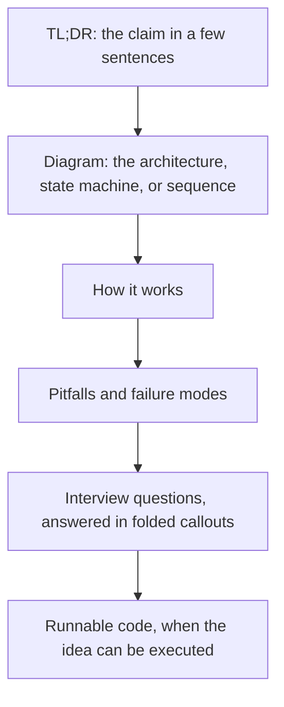
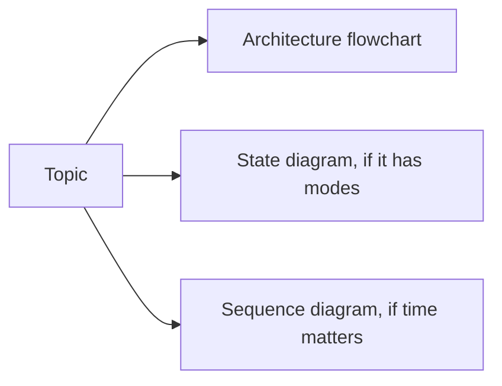

# How this vault works

This repository is an Obsidian vault and a public Git repository at the same time.
Open the folder as a vault and you get the graph, the canvas, backlinks, callouts, and the review queue.
Open it on GitHub and you still get the Markdown, the Mermaid diagrams, and the code.
The [roadmap](Roadmap.md) is the order.
The [vault map](Vault-Map.canvas) is that order laid out in space.

## Anatomy of a note

A diagram sits near the top because the rest of the note is a commentary on that picture.
If you can redraw the picture and narrate the arrows, you know the topic.
If you can only repeat the prose, you do not.

## Properties

Every knowledge note starts with properties.
Obsidian shows them in the properties view.
The tools in `tools/` check the same fields.

| Property | Meaning |
| :--- | :--- |
| `type` | concept, pattern, problem, case-study, paper, playbook, or moc |
| `track` | who the note is for: sde, quant-dev, quant-research, low-latency, ai-eng, distinguished |
| `level` | L3 through L8+, filled in when a person assigns it |
| `status` | seed, draft, solid, or canonical |
| `last_reviewed` | the date you last proved you still know it |
| `sources` | papers and books the note actually uses |

A `seed` is a stub other notes already cite.
A note is ready to become `solid` when it has a TL;DR, the core idea, a worked example or runnable code, pitfalls, interview questions, and further reading.
Leave `status` and `last_reviewed` for a human review.
Do not mark your own fresh writing canonical.

## Finding a note

Each folder has an entry note, usually `README.md`.
In the low-latency vault the entry note is `00 Home` or a note whose name starts with `MOC -`.
The generated block between the `moc:start` and `moc:end` comments is written by `tools/build_mocs.py`.
Write above that block.
Edits inside it are overwritten.

Link with a wikilink, `[[Note Name]]`, when the title is unique.
Use a path when it is not, as with the many `README` files.
Hover a link for the page preview.
Open the backlinks pane to see who cites the note you are reading.
Open the graph when you want the neighborhood, not a search result.
The outline follows the headings.
Omnisearch is installed for full-text search across the vault.

> [!warning] Aliases inside tables
> A raw `|` inside a wikilink splits the table cell.
> Write `[[Note\|Alias]]` when the link sits in a Markdown table.

## Pictures

Mermaid is the diagram format for this vault.
It stays in Git as text, it renders in Obsidian reading view, and it renders on GitHub.
Use one architecture flowchart for structure.
Use a `stateDiagram-v2` when the topic is a machine with modes.
Use a `sequenceDiagram` when the topic is an exchange of messages over time.
Keep node labels short.
Put the narrative under the picture, in sentences.

Canvas is for a map that is too wide for one flowchart.
The vault map is the example.
Click a card to open that section.
GitHub does not render a canvas, so every canvas has a Markdown page that states the same order.

Screenshots of architecture go stale and do not follow the theme.
Prefer a diagram you can edit.
Drop a PNG or SVG in the note only when the thing itself is a picture, such as a plot or a photo of hardware.

Excalidraw is installed in the vault files and is not enabled.
New drawings go in Mermaid or in a canvas.

## Callouts

Callouts are the aside that should not be buried in a paragraph.

> [!summary] Claim
> The one sentence a tired reader needs.

> [!tip] How to practice
> Close the note and redraw the diagram.

> [!warning] Pitfall
> The mistake that survives a correct-sounding explanation.

> [!question] Prompt
> A question an interviewer actually asks.
>
> > [!success]- Answer
> > Folded, so you can try before you read.

## Review

The [review queue](Review-Queue.md) is a Dataview query over the properties.
A draft is due after 7 days, a solid note after 21, a canonical note after 60.
`seed` notes never appear.
After you review a note, set `last_reviewed` to today.
Dataview is one of the enabled community plugins.
Without it, the queue is still readable as a description of the rule, and the notes are still ordinary Markdown.

## What stays out

Recruiter names, contact details, compensation, application status, and email content do not belong in a public note.
The Command Center folders for companies, pipeline, retrospectives, behavioral stories, and the daily log are local symlinks.
They are not part of the public history.

## When you add a topic

1. Start from the properties block used by the notes next to yours.
2. Write the claim, then the diagram, then the mechanism.
3. Name the failure mode in a warning callout.
4. Link the runnable file instead of pasting a second copy of it.
5. Add the note above the generated map block if you are editing an entry note.
6. Run `python3 tools/build_mocs.py --apply` so the folder index sees the new note.
