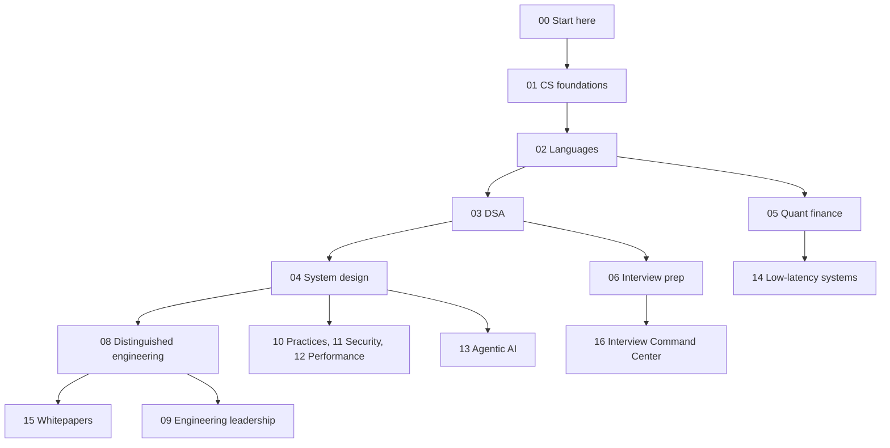
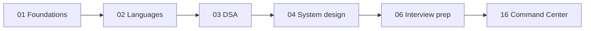
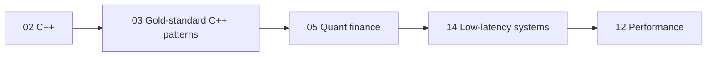
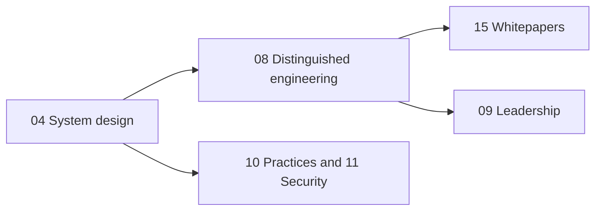
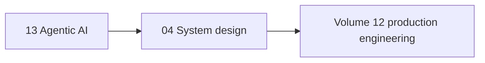

# The World's Best SDE and Quant Developer Roadmap

Author: Shreejit Verma
GitHub: https://github.com/shreejitverma

This vault is a learning path from foundations to staff-level systems, with separate tracks for quantitative development, low-latency trading, and agentic AI.
Read this page for the order.
Open the [vault map](Vault-Map.canvas) when you want the same order as a canvas you can click.
Read [How this vault works](How-This-Vault-Works.md) once, so the diagrams, callouts, and review queue make sense.

## Picture of the vault

Each box is a folder.
The arrow is the order to learn, not a runtime dependency.
You can enter a later box once the earlier one is good enough to support it.

## Pick a track

> [!tip] Stay on one track until the core path feels boring
> Breadth without a finished path is how this vault becomes a pile of tabs.
> Finish the boxes on your track, then widen.

### General SDE

### Quant developer or low-latency C++

The finance curriculum that sits beside the code lives in The-Quant-Prep.
The section note in [05-Quantitative-Finance](../05-Quantitative-Finance/README.md) points at it.

### Senior, staff, or distinguished

### AI or agent engineering

Start in [Agentic AI: Zero to Godhood](../13-Agentic-AI/Agentic_AI_Zero_to_Godhood/README.md).
Volume order is drawn on that page.
Use system design when you need the production systems the agents call.

## How a section teaches

A section opens on a map of content.
A concept note opens with a short claim, then a diagram, then the mechanism, the ways it fails, and questions you should be able to answer out loud.
Runnable code sits next to the note when the idea is easier to trust after you run it.
The [review queue](Review-Queue.md) brings a note back after 7, 21, or 60 days, depending on whether it is still a draft, solid, or canonical.

## Section guide

| Folder | What it is for | Open |
| :--- | :--- | :--- |
| 00 | Order, map, and review | [Start here](README.md) |
| 01 | OS, networks, DBMS, OOP, with code | [CS foundations](../01-CS-Foundations/README.md) |
| 02 | C++ and Python Zero to Godhood, plus Java and JavaScript | [Languages](../02-Programming-Languages/README.md) |
| 03 | Patterns, practice problems, gold-standard C++ | [DSA](../03-Data-Structures-Algorithms/README.md) |
| 04 | Concepts, case studies, APIs, stores, messaging, orchestration | [System design](../04-System-Design/README.md) |
| 05 | Pricing, order book, backtester | [Quant finance](../05-Quantitative-Finance/README.md) |
| 06 | Behavioral, resume, mocks | [Interview prep](../06-Interview-Prep/README.md) |
| 07 | Portfolio project ideas | [Portfolio](../07-Project-Portfolio/README.md) |
| 08 | Raft, LSM, WAL, sagas, lock-free structures | [Distinguished engineering](../08-Distinguished-Engineering/README.md) |
| 09 | RFCs, review, mentorship | [Leadership](../09-Engineering-Leadership/README.md) |
| 10 | Tests, CI, containers | [Practices](../10-Development-Practices/README.md) |
| 11 | OWASP and safer C++ | [Security](../11-Security-And-Cryptography/README.md) |
| 12 | Caches, false sharing, profiling | [Performance](../12-Performance-Engineering/README.md) |
| 13 | Agents, from the model to production | [Agentic AI](../13-Agentic-AI/README.md) |
| 14 | Exchange architecture through FPGAs | [Low-latency systems](<../14-Low-Latency-Systems/00 Home.md>) |
| 15 | Reading notes on the papers the other folders cite | [Whitepapers](../15-Technical-Whitepapers/README.md) |
| 16 | Role hubs, drills, and the local interview loop | [Command Center](../16-Interview-Command-Center/00-Dashboard.md) |

Private application data is not in this repository.
The Command Center links that point at companies, pipeline, and retrospectives resolve only in a local checkout that has those folders.

## What to do this week

1. Choose one track above and ignore the others until that path has a finished pass.
2. Open the folder map and read only the entry note.
3. For each concept, redraw the architecture diagram from memory before you reread it.
4. Run the code next to the note and change one input so you can see the failure the pitfalls section describes.
5. Set `last_reviewed` on the note when you can explain it without the page.
6. Pull the next due note from the [review queue](Review-Queue.md).
