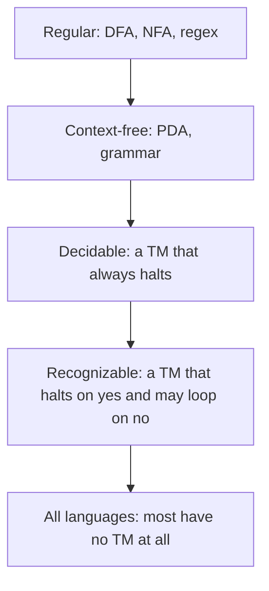

# Automata and Computability

## TL;DR

A language is a set of strings.
An automaton is a finite description of which strings are in the set.
The hierarchy matters because each machine class is exactly as strong as a class of descriptions you already use: regular expressions, context-free grammars, and general programs.
Some languages have no program that halts and answers correctly on every string.

## The hierarchy



A deterministic finite automaton reads one symbol at a time and moves among a finite set of states.
It has no stack and no tape it can rewrite.
Nondeterminism adds choices.
The subset construction turns an NFA with $n$ states into a DFA with at most $2^n$ states, so the two models accept the same languages.
Regular expressions describe the same set.
That is why a lexer can be a regex and a DFA is the implementation.
They cannot count arbitrarily far.
`a^n b^n` is not regular. The pumping lemma is the usual proof: a long enough accepted string has a repeatable middle, and repeating it leaves the language.

A pushdown automaton adds a stack.
Context-free grammars generate the same languages.
Programming-language parsers live here until the language needs a rule the grammar cannot state, which real languages do. The compiler then uses a context-free skeleton and a separate semantic pass. See [[Compilers-and-SSA]].

A Turing machine has an unbounded tape it can read and write, and a finite control.
The Church-Turing thesis says this matches effective computation.
It is a thesis, not a theorem, because "effective" is not a mathematical object until you define a machine.
Every other serious model, lambda calculus included, has turned out to be equivalent. [[Types-Lambda-and-Memory-Safety]] is the other presentation.

## The halting problem

There is no Turing machine $H$ that, given a program $P$ and an input $w$, always halts and says whether $P$ halts on $w$.

```python
def paradox(halts) -> None:
    """halts(program, data) is assumed total. This function cannot exist with it."""
    def self_reject(source: str) -> None:
        if halts(source, source):
            while True:
                pass
        return None
    # Feed self_reject its own source. Both answers contradict halts.
    self_reject(self_reject.__doc__ or "")
```

The sketch is the diagonal argument in code shape.
If `self_reject` halts on its own source, `halts` said it would not, and it loops.
If it loops, `halts` said it would halt, and it returns.
Either answer is wrong.
So `halts` cannot be a total correct function.
The same diagonal shows a concrete language that is recognizable and not decidable: simulate the machine, accept if it accepts, and you may loop when it loops.

Rice's theorem is the engineering version.
Any property of the *language* a program recognizes, other than "all programs" or "no program", is undecidable.
"Does this function always return 0" and "can this program dereference null" are undecidable in general.
That is why a compiler's warning is an approximation.
A sound approximation never says "safe" when the program is unsafe, and it rejects some safe programs.
An unsound tool does the opposite. Know which one you are running.

## A small machine you can run

```python
def accepts(delta: dict, start: str, accept: set, word: str) -> bool:
    state = start
    for ch in word:
        state = delta[state][ch]
    return state in accept
```

`delta` is the DFA.
Missing keys are missing transitions, which a total DFA should not have.
Add a dead state rather than letting the lookup throw, if you want the mathematical object.

## Pitfalls

- "Finite states" does not mean "small". A 64-bit counter is a finite automaton with $2^{64}$ states. The point is the bound, not the vibe.
- Regex implementations with backreferences are not the regular languages. They can be exponential, and they are a different model.
- Undecidable does not mean "we have not found the algorithm yet". It means every candidate fails on some input.
- A test suite is a finite automaton's worth of evidence. It is not a decision procedure for "all bugs".

## Questions

> [!question]- Why can a DFA not match balanced parentheses of unbounded depth?
> Each additional open parenthesis is a fact the machine must remember until the matching close.
> A finite set of states can remember only a bounded count.
> A stack can remember the rest, which is why a PDA can, and a DFA cannot.

> [!question]- If the halting problem is undecidable, how do linters say anything?
> They answer a stronger, simpler question, or they give up on some programs.
> "This pattern looks like a null dereference" is decidable.
> "This program never dereferences null on any input" is not, for a general language.

## Further reading

- Turing, 1936. The vault note is [[15-Technical-Whitepapers/09-Seminal-Computer-Science-Papers/01-Foundations-and-Information-Theory|Foundations and Information Theory]].
- Sipser, for the pumping lemmas and the subset construction written out.
- [[Complexity-and-NP-Completeness]] for the problems that are decidable and still too expensive.
