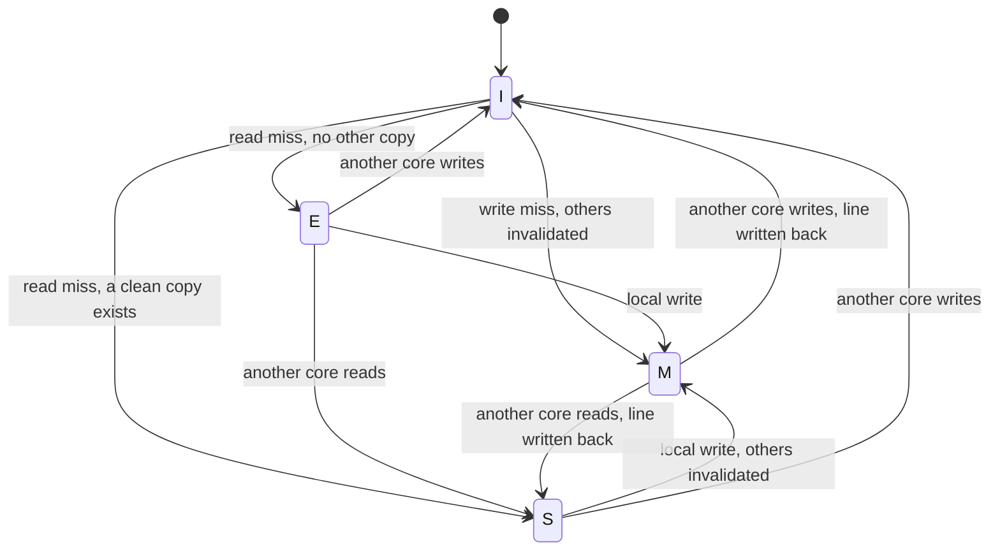
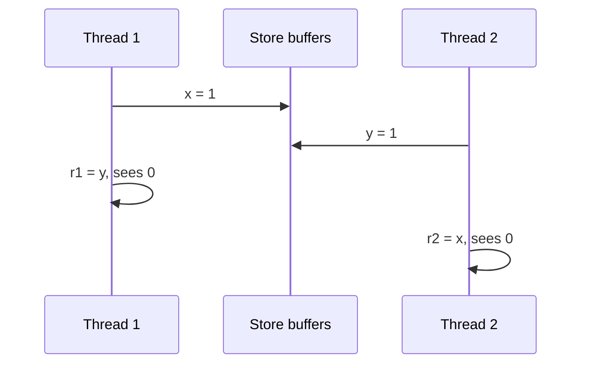

# Caches, Coherence, and Consistency

## TL;DR

A cache is a small fast copy of memory, justified only by locality.
Coherence is the agreement among copies of one address.
Consistency is the order of different addresses as a program is allowed to observe it.
Average access time, false sharing, and a data race sit on three different layers of that stack.
[[Processor-Pipelines-and-ILP]] overlaps instructions.
This note is what happens when one of those instructions touches memory.

## Average memory access time

$$
\mathrm{AMAT} = t_{\mathrm{hit}} + r_{\mathrm{miss}} \times t_{\mathrm{miss}}
$$

The miss penalty of a middle level is itself an AMAT.
For a load that checks L1, then L2, then DRAM:

$$
\mathrm{AMAT} = t_{L1} + r_{L1} \times (t_{L2} + r_{L2 \mid L1} \times t_{\mathrm{DRAM}})
$$

$r_{L2 \mid L1}$ is the fraction of L1 misses that also miss in L2.
It is not the fraction of all loads that miss in L2.

Take $t_{L1} = 4$ cycles, $r_{L1} = 0.03$, $t_{L2} = 12$ cycles, $r_{L2 \mid L1} = 0.40$, and $t_{\mathrm{DRAM}} = 200$ cycles.

$$
4 + 0.03 \times (12 + 0.40 \times 200) = 4 + 0.03 \times 92 = 6.76 \text{ cycles}
$$

```python
def amat(hit: float, miss_rate: float, miss_penalty: float) -> float:
    return hit + miss_rate * miss_penalty


def two_level(l1_hit: float, l1_miss: float, l2_hit: float, l2_miss_given_l1: float, dram: float) -> float:
    return amat(l1_hit, l1_miss, amat(l2_hit, l2_miss_given_l1, dram))
```

A 3 percent L1 miss rate still moves the average from 4 cycles to 6.76, because the DRAM term is large.
Cutting the miss rate and cutting the miss penalty are different projects.
A bigger cache attacks capacity misses.
A better layout attacks conflict misses and false sharing.
Hardware prefetch attacks some compulsory and stride misses, and it pollutes the cache when the guess is wrong.

## The three misses

| Miss | Cause | What actually helps |
| :--- | :--- | :--- |
| Compulsory | The line has never been fetched | Larger lines, prefetch, a smaller working set does not remove the first touch |
| Capacity | The working set does not fit | A bigger cache, or less live data |
| Conflict | Too many lines map to the same set | Associativity, padding, a different stride |

A direct-mapped cache has one line per set.
A stride that equals the cache size will thrash even when the working set is two lines.
A set-associative cache gives each set several ways.
A fully associative cache can place a line anywhere, and the replacement choice is the whole problem.

Write-through updates memory on every store.
Write-back updates memory when the dirty line is evicted.
Write-allocate fetches the line on a store miss.
Write-no-allocate sends the store to the next level and leaves the cache alone.
A write-back cache is a small database: the dirty bit is the only record that memory is stale.

## Coherence: one address, many copies



MESI is the usual teaching protocol.

- Invalid: this cache must not use the line.
- Exclusive: this cache is the only owner, and the line matches memory.
- Shared: at least one other cache may hold a clean copy.
- Modified: this cache is the only owner, and the line is dirty.

A write in Exclusive becomes Modified with no bus transaction.
A write in Shared must invalidate the other copies first.
A read that finds a Modified copy must wait for that owner to provide the data.
The protocol answers "which value of this address is current".
It does not answer "in what order may I observe two addresses".

Inclusive caches keep a line in the outer level whenever an inner level has it, so an invalidate can snoop the outer tags.
Exclusive caches use the outer level for lines the inner level does not hold, which raises capacity and complicates the snoop.
The choice is a silicon trade, not a correctness theorem.

## False sharing

A coherence miss fires on a line, not on a byte.
Two cores that write `a` and `b` on the same 64-byte line invalidate each other on every store.
The program has no data race if `a` and `b` are distinct objects.
The machine still ping-pongs the line.
Padding each hot counter to its own line removes the sharing.
[[false_sharing.cpp]] is that demonstration.
[[12-Performance-Engineering/README|Performance engineering]] is the habit of measuring it before you pad the world and waste capacity.

## Consistency: many addresses

Coherence can hold while the program still surprises you.



Sequential consistency requires one total order of memory operations that respects each thread's program order.
In that order the outcome `r1 == 0` and `r2 == 0` is impossible: the store to `x` is before the load of `y` in thread 1, and the store to `y` is before the load of `x` in thread 2.

Total store order, the x86 model, lets a store sit in a buffer.
The storing thread can forward that store to its own later loads.
Other threads do not see it yet.
Both loads above can pass their own stores, and both can read the old zeros.
x86 still does not reorder loads with older loads, or stores with older stores, in the way a weaker model does.

ARM and POWER allow more reorderings, including load-load reordering, unless the instruction stream contains the barrier the architecture demands.
A program proved only on x86 is not proved on ARM.

## The language contract

C++ gives data-race-free programs sequential consistency.
A data race is two conflicting accesses, at least one a write, that are not ordered by the synchronizes-with relation.
That race is undefined behavior.
The compiler may then assume it does not happen, and the hardware model underneath no longer saves you.

`memory_order_relaxed` atomics are not a data race, and they are not sequential consistency.
They give you atomicity of that location and very little order.
`volatile` tells the compiler the object may change outside the abstract machine.
It is not a fence and it is not a lock.

The paper treatment of the hardware side is [[15-Technical-Whitepapers/10-Seminal-Low-Latency-Systems-Papers/01-Memory-Models-and-Hardware-Coherence|Memory models and hardware coherence]].
The trading-system consequences live in [[14-Low-Latency-Systems/00 Home|Low-Latency Systems]].

## Pitfalls

- Hit rate is not AMAT. A 99 percent hit rate with a 200-cycle miss can still dominate the loop.
- MESI does not make a lock correct. The lock needs an atomic read-modify-write and an order that keeps the critical section inside the lock.
- False sharing is not a race. Fixing the race does not fix the ping-pong, and padding does not fix a race.
- A passing test on x86 says nothing about an ARM reorder the test never hit.
- Prefetch and a larger line cut some misses and increase the cost of the misses you still take, and they make false sharing wider.

## Questions

> [!question]- Why can a store in Exclusive become Modified with no coherence message?
> No other cache holds the line, so invalidating "the others" is a no-op.
> The line was already clean and unique. The transition only records that it is now dirty.

> [!question]- Why is a data race in C++ worse than a surprising reorder?
> A surprising reorder is still a defined execution of the memory model.
> A data race is undefined behavior, so the compiler may delete or move surrounding code under the assumption that the race does not occur.

## Further reading

- Hennessy and Patterson, the memory-hierarchy chapters, for AMAT and the three misses.
- Sorin, Hill, and Wood, for coherence protocols and consistency litmus tests.
- Boehm and Adve, for the data-race-free sequential-consistency theorem in C++.
- [[Proofs-and-Invariants]] for the invariant a lock is supposed to protect across those reorderings.
