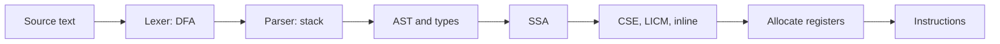
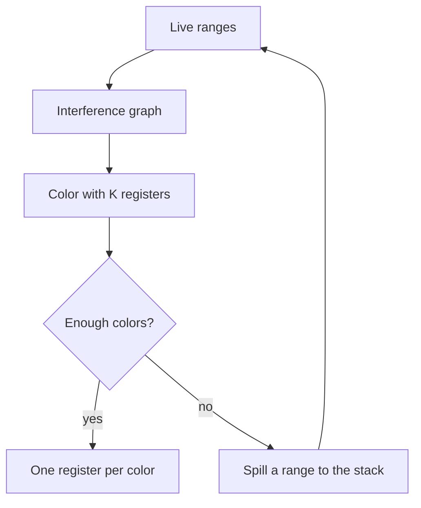

# Compilers and SSA

## TL;DR

A compiler is a pipeline from text to a machine program, with a typed intermediate form in the middle.
Static single assignment gives every value one name, so an optimization can see where the value came from.
Undefined behavior is the contract that lets those optimizations assume the impossible branch never happens.
[[Automata-and-Computability]] is why the front end is a machine.
[[Caches-Coherence-and-Consistency]] is why the back end's spill and inline choices show up as misses.

## The pipeline



The lexer is a deterministic finite automaton.
It recognizes tokens.
It cannot count nested parentheses, because a finite automaton cannot match $a^n b^n$, and a parenthesis language is that shape.
The parser is a stack machine.
An LL parser builds a leftmost derivation from the top down.
A classical LL grammar cannot be left-recursive, because the prediction would loop.
An LR parser builds a reversed rightmost derivation from the bottom up and accepts a larger set of grammars.
That is why parser generators in the yacc family are LR.
A PEG with ordered choice is a third formalism.
It looks like a grammar and it is not the same recognition problem.

The AST is the tree the type checker walks.
The type rules are [[Types-Lambda-and-Memory-Safety]].
After types, the optimizer wants a form where "the value of `x`" is unambiguous.

## SSA and phi

```text
x = 1
if cond:
    x = 2
else:
    x = 3
y = x + 1
```

becomes

```text
x1 = 1
if cond:
    x2 = 2
else:
    x3 = 3
x4 = phi(x2 from then, x3 from else)
y1 = x4 + 1
```

Each name is assigned once.
`phi` is not a branch you wrote.
It selects the value that belongs to the incoming control-flow edge.
On the path through the then-block, `x4` is `x2`.
On the path through the else-block, `x4` is `x3`.
A use of `x4` can then be rewritten without asking which assignment "the" `x` was.

This is the compiler's version of register renaming in [[Processor-Pipelines-and-ILP]].
The hardware renames so independent uses of the same architectural register do not wait for each other.
SSA renames so the optimizer can see the same fact before it emits instructions.

## The optimizations you should be able to name

Common-subexpression elimination computes `a + b` once when both uses have the same reaching `a` and the same reaching `b`.
SSA makes "the same" a pointer comparison of names.

Loop-invariant code motion hoists a computation whose operands are not assigned inside the loop.
Hoisting a call is legal only when the call does not change observable behavior.
A call the compiler cannot see through stays in the loop.

Inlining replaces a call with the callee body.
The win is the optimizations that become visible after the call boundary is gone, and the removal of the call itself.
The loss is code size.
A larger body misses in the instruction cache, which is an AMAT problem, not a theoretical one.
Profile-guided inlining is the admission that the static guess is weak.

Dead-code elimination removes a definition with no uses.
It is correct only for a definition the language treats as free of observable behavior.
A store the program is allowed to race on is not in that set, which is one reason a data race is poisonous to optimizers.

## Registers



Two values interfere when there is a program point where both are live.
An edge in the interference graph records that.
A coloring with $K$ colors is an assignment of $K$ registers.
If the graph needs more colors, a live range is spilled: the compiler inserts a store to the stack and a later load.
That load can miss.
The "register allocator" line on a profile is often a cache line in disguise.

Graph coloring is NP-hard in general, which is [[Complexity-and-NP-Completeness]] showing up in a compiler.
Production allocators use a linear scan or an iterated heuristic, not an exponential exact coloring, because compile time is part of the product.

## Undefined behavior is the contract

In C and C++, signed integer overflow is undefined.
The compiler may therefore assume that `i + 1` does not overflow, and it may delete a check that would only fail if it did.
Out-of-bounds access, use after free, and a data race are in the same family.
The optimizer's job is to exploit every assumption the language granted.
A sanitizer finds executions that break the assumption.
It does not change the assumption.
Turning the sanitizer off does not make the execution defined.

Safer languages shrink this set by rejecting the program, inserting a check, or defining the behavior.
That is a language-design choice with a runtime cost, not a moral one.
The C++ side of the memory half is [[cpp_safety.cpp]].

## Pitfalls

- A green parse is not a correct translation. The bug can be a legal AST with the wrong binding.
- Phi is not "pick either value at runtime by a hidden branch" in the sense of a source-level condition. It is the edge you already took.
- Inlining a cold function into a hot one can make the hot one slower.
- "The compiler will optimize it" is not a proof. Read the assembly when the cost matters, and name the assumption the compiler used.
- Undefined behavior that "worked on this compiler last year" was never a guarantee.

## Questions

> [!question]- Why is the lexer a DFA and the parser a stack machine?
> Tokens are a regular language.
> Nesting is a context-free language.
> [[Automata-and-Computability]] separates those classes, and the pipeline follows the separation.

> [!question]- What does a phi node select?
> The definition that reaches this block along the control-flow edge that was taken.
> After SSA construction there is one name for that meeting, and later passes rewrite that name.

## Further reading

- The Dragon Book, for lexing, parsing, and the classical optimizations.
- Cooper and Torczon, for a modern pass-by-pass picture.
- Braun and others, for a construction of SSA that does not require a separate dominance-frontier textbook first.
- [[Types-Lambda-and-Memory-Safety]] for the judgment the front end is applying.
