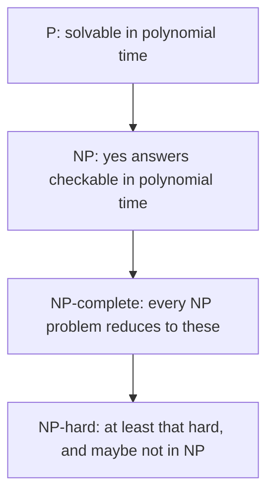

# Complexity and NP-Completeness

## TL;DR

P is the set of decision problems a deterministic machine can solve in time polynomial in the input length.
NP is the set whose yes answers have a proof a deterministic machine can check in polynomial time.
NP-complete problems are the hardest in NP: a polynomial algorithm for one of them is a polynomial algorithm for every problem in NP.
Nobody has proved $P = NP$ or $P \neq NP$.
You design as if the second is true, and you say so.

## The picture



If $P \neq NP$, the inclusions are strict.
A problem can be NP-hard and not in NP, because a yes answer might not have a short proof.
Chess on an $n \times n$ board, suitably generalized, is the kind of example people reach for. Optimization problems are outside NP until you turn them into a decision: "is there a tour of length at most $K$".

A polynomial-time reduction from A to B is a polynomial function that maps yes inputs of A to yes inputs of B and no inputs to no inputs.
If you can solve B quickly, you can solve A quickly.
To show B is NP-hard, reduce a known NP-hard problem *to* B, not the other way around.
The arrow is the direction students reverse.

Cook and Levin showed Boolean satisfiability is NP-complete.
Every NP machine's computation tableau can be written as a formula that is satisfiable exactly when the machine accepts.
After SAT, you almost never build that tableau.
You reduce SAT, 3-SAT, clique, vertex cover, or subset sum to the problem in front of you.

## A reduction you can check

A vertex cover is a set of vertices that touches every edge.
An independent set is a set of vertices with no edge inside it.
In a graph with $n$ vertices, $S$ is a vertex cover if and only if the complement $V \setminus S$ is an independent set.

So "is there a vertex cover of size at most $k$" is yes exactly when "is there an independent set of size at least $n - k$" is yes.
The map is polynomial. It copies the graph and replaces $k$ with $n - k$.
Both problems are NP-complete because this reduction runs both ways and one of them is already NP-complete.

```python
def cover_size_to_independent_size(n: int, k: int) -> int:
    if not 0 <= k <= n:
        raise ValueError("k must lie between 0 and n")
    return n - k
```

The function is the numeric half of the reduction.
The graph is unchanged.

## What you do on a Monday

You do not wait for a proof about P and NP.
You recognize the shape: a subset, an ordering, a coloring, a packing, with a bound.
Then you pick one of these exits.

- The instance is small, and exponential in that parameter is fine. $n = 20$ and $2^n$ is a million.
- The structure is special: an interval graph, a tree, a fixed dimension.
- An approximation is acceptable, and you can bound how far the answer is from optimal.
- A heuristic is acceptable, and you will measure it, not call it optimal.

[[03-Data-Structures-Algorithms/README|The algorithms shelf]] is where the polynomial algorithms live once you have recognized that the problem is not this hard.
Dynamic programming is often "the exponential tree shares subproblems, and there are polynomially many of them".

## Pitfalls

- "NP means not polynomial" is false. NP means nondeterministic polynomial time, which is the certificate definition above. Every problem in P is in NP.
- A reduction from your problem to SAT shows your problem is no harder than SAT. It does not show it is hard. SAT solvers then become a tool, which is useful, and it is not an NP-hardness proof.
- Average instances of an NP-complete problem can be easy. Hardness is a worst-case statement unless you have a stronger theorem.
- Pseudo-polynomial algorithms depend on the magnitude of the numbers, not only the number of bits. Knapsack is weakly NP-complete. Subset sum with tiny integers is practical dynamic programming.

## Questions

> [!question]- A colleague says they proved P = NP because their SAT solver finished a benchmark. What is wrong?
> A solver that finishes some formulas does not decide every formula in polynomial time.
> NP-completeness is a worst-case statement about asymptotic growth.
> A fast solver is good news about instances, not a collapse of the classes.

> [!question]- You reduced vertex cover to your new problem in polynomial time, and vertex cover is NP-complete. What may you conclude?
> Your problem is NP-hard.
> If it is also in NP, it is NP-complete.
> You still need the certificate argument for membership in NP.

## Further reading

- Garey and Johnson, the catalog and the method.
- Sipser, for the tableau proof of Cook-Levin written carefully.
- [[Proofs-and-Invariants]] for the shape of a reduction argument.
