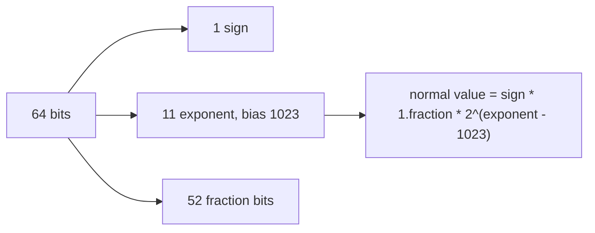

# Floating Point

## TL;DR

A binary floating-point number is a finite set of rationals, not the real line.
Binary64 gives you 1 sign bit, 11 exponent bits, and 52 explicit fraction bits.
The surprises that matter in production are rounding, two zeros, NaN, and addition that is not associative.
Money is an integer count of minor units.
[[04-System-Design/02-Case-Studies/15-Payment-Ledger/design|The payment ledger]] is that rule in a system.

## The encoding



A normal binary64 number is

$$
(-1)^s \times \left(1 + \sum_{i=1}^{52} b_i 2^{-i}\right) \times 2^{e - 1023}
$$

The leading 1 is implicit, so the significand has 53 bits of precision.
The largest odd integer you can represent exactly is $2^{53} - 1$, which is 9007199254740991.
Past $2^{53}$, the unit in the last place is 2, then 4, then larger.
Integers in that range are not all representable.
That single fact breaks identifiers, loop indexes, and "just store the cents in a float" once the magnitude grows.

Subnormal numbers fill the gap between zero and the smallest normal, at reduced precision.
An all-ones exponent encodes infinity when the fraction is zero, and NaN when the fraction is not zero.
A NaN is not equal to itself.
Any comparison with a NaN is false, including `x < y` and `x >= y` both false.
A branch that assumes those two are complements is wrong as soon as a NaN appears.
NaNs also propagate: one bad input silently poisons a reduction unless you test for it.

## Two zeros, and a value that is not what you typed

$+0$ and $-0$ compare equal and divide the other way: $1/+0$ is $+\infty$ and $1/-0$ is $-\infty$.
They exist so the sign of an underflow can survive.

`0.1` is not a binary64 value.
One tenth in binary is a repeating fraction.
The literal `0.1` is the binary64 number nearest to one tenth, and it is not one tenth.
So:

```python
def not_a_tenth() -> bool:
    return (0.1 + 0.2) != 0.3
```

That expression is true.
The rounded sum of the two rounded inputs is not the rounding of three tenths.
Parenthesizing those same three literals also disagrees: `(0.1 + 0.2) + 0.3` is one ulp above `0.1 + (0.2 + 0.3)`.
That pair is a fragile demonstration, because nearby decimals often do associate after rounding.
This pair does not:

```python
def not_associative() -> tuple[float, float]:
    a, b, c = 1e16, -1e16, 1.0
    return (a + b) + c, a + (b + c)
```

`(a + b) + c` is `1.0`.
`a + (b + c)` is `0.0`, because `b + c` is not representable apart from `b` at that magnitude, so the `1.0` is lost before the cancellation.
Same three numbers, two parenthesizations, two answers.
A compiler that reassociates a floating-point reduction is changing the result, and a language that allows it is making that change legal.

## Rounding and comparison

Every elementary operation in IEEE 754 arithmetic is correctly rounded: the result is as if you computed in infinite precision and then rounded, for the operations the standard lists.
That is a strong guarantee, and it is not "the result equals the real result".
The error of a single operation is at most half an ulp in the round-to-nearest mode.
The error of a sequence of operations depends on the sequence.
Cancellation, subtracting two close quantities, reveals the error that was hiding in the low bits and leaves a significand full of noise.

Comparing floats with `==` is correct when you mean "the same encoding after the same operations", for example a sentinel you just stored.
It is the wrong tool for "these two formulas agree on the reals".
An absolute epsilon fails when the values are huge.
A relative epsilon fails when the values are near zero.
The comparison has to name the tolerance in the unit the problem actually has, or it should be an integer comparison after a scaling you control.

Kahan summation is the technique that keeps a running correction so a long sum loses less.
It does not make summation associative.
It spends a few operations to reduce the error the naive left fold commits.

## Money and identifiers

A payment amount is an integer number of minor units.
`199` cents is `199`, not a binary approximation of `1.99`.
Rounding then happens at a defined boundary, with a defined tie rule, once, when you convert to or from a human scale.
The ledger note uses that representation because a float ledger cannot promise that postings sum to zero after a few exchanges.

Identifiers and loop counters belong in integers for the same reason.
A JSON number decoded into binary64 will not round-trip every integer a 64-bit counter can hold.
If the wire format is allowed to carry one, the decoder has to say so.

## Pitfalls

- `0.1 + 0.2 != 0.3` is true, and it is a rounding fact, not a bug in `+`.
- `(0.1 + 0.2) + 0.3` and `0.1 + (0.2 + 0.3)` differ by one ulp in binary64. Nearby literals often do not. Use a magnitude where the small term disappears, as in the `1e16` example.
- A NaN fails every comparison, including equality with itself. `if not (x >= lo and x <= hi)` is not "x is outside the range" when `x` is NaN.
- Flushing subnormals to zero, a mode some hardware offers for speed, changes results near zero and breaks code that expected gradual underflow.
- Parallel reductions reassociate. A faster sum is a different sum unless you pin the order.

## Questions

> [!question]- Why is 0.1 not exact?
> Binary64 fractions are sums of powers of one half.
> One tenth has a repeating binary expansion, so the stored value is a nearby dyadic rational.
> Decimal floating-point, or a scaled integer, is how you keep tenths exact.

> [!question]- When is `==` on floats the right comparison?
> When both sides are results you defined to be bit-identical, such as a copied sentinel or a value you just wrote and read back from the same format.
> It is the wrong comparison for two different formulas that agree on paper.

## Further reading

- Goldberg's paper, for rounding, cancellation, and the examples this note compresses.
- IEEE 754-2019, for the operations that are correctly rounded and the encoding of NaN and the signed zeros.
- [[Proofs-and-Invariants]] for why an invariant proved on real numbers is not an invariant of this type.
