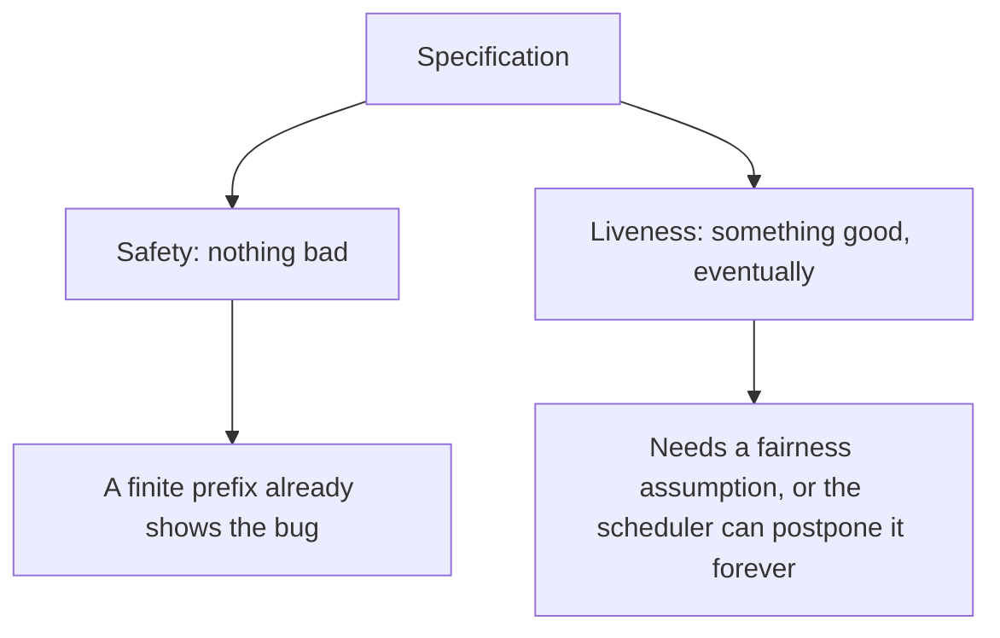
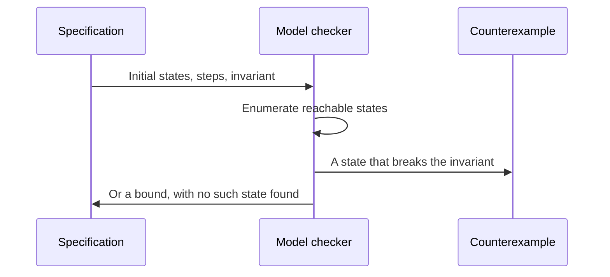
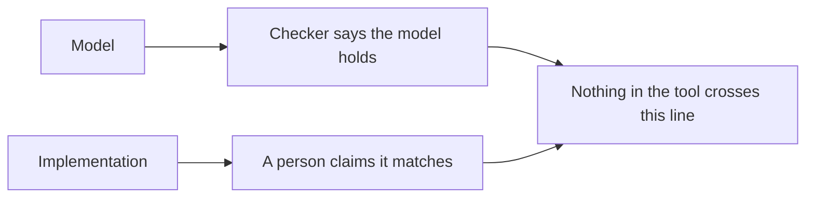

# Formal Models and Specifications

## TL;DR

A formal model is a state machine small enough that a tool can try to break your claim.
Safety says a bad state never happens, and a finite trace is enough to convict it.
Liveness says a good state eventually happens, and no finite trace is enough to convict it.
A model checker that stays green has checked the model you wrote.
It has not checked that the C++ matches the model.
[[Raft-Consensus]] is the protocol this distinction was invented for.
[[Proofs-and-Invariants]] is the same argument done by hand.

## Safety and liveness

"No two leaders in the same term" is safety.
If a trace reaches that state, the prefix up to that state is a counterexample.
You do not need to know what would have happened next.

"Every request eventually receives a response" is liveness.
Any finite prefix can be extended with the response.
A checker that reports a liveness failure on a trace where the scheduler simply never runs the server is reporting the scheduler, unless you told it that a continuously enabled step is eventually taken.
That assumption is fairness.
Without it, liveness properties are false in the most boring way.
With a fairness assumption that the real scheduler violates, the proof is about a system you do not run.

Lamport's informal test is enough to classify most claims.
If a finite execution can already show the violation, you wrote safety.
If every violation depends on something never happening later, you wrote liveness.
Systems people smuggle liveness into an invariant and then wonder why the checker either loops or complains about scheduling.

## What a model checker does

TLA+ describes states and the actions that relate a state to the next one.
TLC enumerates the reachable states of a finite instance.
A failed invariant comes back as a concrete trace: the shortest story the tool could find.
That trace is the most useful output.
You either fix the action or you discover the invariant was not what you meant.

The green result means: in the finite instance you asked for, no reachable state broke the invariant.
It does not mean the invariant holds for a larger instance.
It does not mean the implementation performs the action you specified.
State-space explosion is the normal failure of the method.
Two counters of range $N$ are $N^2$ states before you add the queues.
Engineers bound the model, check the bound they can afford, and write the inductive invariant they want for the unbounded system.
The inductive invariant is a proof obligation of the kind in [[Proofs-and-Invariants]].
The checker is a tireless attempt to refute it on the sizes you could encode.

## The gap to code

Closing the gap is a different project: a refinement proof, a verified implementation, or a test that executes the counterexample trace against the binary.
Each of those is real work.
A wiki page that says "we model-checked the protocol" has done the left box.
[[Raft-Consensus]] records the teaching implementation's missing pieces, including persistence and membership.
A model that includes persistence is a different model from a lab that skips it.
Checking the smaller one and shipping the larger one is how a verified paper coexists with a bug in the unmodeled line.

The same gap appears in cryptography.
A proof in the symbolic model, where encryption is a perfect box, does not mention timing, error oracles, or a nonce the code reused.
[[Public-Key-Crypto-and-TLS]] needs both the protocol model and the cryptographic assumptions, and still needs the code to use a unique nonce.

## Inductive invariants

An invariant suitable for a checker is inductive when every action preserves it, including the actions you added for crash and restart.
"The log is consistent" fails this test if the crash action can tear a write and no action rebuilds it.
The error path is part of the next-state relation.
This is the same sentence as the loop invariant, moved to a transition system.

If you cannot find an inductive invariant, the property may still be true and merely not inductive.
The usual repair is to strengthen it: add the facts about terms, votes, and logs that make the step go through.
Strengthening is the actual work.
The checker then tries to refute the stronger claim.

## Pitfalls

- A green model check of a three-node finite run is not a proof for $n$ nodes.
- Liveness without a fairness hypothesis is a complaint about the scheduler.
- The model can omit the bug by omitting the action. Membership, disk, and time are the actions people forget.
- "The invariant held in the test suite" is not a model check. Tests sample. TLC enumerates a finite space.
- A specification that is too close to the code, line by line, will not fit in the checker, and a specification that is too far from the code will not constrain the bug you have.

## Questions

> [!question]- Why is a counterexample for safety a finite trace?
> Safety is violated by reaching a bad state.
> The prefix from the initial state to that bad state is a complete witness.
> Extending the trace cannot repair it.

> [!question]- What would you still not know after TLC reports success?
> You would not know that a larger parameter is safe, and you would not know that the implementation takes only the actions in the spec.
> You would know that this finite model did not reach an invariant violation.

## Further reading

- Lamport, Specifying Systems, for TLA+ and the safety versus liveness split.
- Baier and Katoen, for model checking as a discipline, including fairness.
- [[Consensus-and-Failure-Detection]] for the distributed-systems facts a Raft model is trying to pin down.
