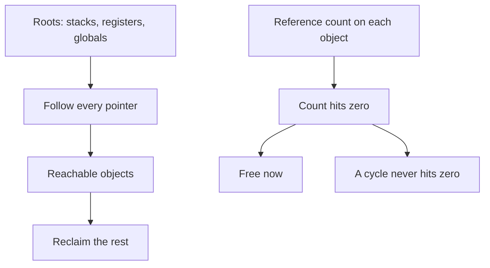
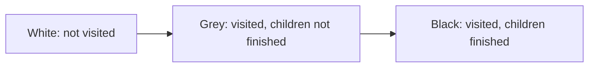
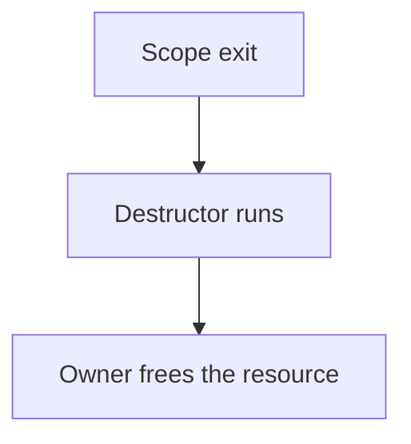

# Garbage Collection

## TL;DR

A collector reclaims objects no live root can reach.
Tracing finds the reachable set from roots.
Reference counting finds it by a local count, and it cannot see a cycle.
The generational hypothesis says most objects die young, so a collector that looks at the young objects most of the time wins.
RAII is a different mechanism: the owner frees the object at a lexical point, and nothing traces the heap.

## Two ways to know an object is dead

A tracing collector is complete for reachability, including cycles, as long as it actually sees every root and every pointer.
A reference-counting collector frees an object the moment the last reference drops.
That promptness is the advantage.
The cycle is the hole: two objects pointing at each other keep count 1 forever if the rest of the program has forgotten them.
CPython uses reference counting for the prompt case and a separate cycle detector for the hole.
A pure counting collector without that detector leaks cycles.

## Mark-sweep and copying

Mark-sweep paints the reachable objects, then walks the heap and frees the unpainted ones.
The live objects stay where they are.
The heap fragments.
Allocation becomes a search for a hole unless a free list or a segregated size class hides that search.

Copying collection splits the space in two.
It copies live objects into the empty half and leaves the garbage behind.
Allocation is then a pointer bump.
The cost is paid per live object, not per garbage object, which is exactly what you want when most objects are dead.
The price is half the heap, plus the cost of updating every pointer that moved.

Compaction is the same idea inside one space: slide the live objects together so the free region is contiguous.
A moving collector must know every pointer, or it will leave a stale address.
That requirement is why a precise collector wants stack maps from the compiler, and why an interior pointer from foreign code is a design problem.

## The tricolor invariant

The collector is allowed to run while the program runs only if this invariant holds: a black object does not point at a white object.
Grey objects are the frontier.
If the invariant is true, every path from a black object to a not-yet-scanned object passes through grey, so the collector will still find it.

The mutator breaks the invariant by storing a pointer.
A write barrier repairs it.
Dijkstra's insertion barrier shades the object you are installing, so a white object written into a black object does not stay white.
Yuasa's deletion barrier shades the object whose pointer you are about to overwrite, so the collector does not lose the only path to it.
Both restore a tricolor invariant.
They are not the same barrier, and a concurrent collector is specified by which one it uses.

Without a barrier, a concurrent mark will miss objects or reclaim live ones.
"We run the collector on another thread" is not a design until the barrier is named.

## Generations

The hypothesis: most allocated objects are dead before the next collection, and objects that survive a collection tend to survive many more.
A nursery collects the young space often and cheaply, especially if it is a copying space.
Survivors promote to an older generation that is collected rarely.

A store of a young pointer into an old object would hide a young live object from a nursery-only collection.
The remembered set records those old-to-young pointers, and it is filled by a write barrier on the store.
The nursery collection scans the remembered set as extra roots.
If the barrier misses a store, the nursery reclaims a live object.

Promotion of a large object, or a program that allocates long-lived objects straight into the nursery, defeats the hypothesis.
The collector is then copying data it will only have to visit again.
Measuring survivor rate is the check.

## What production runtimes actually chose

CPython counts references so destruction is prompt, and it runs a generational cycle collector because counts leak cycles.
The JVM ships several collectors.
G1 divides the heap into regions and collects a set of them.
ZGC is concurrent and moving, aimed at short pause times on large heaps.
Go's collector is a concurrent mark-sweep with a write barrier.
The pause-time goal and the throughput cost are different points on one curve.
A collector with a shorter pause usually spends more total CPU, or more barrier cost on the mutator, to get there.

None of these facts replaces the manual for the version you run.
They tell you which questions to ask: does it move objects, does it run concurrent with mutators, and which barrier does it use?

## RAII is not a collector

In C++, a destructor runs when the owner's lifetime ends.
That frees the file, the lock, or the buffer at a point the type system of lifetimes already named.
There is no trace, and there is no cycle collection.
`shared_ptr` is reference counting, and it has the cycle hole unless a `weak_ptr` breaks the cycle.
A collector would also close the file "eventually", which is the wrong time for a lock or a socket.
Deterministic destruction and tracing collection solve different problems.
Using one name for both is how servers leak file descriptors while the heap looks fine.

[[Types-Lambda-and-Memory-Safety]] is the static version of the same question: who is allowed to hold this address.
[[Caches-Coherence-and-Consistency]] is why a moving collector and a mutator must not race on a pointer word without a barrier that the hardware will actually honor.

## Pitfalls

- A cycle leak under reference counting looks like a live heap. The objects are reachable from each other and from nothing else.
- A remembered-set bug is memory corruption, not a slow collection.
- Finalizers and destructors that run "later" must be safe against running on the collector thread, running twice, or never running.
- A pause-time average hides the one collection that scanned the whole old generation.
- Freeing promptly is not free. Atomic reference-count updates contend on the same cache line the object header sits on.

## Questions

> [!question]- Why does copying collection cost the live set, while mark-sweep walks the whole heap?
> Copying only touches objects it forwards, and allocation is a bump in the empty space.
> Mark-sweep must find the unmarked holes, so it looks at dead objects too.
> When almost everything is dead, copying does less work per byte allocated.

> [!question]- What does the write barrier protect?
> The tricolor invariant, or the remembered set, depending on the collector.
> It is the proof that a mutator store did not hide a live object from the scan.
> Removing it to "save a store" makes the collector incorrect.

## Further reading

- Jones, Hosking, and Moss, The Garbage Collection Handbook, for barriers, generations, and concurrent collectors.
- Wilson's survey, for mark-sweep, copying, and the generational hypothesis in one sitting.
- [[Compilers-and-SSA]] for the stack maps a precise collector needs from the compiler.
