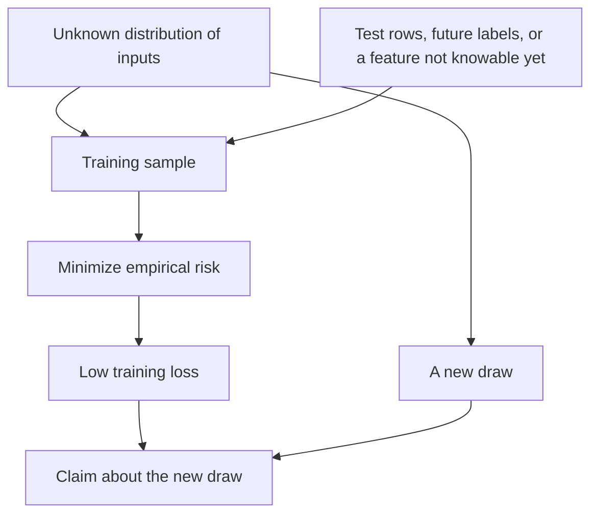

# Generalization and Learning

## TL;DR

Training loss is a fact about the sample.
Generalization is a claim about inputs the sample did not include.
Optimization finds a hypothesis with low training loss.
It does not, by itself, make the claim true.
The product layer that serves a model, calls tools, and keeps a loop is [[13-Agentic-AI/README|Agentic AI]].
This note is the limit on what that product is allowed to say about a new input.

## The gap



The risk of a hypothesis $h$ is the expected loss on the true distribution.

$$
R(h) = \mathbb{E}[\ell(h(x), y)]
$$

The empirical risk is the average loss on the $n$ samples you have.

$$
\hat{R}(h) = \frac{1}{n} \sum_{i=1}^{n} \ell(h(x_i), y_i)
$$

The generalization gap is $R(h) - \hat{R}(h)$.
You observe $\hat{R}$.
You want $R$.
A hypothesis class that is rich relative to $n$ can drive $\hat{R}$ to zero by memorizing, and $R$ stays large.
A hypothesis class that is too poor cannot drive either quantity down.
That trade is the bias-variance picture in one sentence: a rigid class systematically misses the function, and a flexible class fits the sample's noise.

Uniform convergence is the theorem that says, for a class that is not too large, $\hat{R}$ is close to $R$ for every hypothesis in the class at once.
"At once" matters.
If you pick the hypothesis after seeing which one fit best, a guarantee that holds for a single hypothesis chosen in advance does not apply.
The theory pays for the search.

## Capacity, stated honestly

The VC dimension of a class is the size of the largest set of points the class can shatter: for every possible labeling of those points, some hypothesis in the class realizes it.
A finite VC dimension gives a uniform convergence bound.
The bound says the gap shrinks as $n$ grows, at a rate that depends on that dimension.

Deep networks in production are often large enough to fit the training set perfectly, and they still perform well on fresh data drawn from a similar source.
The classical bound is a sufficient condition, not a tight description of those networks.
Quoting a VC number you cannot compute for the network you trained does not make the claim precise.
What you keep from the theory is the shape: capacity, sample size, and the fact that selection over many models spends the sample.

A held-out test set estimates $R$ for the hypothesis you already froze.
If you tune on that set and then quote it, it is no longer a test set.
It is a second training set with a smaller $n$.
A final report needs a set that did not choose the model, the features, or the threshold.

## Leakage

```python
def scale_leaking(xs: list[float], split: int) -> list[float]:
    mean = sum(xs) / len(xs)
    return [x - mean for x in xs[:split]]


def scale_past_only(xs: list[float], split: int) -> list[float]:
    past = xs[:split]
    mean = sum(past) / len(past)
    return [x - mean for x in past]
```

`scale_leaking` computes the mean on the whole series, then trains on the prefix.
The mean contains the future.
`scale_past_only` uses only rows the training cut is allowed to see.
The same bug exists when a normalizer, an encoder, or a feature selection is fit on the full frame and then applied to a fold.

Time series make the random split a leak.
A random row from Thursday in the training set and a random row from Wednesday in the test set lets the model see the future of the test row whenever Wednesday and Thursday share a cause.
The split has to respect time.
Rows that would not have been knowable at the decision are not features.

Point-in-time is that rule on a join.
A feature for a decision at time $t$ may use records whose timestamp is at most $t$.
Joining "the customer's current status" at training time, when that status was edited after the decision, is a future feature.
The serving system then cannot compute it, or it computes something else.
Either way the number you evaluated is not the number you will serve.

Train-serve skew is the same bug one step later.
The training code imputes a missing value as zero.
The serving code imputes it as the column mean.
The model is evaluated on a function it will not be asked to compute.
The fix is one feature definition, executed in both places, on data that was legal at the decision time.

## Optimization is not generalization

Gradient descent, a better preconditioner, or more epochs change how fast you reduce $\hat{R}$ and which minimizer you land on.
They are optimization facts.
A lower training loss can increase the gap.
Early stopping is a regularizer because it refuses to keep fitting.
More data shrinks the gap when the fresh data comes from the distribution you will actually see.
A faster optimizer does not substitute for that data.
A change in the loss that ignores the decision you care about can also "win": accuracy on a balanced test set is a different number from the cost of a false negative in the real base rate.

Calibration is a separate claim from ranking.
A score of 0.9 is a probability only if, among the inputs that scored near 0.9, about nine in ten really were positive.
A model can rank perfectly and still be a bad probability.
If a downstream system thresholds the score as if it were a probability, you measured the wrong thing by reporting rank only.

## What an agent does not get for free

[[13-Agentic-AI/README|An agent]] that retrieves documents, calls a model, and takes an action is a system.
The model's training loss does not bound the system's error.
Retrieval can add a document the label never saw.
A tool can return a stale row, which is the point-in-time bug in production.
A loop that retries can turn one uncertain answer into a committed side effect.
The learning-theoretic claim stops at the hypothesis on its inputs.
The system claim starts when you define the input the hypothesis actually received and the loss you actually pay.

[[Complexity-and-NP-Completeness]] bounds the cost of exact answers.
This note bounds the meaning of approximate answers fit to a sample.
They fail in different ways, and a learned heuristic for an NP-hard problem owes both explanations: how long it took, and on which distribution the quality was measured.

## Pitfalls

- A test metric you tuned on is a training metric.
- A random split of a time series trains on the future.
- A feature join that uses "current" state uses whatever current was at export time.
- Fitting the scaler on the full dataset is leakage even when the model code looks clean.
- Perfect training accuracy is an optimization result. It is not evidence about the next input.
- A leaderboard number from a distribution you will not see in production is a fact about the leaderboard.

## Questions

> [!question]- Why is a guarantee for one hypothesis not a guarantee for the hypothesis you selected?
> Selection uses the sample.
> A bound that assumed the hypothesis was fixed before seeing the data does not price in the search.
> Uniform convergence, or a test set that was not used for selection, is what prices it in.

> [!question]- What is train-serve skew?
> The function that turns raw records into the model input differs between the job that trained and the job that serves.
> The evaluated loss is then the loss of a program you are not running.
> One definition, on point-in-time inputs, is the repair.

## Further reading

- Shalev-Shwartz and Ben-David, for empirical risk, VC dimension, and uniform convergence with the hypotheses visible.
- Domingos, for the short version of the same warnings a practitioner keeps violating.
- [[Information-and-Coding]] for entropy of a feature. A feature with no entropy cannot help, and a feature that leaks the label has entropy for the wrong reason.
