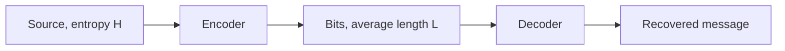

# Information and Coding

## TL;DR

A bit is a unit of surprise, not a unit of storage.
Entropy is the average surprise of a source.
You cannot compress a source below its entropy and still recover every message, except by gambling on a loss.
A noisy channel has a capacity, and below that rate reliable communication is possible.
The paper note is [[15-Technical-Whitepapers/09-Seminal-Computer-Science-Papers/01-Foundations-and-Information-Theory|Foundations and Information Theory]].

## Entropy

For a discrete source with probabilities $p(x)$,

$$
H(X) = - \sum_x p(x) \log_2 p(x)
$$

with the convention that $0 \log 0 = 0$.

A fair coin has $H = 1$ bit.
A coin that lands heads with probability $0.1$ has

$$
H = -0.1 \log_2 0.1 - 0.9 \log_2 0.9 \approx 0.469 \text{ bits}
$$

It is less surprising, so it carries less information per toss, even though the alphabet is the same size.

```python
import math


def entropy(ps: list[float]) -> float:
    return -sum(p * math.log2(p) for p in ps if p > 0)
```

`entropy([0.5, 0.5])` is 1.
`entropy([0.1, 0.9])` is about 0.469.
Uniform over $n$ symbols gives $\log_2 n$ bits.
Any other distribution on the same alphabet gives less.
That is why a field you described as "8 bits" may carry far fewer than 8 bits of entropy if the values are skewed, and why a "random" identifier from a weak generator does not have 128 bits of entropy just because it is 128 bits wide.

## Source coding



Shannon's source coding theorem: for a source of entropy $H$, codes exist whose average length per symbol approaches $H$, and no lossless code beats $H$.
The practical statement is the Kraft inequality.
For binary prefix-free codes of lengths $l_i$,

$$
\sum_i 2^{-l_i} \le 1
$$

and the average length is then at least the entropy.
Prefix-free means no codeword is a prefix of another, so the decoder knows when a symbol ends without a separator.

Huffman coding builds an optimal prefix-free code for a known distribution: rarer symbols get longer codewords.
It reaches within one bit per symbol of the entropy for a single symbol.
Arithmetic coding and asymmetric numeral systems close more of that gap by coding a sequence as one number, not as an integer number of bits per symbol.
Huffman is still the construction you should be able to do by hand.

```python
import heapq
from collections import Counter


def huffman_lengths(text: str) -> dict[str, int]:
    counts = Counter(text)
    if len(counts) <= 1:
        return {symbol: 1 for symbol in counts}
    heap = [(count, index, symbol) for index, (symbol, count) in enumerate(counts.items())]
    heapq.heapify(heap)
    parent: dict[object, object] = {}
    next_id = len(heap)
    while len(heap) > 1:
        count_a, _, left = heapq.heappop(heap)
        count_b, _, right = heapq.heappop(heap)
        node = next_id
        next_id += 1
        parent[left] = node
        parent[right] = node
        heapq.heappush(heap, (count_a + count_b, node, node))
    lengths = {}
    for symbol in counts:
        depth = 0
        cursor = symbol
        while cursor in parent:
            cursor = parent[cursor]
            depth += 1
        lengths[symbol] = depth
    return lengths
```

On `"ab"`, both symbols get length 1.
Two symbols always do: each is a child of the root, however skewed the counts are.
On `"aaaaaaabc"` the lengths are `a: 1`, `b: 2`, `c: 2`.
The rare symbols pay the extra bit.
The function returns lengths, not the bitstrings, because the lengths are the claim.

Compression of already-compressed data, ciphertext, or a high-entropy identifier does nothing useful.
The entropy is already near the bit length.
A compressor that expects to win there is guessing.

## Channels

A noisy channel corrupts symbols.
Mutual information

$$
I(X; Y) = H(X) - H(X \mid Y)
$$

is how many bits the output $Y$ still tells you about the input $X$.
The capacity $C$ is the maximum of $I(X; Y)$ over input distributions the channel allows.

Shannon's channel coding theorem: for any rate $R < C$, there exist codes that drive the error probability as low as you like, at the cost of longer blocks and more delay.
For any rate above $C$, the error probability stays bounded away from zero.
The theorem does not hand you the code.
Hamming codes correct small bursts of bit errors with a simple parity geometry.
Reed-Solomon codes treat symbols as polynomials and correct erasures and errors in storage and networks.
Turbo and LDPC codes are what get close to capacity in modern radios.
Naming them is the job of this note.
Deriving a decoder is a course of its own.

A checksum such as CRC detects many accidental errors and detects no adversary.
An adversary who can see the data can satisfy the CRC.
Authenticity is a MAC or a signature, on the crypto shelf, not a better CRC.

## Where this shows up in systems

A sampling profiler and a metrics system are lossy codes.
You chose a rate, and the capacity of the channel you actually have, the network and the disk, bounds what you can reconstruct.
An identifier's entropy is the log of the space an attacker must search, which is [[Symmetric-Crypto-and-Hashes]] once the identifier is a key or a token.
A compressed column in a database wins only when the column's empirical entropy is low.
The byte size on disk is the code length, and entropy is the floor under it.

## Pitfalls

- File size is not entropy. A padded file is large and unsurprising.
- "Lossless" codecs still depend on a model. The model that mismatches the source expands it.
- A hash is not a compressor you can invert. Collision resistance is a different requirement from unique decodability.
- Capacity is a supremum over codes of unbounded length. A short packet does not achieve it.
- CRC, parity, and a MAC answer three different adversaries: noise you modeled, noise you modeled a bit better, and an attacker.

## Questions

> [!question]- Why can a biased coin be compressed, while a fair coin cannot?
> The biased coin has entropy below 1 bit per toss, so a code can spend fewer than one bit per toss on average and still be lossless.
> A fair coin has entropy 1, and the source-coding theorem says you cannot go below that.

> [!question]- What does the channel coding theorem not give you?
> It does not give an explicit code, a finite-block guarantee at a rate you picked, or protection against an attacker who chooses the errors.
> It says the rate region is real.

## Further reading

- Shannon 1948, for entropy, source coding, and channel capacity in the original paper.
- Cover and Thomas, for the proofs and for mutual information.
- [[Complexity-and-NP-Completeness]] for a different notion of hardness: information limits and time limits are not the same wall.
