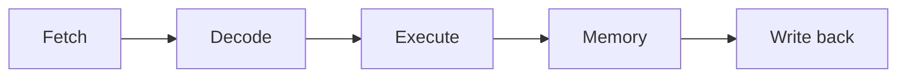

# Processor Pipelines and Instruction-Level Parallelism

## TL;DR

A pipeline overlaps the stages of several instructions so the clock can tick once per stage instead of once per instruction.
It does not make a dependent chain faster than the latency of that chain.
Out-of-order execution finds other work to put in the holes.
The holes that remain are cache misses, mispredicted branches, and long dependency chains. Those are the ones a distinguished engineer hunts in a profile.

## A classic pipeline



In a clean pipeline one instruction finishes per cycle after the pipe is full, even though each instruction takes five cycles of latency.
Three hazards break the picture.

A structural hazard is two instructions that need the same piece of hardware in the same cycle.
A data hazard is an instruction that needs a result that is not written yet.
Forwarding sends the result from the execute stage to a later instruction and removes most back-to-back arithmetic stalls.
A load has a use delay forwarding cannot always hide, because the data comes back from memory a stage later.
A control hazard is a branch whose target is unknown when the next instruction should have been fetched.

## Prediction and out-of-order cores

The frontend guesses the branch and fetches down the guess.
A wrong guess flushes the wrong-path instructions.
The cost is the pipeline depth from fetch to the branch resolving, which on a modern core is more than five cycles, and it is paid on the mispredict rate, not on every branch.
A bimodal counter remembers the last outcomes of one branch.
A two-level predictor uses recent global history to distinguish the same branch in different contexts.
The name to know next is TAGE: several tagged tables indexed by different history lengths. You do not need the circuit. You need the consequence: a branch the history cannot see will mispredict, and no amount of strength reduction fixes that.

Out-of-order execution renames registers so a false dependence on a reused name disappears, issues instructions whose inputs are ready, and commits them in program order from a reorder buffer so exceptions stay precise.
The window is finite.
A chain `a = f(a)` of length longer than the window cannot be overlapped with itself.
Independent iterations can.
That is why unrolling and breaking a carried dependence raise instructions per cycle, and why a single carried dependence caps them.

```python
def dependent_chain(n: int) -> int:
    x = 1
    for _ in range(n):
        x = (x * 1664525 + 1013904223) & 0xFFFFFFFF
    return x

def independent_pair(n: int) -> tuple[int, int]:
    a, b = 1, 2
    for _ in range(n):
        a = (a * 1664525 + 1013904223) & 0xFFFFFFFF
        b = (b * 22695477 + 1) & 0xFFFFFFFF
    return a, b
```

`dependent_chain` has a one-cycle-or-more carried dependence on `x`.
`independent_pair` has two chains. A core with two integer units can overlap them.
The constants are not magic. They keep the work data-dependent so the compiler cannot delete it, and they stay in registers so you are not measuring the cache by accident.

## Pitfalls

- A CPU at 30 percent utilization can still be latency-bound on a dependence chain. Utilization is not throughput of your critical path.
- Vector instructions raise throughput and do not shorten a carried chain unless the chain itself vectorizes.
- Misaligned hot data and [[Caches-Coherence-and-Consistency]] misses dwarf a pipeline diagram. Check the memory before you rewrite the arithmetic.
- The five-stage picture is a teaching machine. A core you buy has a deeper frontend, a reorder buffer, and store buffers. The hazards have the same names.

## Questions

> [!question]- Forwarding removes a back-to-back add stall. Why can a load still stall the next instruction?
> The loaded value is not produced in the execute stage.
> It comes back from the cache on a later stage.
> The consumer that wants it in the next cycle is waiting on a result that does not exist yet.

> [!question]- Why does the reorder buffer commit in program order if execution was out of order?
> So an instruction that traps, or a mispredicted branch, can discard every later instruction that should not have happened.
> Precise exceptions mean the architectural state matches a single place in the program.

## Further reading

- Hennessy and Patterson, the pipeline and ILP chapters.
- [[12-Performance-Engineering/README|Performance engineering]] for how this shows up in a profile, including false sharing.
- [[14-Low-Latency-Systems/00 Home|Low-latency systems]] when the same core is on a trading path.
