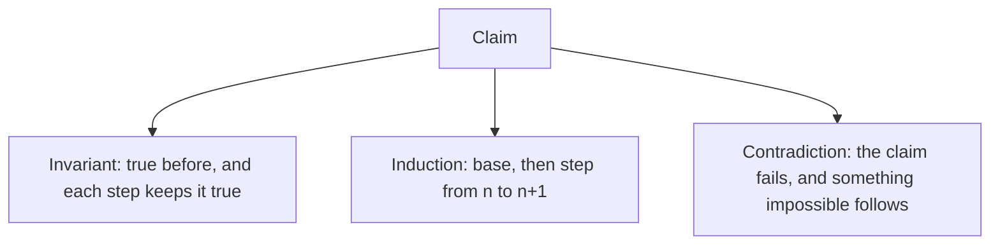

# Proofs and Invariants

## TL;DR

A proof is an argument that a claim holds for every input in a stated set, not a test that held for the inputs you tried.
The tools you will actually use are the invariant, induction, and contradiction.
Every correct loop, every consensus protocol, and every cryptographic reduction is one of those three in disguise.

## The shapes



An invariant is a predicate on the state.
You show it holds at the start.
You show every legal step takes a state that satisfies it to another state that satisfies it.
You show that a state satisfying it, together with the exit condition, is the property you wanted.
That is a loop proof and a protocol proof.
[[Formal-Models-and-Specifications]] is the same idea written so a checker can try to break it.
[[Raft-Consensus]] is an invariant about a log: two majority-committed entries at the same index are equal, because two majorities intersect.

Induction is the invariant specialized to the natural numbers.
The base case is the empty list, the empty tree, or zero.
The step assumes the claim for smaller values and builds the next one.
Structural induction does this on trees and lists: assume it for the children, prove it for the node.

Contradiction assumes the negation and derives a false statement.
Use it when the claim is "no such object exists".
The halting problem in [[Automata-and-Computability]] is this shape.
So is the proof that a comparison sort needs $\Omega(n \log n)$ comparisons in the worst case: a tree of height $h$ has at most $2^h$ leaves, and there are $n!$ possible orders.

## Worked invariant

Binary search on a sorted array claims: if `target` is present, the answer index lies in `[lo, hi)`.

```python
def binary_search(xs: list[int], target: int) -> int:
    lo, hi = 0, len(xs)
    while lo < hi:
        mid = lo + (hi - lo) // 2
        if xs[mid] < target:
            lo = mid + 1
        else:
            hi = mid
    return lo if lo < len(xs) and xs[lo] == target else -1
```

At the start, `[0, n)` covers every index.
If `xs[mid] < target`, the target cannot sit at `mid` or to its left, because the array is sorted.
The new interval is `[mid + 1, hi)`.
Otherwise the target, if present, sits at `mid` or to its left, and the new interval is `[lo, mid]`.
The interval shrinks, so the loop ends.
On exit, `lo == hi`, and the only index that might hold `target` is `lo`.

The midpoint formula `lo + (hi - lo) // 2` is part of the proof.
` (lo + hi) // 2 ` overflows a fixed-width integer when `lo` and `hi` are large.
An invariant that assumes a mathematical integer is false in the language you shipped.

## Pitfalls

- An example is not a proof. One passing test does not quantify over the inputs.
- An invariant you do not re-establish on every branch is not an invariant. The error path counts.
- Induction that skips the base, or that steps from $n$ to $n+1$ while the algorithm shrinks by two, does not cover the odd cases.
- "By inspection" hides the step you got wrong.

## Questions

> [!question]- Why does the binary-search interval include `lo` and exclude `hi`?
> The empty interval is `lo == hi`, which is easy to test.
> Every shrink keeps `target` inside if it was inside, and the excluded end is the first index you have proved is too far to the right, or just past the end.

> [!question]- Where does an invariant show up in a distributed system?
> In the quorum intersection of [[Replication-and-Quorums]], and in the commit rule of a replicated log.
> If you cannot name the predicate that is true after every message, you do not yet have a protocol.

## Further reading

- Velleman, How to Prove It, for the shapes.
- CLRS, for the loop-invariant style used on algorithms.
- [[Complexity-and-NP-Completeness]] for proofs that reduce one problem to another instead of solving it.
