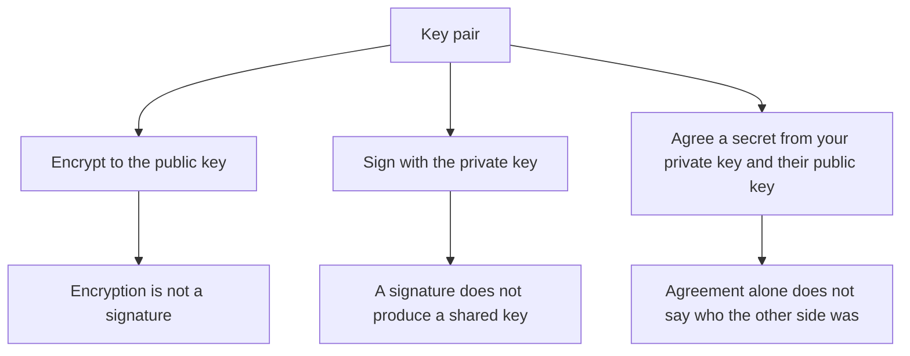
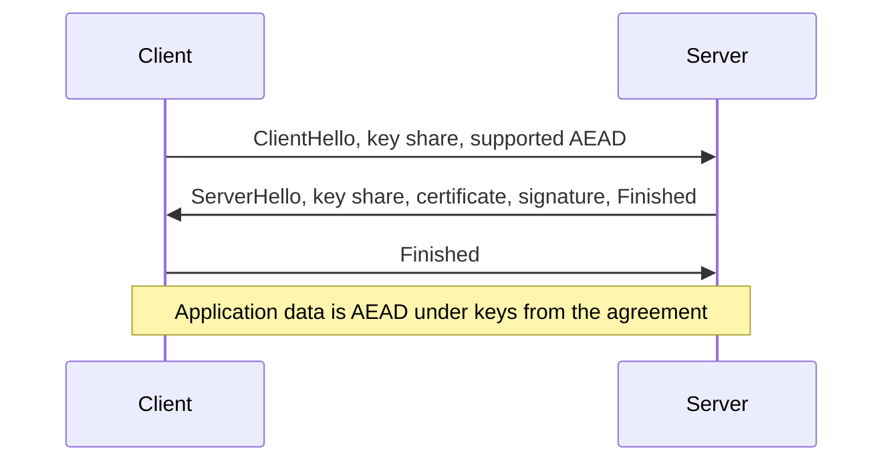

# Public-Key Crypto and TLS

## TL;DR

Public-key primitives do three different jobs: encrypt to a public key, sign with a private key, and agree a shared secret.
Textbook RSA is none of the finished jobs.
TLS 1.3 uses an ephemeral Diffie-Hellman agreement, signs the handshake with a long-term key, and then speaks only AEAD.
[[Symmetric-Crypto-and-Hashes]] is the channel after that agreement.

## Three jobs

Encryption provides confidentiality to the holder of the private key.
A signature provides authenticity to anyone who holds the public key, and verifiers cannot forge.
Key agreement gives two parties the same secret and gives a passive eavesdropper nothing they can use.
Agreement does not name the peer.
The peer is named by a signature on the ephemeral public key, or by a pre-shared identity.
Mixing the three verbs up is how a design "uses RSA" and still has no integrity.

## RSA, the teaching version and the real one

Take $p = 5$, $q = 11$, so $n = 55$ and $\varphi(n) = 40$.
Choose $e = 3$.
Then $d = 27$, because $3 \times 27 = 81 \equiv 1 \pmod{40}$.
Textbook encryption of a message $m$ is $c = m^e \bmod n$.
The message $2$ always encrypts to $8$, because $2^3 = 8$.
Decryption is $c^d \bmod n$, and $8^{27} \equiv 2 \pmod{55}$.

That arithmetic is the trap.
The map is deterministic, so equal messages are equal ciphertexts.
It is malleable.
Small messages with a small exponent sit in a range where the modular reduction never happens and a root recovers $m$.
Nothing about this toy modulus is a scheme you ship.
It exists so the failure is visible at a size you can compute by hand.

RSA encryption in practice is RSA-OAEP.
The padding is randomized and is checked on decrypt, so the map is not deterministic and a mangled ciphertext fails the check.
RSA signatures in practice are RSA-PSS, a different padding with a different purpose.
Signing with the decryption exponent and "encrypting" with the encryption exponent, on raw integers, is the textbook confusion.
PKCS #1 v1.5 encryption padding has a long history of padding-oracle failures.
New designs use OAEP or, more often, do not use RSA encryption at all.

A 2048-bit modulus is a common floor for RSA that must last.
The key is the pair $(n, e)$ in public and $d$ in private, and the primes stay private because factoring $n$ recovers them.

## Curves

Ed25519 is a signature.
The private key signs a message.
The public key verifies it.
The nonce inside the signature is derived from the key and the message, which removes a class of failures where a reused random nonce leaks the private key.
It does not agree a session key.

X25519 is an elliptic-curve Diffie-Hellman function.
Each side multiplies the peer's public point by its own scalar and arrives at the same shared secret.
A passive observer sees the two public points and cannot compute that secret, under the hardness assumption the curve is chosen for.
An active attacker who substitutes their own public point gets a secret with you, and you do not notice, because agreement is not authentication.
The signature over the ephemeral public key is what closes that substitution.
Curve25519 is not "more AES".
It is a different job, and Ed25519 and X25519 are not interchangeable because both strings contain 25519.

## TLS 1.3

The client sends an ephemeral key share in the first flight.
The server sends its own ephemeral share, a certificate chain, and a signature over the handshake, then a Finished tag that proves it holds the agreed keys.
The client checks the chain, the signature, and the Finished tag, then sends its own Finished.
Application data after that is AEAD, from [[Symmetric-Crypto-and-Hashes]].
One round trip before application data is the ordinary full handshake.

Forward secrecy is a property of this shape.
The long-term key only signs.
The session keys come from ephemeral shares that are thrown away.
A later theft of the certificate's private key lets the thief sign new handshakes.
It does not let them decrypt a recorded session whose ephemeral shares are gone.
RSA key transport, where the client encrypts a session key to the certificate's RSA key, does not have that property.
TLS 1.3 removed it.
Static RSA decryption of a captured session is a TLS 1.2 configuration, not a 1.3 one.

The certificate chain is a path of signatures from a root the client already trusts, through intermediates, to the leaf.
The leaf has to name the host you meant to reach.
A valid signature to the wrong name is a valid signature for someone else's server.
Revocation is the unsolved operational half: a certificate can be syntactically perfect after the key was stolen, until a client actually learns that it was revoked.

0-RTT in TLS 1.3 lets the client send data before the handshake finishes, using a key from a previous session.
That data can be replayed.
0-RTT is acceptable for a request the application can stand to see twice, and unacceptable for a request that charges, sends, or deletes.
The protocol will not save you from that replay.
The application has to be idempotent, which is [[Idempotency-and-Delivery]].

## What to refuse

- Textbook RSA, in either direction.
- A signature scheme used as encryption, or the reverse.
- A Diffie-Hellman share you did not authenticate.
- TLS versions and cipher suites the current standard has retired. Negotiating them "for compatibility" reintroduces the removed attacks.
- A custom handshake. Use a maintained TLS stack, and configure versions and certificate checks on purpose.
- Certificate checks you disabled to make a test pass. The test then proves the check is off.

## Pitfalls

- "We pin the public key" is a real control, and it breaks the day the key rotates, unless the pin set includes the next key.
- A self-signed certificate is an unauthenticated key unless you distributed that exact key by another channel.
- Forward secrecy is about recorded traffic and a later key theft. It does not hide traffic from an endpoint that is compromised now.
- 0-RTT replay is a feature of the mode, not a bug in your load balancer.
- Hashing a password and calling it a key agreement does not put you on this page. Passwords stay on the symmetric page, inside Argon2.

## Questions

> [!question]- Why is there no RSA key transport in TLS 1.3?
> Encrypting the session key to the long-term RSA key means a later compromise of that key decrypts every recorded session.
> Ephemeral Diffie-Hellman plus a signature keeps the long-term key out of the session-key derivation.
> The protocol then has forward secrecy by construction.

> [!question]- What does the certificate signature actually bind?
> It binds the server's long-term public key to a name, in the judgment of the issuer.
> The handshake signature then binds this ephemeral key share to that long-term key.
> Drop either bind and the peer is whoever answered the TCP connection.

## Further reading

- Boneh and Shoup, for RSA-OAEP, signatures, and Diffie-Hellman.
- RFC 8446, for the TLS 1.3 handshake, 0-RTT, and the AEAD-only record layer.
- RFC 8032, for Ed25519.
- [[Formal-Models-and-Specifications]] is how a handshake this size gets a machine-checked model instead of a diagram alone.
