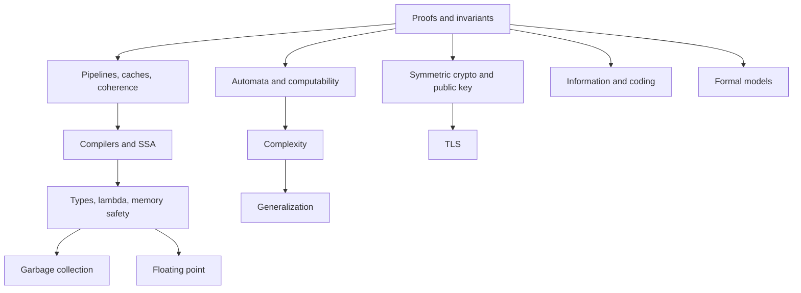

# Computer Science Canon

## TL;DR

This folder is the part of computer science that the rest of the vault assumes and does not re-teach.
Operating systems, networks, databases, algorithms, and distributed systems already have their own shelves.
A computer scientist who stops at those shelves still owes proofs, automata, complexity, the processor, the compiler, cryptography, information, and what a learned model is allowed to claim.

> [!tip] How to use this shelf
> Redraw the diagram before you reread the prose.
> Then answer the folded question without looking.
> The review queue will bring the note back. Set `last_reviewed` when you can still redraw it.



```dataview
TABLE WITHOUT ID file.link AS "Note", type AS "Type", status AS "Status"
FROM "01-CS-Foundations/Computer-Science-Canon"
WHERE type != "moc"
SORT file.name ASC
```

## What this shelf teaches

- [[Proofs-and-Invariants]] is the method: induction, contradiction, and an invariant that survives every step.
- [[Automata-and-Computability]] is what a machine can decide at all.
- [[Complexity-and-NP-Completeness]] is what it can decide in time you can afford.
- [[Processor-Pipelines-and-ILP]] is how one core overlaps work, and why a mispredicted branch dominates a tight loop.
- [[Caches-Coherence-and-Consistency]] is the contract between the memory you wrote and the value another core reads.
- [[Compilers-and-SSA]] is the pipeline from source text to instructions, and the deal undefined behavior makes with the optimizer.
- [[Types-Lambda-and-Memory-Safety]] is why a type checker can reject a program before it runs.
- [[Garbage-Collection]] is how a runtime finds live objects without you freeing them.
- [[Floating-Point]] is why `(0.1 + 0.2)` is not `0.3`, and why money is an integer.
- [[Symmetric-Crypto-and-Hashes]] is secrecy and integrity with a shared key, and what a hash is not.
- [[Public-Key-Crypto-and-TLS]] is how two strangers agree a key and how TLS uses that agreement.
- [[Information-and-Coding]] is the bit as a unit of surprise, and the limit on compression.
- [[Formal-Models-and-Specifications]] is a state machine you can check before you trust the code.
- [[Generalization-and-Learning]] is the gap between a fit on the training set and a claim about new inputs.

## Where the rest of the science already lives

Do not look for a second operating-system course here.
The advanced operating systems shelf, including virtual memory, scheduling, and the paper notes, is [[01-CS-Foundations/Operating-Systems/README|Operating Systems]].
Networks are [[01-CS-Foundations/Computer-Networks/README|Computer Networks]].
Relational design, SQL, and query shape are [[01-CS-Foundations/DBMS/README|DBMS]].
Algorithms and data structures are [[03-Data-Structures-Algorithms/README|the DSA shelf]].
Distributed systems, from quorums to the case studies, are [[Distinguished-Design-Path]] and [[04-System-Design/README|System Design]].
The labs for Raft, logs, and lock-free structures are [[08-Distinguished-Engineering/README|Distinguished Engineering]].
Latency, coherence in the trading sense, and the hardware path are [[14-Low-Latency-Systems/00 Home|Low-Latency Systems]].
Agent systems are [[13-Agentic-AI/README|Agentic AI]].
The primary papers, including Turing and Shannon, are [[15-Technical-Whitepapers/09-Seminal-Computer-Science-Papers/01-Foundations-and-Information-Theory|Foundations and Information Theory]].
Vulnerability classes are on the security shelf. Cryptography on this shelf is the mechanism those classes break.

## A question you should be able to answer

> [!question]- What is the difference between undecidable and intractable?
> Undecidable means no algorithm halts with the right answer on every input.
> Intractable, in the usual speech of this shelf, means an algorithm exists and its cost grows faster than you can pay, often because the problem is NP-complete and you do not have a polynomial algorithm.
> The halting problem is undecidable.
> Satisfiability is decidable and NP-complete.
> Brute force decides it. The brute force is why it is still hard.
