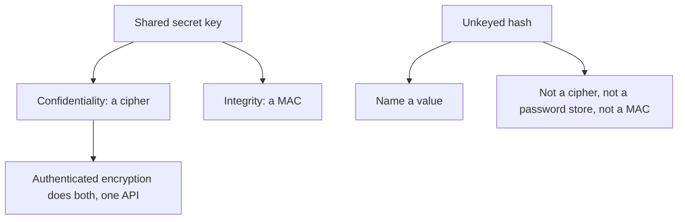

# Symmetric Crypto and Hashes

## TL;DR

Symmetric cryptography hides a message and detects tampering when both sides already share a key.
Kerckhoffs' principle says the secrecy lives in the key, not in the algorithm.
A cipher without an authenticity check is the wrong tool.
A fast hash is the wrong tool for a password.
[[Public-Key-Crypto-and-TLS]] is how the shared key gets agreed when the two sides are strangers.

## The split



Confidentiality means an observer without the key cannot recover the plaintext.
Integrity means a modified ciphertext is rejected.
They are independent.
A stream cipher that decrypts any bitstring will cheerfully decrypt the attacker's bitstring.
The application then parses attacker-controlled plaintext and calls it a success.

## Modes

ECB encrypts each block alone.
Equal plaintext blocks become equal ciphertext blocks.
A picture encrypted under ECB still shows its silhouette.
ECB is not a mode you choose.

CBC chains each plaintext block with the previous ciphertext and needs a fresh, unpredictable IV.
Reusing an IV leaks equality of plaintext prefixes.
CBC without an authenticity check is also open to a padding oracle: a service that reports whether the padding was valid is revealing a bit of the plaintext on every answer.
The fix is to authenticate the ciphertext, not to describe a tighter parser.

CTR turns a block cipher into a stream by encrypting a counter.
The ciphertext is the plaintext XOR that stream.
Reuse of a nonce under the same key reuses the stream, and the XOR of the two ciphertexts is the XOR of the two plaintexts.
A counter mode nonce is unique per key, or it is broken.

GCM is CTR plus GHASH.
The ciphertext is the CTR stream, and the tag is a polynomial hash of the ciphertext and the associated data, keyed by a value derived from the block cipher.
Associated data is authenticated and not encrypted: headers you need to read and still need to protect.
The standard nonce is 96 bits and must be unique per key.
A repeated nonce under GCM does more than leak plaintext XOR.
It also lets a forger compute tags.
"We use AES" is not a design.
"We use AES-GCM with a unique 96-bit nonce per key, and we verify the tag before parsing" is a design.

RFC 5116 names this shape AEAD.
One call encrypts and tags.
One call verifies and decrypts, and it fails closed.

## Hashes

A cryptographic hash $H$ is a function you want to behave like a random function in three ways.

| Goal | What the attacker must not find |
| :--- | :--- |
| Preimage resistance | Given $y$, an $x$ with $H(x) = y$ |
| Second-preimage resistance | Given $x$, an $x' \neq x$ with $H(x') = H(x)$ |
| Collision resistance | Any pair $x \neq x'$ with $H(x) = H(x')$ |

Collision resistance is the strongest of the three in the sense that a collision breaks it even when the attacker does not have a target input.
The birthday bound is why a hash with an $n$-bit output loses collision resistance near $2^{n/2}$ evaluations, not near $2^n$.
SHA-256 has a 256-bit output.
Its collision bound is around $2^{128}$ evaluations, which is the number you are relying on, not 256 bits of collision security.

SHA-256 is a Merkle-Damgard hash.
A length-extension attacker who sees $H(m)$ and the length of $m$, but not $m$, can compute $H(m \,\|\, \mathrm{pad} \,\|\, m')$ for a chosen suffix.
That is why $H(k \,\|\, m)$ is not a MAC.
HMAC feeds the key twice, inside and outside, and closes that hole.
A MAC proves the holder of the key produced the tag.
Anyone who can verify can also forge, because verification uses the same key.
A signature, on the public-key shelf, does not have that property.

## Passwords

SHA-256 is fast on purpose.
An attacker who stole a database of SHA-256 password hashes will try billions of guesses per second per GPU.
A password hash is the opposite design: slow, and hungry for memory, so a guess costs RAM as well as time.

Argon2id is the current standard choice.
Each password has its own salt, stored beside the hash, so identical passwords do not look identical and a precomputed table does not transfer.
The parameters are a memory size, an iteration count, and a parallelism degree.
You set them so one honest login costs a time you can spare, and you rehash on login when the parameters move up.
A pepper, a secret that is not in the password database, helps only while that secret stays out of the stolen disk.

Do not invent a stretching scheme by looping SHA-256 "a few times" and calling it done.
The memory hardness is the part a custom loop forgets.

## Compare tags in constant time

```python
def tags_equal(a: bytes, b: bytes) -> bool:
    if len(a) != len(b):
        return False
    diff = 0
    for x, y in zip(a, b):
        diff |= x ^ y
    return diff == 0
```

A comparison that returns on the first mismatched byte tells a timing observer how long the prefix was.
AEAD tags are a fixed width, so the length check is not a leak between two honest tags.
The loop still has to run to the end.
Use the comparison your cryptography library already ships when you have one.
This function is the specification of that duty, not a new MAC.

## Pitfalls

- Encryption without a tag is not a complete design. The receiver must verify before it parses.
- A nonce is not an IV you can set to zero "for now". Uniqueness is the security property.
- SHA-256 of a password is a fast oracle for an offline guesser.
- $H(k \,\|\, m)$ is not a MAC, because of length extension.
- A MAC key and a cipher key are different keys. Reusing one key for both jobs couples failures.
- Rolling your own cipher, mode, or padding fails closed only by accident.

## Questions

> [!question]- Why does nonce reuse destroy GCM and not merely weaken it?
> CTR with a repeated nonce produces the same keystream, so two ciphertexts XOR to the two plaintexts.
> GCM's tag is computed from a value that the repeated nonce also exposes, so the authenticity check fails open as well.
> The rule is uniqueness, not "unlikely".

> [!question]- What is the difference between a hash, a MAC, and a signature?
> A hash is unkeyed. It names a value and does not authenticate a sender.
> A MAC is keyed with a shared secret. Anyone who can check it can forge it.
> A signature is checked with a public key and produced with a private key. Verifiers cannot forge.

## Further reading

- Boneh and Shoup, for definitions of IND-CPA, INT-CTXT, and why AEAD is the interface.
- RFC 5116, for the AEAD API.
- RFC 9106, for Argon2 parameters.
- The vulnerability catalog on the security shelf is what these rules look like when an application breaks them.
