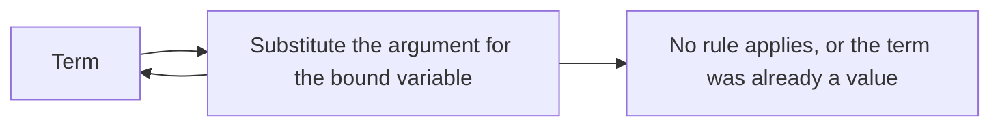
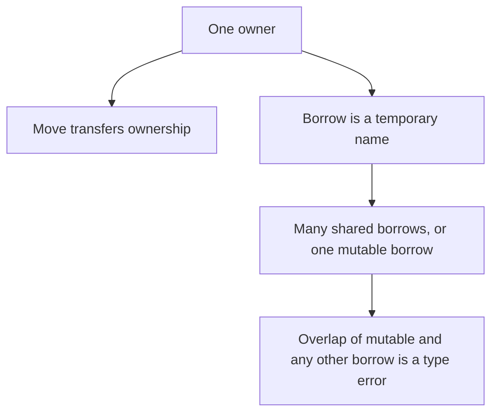

# Types, Lambda, and Memory Safety

## TL;DR

The lambda calculus is the smallest language in which "apply a function" is the whole computation model.
A type system is a set of rules that reject some terms before they run.
The payoff is a theorem: a well-typed term does not get stuck, and in the simply typed calculus it also terminates.
Memory safety is that idea applied to aliasing, lifetimes, and bounds.

## Untyped lambda

A term is a variable, an abstraction $\lambda x.\, t$, or an application $t\; u$.
Computation is substitution.
The identity is $\lambda x.\, x$.
The term $\Omega = (\lambda x.\, x\; x)(\lambda x.\, x\; x)$ reduces to itself and never finishes.
Untyped lambda can encode numbers, pairs, and loops.
It can also fail to terminate, and a nonsense application is still a term.



"Stuck" in the untyped calculus is a soft idea, because almost everything can be applied.
The typed calculus makes stuck precise: a term that is not a value and has no reduction rule.

## Progress and preservation

Simply typed lambda assigns a type to every variable and requires the function's argument type to match the value you apply.

Two lemmas carry the theory.

Progress: a well-typed closed term is a value or it can take a step.
Preservation: if a well-typed term steps, the result has the same type.

Together they say a well-typed program does not reach a state the semantics cannot explain.
The simply typed calculus is also strongly normalizing.
Every well-typed term reaches a value.
There is no general loop.
You get loops back by adding a fixed-point operator or a recursive `let`, and then termination is no longer a theorem of the types alone.

That is the right way to hear "types are specifications".
They are specifications of a particular theorem, not of every property you care about.
A well-typed program can still compute the wrong answer.

## Let-polymorphism

Hindley-Milner typing, the core of ML and a large part of Haskell and Rust inference, generalizes at `let`.

```text
let id = fun x -> x in (id 1, id true)
```

`id` receives the type scheme $\forall \alpha.\, \alpha \rightarrow \alpha$.
Each use instantiates $\alpha$ separately, so the integer use and the boolean use are both legal.
A lambda-bound argument is not generalized the same way.
That restriction keeps inference decidable and principal: there is a best type, and algorithm W finds it by unification.

This is why "the compiler inferred it" has a boundary.
Higher-rank uses, where a caller must pass a polymorphic function, need an annotation in this family of systems.
Inference did not fail at random.
The algorithm is complete for the fragment it claims.

## Two sentences that are theorems

Curry-Howard: a type is a proposition, and a term of that type is a proof of the proposition.
Implication is a function, conjunction is a pair, and a proof that does not use its assumption is a function that ignores an argument.

Parametricity: in a pure language, the only function of type $\forall \alpha.\, \alpha \rightarrow \alpha$ is the identity.
The type is so uninformative that the body cannot inspect the value, so it can only return it.
That is why a generic `sort` cannot depend on the bit pattern of the element except through the comparison you passed.

Both sentences have side conditions.
Bottom, divergence, unsafe casts, and reflection punch holes in them.
The sentences are still the reason generic libraries have algebraic properties you can use without reading every instantiation.

## Memory safety

Memory safety means: no use after free, no double free, no out-of-bounds access, in the fragment the language calls safe.
A type system can enforce it by tracking who owns a value and for how long a borrow is allowed to exist.



Rust is the widely shipped answer in that shape.
A value has one owner.
A shared borrow and a mutable borrow of the same value may not overlap.
The checker rejects programs that would use freed memory or mutate through an alias the type did not allow.
`unsafe` is an explicit hole where the programmer takes the proof obligation back.
The type system did not become false.
The module boundary became the place the proof has to be written by a person.

C++ does not run that checker on ordinary references.
Lifetimes are a convention, and the tools around the language, including the checks in [[cpp_safety.cpp]], are how you recover some of the same failures after the fact.
[[Garbage-Collection]] is the other answer: do not free an object while a reference exists, and find the garbage later.
A collector prevents use-after-free of managed objects.
It does not prevent a data race, and it does not prevent a bounds error unless the language also checks the index.

[[Compilers-and-SSA]] is what happens after the judgment succeeds.
The type checker deletes programs.
The optimizer then trusts the deletions.

## Pitfalls

- "It typechecks" does not mean "it is correct". Progress and preservation say it will not get stuck, not that the specification is the one you wanted.
- Dynamic typing is not the absence of types at runtime. The tag is still there, and the stuck state happens later.
- Inference is decidable on a fragment. Adding the feature you saw in a paper can leave that fragment.
- A garbage-collected language can still be memory-unsafe at the boundary with C, and a Rust program can still be wrong in `unsafe`.
- Parametricity does not apply to a function that accepts `Any` and branches on the runtime tag. You gave it the information the theorem assumes it does not have.

## Questions

> [!question]- Why does simply typed lambda terminate, while a real language does not?
> The simply typed rules cannot type a general fixed point.
> Languages people ship add recursion, loops, or a fixed-point primitive, and they give up the termination theorem on purpose.

> [!question]- What is the difference between memory safety and thread safety?
> Memory safety is about lifetimes and bounds of a location.
> Thread safety is about conflicting accesses ordered in time.
> Rust's borrow rules reject many data races as well, because a mutable alias is exclusive.
> A lock in a garbage-collected language is a separate proof.

## Further reading

- Pierce, Types and Programming Languages, for progress, preservation, and Hindley-Milner.
- Peyton Jones, for how a typed functional language becomes a runtime.
- [[Automata-and-Computability]] for the line between a check that always halts and a property that is undecidable. Rice's theorem is why the type system proves a conservative subset.
