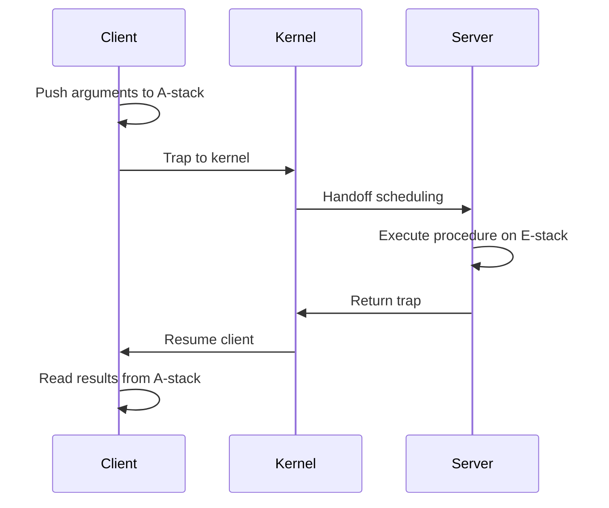

# Part 2 Cheat Sheet: Parallel Systems

## Shared Memory Machines and Coherence

- **Sequential Consistency**: The result of any execution is the same as if the operations of all processors were executed in some sequential order, and the operations of each individual processor appear in this sequence in the order specified by its program.
- **Cache Coherence**: Cache coherence ensures that a read of a memory location returns the most recently written value to that location across all caches.
- **Write-Invalidate**: Writing to a shared variable broadcasts an invalidation signal.
- **Write-Update**: Writing to a shared variable broadcasts the new value.
- **False Sharing**: False sharing occurs when two processors write to independent variables that reside in the same cache line, causing unnecessary invalidation traffic.
- **Dance-hall architecture**: A dance-hall architecture places all memory modules at an equal distance from every processor across an interconnection network.
- **Symmetric Multiprocessor (SMP)**: An SMP connects all processors to a centralized shared memory via a uniform bus.
- **Distributed Shared Memory (DSM)**: A hardware DSM distributes slices of memory next to each processor to minimize local latency while maintaining a single global address space.

## Lock Synchronization Algorithms

Locks provide mutual exclusion for critical sections.

| Algorithm | Space Complexity | Fairness | Network Traffic (Contended) | Hardware Primitives |
| :--- | :--- | :--- | :--- | :--- |
| **Test-and-set** | O(1) | None | High (linear per release) | test-and-set |
| **Ticket** | O(1) | FIFO | Medium (linear reads) | fetch-and-increment |
| **Anderson** | O(P) static | FIFO | Low (constant per handoff) | fetch-and-increment |
| **MCS** | O(N) dynamic | FIFO | Low (constant per handoff) | fetch-and-store (swap) |

- **Anderson Lock**: An Anderson lock is an array-based queuing lock where each thread spins on a unique, padded element.
- **MCS Lock**: An MCS lock is a linked-list lock where threads append a node using fetch-and-store and spin on a local flag in their node, achieving constant network transactions per acquisition.

## Barrier Synchronization Algorithms

Barriers ensure all threads reach a phase before any proceed.

| Algorithm | Network Messages | Critical Path | Atomic Instructions | Best Used For |
| :--- | :--- | :--- | :--- | :--- |
| **Centralized** | O(N) | O(N) | Yes | Small scale SMPs with broadcast cache coherence. |
| **Combining Tree** | O(N) | O(log_K N) | Yes | Medium systems where hot spots must be avoided. |
| **MCS Tree** | O(N) | O(log_4 N) | Yes | Large-scale NUMA or cache-coherent systems. |
| **Tournament** | O(N) | O(log_2 N) | No | Clusters or systems without atomic instructions. |
| **Dissemination**| O(N log N) | O(log_2 N) | No | Systems lacking shared memory or atomics. |

- **Sense-reversing barrier**: A sense-reversing barrier uses a single boolean flag to avoid resetting a counter between phases.
- **MCS tree barrier**: An MCS tree barrier uses a 4-ary tree for arrival tracking and a binary tree for wakeups.
- **Tournament barrier**: A tournament barrier pairs threads in rounds where losers wait and winners advance to the next round until a champion signals all losers.
- **Dissemination barrier**: A dissemination barrier requires threads to signal in logarithmic rounds with linearithmic messages, optimizing the critical path.

## Lightweight Remote Procedure Call (LRPC)

LRPC optimizes communication between protection domains on the same machine.

- **A-stack**: An A-stack is a shared memory region mapped between client and server to pass arguments without kernel copying.
- **E-stack**: An E-stack is a server-side stack used for executing the procedure.
- **Handoff Scheduling**: Handoff scheduling occurs when the kernel directly schedules the server thread, bypassing the standard run queue.
- **Binding**: Binding is the process where a client connects to a server by obtaining an invocation capability and pre-allocating A-stacks.

## Multiprocessor Scheduling

Scheduling must balance load, fairness, and cache affinity.

- **Fixed Processor**: A fixed processor policy dictates that a thread runs only on the processor where it was created, maximizing affinity but risking load imbalance.
- **Last Processor**: A last processor policy preferentially schedules threads on the processor they last ran on.
- **Minimum Intervening**: A minimum intervening policy schedules a thread on the processor with the fewest other threads run since its last execution.
- **Co-scheduling**: Co-scheduling involves scheduling all threads of a parallel application simultaneously to avoid spinning for descheduled peers.

## Shared Memory Multiprocessor Operating Systems

Scalable OS structures minimize global locks and centralized data structures.

- **Tornado**: Tornado uses clustered objects to replicate, partition, or share data structures based on access patterns.
- **Protected Procedure Call**: A protected procedure call is Tornado's mechanism for fast, localized cross-domain calls.
- **Corey**: Corey introduces address ranges and shares, allowing applications to explicitly control sharing of OS data structures.
- **Dedicated Cores**: Dedicated cores in Corey reserve specific processors for kernel tasks to isolate OS overhead and preserve cache state.
- **Cellular Disco**: Cellular Disco virtualizes large multiprocessors to provide fault containment and scalability without rewriting the guest OS.
