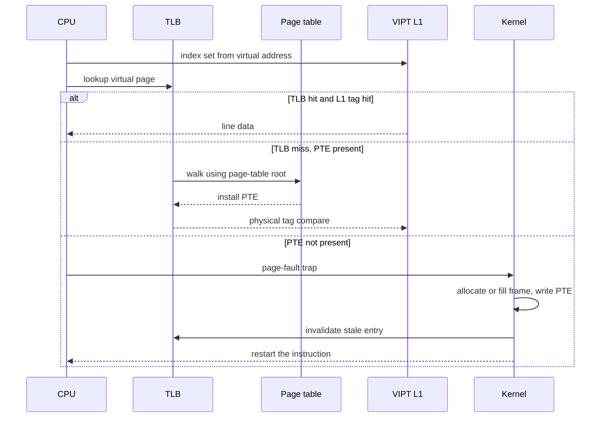

# Refresher: Virtual Memory and Caches

> [!summary] TL;DR
> A process names memory with virtual addresses, and the hardware translates each one to a physical frame through a page table cached by the TLB.
> A virtually indexed, physically tagged cache can start the lookup before translation finishes, but only when the index bits that are not part of the page offset are handled carefully.
> A page fault is a controlled trap that allocates or fetches a frame, installs a PTE, and restarts the faulting instruction.
> Replacement, working sets, and page coloring decide which frames stay in RAM and which cache sets they occupy.
> Context switches and coherence traffic later pay for whatever this translation and cache design got wrong.

## Learning outcomes

- Trace one virtual address through a VIPT cache, a TLB, and a multi-level page table, and name which step can complete before translation.
- Distinguish a segment from a page, and a virtual page from a physical frame, with the protection and fragmentation consequences of each.
- Walk the page-fault path for the only runnable process, from the trap to the restarted instruction.
- Compute FIFO and LRU fault counts on a reference string and show a case where adding a FIFO frame adds a fault.
- Explain working set, thrashing, the paging daemon, the swapper, the loader, and the linker as separate mechanisms.
- Compute how many page colors a cache needs, and when associativity removes the VIPT alias problem.
- Compare invalidate and update coherence, and place L1 and L2 relative to a core on a multicore chip.

## Motivation and the problem

Processes cannot be allowed to name physical RAM directly.
If they did, one store could overwrite another process or the kernel, and a program would have to be rewritten every time it was loaded at a different address.
Virtual memory gives every process its own address space, a protection boundary, and the illusion of a large contiguous memory backed by a smaller set of frames.
The cache hierarchy then makes those frames fast, but it introduces a second naming problem: the cache must be indexed and tagged with some mix of virtual and physical bits, and those bits must stay coherent across cores.
Every later topic in this course, from microkernel IPC to shadow page tables, is a reaction to the cost of crossing or duplicating this translation machinery.
The companion notes are [architecture, storage, and networking](R02-Architecture-Storage-and-Networking.md) and [concurrency and the kernel](R03-Concurrency-and-the-Kernel.md).

## Core concepts

### Virtual pages versus physical frames

<!-- coverage: R01-01 -->

> [!note] Definition
> A virtual page is a fixed-size, aligned block of a process virtual address space.
> A physical frame is a block of the same size in RAM, and it is the unit the OS allocates and maps.

The CPU generates a virtual address.
Hardware splits it into a virtual page number and a page offset.
Translation replaces the virtual page number with a physical frame number and leaves the offset unchanged, so a byte keeps its position inside the page.
A page and a frame are the same size, which is why the mapping is a pure relocation of the high bits.
Typical page sizes are 4 KiB, with larger pages (2 MiB, 1 GiB on x86-64) used when the TLB reach matters more than fine-grained allocation.
The OS can map the same frame into several address spaces, mark it read-only, or leave it unmapped.
Unmapped and wrongly protected references do not silently wrap; they trap.
That trap is the page fault discussed below.
Contiguous virtual pages need not occupy contiguous frames, which is what lets the kernel pack RAM without compacting processes.

### Page tables and multi-level page tables

<!-- coverage: R01-02 -->

> [!note] Definition
> A page table is the OS-built map from virtual page numbers to frame numbers plus permission and status bits.
> A multi-level page table breaks that map into a tree so that unused regions of a sparse address space consume no leaf pages.

A single-level page table for a 32-bit space with 4 KiB pages has 2^20 entries.
At 4 bytes per entry that is 4 MiB per process, paid even if the process touches one page.
A two-level table uses the VPN as a directory index plus a page-table index.
A three-or-four-level table, as on x86-64, does the same with more slices of the virtual address.
A missing intermediate node means the whole subtree is absent, so a 48-bit user space does not require a full tree.
Each leaf page-table entry (PTE) holds the frame number, a present bit, permission bits (read, write, execute, user), and the hardware or software status bits used for replacement (accessed, dirty).
The OS updates the table.
The CPU only reads it, usually through the TLB.
Hardware page-table walkers on x86 and ARM walk the tree themselves on a TLB miss.
Older software-managed TLBs (classic MIPS) trap into the kernel, which is the design an exokernel later exposes to the application.
The tree is a time-space trade.
Each extra level adds a dependent memory reference on a cold walk, and those references are why a TLB exists.

### TLB and TLB shootdown

<!-- coverage: R01-03 -->

> [!note] Definition
> The translation lookaside buffer is a small cache of recent page-table entries, keyed by virtual page number and sometimes by an address-space tag.
> A TLB shootdown is the act of removing stale entries from every TLB that might still hold them after a PTE change.

On a hit, translation finishes in a few cycles and never touches the page table in memory.
On a miss, a hardware walker or a kernel handler fills one entry from the page table and retries.
The TLB is much smaller than RAM, so its contents are a working set of translations, not the full map.
Entries become stale when the OS changes a PTE: unmap, protect, remap, or swap.
A uniprocessor can invalidate the local entry, or write a new page-table root and flush.
A multiprocessor is harder.
Another core may have cached the old translation and would keep using it until told otherwise.
The kernel sends an inter-processor interrupt, and each target invalidates the matching entry before acknowledging.
That round trip is a TLB shootdown.
It is expensive enough that kernels batch invalidations, use address-space identifiers (PCID on x86, ASID on ARM) so a context switch need not flush, and avoid changing PTEs that are not shared.
A tagged TLB stores an address-space id beside the virtual page number, so entries from several processes coexist.
An untagged TLB must be flushed, or its entries become aliases for the next process.
Liedtke's microkernel argument, taken up in [L02d](../Part-1-OS-Structure-and-Virtualization/L02d-L3-Microkernel-Approach.md), is largely about this flush.

### Address translation with a virtually indexed physically tagged cache

<!-- coverage: R01-04 -->

> [!note] Definition
> A virtually indexed, physically tagged (VIPT) cache selects the set from virtual address bits and checks the tag with physical address bits.
> The set lookup overlaps translation.
> The tag compare waits for the frame number.

The sequence for one load is fixed.

1. The CPU splits the virtual address into page number and offset, and in parallel into cache offset, index, and the bits that will become the tag.
2. The TLB is looked up with the virtual page number.
3. The cache reads the set named by the index bits.
4. On a TLB hit, the frame number is concatenated with the page offset to form the physical address, and the physical tag is compared with the tags in the selected set.
5. A tag match returns the line.
6. A tag miss fetches the line from the next level using the physical address.
7. A TLB miss walks the page table, installs a TLB entry, and retries.
8. A page-table walk that finds a not-present PTE raises a page fault instead of completing the load.

VIPT is the usual L1 design because the page offset is available before translation.
Any index bit that lives inside the page offset is therefore safe to use early.
Index bits taken from the virtual page number are not safe.
Two virtual pages that differ only in those bits can map to the same frame and would look like two different sets of one physical line, which is a synonym or alias.
The hardware fix is to size the cache so that every index bit comes from the page offset.
For a 4 KiB page the offset is 12 bits.
A 64-byte line uses 6 of them as the line offset, leaving 6 bits of free index, so 64 sets.
A direct-mapped cache can then be 64 * 64 B = 4 KiB before an alias appears.
An 8-way cache can be 32 KiB, because the extra factor of 8 is associativity rather than extra index bits.
The rule is: if cache size divided by associativity is at most the page size, a VIPT cache has no synonyms.
A physically indexed cache has no synonym problem either, but it cannot start the lookup until translation produces the frame number, which is why large L2 caches are usually PIPT and small L1 caches are VIPT.

### Page fault handling end to end

<!-- coverage: R01-05 -->

> [!note] Definition
> A page fault is a precise trap taken when a translation is missing or the requested access violates the PTE permissions.
> Handling it means making the translation valid, or killing the process, and then restarting the faulting instruction.

Assume this process is the only runnable one, so the handler is not preempted by another user process.
The path is still not a single memcpy.

1. The load or store fails translation or permission.
2. The CPU switches to kernel mode, saves the restart PC on the kernel stack, and jumps to the page-fault vector.
3. The handler reads the faulting virtual address (CR2 on x86) and the error code (not present versus protection, read versus write, user versus kernel).
4. The kernel looks up the address in the process memory map.
5. If no mapping covers it, the access is illegal and the process is sent a segmentation fault.
6. If the mapping exists but the access exceeds its permissions, and this is not a copy-on-write write to a read-only shared page, the result is the same signal.
7. If the page is not resident, the kernel allocates a frame from the free list.
8. If the free list is empty it must reclaim a frame first, even though no other user process is runnable.
9. The handler fills the frame: a zero fill for a fresh anonymous page, a read from the file for a file-backed page, or a read from swap for a page that was paged out.
10. It installs the PTE with the frame number, present bit, and permissions, and marks the page accessed (and dirty, if the fault was a write).
11. It invalidates any TLB entry that might still say "not present" for that virtual page.
12. It restores registers and returns from the trap.
13. The CPU restarts the faulting instruction, which now hits the new translation.

Copy-on-write is the important special case inside step 6.
The mapping is valid, the PTE is read-only, and the faulting access is a write.
The kernel allocates a private frame, copies the old page, and points the writer's PTE at the copy with write permission.
The only-runnable-process assumption removes scheduling from the story.
It does not remove disk I/O.
A major fault still sleeps the process inside the kernel until the fill completes, and a brief idle period is how the paging daemon gets to run.

### Page replacement policies

<!-- coverage: R01-06 -->

> [!note] Definition
> A page replacement policy chooses which resident page to evict when a fault needs a free frame and the free list is empty.
> The same names, FIFO, LRU, and LFU, are used for cache lines, with a different cost model.

FIFO evicts the page that was brought in earliest, ignoring later use.
It is simple and suffers Belady's anomaly: a larger frame count can cause more faults on the same reference string.
LRU evicts the page whose last reference is the oldest.
It is a stack algorithm, so adding a frame never increases its fault count on a given trace, but true LRU needs a timestamp or a stack update on every reference.
LFU evicts the page with the smallest reference count.
It protects a hot page that was touched many times, and it also protects a page that was hot long ago and is now cold, unless the counts are aged.
Neither perfect LRU nor perfect LFU is what hardware gives the OS.
The PTE accessed bit is cleared by software and set by hardware, and a clock or second-chance scan treats a set bit as "recently used" and a clear bit as a victim candidate.
That is the practical approximation behind most Unix-family freelists.
The optimal policy, Belady's MIN, evicts the page whose next reference is farthest in the future.
It is a yardstick, not an implementation, because the future reference string is not known online.
Dirty pages cost more to evict than clean ones, because a dirty victim must be written back before its frame can be reused.
A good policy therefore prefers a clean page when the reference history is a tie.

### Working set and thrashing

<!-- coverage: R01-07 -->

> [!note] Definition
> The working set of a process over a window is the set of pages it references in that window.
> Thrashing is the regime in which the sum of working sets exceeds RAM, so the machine spends its time faulting rather than computing.

Denning's working set W(t, T) is the distinct pages referenced in the interval from t - T to t.
If the OS gives each runnable process a resident set at least that large, faults stay rare.
If it does not, the next reference after an eviction is likely to fault, the eviction of that replacement causes another fault, and the CPU utilization curve falls as the multiprogramming level rises.
That collapse is thrashing.
The cure is to reduce the number of competing working sets, by swapping out a whole process or by refusing to admit one, not to speed up the disk.
A window that is too short underestimates the set and causes extra faults.
A window that is too long overestimates it and wastes frames on pages that will not be reused.
The same idea reappears when a hypervisor has to decide which guest is idle.
ESX estimates a guest working set by sampling rather than by trusting the guest, which is the subject of [L03b](../Part-1-OS-Structure-and-Virtualization/L03b-Memory-Virtualization.md).

### Paging daemon, swapper, loader, and linker

<!-- coverage: R01-08 -->

> [!note] Definition
> These four are different programs in the memory path, and mixing their names is a common exam error.
> The paging daemon keeps a free-frame pool, the swapper moves whole processes, the loader builds an address space, and the linker resolves symbols.

The paging daemon (classic Unix pageout, Linux kswapd in spirit) runs in the background and tries to keep some frames free before a fault is desperate.
It scans PTEs, writes dirty victims, and moves clean frames to the free list.
A fault handler that always finds a free frame does not have to do that scan on the fault path.
The swapper is coarser.
When RAM cannot hold every runnable working set, the swapper suspends an entire process and writes its resident pages out, then brings a swapped process back when the contention drops.
Swapping a process and paging a page are different granularities.
The loader is what creates the initial address space.
It reads the executable header, maps the segments the linker laid down, sets the entry point, and usually does not copy every page in up front.
Demand paging lets the first reference to each page fault it in.
The linker runs before any of that, at build time for a static executable and at load time for shared libraries.
It assigns final or relocatable addresses to symbols and patches call sites.
A loader that maps a shared object still depends on the dynamic linker to bind undefined symbols.
None of these four decides the replacement policy by itself.
The policy is a rule the paging daemon and the fault handler share.

### Segmentation versus paging

<!-- coverage: R01-09 -->

> [!note] Definition
> Segmentation divides the address space into variable-length logical units such as code, stack, and heap, each with a base and a bound.
> Paging divides it into fixed-length pages and does not try to match those pages to source-level objects.

A segment translation is physical = base + offset, and it faults if the offset exceeds the length.
That matches how programmers think: one segment for the text, one for the stack, one per mapped object.
Segments can be protected independently and shared as a unit.
Their lengths differ, so allocating them in physical memory creates external fragmentation, and growing a segment may require a copy.
Paging removes external fragmentation by making every allocation the same size, and it pays internal fragmentation of up to one page per object.
It also decouples the logical structure from the physical layout, which is why a stack and a heap can grow toward each other in virtual space while their frames sit anywhere.
Real machines have combined the two.
The classic x86 protected mode has a segment descriptor (base, limit, privilege) in front of a page table.
Modern 64-bit code mostly uses flat segments that cover the whole space, so the segment check is trivial and paging does the real translation.
A segment is not a page, and a page is not a frame.
The segment is a variable logical region, the page is a fixed virtual block, and the frame is the physical block that holds a page.

### Page coloring

<!-- coverage: R01-10 -->

> [!note] Definition
> Page coloring is an allocation constraint that chooses the physical frame so that chosen bits of the frame number, which the cache uses as an index, match a chosen color.
> The OS uses it to spread active pages across cache sets, or to keep a virtual page on a stable color.

Take a physically indexed cache whose index bits reach into the frame number.
Two frames that agree on those bits compete for the same small group of sets.
The color of a frame is the frame number modulo the number of distinct index classes.
For a 32 KiB direct-mapped cache and a 4 KiB page, the number of colors is 32 / 4 = 8.
The allocator can then treat free frames as eight bins and hand a process a mix of colors, so a sequential scan does not pile every page into one eighth of the cache.
Coloring was a practical tool on direct-mapped and low-associativity caches, including early workstation kernels that had to keep a software-visible cache happy.
It is also one way to ban VIPT synonyms: if the OS promises that virtual page and physical frame always share the same color, the extra virtual index bits equal the physical ones, and the alias cannot form.
Once the L1 is associative enough that cache size / ways is at most one page, coloring is no longer required for VIPT correctness.
It can still be useful for a large physically indexed cache that has conflict misses, but a modern allocator more often gets that effect from huge pages, which simply put more of the address into the page offset so the program controls the index bits itself.

### Cache organization and associativity

<!-- coverage: R01-11 -->

> [!note] Definition
> A cache stores copies of memory blocks, called lines, in sets.
> Associativity is the number of lines that may sit in one set.

The address splits into an offset inside the line, an index that names the set, and a tag that identifies which memory block is stored.
A direct-mapped cache has one line per set, so a lookup is a single comparison and a conflict is mandatory when two blocks share an index.
A set-associative cache has N lines per set and compares N tags.
A fully associative cache has one set and can place a line anywhere, which is how a small TLB is often built.
Larger associativity reduces conflict misses and costs extra comparators, extra power, and a slower hit path.
The line size is a bandwidth trade.
A wider line brings spatial locality in one fill and wastes bandwidth when the extra bytes are never used.
Capacity misses remain when the working set simply does not fit, no matter how the sets are organized.
Write policy is orthogonal: a write-back cache updates memory only on eviction and needs a dirty bit, while a write-through cache updates memory on every store and simplifies coherence at the price of write bandwidth.

### Cache replacement policies

<!-- coverage: R01-12 -->

> [!note] Definition
> Inside a set, the cache replacement policy chooses which line to evict on a miss when every way is occupied.
> The names match page replacement, but the decision is made by hardware on every miss and must finish in a few cycles.

Least-recently-used is the textbook target for an associative set, because temporal locality says the line that has been quiet longest is the least likely to be reused soon.
True LRU needs an order among the ways, which is cheap for 2 ways and awkward for 8 or 16.
Hardware therefore uses pseudo-LRU trees, or a random victim, or a not-recently-used bit that approximates the clock algorithm.
FIFO inside a set is rare in caches and has the same anomaly as FIFO paging.
A write-back cache must write a dirty victim back before or while the new line arrives, so the miss penalty depends on the victim's dirty bit.
The OS almost never picks the victim line.
What the OS does control is the address stream: page coloring, huge pages, padding to avoid false sharing, and not flushing the TLB or the cache without a reason.
Those change which misses happen.
They do not replace the set's replacement circuit.

### Cache coherence: update versus invalidate

<!-- coverage: R01-13 -->

> [!note] Definition
> Cache coherence keeps the values observed by different caches for one physical address consistent with a single memory order.
> An invalidate protocol destroys other copies on a write.
> An update protocol refreshes them.

Under invalidate (MESI and its descendants), a core that wants to write obtains the line in an exclusive or modified state and invalidates every other copy.
Later readers miss and fetch the new value.
The protocol sends an invalidation only when a write actually happens, so a line that is read by many cores and written by one stays shared until the write.
Under update, the writer broadcasts the new data to the other copies so they do not miss.
That wins when the other cores will read the value soon, and it loses when they will not, because every store pays for an update that nobody uses.
Real multicore chips use invalidate.
Update traffic was more attractive on older broadcast buses with few cores.
The coherence transaction is not the same thing as a memory-consistency fence.
Coherence answers "what value does this address have?"
Consistency answers "in what order do my loads and stores become visible?"
False sharing is the failure mode students mix up with a data race.
Two cores write different words of the same line, the protocol bounces the whole line, and the program is race-free and still slow.

### L1 and L2 caches in multicore chips

<!-- coverage: R01-14 -->

> [!note] Definition
> The L1 cache is the small, split, per-core cache that the pipeline hits in a few cycles.
> The L2 is a larger cache behind it, private to the core or shared by a cluster, and the last-level cache sits further out and is usually shared and inclusive or non-inclusive across cores.

A typical arrangement gives each core a private L1 instruction cache and a private L1 data cache, each VIPT, write-back, and highly associative for their size.
The private L2 absorbs L1 misses without a trip to the shared last-level cache or to DRAM.
Coherence applies at the first level that can hold a line another core might also hold.
A store on core 0 that hits a shared line must invalidate core 1's L1 copy, even if the line also lives in a shared L3.
The L1 is virtually indexed so the pipeline does not wait for the TLB.
The shared last-level cache is physically indexed, so it never has a synonym problem and it can be the coherence point.
Context switches hurt this hierarchy twice.
The TLB loses translations, and the L1 loses the previous process's lines as the new process streams its own.
A thread that migrates to another core pays both, plus the loss of the old core's private L2.
That cost is why a scheduler that cares about cache affinity tries to keep a thread on the core that already holds its lines, which is a Part 2 topic, and why a microkernel that crosses address spaces on every call was accused of thrashing the cache.

## Mechanisms step by step

The steady-state hit path and the fault path are different state machines.
The hit path stays in hardware.
The fault path enters the kernel and may sleep.

On a synonym-free VIPT L1 the index bits all sit in the page offset, so the set lookup in the first message is legal before the TLB answers.
The tag compare is not.
A design that tagged the L1 with virtual bits would answer faster and would have to invalidate or recolor lines on every context switch and on every remapping.

## Worked examples

> [!example] VIPT index, tag, and colors
> Virtual address 0x3240, 4 KiB pages, TLB hit with frame number 0x1A0.
> The page offset is the low 12 bits, 0x240, so the physical address is (0x1A0 << 12) concatenated with 0x240, which is 0x1A0240.
> The L1 is direct-mapped, 32 KiB, with 64-byte lines.
> The number of sets is 32768 / 64 = 512, so the index is 9 bits, address bits 14 through 6.
> Bits 14 through 6 of 0x3240 are 0x3240 >> 6 = 201, and 201 fits in 9 bits, so the set is 201.
> The physical tag is physical address >> 15.
> 0x1A0240 >> 15 = 0x34, because shifting off the 12-bit offset leaves 0x1A0 and three more bits leave 0x34.
> Only 6 of the 9 index bits (bits 11 through 6) live in the page offset.
> The other three come from the virtual page number, so this cache has 2^3 = 8 colors.
> The same count is cache size / page size = 32 KiB / 4 KiB = 8.
> An 8-way 32 KiB cache has size / ways = 4 KiB, which equals the page size, so its index fits in the offset and the alias disappears.

> [!example] Belady's anomaly on a short string
> Reference string: 1, 2, 3, 4, 1, 2, 5, 1, 2, 3, 4, 5.
> FIFO with 3 frames faults 9 times.
> FIFO with 4 frames faults 10 times.
> The extra frame made the policy worse, which is the anomaly.
> LRU with 3 frames faults 10 times and LRU with 4 frames faults 8 times.
> Adding a frame did not hurt LRU, which is the stack property.
> A clock approximation can land between these counts.
> It cannot be claimed to be either number unless the accessed-bit schedule is specified.

> [!example] What a full TLB refill costs
> A 64-entry TLB is cold after an untagged flush, and each miss costs 20 cycles of walk overhead beyond the hit path.
> Refilling every entry is 64 * 20 = 1280 cycles.
> At 2 GHz that is 1280 / 2 = 640 nanoseconds, or 0.64 microseconds, before counting the cache misses on the page-table lines themselves.
> A tagged TLB that survives the switch pays none of this for entries that are still present.
> This is only the translation cost.
> The L1 capacity miss stream of the incoming process is extra and usually larger.

## Comparison

| Design | Strength | Cost | Use when |
| --- | --- | --- | --- |
| Segmentation | Matches logical objects, simple base-and-bound check | External fragmentation, hard to grow | A single region, or a legacy descriptor in front of paging |
| Paging | Fixed frames, no external fragmentation, sparse spaces | Page-table walks, internal fragmentation | General-purpose virtual memory |
| Single-level page table | One memory reference per walk | Pays for the whole VPN space | A small address space |
| Multi-level page table | Absent subtrees cost nothing | Several dependent references on a cold walk | Sparse 64-bit spaces |
| Untagged TLB | Simple hardware | Flush on every address-space switch | One address space at a time |
| Tagged TLB | Entries survive a switch | Tag bits, shootdown still required on PTE edits | Multiprogramming, microkernel IPC |
| Direct-mapped cache | Fast hit, simple | Conflict misses, more colors to manage | Large caches where associativity is expensive |
| Set-associative VIPT L1 | Overlaps translation, few conflicts | Comparators, synonym rule | Per-core L1 |
| Invalidate coherence | Quiet when readers dominate | Miss after the next write | Multicore MESI-family protocols |
| Update coherence | Readers already hold the new value | Broadcast on every store | A small bus and a write-shared variable that is reread immediately |

## Paper deep dives

This refresher has no required paper.
The translation facts above are the vocabulary for the papers that follow.
[L02d](../Part-1-OS-Structure-and-Virtualization/L02d-L3-Microkernel-Approach.md) measures how many cycles an untagged TLB flush adds to a border crossing.
[L03b](../Part-1-OS-Structure-and-Virtualization/L03b-Memory-Virtualization.md) adds a second translation, from the guest's physical address to a machine frame, and then has to keep shadow page tables coherent with the guest page tables.
The working-set definition here is the one ESX approximates with sampling.

## Modern descendants

PCID on x86 and ASID on ARM tag the TLB so a user-kernel crossing or a process switch does not flush translations that still belong to a live address space.
A shootdown is still required when a PTE that another core might have cached is changed.
Transparent huge pages and explicit huge pages cut TLB pressure by covering 2 MiB or 1 GiB with one entry, at the cost of internal fragmentation and more expensive page-table updates.
Kernel page-table isolation, added to mitigate Meltdown, gives the kernel its own minimal page table while user code runs, which makes an entry into the kernel look more like an address-space switch again.
MESI, MOESI, and directory coherence are the production forms of the invalidate protocol.
Inclusive L3 directories record which private caches hold a line so a shootdown of a cache line does not have to ask every core.
The page-coloring problem is mostly designed out of the L1 by the associativity rule above, and it survives mainly as a performance hint for last-level caches and for shared-cache partitioning on a cloud machine.

## Pitfalls and exam traps

> [!warning] Names that are not interchangeable
> A page is virtual, a frame is physical, and a segment is a variable-length region with a base and a bound.
> FIFO can fault more often with more frames.
> LRU, being a stack algorithm, cannot.
> A TLB shootdown is not a context switch, and a context switch is not a shootdown.
> The first changes PTEs that other cores may have cached.
> The second changes which address space is current, and an untagged TLB must be flushed even when no PTE changed.
> VIPT tag comparison uses the physical address.
> Indexing with virtual bits does not mean the cache is virtually tagged.
> Page coloring is an allocation rule, not a replacement policy.
> The paging daemon frees frames in the background.
> The swapper removes a whole process.
> The loader maps an executable.
> The linker binds symbols.

> [!warning] The only-runnable-process fault still blocks
> "No other runnable process" does not mean the fault handler runs without I/O.
> A major fault still waits for the disk, and the kernel may run the paging daemon in that gap.
> Restarting the instruction is mandatory.
> The handler does not emulate the load unless the architecture's fault is imprecise, which the textbook trap is not.

## Practice

Original questions for this note, for [R02](R02-Architecture-Storage-and-Networking.md), and for [R03](R03-Concurrency-and-the-Kernel.md) are in [Practice R](../Practice/Practice-R.md).

> [!question]- A 32 KiB direct-mapped L1 with 64-byte lines and 4 KiB pages is VIPT. How many colors does the OS have to track, and what associativity would remove the alias? (concepts: R01-04, R01-10, R01-11)
> Colors = cache size / page size = 8.
> Three index bits sit above the page offset.
> Size / ways <= 4 KiB when ways >= 8, so an 8-way 32 KiB cache is synonym-free.
> The tag is still physical either way.

## Lab

[lab-00-refresher](../labs/lab-00-refresher/README.md) is the place to watch a real fault, a TLB miss, and a cache miss with the VM's counters.
The lab crew owns the Makefile and the commands.
This note stops at the mechanism those commands are meant to show.

## Further reading

- Linux page-table documentation: <https://docs.kernel.org/mm/page_tables.html>
- Linux cache and TLB flushing rules: <https://docs.kernel.org/core-api/cachetlb.html>
- Denning, "Working Sets Past and Present," IEEE Transactions on Software Engineering, 1980, for the working-set definition used above.
- Hennessy and Patterson, *Computer Architecture: A Quantitative Approach*, appendix on memory hierarchy, for VIPT sizing and miss classification.
