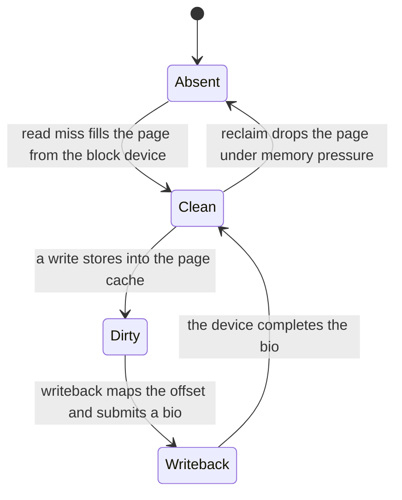
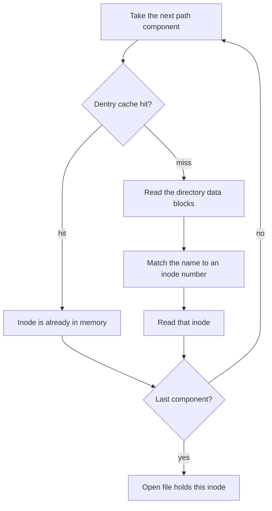
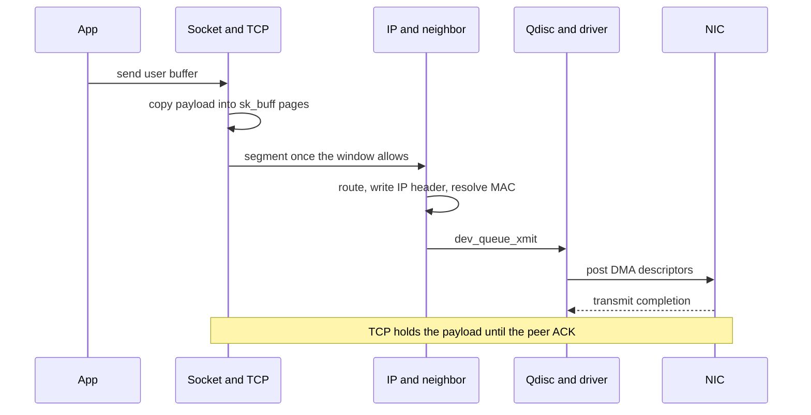

# Refresher: Architecture, Storage, and Networking

> [!summary] TL;DR
> An SMP gives every CPU the same memory latency, while a NUMA machine makes that latency depend on which node holds the page.
> A file name lives in a directory, and the inode holds the metadata and the map from file offsets to disk blocks.
> A block device is the addressable array those blocks sit on, and the file system is the interpreter of that array.
> Linux moves bytes between a socket and a NIC through transport, network, neighbor, queueing, and driver layers, and it uses a port to choose the socket on a host.
> Placement, extra indirect blocks, and one interrupt per packet are the costs this refresher makes visible.

## Learning outcomes

- Distinguish a uniform SMP from a NUMA node topology, and compute remote-to-local latency and bandwidth ratios from stated inputs.
- Map a pathname onto an inode, and separate the directory entry, the link count, and the open-file reference.
- Compute how many data blocks and indirect blocks a classic 12-direct inode needs for a given file size and block size.
- Locate an inode inside an ext-family inode table from an inode number, an inode size, and the group parameters.
- Order the Linux layers a `send` crosses, and state what a 16-bit port adds to an IP address.
- Count CPU payload copies, TCP segments, and on-wire bytes for a stated payload, MSS, and header set.
- Compare an interrupt per packet with NAPI batching at a stated line rate, in core-seconds per second.

## Motivation and the problem

Later papers in this course sit on three physical facts: where a byte of memory lives, how a durable byte is named, and how a byte leaves the machine.
A lock that spins on a shared counter is cheap only when that counter's cache line stays on a quiet interconnect.
A file-system paper is a claim about inodes, allocation, and the page cache, and it is unreadable if those words are still vague.
A distributed service is a claim about copies, headers, and round trips, and the round trip starts in the socket layer on the way to the NIC.
The course prerequisite list asks for SMP versus NUMA, file-system data structures, the meaning of a block device, and the path from an application to a NIC.
The diagnostic asks for the same network stack in layer order, and for why ports exist.
[Virtual memory and caches](R01-Virtual-Memory-and-Caches.md) covers the translation hardware underneath a NUMA node.
[Concurrency and the kernel](R03-Concurrency-and-the-Kernel.md) covers the trap that enters every system call on the paths below.
This note is the machine those two notes run on.

## Core concepts

### SMP versus NUMA

<!-- coverage: R02-01 -->

> [!note] Definition
> A symmetric multiprocessor (SMP), in the architecture sense used here, connects every CPU to memory so that a given memory access has the same latency from any CPU.
> A non-uniform memory access (NUMA) machine splits memory into nodes, and a local access is cheaper than a remote one.
> Symmetric still means any CPU may run kernel code and take interrupts.
> Uniform and symmetric are different adjectives.

On the SMP drawn by [the shared-memory lecture](../Part-2-Parallel-Systems/L04a-Shared-Memory-Machines.md#symmetric-multiprocessor-smp-architecture), private caches sit next to the CPUs and one bus or crossbar reaches one memory system.
A snooping protocol works naturally there, because every cache can watch the one interconnect.
The operating system can migrate a thread or a page without changing the DRAM latency of the next miss.
The limit is that one interconnect and one set of memory pins have a finite bandwidth, and every miss and every invalidate spends some of it.
A handful of cores hide that cost.
A few dozen cores issuing misses at once saturate it, which is why the locking papers on that lecture care about bus transactions.

NUMA multiplies memory controllers by attaching a DRAM region to each group of CPUs, then connecting the groups.
A load that hits in a remote node's DRAM still returns a coherent value on a cache-coherent NUMA (ccNUMA) machine, and it returns it later, and it consumes the inter-node link.
Hardware distributed shared memory in [that same lecture](../Part-2-Parallel-Systems/L04a-Shared-Memory-Machines.md#distributed-shared-memory-dsm-architecture) is this floor plan, with coherence optional in the older machines and present on current servers.
The operating-system problem changes from "share the bus fairly" to "place the thread and its pages on the same node."
Linux's default for anonymous memory is first touch: the node of the CPU that faults the page the first time is the node that allocates the frame.
A thread that zeros a buffer on node 0, and a compute thread that later runs on node 1, produces a fully remote working set.
Binding, preferred, and interleaved policies exist so a program can override that default.
The [NUMA policy documentation](https://docs.kernel.org/admin-guide/mm/numa_memory_policy.html) is the current statement of those policies.

```
Node 0                         Node 1
+----------+  +----------+     +----------+  +----------+
| CPU + L1 |  | CPU + L1 |     | CPU + L1 |  | CPU + L1 |
|   L2     |  |   L2     |     |   L2     |  |   L2     |
+----+-----+  +----+-----+     +----+-----+  +----+-----+
     |             |                |             |
     +------+------+                +------+------+
            |                              |
       +----+----+                    +----+----+
       |  DRAM   |                    |  DRAM   |
       +----+----+                    +----+----+
            |                              |
            +-------- interconnect --------+
```

Private L1 and L2 caches, drawn in [the cache refresher](R01-Virtual-Memory-and-Caches.md#l1-and-l2-caches-in-multicore-chips), still filter most hits on either floor plan.
NUMA shows up on the misses, on DMA that targets a particular node, and on atomics whose line ping-pongs between nodes.
A [ticket lock](../Part-2-Parallel-Systems/L04b-Synchronization.md#ticket-lock) whose shared counter lives on one node makes every other node pay the remote atomic.
That is the hardware fact behind a [queueing lock](../Part-2-Parallel-Systems/L04b-Synchronization.md#linked-list-queuing-lock-mcs) and behind Linux's [qspinlock](../Part-2-Parallel-Systems/L04b-Synchronization.md#modern-descendants-linux-qspinlock).

| Floor plan | Latency | Coherence traffic | OS job |
| --- | --- | --- | --- |
| UMA SMP | Same DRAM latency from every CPU | Snoop or directory on one interconnect | Balance CPU and cache use |
| ccNUMA | Local DRAM is cheaper than remote | Directory or snoop filter plus the inter-node link | Place thread and pages together |
| NUMA without coherent caches | Local is cheaper, and a stale line stays stale until software flushes it | Software flush and invalidate | Place data, and flush on purpose |

### File system data structures and inodes

<!-- coverage: R02-02 -->

> [!note] Definition
> An inode is the file's metadata object, addressed by an inode number.
> The name is a directory entry that points at that number.
> The inode records mode, owner, size, link count, timestamps, and the map from logical file blocks to device blocks.

The split between name and inode is the reason hard links and `unlink` of an open file work.
Two directory entries can name one inode, and the link count records how many names exist.
A process that already has the file open holds a separate reference, so the inode and its blocks stay alive when the link count drops to zero, and they disappear when the last open reference closes.
A symbolic link is a different inode whose contents are a path string.
Rename inside one file system is a directory edit that swings a name at an existing inode.
The durable identity of the file is the pair (file system, inode number), which is what a Unix `(st_dev, st_ino)` pair reports.

A classic Unix inode is a fixed-size record, so it cannot hold one pointer per block of a large file.
The usual teaching layout, used by UFS and by ext2, stores 12 direct block pointers, one single-indirect pointer, one double-indirect pointer, and one triple-indirect pointer.
An indirect block is an ordinary device block full of pointers.
With 4 KiB blocks and 4-byte pointers, one indirect block holds 4096 / 4 = 1024 pointers, so the single-indirect pointer covers 1024 data blocks and the double-indirect pointer covers 1024 squared data blocks.
The price is extra I/O: a cold read of a byte in the double-indirect region reads the inode, the double-indirect block, a child indirect block, and only then the data block.
Extents replace that pointer tree with a run of contiguous blocks described by a starting offset and a length.
ext4, XFS, and Btrfs use extents so a large sequential file is a short list of runs, and the classic triple-indirect tree remains the model the diagnostic is asking you to be able to draw.

```
inode (fixed size)
  direct[0..11] -----> data blocks 0..11
  single ------------> pointer block -----> data blocks 12..1035
  double ------------> pointer block -----> pointer block -----> data
  triple ------------> one more level of pointer blocks
```

On disk, an ext-family file system groups those records so that inodes and the data they point at can sit near each other.
A superblock (at byte 1024 in the usual ext layout) describes block size, inode size, and blocks per group.
Each block group then holds a block bitmap, an inode bitmap, an inode table, and data blocks.
The in-memory objects are a second set, documented with the [virtual file system](https://docs.kernel.org/filesystems/vfs.html): a superblock, an inode, a dentry (the cached name), a file (one open description, with its offset), and an address space (the page-cache pages of that inode).
Path walk consults the dentry cache before it reads a directory block.
A hit avoids the disk and still ends at the same inode number a cold walk would have found.

| Object | Lifetime | Holds |
| --- | --- | --- |
| Directory entry | Until the name is removed | A name and an inode number |
| On-disk inode | Until link count and open references are both zero | Metadata and the block map |
| VFS inode | While the kernel caches that inode | The in-memory copy, including the page-cache address space |
| Dentry | While the name lookup cache keeps it | The name-to-inode edge used by path walk |
| Open file | From `open` to the last `close` | Offset, status flags, and a reference on the inode |

### Block devices and the file system

<!-- coverage: R02-03 -->

> [!note] Definition
> A block device is a randomly addressable array of fixed-size sectors.
> A file system is a layout and a set of operations that turn a region of that array into inodes and files.
> The device does not know file names, and the file system does not program the device's DMA registers itself.

The split exists so that one file system can sit on a disk, a partition, an SSD, a RAID volume, a loop device, or a virtio disk, and so that one block layer can serve every file system plus swap.
A character device, by contrast, is a byte stream without a sector address: a terminal or a pipe does not host an ext4 superblock.
What an application calls a file is a range of logical offsets.
The file system maps an offset to a device block through the inode or the extent tree, then builds an I/O request for those sectors.
The block layer merges adjacent requests, schedules them across hardware queues, and hands them to the driver.
The driver programs DMA.
Completion interrupts the CPU, the page is marked up to date, and any waiter is woken.

Linux names the unit at each level carefully.
The device sector is often 512 bytes, or 4096 bytes on a native 4 KiB drive, and the file-system block is an integer number of sectors, commonly 4096 bytes.
A `bio` describes a range of sectors and the memory pages that will be the source or target of DMA.
The multi-queue block layer (`blk-mq`) keeps a submission and completion path per hardware queue, which matches NVMe devices that already have many queue pairs.
A single shared request queue was the right model for one spinning disk with one head.
It is the wrong model for a device that can retire thousands of independent I/Os.

Buffered I/O hides that machinery behind the page cache.
A `read` copies from a cached page, or faults the page in by submitting a bio and sleeping.
A `write` copies into a cached page, marks it dirty, and returns before the device has the bytes, unless the file was opened with a durability flag such as `O_SYNC` or the write is later followed by `fsync`.
`O_DIRECT` asks the file system to DMA between the user buffer and the device, skipping the page cache, and it still uses the file system's block map unless the program opened the raw block device and is managing blocks itself.
A database that thinks it is "doing its own I/O" is still a client of this stack.
It has only chosen which layer owns the cache.



The page above is the same kind of frame the [page-fault path](R01-Virtual-Memory-and-Caches.md#page-fault-handling-end-to-end) installs in a page table.
File-backed memory and buffered I/O share the page cache.
A fault on an `mmap`ed file and a `read` of that file are two ways to arrive at the same clean page, which is why `mmap` and `read` can see each other's writes once the page is up to date.

### Network protocol stack layers in Linux

<!-- coverage: R02-04 -->

> [!note] Definition
> The Linux network stack is the sequence of kernel layers that turns a socket call into a link-layer frame, and a received frame into bytes a process can `recv`.
> It is a TCP/IP implementation with queueing and a driver, and it has no separate OSI session layer or presentation layer.

Each layer exists so the layer above can ignore one physical fact.
The socket layer is the process boundary: a file descriptor, permissions, and the copy between user memory and kernel memory.
The transport layer demultiplexes endpoints and, for TCP, provides a reliable byte stream with sequence numbers, acknowledgements, retransmission, and congestion control.
UDP provides a datagram, a length, and a checksum, and it leaves reliability to the application.
The network layer, IPv4 or IPv6, selects a next hop, decrements a hop limit, and fragments only when a path actually requires it.
The neighbor layer resolves that next hop to a link address (ARP for IPv4, NDP for IPv6).
The traffic-control layer (`qdisc`) decides which queued frame leaves first and can shape or drop.
The device driver and the NIC turn a kernel buffer into DMA descriptors and a frame on the wire.
Replacing Ethernet with a [virtio NIC](../Part-1-OS-Structure-and-Virtualization/L03c-CPU-and-Device-Virtualization.md#network-and-disk-virtualization-in-xen) changes the bottom layer and leaves TCP untouched.
Replacing TCP with UDP changes the transport and leaves the driver untouched.

Ports are the transport's demultiplexing key, and they are why one IP address can serve many processes.
An IP address names a host interface (or a route to a host).
A port is a 16-bit number at the transport layer.
A TCP connection is identified by the 4-tuple of source address, source port, destination address, and destination port, so many connections can share one local port as long as the remote endpoints differ.
A listening socket owns the local port for new handshakes, and each accepted connection becomes its own 4-tuple.
UDP demux is the protocol plus the local address and port, tightened to the remote pair when the socket is connected.
Ports below 1024 are privileged on Linux, and the kernel chooses ephemeral source ports from a configured range.
Without ports, the host could deliver a given protocol to only one endpoint.
Network address translation rewrites addresses and ports in flight, which is possible only because the port is an ordinary header field and not a property of the NIC.

The packet object that crosses these layers is the socket buffer, `sk_buff`.
Headers are prepended by pulling a data pointer back into reserved headroom, so adding a TCP header does not copy the payload.
Checksum offload and segmentation offload are flags on that buffer: the stack can leave the checksum, or the split into MSS-sized segments, to the NIC, and it can do the split in software just above the driver when the NIC cannot.
On receive, generic receive offload merges segments before the upper layers see them, which is one reason a fast path is not "one function call per 1460 bytes" anymore.
Netfilter hooks sit at well-known points (pre-routing, local input, forward, local output, post-routing) so policy can drop or rewrite a packet without each protocol growing its own filter code.

| Layer | Names | Adds | Fails when |
| --- | --- | --- | --- |
| Socket | file descriptor, `send` / `recv` | The user/kernel copy and the process reference | The buffer is bad, or the socket is shut down |
| Transport | TCP, UDP, port | Demux, and reliability for TCP | The port is closed, or TCP gives up retransmitting |
| Network | IPv4, IPv6 | Route, hop limit, fragmentation | No route, or the hop limit expires |
| Neighbor | ARP, NDP | Link address of the next hop | The neighbor never answers |
| Queueing | qdisc | Order, shaping, drops | The queue limit is hit |
| Driver and NIC | DMA rings, NAPI | A frame on the wire | The ring is full, or the link is down |

### Data path from application to NIC

<!-- coverage: R02-05 -->

> [!note] Definition
> The transmit path copies or pins application bytes, wraps them in headers, resolves a next hop, and posts DMA descriptors so the NIC can read the packet from RAM.
> The receive path is the reverse up to the socket queue, and it ends with a copy or a zero-copy map into the receiving process.
> DMA completion and a TCP acknowledgement are different events.

On transmit of an ordinary TCP `send`, the core crosses into the kernel through the system-call trap described in [how the kernel gets control](R03-Concurrency-and-the-Kernel.md#how-the-kernel-gets-control-traps-interrupts-and-system-calls).
The socket layer copies the user bytes into `sk_buff` pages attached to the socket send buffer.
That copy is what lets the process reuse its buffer immediately, and it is what gives the NIC pages that are safe to DMA.
TCP chooses a sequence number and a segment size, and it may hold the bytes until the congestion window and the peer window allow them out.
IP looks up a route and writes its header.
The neighbor subsystem supplies the link address, or it queues the packet and sends an ARP or NDP query.
`dev_queue_xmit` passes the buffer through the qdisc and into the driver's transmit routine, which maps the pages and rings the NIC.
The NIC DMA-reads the frame and puts it on the wire.
The transmit completion interrupt, or a NAPI poll, lets the driver drop its reference to the buffer.
TCP keeps its own reference until the peer acknowledges the sequence numbers, because a retransmission needs the bytes.
A program that treats "the `send` returned" as "the peer has the data" has confused the local copy with the acknowledgement.

On receive, the NIC DMA-writes the frame into a ring the driver posted.
An interrupt schedules a NAPI poll, which drains up to a budget of frames with further interrupts held off, then re-enables them.
The driver builds an `sk_buff`, receive offload may merge segments, and the protocol dispatcher hands the packet to IP.
IP accepts it locally or forwards it.
TCP checks the sequence number, stores the payload on the socket receive queue, and wakes a waiting reader.
`recv` copies from that queue into the user buffer.
The CPU payload copies on a normal `send` plus `recv` of the same bytes are therefore two: one into the kernel on the sender, one out of the kernel on the receiver.
DMA moves the bytes in between and is not a CPU copy.
`sendfile` and zero-copy send paths drop the sender CPU copy by DMA-ing a page-cache page or a pinned user page, and they add a lifetime rule: the page cannot be reused until the NIC, and sometimes the peer acknowledgement, is done with it.

The hot path is per packet, so small packets burn cores on headers, cache misses, and interrupts even when the payload is tiny.
[Receive-side scaling](https://docs.kernel.org/networking/scaling.html) hashes the flow onto a NIC queue so one flow stays on one core, and transmit scaling does the same on the way out.
That hash is a placement decision, in the same spirit as NUMA first touch: the right core is the one that already holds the socket and the cache lines.

## Mechanisms step by step

The core storage and networking paths rely on explicit step-by-step state transitions through the kernel layers.

### Path walk to an inode

1. Start at the root inode, or at the current directory if the path is relative.
2. Take the next component.
3. Look it up in the dentry cache.
4. On a miss, read that directory's data blocks through the page cache and find the name and its inode number.
5. Load that inode if it is not already cached.
6. If access checks pass and components remain, repeat.
7. The last component becomes the open file's inode reference, and the file offset starts at zero unless the open flags say otherwise.



A cached walk touches no directory blocks and still returns the same inode number a cold walk would.
The dentry cache is a performance object, and the directory is the durable object.
An unlink removes the directory entry and drops the link count, and an open file from an earlier walk keeps the inode alive.

### Buffered write to the device

1. The write copies user bytes into page-cache pages of the file's address space, allocating pages and inode blocks as the file grows.
2. Those pages are marked dirty.
3. The process returns, unless durability was requested.
4. Writeback selects dirty pages, maps each file offset through the inode or extent tree to a device sector, and builds a bio.
5. The block layer queues the bio on the multi-queue path and the driver programs DMA.
6. Completion marks the pages clean, or reports an error to anyone waiting on `fsync`.

A crash between step 3 and step 6 loses the write.
That gap is the reason databases and file systems have journals, and it is already visible from the state diagram above.

### TCP send to the wire



The sequence is one segment's life.
A large write becomes several segments when segmentation offload is off, and one large buffer plus a NIC split when it is on.
Receive is the same boxes in the other direction, with NAPI between the NIC and IP, and with the final copy in `recv`.

## Worked examples

> [!example] Remote placement on stated NUMA inputs
> Worked inputs, chosen so the arithmetic is exact: local DRAM latency 80 ns, remote 160 ns, local streaming bandwidth 40 GB/s, remote streaming bandwidth 16 GB/s, and a migration copy rate of 10 GB/s.
> In this example 1 GB means 10^9 bytes.
> Ten million dependent DRAM loads at 80 ns take 10000000 * 80 * 10^-9 = 0.8 seconds locally.
> The same loads at 160 ns take 1.6 seconds, and 160 / 80 = 2, so the remote pointer chase is twice as slow.
> An 8 GB sequential scan takes 8 / 40 = 0.2 seconds locally and 8 / 16 = 0.5 seconds remotely.
> The remote scan delivers 16 / 40 = 2/5 of the local bandwidth and costs an extra 0.5 - 0.2 = 0.3 seconds.
> Copying 8 GB once at 10 GB/s costs 8 / 10 = 0.8 seconds, ignoring fault overhead.
> Two remote scans cost 2 * 0.5 = 1.0 second, while migrate-then-scan-twice costs 0.8 + 2 * 0.2 = 1.2 seconds, so two scans do not repay the move.
> Three remote scans cost 1.5 seconds, and migrate-then-scan-three-times costs 0.8 + 0.6 = 1.4 seconds, so the third scan is where migration wins under these inputs.
> The array is 8000000000 / 4096 = 1953125 pages of 4 KiB, because 4096 * 1953125 = 8000000000.
> First touch by a thread on the slow node allocates all 1953125 pages there.
> The later bandwidth-bound scan does not fault those pages again.
> It reads them remotely, which is the 0.5 second case.
> A migration has to copy the pages, or automatic NUMA balancing has to unmap them and catch a later fault, before the scan becomes local.

> [!example] Classic inode for a 5 MiB file, 4 KiB blocks, 4-byte pointers
> Pointers per indirect block = 4096 / 4 = 1024.
> File size = 5 * 1024 * 1024 = 5242880 bytes.
> Data blocks = 5242880 / 4096 = 1280 exactly.
> Twelve direct pointers cover 12 data blocks, and the single indirect covers the next 1024.
> The remainder is 1280 - 12 - 1024 = 244 data blocks, and 244 is less than 1024, so they occupy one child of the double-indirect block.
> Indirect blocks allocated = 1 single-indirect + 1 double-indirect + 1 child = 3.
> Blocks charged to the file body = 1280 + 3 = 1283, and the inode itself lives in the inode table besides that.
> The last byte is at offset 5242879, whose block index is 5242879 / 4096 = 1279.
> Index 1279 sits 1279 - 12 - 1024 = 243 slots into that first double-indirect child.
> A cold read of that byte, with the inode already cached, reads 3 blocks: the double-indirect block, the child, and the data block.
> With the inode not cached, the same read is 4 block reads.
> Extent mapping replaces those 3 indirect blocks with a short run record when the 1280 data blocks are contiguous.

> [!example] Where inode 20000 sits under usual ext4 defaults
> Take a 4 KiB block size, a 256-byte inode, 32768 blocks per group, and one inode per 16384 bytes of the file system.
> Blocks per group are capped by a one-block bitmap: 4096 * 8 = 32768 bits, so 32768 blocks, which is 32768 * 4096 = 134217728 bytes, or 128 MiB.
> Inodes per group = 134217728 / 16384 = 8192.
> Inode numbers in this family are 1-based, so inode 20000 has zero-based index 19999.
> Block group = 19999 / 8192 = 2, because 8192 * 2 = 16384, and the index inside the group is 19999 - 16384 = 3615.
> Byte offset inside the group's inode table = 3615 * 256 = 925440.
> Block inside that table = 925440 / 4096 = 225, with byte offset 925440 - 225 * 4096 = 3840.
> The same split via inodes per block: 4096 / 256 = 16, and 3615 = 16 * 225 + 15, and slot 15 starts at 15 * 256 = 3840.
> A cold `stat` of this inode reads that one table block, plus the inode bitmap only if allocation is in progress.
> The directory entry that names the file is a separate block.

> [!example] One 4096-byte TCP write, no options, no VLAN, TSO off
> IPv4 and TCP headers are 20 bytes each, so an MSS on a 1500-byte MTU is 1500 - 20 - 20 = 1460 bytes.
> The write needs ceil(4096 / 1460) = 3 segments, because 1460 * 2 = 2920 and 4096 - 2920 = 1176, and 1176 is under the MSS.
> Each Ethernet frame adds 14 bytes of header and 4 bytes of FCS.
> The two full segments are 14 + 20 + 20 + 1460 + 4 = 1518 bytes each.
> The last segment is 14 + 20 + 20 + 1176 + 4 = 1234 bytes.
> The three frames sum to 1518 * 2 + 1234 = 4270 bytes, and 4270 - 4096 = 174 bytes of headers and FCS, which is also 3 * (14 + 20 + 20 + 4) = 3 * 58 = 174.
> Adding the 8-byte preamble and start-of-frame delimiter and the 12-byte interframe gap puts 20 more bytes of line occupancy on each frame, so the wire holds 4270 + 60 = 4330 bytes.
> That is 4330 * 8 = 34640 bits.
> At 10 Gbit/s, 34640 / 10^10 seconds = 3.464 microseconds of line time for 4096 bytes of payload.
> The sending CPU copied the payload once.
> The receiving CPU will copy it once on `recv`.
> DMA on each NIC is not a third CPU copy.
> `sendfile` of a page-cache-resident file drops the sender copy to zero and still produces these three frames when TSO is off.

> [!example] Interrupt per packet versus a NAPI budget of 64, at 10 Gbit/s
> The minimum Ethernet frame is 64 bytes including the FCS, and the line also spends 8 bytes of preamble and 12 bytes of interframe gap, so the accounted minimum is 64 + 8 + 12 = 84 bytes.
> That is 84 * 8 = 672 bit-times.
> The packet rate is 10^10 / 672 per second.
> 672 * 14880952 = 9999999744, and 10^10 - 9999999744 = 256, so the rate is 14880952 and 256/672 packets per second.
> Charge each interrupt 2 microseconds, which is 2 * 10^-6 seconds.
> Core-seconds consumed per second of line rate equal (10^10 / 672) * 2 * 10^-6 = 20000 / 672.
> Divide numerator and denominator by 32 to get 625 / 21, which is 29 and 16/21 cores, since 21 * 29 + 16 = 625.
> A NAPI budget of 64 packets per interrupt divides that cost by 64, giving 625 / 1344 of one core.
> The frames still arrive at the same rate.
> Batching removes interrupt entries, and the poll still has to touch every packet.
> This is why a 10 Gbit/s minimum-size flood is an interrupt problem before it is a bandwidth problem, and why [NAPI](https://docs.kernel.org/networking/napi.html) polls under a budget.

## Comparison

| Design | Strength | Cost | Use when |
| --- | --- | --- | --- |
| UMA SMP | One latency for every CPU, simple snooping | One interconnect ceilings the machine | A small coherent machine, or the on-node slice of a larger one |
| ccNUMA | Memory bandwidth scales with nodes, caches stay coherent | Remote latency, placement bugs look like lost bandwidth | Multi-socket servers, any workload with a real working set |
| Classic indirect inode | Fixed inode size, simple pointer arithmetic | Up to three extra blocks on a cold random read | Teaching model, and ext2-shaped volumes |
| Extent tree | A long run is one record | Splitting and merging extents on random writes | ext4, XFS, and any large sequential file |
| Buffered page cache | Hits avoid the device, small writes aggregate | Crash window, double buffering with an application cache | General files, and any read that is likely to repeat |
| O_DIRECT | No page-cache copy, the application owns caching | Alignment rules, the process waits for DMA | Databases with their own buffer pool |
| Raw block device | Full control of layout | The application is now the file system | A store that does not want inodes at all |
| Interrupt per packet | Simple driver | Tens of cores at minimum-size 10 Gbit/s | Low packet rates |
| NAPI batching | Interrupt cost falls by the budget | Poll latency and a per-packet CPU cost remain | Multi-gigabit NICs |
| Native XDP | Drop or redirect before an sk_buff is built | A new program type, and a driver that supports it | Early drops at line rate |
| Copied `send` | The user buffer is free on return | One CPU copy of the payload | Ordinary sockets |
| `sendfile` / zero-copy | No sender payload copy | Page lifetime lasts through DMA and sometimes through the ACK | Serving cached files |

## Paper deep dives

This refresher has no required paper.
The floor plans above are the vocabulary of [the shared-memory machines lecture](../Part-2-Parallel-Systems/L04a-Shared-Memory-Machines.md), whose SMP is the uniform machine and whose hardware DSM is the NUMA machine.
[Xen's device chapter](../Part-1-OS-Structure-and-Virtualization/L03c-CPU-and-Device-Virtualization.md#data-transfer-in-xen-asynchronous-io-rings) reuses the same ring idea the block layer and the NIC driver use here, with a grant table in place of a bare DMA map.
[Latency limits](../Part-3-Distributed-Systems/L05c-Latency-Limits.md) starts after this stack has already added its copies and headers.
[Distributed file systems](../Part-4-Distributed-Subsystems-and-Recovery/L07c-Distributed-File-Systems.md) sit on the local inode and the local block device, and they add a network round trip when the authoritative copy is elsewhere.
[Dynamo](../Papers/L09-Dynamo.md) is a paper note for a store that keeps replicas on ordinary local disks and reaches peers through this socket path.
[Giant-scale services](../Part-5-Internet-Scale-Real-Time-and-Security/L09a-Giant-Scale-Services.md) inherits both the disk layout and the NIC path.

## Modern descendants

Current multi-socket servers are ccNUMA: every CPU can run the kernel, caches are coherent, and DRAM latency depends on the node.
Linux still first-touches anonymous pages.
Automatic NUMA balancing, controlled by `kernel.numa_balancing`, periodically unmaps sampled pages and, on the following fault, may migrate the page to the node that touched it.
The scheduler that decides where that thread runs is the fair class.
On current kernels that class is EEVDF, the fair-class scheduler that replaced CFS starting in Linux 6.6, and it still schedules inside [NUMA sched domains](../Part-2-Parallel-Systems/L04e-Scheduling.md#modern-descendants-linux-cfs-and-eevdf-sched-domains).
[qspinlock](../Part-2-Parallel-Systems/L04b-Synchronization.md#modern-descendants-linux-qspinlock) is the kernel lock that replaced a ticket lock on large machines, because the ticket counter is one cache line that remote spinners bounce across the interconnect.
CXL memory devices, enumerated by the [kernel CXL subsystem](https://docs.kernel.org/driver-api/cxl/index.html), can be onlined as an extra NUMA node with its own distance from the CPUs.
Placement policies then have more than two answers.

NVMe presents many queue pairs, and [blk-mq](https://docs.kernel.org/block/blk-mq.html) is the block layer that drives them.
io_uring, entered through [`io_uring_setup`](https://man7.org/linux/man-pages/man2/io_uring_setup.2.html), shares a submission ring and a completion ring between the process and the kernel so a batch of reads or writes is one syscall instead of one syscall per I/O.
The same rings now carry many socket operations.
In a guest, virtio-blk and virtio-net are the paravirtual devices: shared virtqueues of descriptors, in the [virtio device model](https://docs.kernel.org/driver-api/virtio/virtio.html) and the [virtio 1.3 specification](https://docs.oasis-open.org/virtio/virtio/v1.3/virtio-v1.3.html), which is the production form of the Xen I/O ring.
Guest physical addresses on that DMA path are translated by [EPT or NPT](../Part-1-OS-Structure-and-Virtualization/L03b-Memory-Virtualization.md#hardware-nested-paging-ept-and-npt) and by an IOMMU.
[KSM](../Part-1-OS-Structure-and-Virtualization/L03b-Memory-Virtualization.md#modern-descendants-ksm-and-virtio-balloon) can merge identical guest pages, and it does not change inode layout or the NIC queueing model.

On the receive path, native XDP runs an eBPF program in the driver before an `sk_buff` is allocated, and it can drop, rewrite, or redirect a frame.
Generic XDP runs later, on the socket-buffer path, and is cheaper to deploy and more expensive per packet.
AF_XDP moves the frame into a user-space ring when the program redirects it there.
The [eBPF documentation](https://docs.kernel.org/bpf/index.html) and the [scaling notes](https://docs.kernel.org/networking/scaling.html) are the current maps of those hooks, including RSS, RPS, RFS, and XPS.
Checksum offload and [segmentation offload](https://docs.kernel.org/networking/segmentation-offloads.html) are the default on server NICs, so the three-segment example above is what you get when those features are turned off, and a single large TCP segmentation offload is what you get when they are on.
RCU protects the common-case dentry walk and the forwarding-table lookup, so a reader does not take a lock per path component or per forwarded packet.
The [RCU primer](https://docs.kernel.org/RCU/whatisRCU.html) states the read-side rule those two paths rely on.

Unikernels link a library operating system into the application, so the TCP stack and the block driver share the application's address space.
The layers of this note remain, and the privilege boundary around them moves.
seL4 keeps a small verified kernel and runs drivers and protocol stacks as user servers, so the same layers sit above a message transfer.
Raft-era consensus logs to a local block device and replicates over a transport that still looks like the socket path above.
A Dynamo-style store does the same with a hash ring and hinted handoff, on top of ordinary files and ordinary NICs.

## Pitfalls and exam traps

> [!warning] Uniform, symmetric, and coherent are three different claims
> An SMP in this refresher has one DRAM latency.
> A machine can be kernel-symmetric, with every CPU allowed to run the scheduler, and still be NUMA.
> ccNUMA returns a coherent value from a remote node, and that value arrives later than a local load.
> A NUMA machine without cache coherence is a different contract: software has to flush and invalidate.
> Calling every multicore chip NUMA, or calling every NUMA machine incoherent, answers a different question than the one that was asked.
> Sub-NUMA clustering can also split one socket into more than one node, so "two sockets" is a sufficient story for a textbook drawing and an incomplete story for a current BIOS.

> [!warning] The name, the inode, and the open file are three objects
> The directory entry holds the name and the inode number.
> The inode holds metadata, the link count, and the block map.
> The open file holds the offset and a reference that keeps the inode alive after the last name is unlinked.
> A symbolic link does not increment the target's link count.
> A hard link does.
> `st_ino` staying the same across two names is the observation that both names are one inode.

> [!warning] A successful write has not reached the device
> Buffered `write` dirties page-cache pages and returns.
> The device owns the bytes only after writeback completes.
> `fsync` waits for that completion and for the metadata the file system needs to find those bytes after a crash.
> `O_DIRECT` skips the page cache and still returns only after its own DMA completes.
> Sector size and file-system block size are allowed to differ, and a 512-byte sector device often hosts a 4096-byte file-system block.

> [!warning] Ports, interrupts, and acknowledgements
> A port is a 16-bit transport field.
> An IP address names a host, and the port selects the socket on that host.
> Two TCP connections may share a local port when their remote address or remote port differs.
> DMA completion means the NIC has read or written RAM.
> A TCP acknowledgement means the peer has received the sequence numbers.
> `send` returning means the local socket buffer accepted the copy.
> Those three sentences are three different moments.
> Linux has socket, transport, network, neighbor, queueing, and driver layers, and it does not implement an OSI session layer or presentation layer.

> [!warning] Line rate of small packets is an interrupt budget
> A 10 Gbit/s link full of minimum-size frames is on the order of 625/21 cores of pure interrupt entry at 2 microseconds each, before the protocol does any work.
> Counting bandwidth in gigabytes and ignoring packets-per-second answers the bulk-transfer question and misses the flood question.
> NAPI divides interrupt entries by the poll budget and leaves the per-packet work in place.
> TSO and GRO change the packet count the CPU sees, so a segment count computed with TSO off does not describe a NIC that is allowed to segment.

## Practice

Original questions for this note, for [R01](R01-Virtual-Memory-and-Caches.md), and for [R03](R03-Concurrency-and-the-Kernel.md) are in [Practice R](../Practice/Practice-R.md).

> [!question]- A 5 MiB file uses 4 KiB blocks and a classic inode with 4-byte pointers. How many indirect blocks does it allocate, and how many block reads fetch the last byte if the inode is cached? (concept: R02-02)
> Data blocks = 5242880 / 4096 = 1280.
> After 12 direct and 1024 single-indirect blocks, 244 remain, which fit in one double-indirect child.
> Indirect blocks = 3.
> A cached inode plus a cold last byte reads the double-indirect block, that child, and the data block, which is 3 reads.

> [!question]- A 4096-byte TCP payload goes out on a 1500-byte MTU with no options, no VLAN, and TSO off. How many segments, how many on-wire frame bytes including FCS, and how many CPU payload copies does a normal send perform? (concepts: R02-04, R02-05)
> MSS = 1460, so the segments are 1460, 1460, and 1176.
> Frames are 1518, 1518, and 1234, summing to 4270 bytes.
> The sender copies the payload once.
> The receiver's later `recv` is a second copy, and neither copy is the NIC DMA.

## Lab

[lab-00-refresher](../labs/lab-00-refresher/README.md) exercises page faults, the TLB, caches, and a pthreads producer-consumer on a machine that has the floor plan and the I/O stack in this note.
The lab crew owns the Makefile and the commands.
This note stops at the mechanisms those commands assume.

## Further reading

- Linux NUMA memory policy: <https://docs.kernel.org/admin-guide/mm/numa_memory_policy.html>
- Linux NUMA locality and performance attributes: <https://docs.kernel.org/admin-guide/mm/numaperf.html>
- `numa_balancing` and the fair-class scheduler: <https://docs.kernel.org/admin-guide/sysctl/kernel.html> and <https://docs.kernel.org/scheduler/sched-eevdf.html>
- `numa(7)`: <https://man7.org/linux/man-pages/man7/numa.7.html>
- Virtual file system: <https://docs.kernel.org/filesystems/vfs.html>
- ext4 layout overview: <https://docs.kernel.org/filesystems/ext4/overview.html>
- ext4 inodes: <https://docs.kernel.org/filesystems/ext4/inodes.html>
- `inode(7)`: <https://man7.org/linux/man-pages/man7/inode.7.html>
- Block layer index: <https://docs.kernel.org/block/index.html>
- Multi-queue block layer: <https://docs.kernel.org/block/blk-mq.html>
- `socket(7)`: <https://man7.org/linux/man-pages/man7/socket.7.html>
- Receive and transmit scaling: <https://docs.kernel.org/networking/scaling.html>
- NAPI: <https://docs.kernel.org/networking/napi.html>
- Segmentation offloads: <https://docs.kernel.org/networking/segmentation-offloads.html>
- Checksum offloads: <https://docs.kernel.org/networking/checksum-offloads.html>
- eBPF: <https://docs.kernel.org/bpf/index.html>
- AF_XDP: <https://docs.kernel.org/networking/af_xdp.html>
- virtio in the kernel: <https://docs.kernel.org/driver-api/virtio/virtio.html>
- virtio 1.3 specification: <https://docs.oasis-open.org/virtio/virtio/v1.3/virtio-v1.3.html>
- CXL subsystem: <https://docs.kernel.org/driver-api/cxl/index.html>
- What is RCU: <https://docs.kernel.org/RCU/whatisRCU.html>
- `io_uring_setup(2)`: <https://man7.org/linux/man-pages/man2/io_uring_setup.2.html>
- Bach, *The Design of the UNIX Operating System*, for the classic inode, directory, and block-device split used in the worked inode arithmetic.
- Stevens, *TCP/IP Illustrated, Volume 1*, for the header sizes used in the segment arithmetic.
