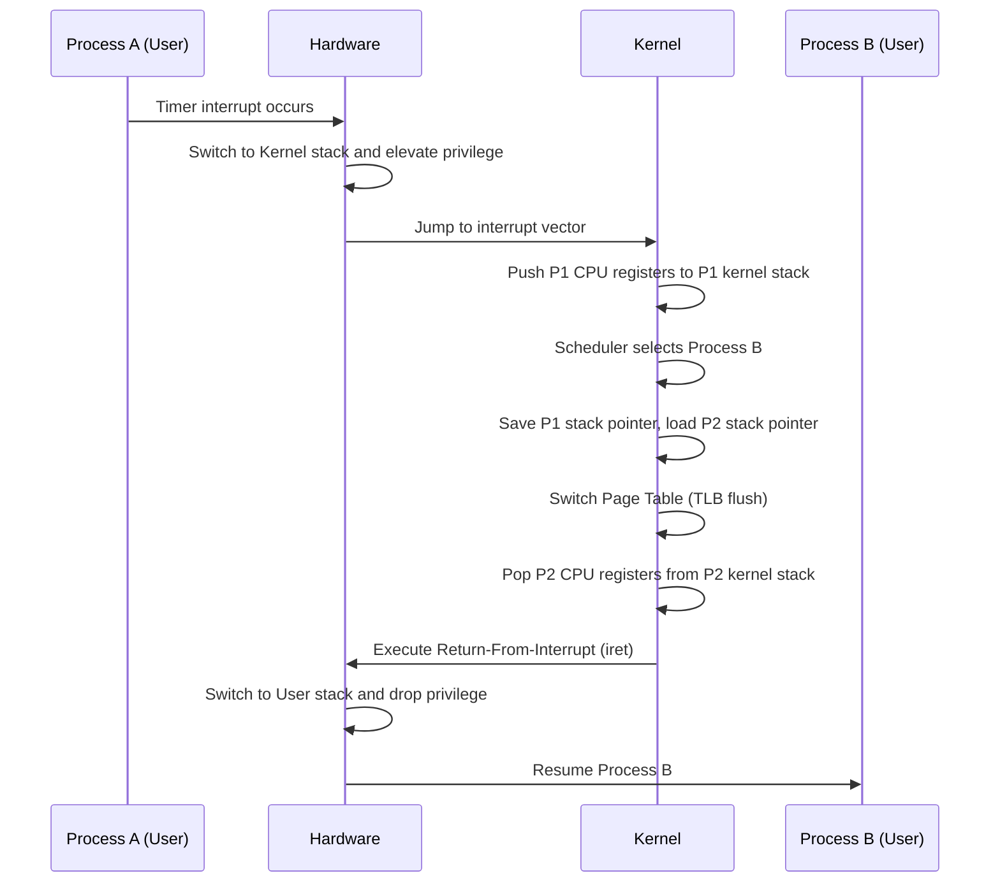

# Refresher: Concurrency, the Kernel, and C

> [!summary] TL;DR
> This note covers the foundational systems concepts and C programming skills required for advanced operating systems.
> It reviews how the kernel manages concurrency, context switches, and interrupts to provide the illusion of simultaneous execution.
> Additionally, it highlights essential C concepts such as memory layout, pointers, and compiling that are crucial for systems programming.

## Learning outcomes

- Distinguish between concurrency and parallelism in systems design.
- Analyze the hidden costs of process and thread context switches.
- Explain how the kernel gains control through traps, interrupts, and system calls.
- Outline the memory layout of a process and the role of kernel stacks.
- Troubleshoot C programs by debugging segfaults and managing memory correctly.
- Implement a multithreaded producer-consumer application using pthreads.

## Motivation and the problem

Modern systems must execute multiple programs seemingly at the same time while safely sharing limited hardware resources.
To do this, the operating system kernel must carefully orchestrate execution, multiplex CPUs, and isolate processes from one another.
This requires a robust set of mechanisms for transferring control, protecting memory, and switching contexts.
Furthermore, because operating systems are typically written in C, mastering pointers, memory management, and debugging is essential to read and write kernel code effectively.

## Core concepts

### Concurrency versus parallelism

<!-- coverage: R03-01 -->
> [!note] Concurrency vs. Parallelism
> Concurrency is about dealing with multiple things at once (structuring a program as independent tasks), whereas parallelism is about doing multiple things at once (executing tasks simultaneously on multiple processors).

Concurrency provides the illusion of simultaneous execution by rapidly switching between tasks on a single processing unit.
It is a software design concept focused on task management and responsiveness.
Parallelism, on the other hand, is a hardware-driven property where multiple tasks truly execute at the exact same physical time on different cores or processors.
Understanding this distinction is vital because a concurrent program may run sequentially on a uniprocessor, yet the kernel must still handle race conditions, synchronization, and scheduling just as if the tasks were parallel.

### Process and thread context switch and its costs

<!-- coverage: R03-02 -->
> [!note] Context Switch
> A context switch is the process of saving the state of a currently running process or thread and loading the state of the next one to be executed.

When the kernel switches the CPU from one process to another, it must save the CPU registers, program counter, and stack pointer.
While the direct cost involves executing the kernel code to save and restore this state, the hidden or indirect costs are often far more significant.
A context switch invalidates processor state such as the Translation Lookaside Buffer (TLB) and evicts useful data from the L1 and L2 caches.
When the new process resumes, it experiences a flurry of cache misses and TLB faults as it warms up the processor state again.
Thread context switches within the same process are cheaper because they share the same memory address space, meaning the TLB and cache contents remain largely valid.

### How the kernel gets control: traps, interrupts, and system calls

<!-- coverage: R03-03 -->
> [!note] Control Transfer
> The kernel gains control of the processor via exceptions (synchronous traps like page faults), hardware interrupts (asynchronous signals from devices), and system calls (intentional requests from user-space).

For an operating system to manage resources and enforce security, it must have a way to preempt running user programs and take over the CPU.
This is achieved through hardware-supported control transfers.
A system call is a software trap where a process intentionally asks the kernel for a service, like reading a file.
An exception, such as a division by zero or a page fault, forces the CPU to vector into kernel code to handle the error.
Hardware interrupts are generated asynchronously by peripherals (like a network card receiving a packet or a timer expiring) to signal that they need attention.
In all cases, the hardware elevates the privilege level and jumps to a pre-registered kernel handler routine.

### Kernel stacks

<!-- coverage: R03-04 -->
> [!note] Kernel Stack
> A kernel stack is a dedicated region of memory used by the operating system kernel to maintain the execution state, local variables, and call frames for a thread when it executes in kernel mode.

Every user thread typically has an associated kernel stack.
When a thread traps into the kernel via a system call or interrupt, the hardware automatically switches the stack pointer from the user stack to the thread's kernel stack.
This separation is crucial for security and isolation.
If the kernel used the user stack, a malicious user program could manipulate the stack data while the kernel is executing, potentially hijacking the system.
The kernel stack is small and fixed in size (often just a few kilobytes), meaning kernel code must avoid deep recursion or allocating large structures as local variables to prevent stack overflow.

### Scheduling basics

<!-- coverage: R03-05 -->
> [!note] CPU Scheduling
> Scheduling is the kernel mechanism that decides which ready thread or process should run on the CPU next, balancing fairness, throughput, and latency.

The scheduling algorithm manages a queue of runnable tasks.
Basic policies include Round-Robin (giving each task a fixed time slice), Shortest-Job-First (prioritizing tasks that finish quickly to minimize average wait time), and Priority Scheduling (where tasks have strict importance levels).
A preemptive scheduler can forcefully pause a running task if its time slice expires or if a higher-priority task becomes ready, typically driven by a timer interrupt.
This ensures that no single CPU-bound process can monopolize the processor, maintaining interactivity and system responsiveness.

### Basic mutual exclusion

<!-- coverage: R03-06 -->
> [!note] Mutual Exclusion
> Mutual exclusion is a concurrency control property ensuring that no two concurrent threads are in their critical section at the same time.

When multiple threads share resources like memory or files, concurrent access can lead to race conditions where the final state depends on unpredictable execution timing.
To solve this, developers use synchronization primitives like mutexes (see [Locks](../Part-2-Parallel-Systems/L04b-Synchronization.md#ticket-lock)) or spinlocks to protect the critical sections of code.
Only one thread can acquire the lock and enter the critical section.
Others must wait (either by spinning in a loop or sleeping) until the lock is released.
Correct use of mutual exclusion is necessary to maintain data invariants, but improper use can lead to deadlocks, where threads wait indefinitely for each other to release resources.

### Function call and return in the machine

<!-- coverage: R03-07 -->
> [!note] Function Call Mechanics
> The hardware and compiler ABI dictate how function arguments are passed, how the return address is saved, and how stack frames are managed during a function call and return.

When a function is called in C, the caller places arguments in specific registers or pushes them onto the stack according to the calling convention.
The `call` instruction pushes the current program counter (the return address) onto the stack and jumps to the function.
The callee then sets up its own stack frame to hold local variables.
Upon completion, the callee tears down its stack frame, places the return value in a designated register, and executes a `ret` instruction.
This pops the return address off the stack and restores execution in the caller.
Understanding this machinery is critical when debugging buffer overflows, segfaults, or writing low-level kernel context-switch code.

### Process memory layout

<!-- coverage: R03-08 -->
> [!note] Memory Layout
> A process's virtual address space is organized into logical segments: code (text), data, heap, and stack.

The typical memory layout places the executable code (text segment) at the bottom, marked as read-only and executable.
Above it lies the data segment for initialized global and static variables, and the BSS segment for uninitialized globals.
The heap grows upward from the data segment to accommodate dynamic memory allocations (e.g., via `malloc`).
The stack starts at a high virtual address and grows downward, storing local variables and function call frames.
This layout maximizes the continuous space available for both the heap and the stack to grow dynamically while keeping them separated to catch out-of-bounds access.

### Pointers, function pointers, and casts

<!-- coverage: R03-09 -->
> [!note] Pointers in C
> A pointer is a variable that stores the memory address of another variable or a function.

In systems programming, pointers are ubiquitous because they allow efficient data manipulation without copying large structures.
Function pointers store the address of executable code, enabling dynamic dispatch and callback mechanisms, often used in the kernel to define unified interfaces for different device drivers or file systems.
Casting is the explicit conversion of one type to another.
Non-obvious casts, such as casting between an integer and a pointer or using `void*` for generic data passing, are powerful but dangerous.
They tell the compiler to treat the memory at that address differently, which can lead to alignment faults or data corruption if the programmer violates the actual data layout.

### Compiling and linking

<!-- coverage: R03-10 -->
> [!note] Compilation Process
> The C compilation pipeline transforms human-readable source code into executable machine code through preprocessing, compiling, assembling, and linking.

A C project typically consists of multiple `.c` source files and `.h` header files.
The compiler processes each source file independently to produce an object file (`.o`), translating C statements into machine instructions and leaving unresolved references for external functions and variables.
The linker then stitches these object files and statically linked libraries (`.a` archives) together.
It resolves external symbols by matching declarations to their actual definitions.
Understanding this distinction, where declarations (like function prototypes in headers) inform the compiler about types, while definitions provide the actual implementation, is vital to resolve "undefined reference" linker errors.

### Segfaults and how to debug them

<!-- coverage: R03-11 -->
> [!note] Segmentation Fault
> A segmentation fault (segfault) occurs when a program attempts to access a restricted or unmapped area of memory.

Segfaults are typically caused by dereferencing null or uninitialized pointers, accessing memory that has already been freed (use-after-free), or overflowing an array or stack buffer.
When the hardware Memory Management Unit (MMU) detects an invalid access, it triggers a page fault exception.
The OS handles this by sending a `SIGSEGV` signal to the process, usually killing it and generating a core dump.
Debugging a segfault involves using tools like `gdb` to inspect the core dump, trace the call stack, and examine the pointer values and variables at the moment of the crash to find the logic error.

### Pthreads producer-consumer

<!-- coverage: R03-12 -->
> [!note] Producer-Consumer Pattern
> A synchronization paradigm where producer threads generate data and place it into a shared buffer, while consumer threads take the data out to process it.

In C, the POSIX threads (pthreads) library is used to implement concurrent programs.
A classic producer-consumer application, such as digitizing video frames (producing) and tracking objects in them (consuming), requires careful synchronization.
Threads share a bounded buffer, protected by a mutex to ensure mutually exclusive access.
Additionally, condition variables are used to signal state changes: producers wait if the buffer is full, and consumers wait if the buffer is empty.
This prevents busy-waiting and allows threads to sleep efficiently until there is work to do or space available.

## Mechanisms step by step

Here is the step-by-step mechanism of a context switch from a user process trapping into the kernel and switching to another process.



ASCII figure for typical Memory Layout:

```text
High Address
+------------------------+
| Stack (grows down)     |
|          |             |
|          v             |
|                        |
|                        |
|          ^             |
|          |             |
| Heap (grows up)        |
+------------------------+
| BSS (uninitialized)    |
+------------------------+
| Data (initialized)     |
+------------------------+
| Text (code)            |
+------------------------+
Low Address
```

## Worked examples

### Context Switch Cache Penalty

Assume a CPU has a 64 KB L1 data cache with 64-byte cache lines.
A memory read hitting the cache takes 1 ns, while a cache miss reaching main memory takes 100 ns.
Process A is running and has fully populated the cache with its working set.
The OS interrupts Process A to run Process B.
Process B runs briefly, evicting 200 cache lines, and then the OS switches back to Process A.
When Process A resumes, it will suffer cache misses to reload the 200 evicted lines.
The time penalty to re-fetch the evicted cache lines is:
200 lines * 100 ns/miss = 20,000 ns = 20 us.
While the register save and restore time for the context switch might only take 1 us, the hidden cache warming penalty (20 us) dominates the overall performance cost.

### Producer-Consumer Buffer Sizes

A digitizer (producer) generates 30 frames per second (1 frame every 33.3 ms).
A tracker (consumer) takes exactly 30 ms to process a frame.
If the tracker pauses for 100 ms due to a momentary system delay, the digitizer will produce 3 frames during that time.
To prevent the digitizer from blocking or dropping frames, the shared bounded buffer must have a capacity of at least 3 slots.

## Comparison

| Feature | Concurrency | Parallelism |
| :--- | :--- | :--- |
| **Focus** | Task management, structuring independent tasks. | Task execution, running tasks physically at the same time. |
| **Hardware** | Can run on a single-core CPU via context switching. | Requires multi-core or multiprocessor hardware. |
| **Primary Goal** | Responsiveness and resource multiplexing. | Throughput and speedup of computation. |
| **Example** | An OS scheduling multiple background services. | A GPU calculating matrix multiplications on 1000 cores. |

| Policy | Advantages | Disadvantages | Best For |
| :--- | :--- | :--- | :--- |
| **Round Robin (RR)** | Fair allocation, good responsiveness. | High context switch overhead if time slice is too small. | Interactive systems. |
| **Shortest Job First (SJF)** | Minimizes average waiting time. | Requires predicting job length; risks starvation of long jobs. | Batch systems. |
| **Priority** | Important tasks get immediate CPU time. | Lower priority tasks can starve completely. | Real-time systems. |

## Paper deep dives

- No paper for this lesson.

## Modern descendants

The fundamental concepts of context switching, interrupts, and memory layout remain the bedrock of modern operating systems, but they have evolved to handle scale and security:
- **eBPF (Extended Berkeley Packet Filter):** Allows user-space programs to safely inject compiled code directly into the kernel to run in response to specific events, bypassing the high overhead of context switching to user space for packet filtering or tracing.
- **Unikernels:** Systems that compile an application and a minimal set of kernel libraries into a single executable, running in a single address space.
This eliminates context switch and system call overhead entirely, heavily used for lightweight, secure cloud microservices.
- **seL4:** A formally verified microkernel that rigorously isolates system components.
Its strict mathematical proofs ensure that context switches and IPC mechanisms are free from traditional implementation bugs, guaranteeing secure concurrency.
- **Hardware-Assisted Virtualization (EPT and NPT):** Modern CPUs use Extended Page Tables (Intel) or Nested Page Tables (AMD) to accelerate virtual memory management, reducing the software overhead of maintaining multiple layers of page tables during VM context switches.

## Pitfalls and exam traps

> [!warning] Exam Traps and Pitfalls
> - **Confusing Concurrency and Parallelism:** A common trap is assuming a concurrent program must be running in parallel.
> Remember that a concurrent program can run on a single core via scheduling.
> - **Ignoring Indirect Costs:** When asked about context switch costs, only listing the save and restore of registers is a partial answer.
> You must mention TLB invalidation and cache eviction.
> - **Pointer vs. Integer Size:** Assuming that `sizeof(int) == sizeof(void*)`.
> On 64-bit systems, pointers are 8 bytes while integers are usually 4 bytes.
> Casting pointers to `int` truncates the address and causes severe bugs.
> - **System Call vs. Function Call:** A system call is not just a function call.
> It changes the hardware privilege level and switches to the kernel stack, which makes it an expensive operation.

## Practice

- [Practice R](../Practice/Practice-R.md)

## Lab

- [lab-00-refresher](../labs/lab-00-refresher/README.md): Refresher: page faults, TLB, caches, and a pthreads producer-consumer

## Further reading

- Arpaci-Dusseau, R. H., & Arpaci-Dusseau, A. C. (2018). *Operating Systems: Three Easy Pieces*. [OSTEP](https://pages.cs.wisc.edu/~remzi/OSTEP/) (Chapters on Processes, Scheduling, and Concurrency).
- Bovet, D. P., & Cesati, M. (2005). *Understanding the Linux Kernel* (3rd ed.). O'Reilly Media.
