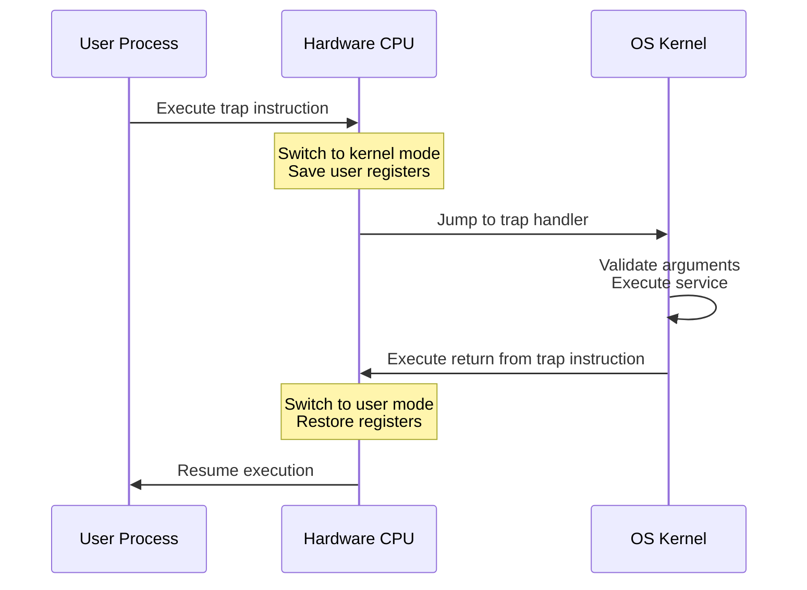

# L01 Introduction to Advanced Operating Systems

> [!summary] TL;DR
> Advanced Operating Systems focuses on the design and implementation of system software that manages hardware resources and provides abstractions to applications.
> This introductory lesson establishes the fundamental vocabulary of operating systems, including abstractions, resource management, and the separation of policy from mechanism.
> We explore how the OS provides the illusion of dedicated CPU and memory through virtualization and multiplexing.
> Finally, we examine the structural costs of crossing protection domains via system calls and context switches.

## Learning outcomes

- Define the purpose of abstractions in operating systems and explain how they simplify application development.
- Describe the hardware components of a computer system and their organization.
- Analyze the memory hierarchy and calculate effective access times based on cache hit rates.
- Identify the core functionalities of an operating system in managing the CPU and memory.
- Distinguish between policy and mechanism in OS design.
- Evaluate the performance overhead of system calls and context switches compared to standard function calls.

## Motivation and the problem

Applications are inherently complex and need to interact with messy, diverse physical hardware.
If every application developer had to write code to manage disk sectors, schedule CPU cycles, or multiplex network interfaces, software development would be impossibly slow and error-prone.
Furthermore, multiple applications running simultaneously on the same hardware would inevitably interfere with one another, corrupting data or crashing the machine.
The operating system exists to solve these problems by interposing itself between the hardware and the applications.
It acts as a referee to safely manage shared resources, an illusionist to provide clean and infinite virtual resources, and a glue to offer common services.

## Core concepts

### Power of abstractions

<!-- coverage: L01-01 -->
> [!note] Definition
> An abstraction is a simplified representation of a complex system that hides implementation details and exposes only the necessary interfaces.

In operating systems, abstractions are the fundamental building blocks that allow software to interact with hardware safely and conveniently.
A process is the abstraction of a running program, giving the illusion of a dedicated CPU.
Virtual memory provides the abstraction of a large, contiguous, and private memory space, hiding the reality of fragmented and shared physical RAM.
Files and directories abstract the complexities of reading and writing raw blocks on spinning disks or flash memory.
These abstractions are powerful because they decouple the application logic from the hardware evolution.
A program written to use file abstractions can run unmodified whether the underlying storage is a solid state drive, a hard drive, or a network file system.
This separation of concerns allows OS developers to optimize the underlying mechanisms without breaking user-level applications.

### Hardware resources and organization

<!-- coverage: L01-02 -->
> [!note] Definition
> Hardware resources consist of the physical components of a computing system, including processors, memory, storage devices, and networking interfaces, organized around a system bus or interconnect.

The CPU executes instructions and manages the overall flow of control in the system.
Main memory stores the code and data currently in active use by the CPU.
I/O devices connect the system to the outside world, including storage for persistence and networking for communication.
These components are connected via a hierarchy of buses, which dictate the speed and bandwidth of data transfers.
The operating system must understand this organization to efficiently move data, minimize bottlenecks, and manage power.
Hardware also provides critical features that the OS relies on for security and virtualization, such as privilege levels, memory management units, and hardware interrupts.
Without these hardware hooks, it would be impossible to build a preemptive, secure operating system.

### Memory hierarchy

<!-- coverage: L01-03 -->
> [!note] Definition
> The memory hierarchy is an architectural design that organizes storage types based on speed, cost, and capacity to approximate the performance of the fastest memory with the capacity of the largest.

Registers are the fastest and smallest form of storage, located directly inside the CPU core.
Caches are small, fast SRAM modules that hold recently or frequently accessed data to hide main memory latency.
Main memory provides the primary working space for the system but is significantly slower than caches.
Secondary storage provides persistent, massive capacity at the cost of orders of magnitude higher latency.
The operating system manages the movement of data between the lower levels via paging and swapping.
Hardware automatically manages the movement of data between main memory and caches.
The principle of locality, both spatial and temporal, is what makes the memory hierarchy effective.
Programs tend to access the same data repeatedly or access data in sequential patterns, allowing the OS and hardware to keep the most relevant data in the fastest memory.

### OS functionality and services

<!-- coverage: L01-04 -->
> [!note] Definition
> OS functionality encompasses the set of core services and management tasks the operating system performs to execute applications, isolate users, and allocate hardware.

The OS acts as a resource allocator, deciding which process gets CPU time, memory pages, or disk bandwidth.
It functions as a control program, preventing errors, restricting malicious access, and managing I/O devices.
Common services include file system management, network stack implementation, and inter-process communication.
By providing these services through a standardized interface known as system calls, the OS ensures that applications do not bypass security checks.
This centralized control allows the OS to enforce quotas, prioritize important tasks, and maintain system stability even under heavy load or hardware failure.
The OS also provides accounting, tracking resource usage for billing or performance profiling.

### Managing the CPU and memory

<!-- coverage: L01-05 -->
> [!note] Definition
> CPU and memory management are the processes of multiplexing execution units across multiple threads and dynamically allocating physical memory pages to virtual address spaces.

To manage the CPU, the OS uses scheduling algorithms to time-slice the processor among ready processes.
A timer interrupt periodically returns control to the OS, allowing it to preempt a long-running process and schedule another, ensuring fairness and responsiveness.
For memory management, the OS relies on virtual memory and the hardware memory management unit.
Each process operates in its own virtual address space, isolated from others.
The OS maintains page tables that map virtual pages to physical frames.
If physical memory is exhausted, the OS can evict rarely used pages to disk, a process called swapping.
This dual management ensures that multiple programs can run concurrently, believing they each have exclusive access to the machine.

### Protection domains and policy versus mechanism

<!-- coverage: L01-06 -->
> [!note] Definition
> A protection domain defines the set of resources and privileges a process can access, while the separation of policy from mechanism isolates what is decided from how it is implemented.

Protection domains are typically enforced through hardware privilege levels, such as user mode and kernel mode.
User applications run in unprivileged domains and must trap into the kernel to perform sensitive operations.
This hard boundary prevents a buggy or malicious application from crashing the entire system.
The principle of separating policy from mechanism is a cornerstone of advanced OS design.
A mechanism is a specific tool or implementation, such as a timer interrupt or a context switch routine.
A policy is an algorithm or decision-making process, such as a priority-based CPU scheduler.
By keeping these separate, developers can change the scheduling policy without rewriting the low-level context switch code, making the OS far more flexible and easier to maintain.

## Mechanisms step by step

The transition from a user-level application to the kernel and back is the fundamental mechanism for providing OS services safely.
When an application needs a privileged service, it invokes a system call.

A context switch is a heavier mechanism that occurs when the OS decides to pause one process and run another.
It involves saving the state of the old process and loading the state of the new process.

1. The OS receives a timer interrupt or a blocking system call from the current process.
2. The hardware switches to kernel mode and saves the process registers to its process control block.
3. The kernel scheduler selects a new process to run based on the scheduling policy.
4. The kernel updates memory management hardware to point to the new process page tables, which typically causes a TLB flush.
5. The kernel restores the new process registers from its process control block.
6. The kernel executes a return from trap instruction to resume the new process in user mode.

## Worked examples

Calculating the cost of system calls and context switches requires understanding the hardware cycles involved.

**Scenario: System Call Overhead**
Assume a CPU runs at 2.0 GHz, which means each cycle takes 0.5 nanoseconds.
A standard function call takes about 4 cycles.
A system call involves trapping into the kernel, changing privilege levels, and switching stacks.
If a trap instruction takes 150 cycles and returning takes 150 cycles, the base overhead is 300 cycles.
The time overhead is 300 cycles multiplied by 0.5 nanoseconds per cycle, equaling 150 nanoseconds.
This means a system call is nearly two orders of magnitude slower than a regular function call, which is why applications batch I/O operations.

**Scenario: Context Switch Cost**
A context switch is more expensive because it involves changing the address space.
When the address space changes, the Translation Lookaside Buffer is flushed.
Assume the TLB has a 99 percent hit rate normally, and a TLB miss costs 100 cycles to walk the page tables.
If a process makes 10,000 memory references immediately after a context switch, and the TLB is completely cold, the hit rate might drop to 50 percent for those first references.
Without a flush, the penalty is 10,000 references multiplied by a 1 percent miss rate multiplied by 100 cycles, equaling 10,000 penalty cycles.
With a flush, the penalty is 10,000 references multiplied by a 50 percent miss rate multiplied by 100 cycles, equaling 500,000 penalty cycles.
This demonstrates the indirect cost of context switching, as cache and TLB pollution dominate the performance hit, far outweighing the direct cost of saving registers.

## Comparison

Operating systems use different structural paradigms to deliver abstractions and protection.

| Design | Definition | Strengths | Costs | When to use |
| :--- | :--- | :--- | :--- | :--- |
| Monolithic Kernel | All OS services run in a single large kernel address space. | High performance due to low system call overhead and direct access between subsystems. | Poor fault isolation, as a bug in a device driver can crash the entire system. | Desktop operating systems where performance and hardware support are critical. |
| Microkernel | Only minimal mechanisms run in kernel space, while services run as user-level servers. | High reliability and security, since failing services can be restarted without crashing the system. | High overhead due to frequent inter-process communication and context switches between servers. | High-assurance systems, embedded devices, and real-time systems. |
| Exokernel | The OS safely multiplexes hardware, but applications implement their own abstractions. | Extreme flexibility, allowing applications to aggressively optimize for their specific workloads. | Complex application development due to the lack of standardized high-level APIs. | Specialized appliances and research systems pushing performance limits. |

## Paper deep dives

- No paper for this lesson.

## Modern descendants

The concepts of OS structure and policy separation have evolved into modern technologies that power cloud infrastructure.
The eBPF technology allows user-space programs to safely execute custom policies inside the Linux kernel without changing kernel source code or loading modules.
This is a direct application of separating policy from mechanism.
Unikernels take the exokernel philosophy to the extreme by compiling an application directly with a minimal, specialized kernel into a single bootable image.
This eliminates the boundary between user and kernel space entirely, offering massive performance gains for single-purpose microservices deployed in cloud hypervisors.
The seL4 project represents the modern triumph of the microkernel approach.
It is a formally verified microkernel that guarantees mathematical proof of isolation, heavily utilized in environments where security is paramount.

## Pitfalls and exam traps

> [!warning] Exam Trap: Confusing policy and mechanism
> A common mistake is failing to distinguish between mechanism and policy.
> Remember that a scheduler algorithm is the policy, while the timer interrupt and context switch code that physically swaps the registers is the mechanism.

> [!warning] Pitfall: Underestimating context switch costs
> It is easy to think of a context switch solely as the time taken to save and restore CPU registers.
> Do not forget the indirect costs.
> The flushing of the TLB and the displacement of data from the CPU caches often cause a much larger performance degradation than the register swap itself.

> [!warning] Exam Trap: Monolithic means unmodular
> Monolithic kernels like Linux are still highly modular in their source code using loadable kernel modules.
> The term monolithic refers to the fact that all these modules execute in the same privileged address space, not that the code is written as one giant unorganized file.

## Practice

- [Practice L01](../Practice/Practice-L01.md)

## Lab

- [lab-01-syscall-and-context-switch](../labs/lab-01-syscall-and-context-switch/README.md): Border crossings: syscall, context switch, and address space switch costs

## Further reading

- [Operating Systems: Three Easy Pieces - Introduction](https://pages.cs.wisc.edu/~remzi/OSTEP/intro.pdf)
- [Linux Kernel Documentation on Context Switching](https://www.kernel.org/doc/html/latest/scheduler/index.html)
