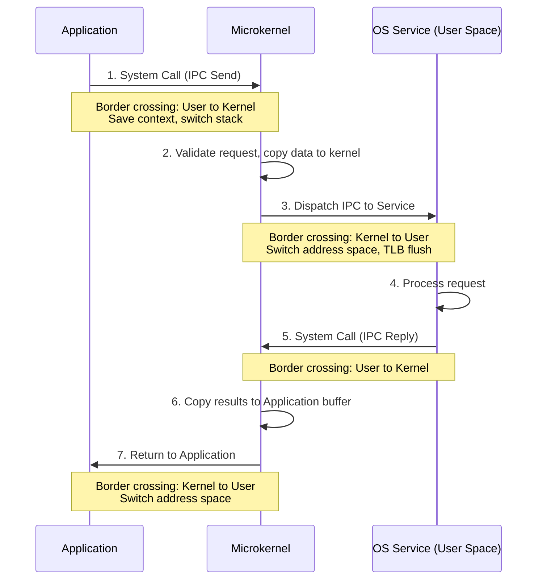

# L02a OS Structure Overview

> [!summary] TL;DR
> An operating system must balance protecting hardware resources with providing performant, flexible services to applications.
> Different OS structures - such as monolithic, DOS-like, and microkernel designs - make distinct trade-offs between extensibility, safety, and performance.
> Monolithic systems prioritize performance and protection at the expense of flexibility, while microkernels offer high flexibility and fault isolation but incur significant border-crossing overheads.

## Learning outcomes

- Contrast monolithic, DOS-like, and microkernel operating system structures.
- Evaluate the trade-offs between extensibility, protection, and performance in OS design.
- Identify the components of border-crossing costs, including context switches and address space switches.
- Analyze how different OS structures isolate faults and protect hardware resources.

## Motivation and the problem

Operating systems serve two fundamental roles: protecting the integrity of hardware resources and providing high-level services (such as memory management, process scheduling, and file systems) to user applications.
A core design challenge is deciding which components of the OS should run in privileged mode with direct hardware access.
Designers must balance the need for robust protection against malicious or buggy code with the desire to offer flexible, personalized services.
Restricting access enhances safety but can introduce performance bottlenecks when applications frequently request system services.
Conversely, granting more direct access improves performance but risks compromising the entire system if a fault occurs.

## Core concepts

### Goals of OS structure: protection, performance, flexibility, scalability, agility, responsiveness

<!-- coverage: L02a-01 -->
> [!note] Definition
> The OS structure defines how an operating system is organized internally and how it interacts with both user applications and underlying hardware resources.

The architecture of an operating system dictates its capabilities across several key dimensions.
- **Protection**: Ensuring that user processes are isolated from each other (user/user) and from the operating system itself (user/system).
- **Performance**: Minimizing the time and overhead required to perform essential system services and handle hardware events.
- **Flexibility**: The degree to which the operating system is extensible and can provide personalized or custom services for specific application needs.
- **Scalability**: The ability of the OS to improve performance effectively as more hardware resources (like CPU cores or memory) become available.
- **Agility**: How well the operating system can adapt to changes in available resources or shifting application requirements dynamically.
- **Responsiveness**: The time it takes for the system to react to external events, such as interrupts from I/O devices.
Different OS designs prioritize these goals differently, as maximizing one often requires compromising another.

### Monolithic structure

<!-- coverage: L02a-02 -->
> [!note] Definition
> A monolithic OS is an architecture where all system services and core functionalities reside within a single, unified kernel address space operating in privileged mode.

In a monolithic structure, essential services like the file system, CPU scheduling, virtual memory management, and inter-process communication (IPC) are all bundled together in the kernel.
Each user application runs in its own distinct address space, separate from the OS.
This strict separation ensures high protection; a bug or crash in a user application cannot corrupt the kernel or affect other running applications.
However, this design dictates that whenever an application needs a system service, it must cross the boundary from user mode to kernel mode.
While the protection is robust, a monolithic OS is generally not customizable by applications.
The tight coupling of services within the kernel makes it difficult to replace or modify specific subsystems without altering the entire kernel, leading to lower flexibility.

### DOS-like structure

<!-- coverage: L02a-03 -->
> [!note] Definition
> A DOS-like structure (e.g., MS-DOS) is an architecture where the application and the operating system share the same address space, with little to no hardware-enforced isolation.

In a DOS-like system, the separation between user applications and the OS is minimal.
Because they share a single address space, an application can access operating system services as quickly as making a simple procedure call.
This eliminates the overhead of switching address spaces or changing privilege levels, resulting in extremely high performance for service requests.
The critical downside is the complete lack of protection.
Without hardware isolation, a buggy application can easily overwrite critical OS data structures or crash the entire system.
This compromises the integrity of the hardware and the OS, making it unsuitable for modern, secure computing environments where multiple applications or users must coexist safely.

### Microkernel-based structure

<!-- coverage: L02a-04 -->
> [!note] Definition
> A microkernel OS minimizes the privileged kernel to only core functionalities (like IPC and basic scheduling), while moving higher-level services (like file systems and drivers) into separate, unprivileged user-space processes.

A microkernel isolates the absolute minimum necessary functionality into a privileged address space.
OS services are implemented as separate "service processes" running in user mode, each with its own address space.
This architecture provides massive flexibility, as services can be easily customized, replaced, or replicated without touching the core kernel.
It also enhances fault isolation; if a file system service crashes, it can be restarted without bringing down the entire OS.
The major drawback is performance.
Because services are separate processes, an application requesting a service must communicate via IPC through the microkernel.
This requires multiple border crossings - switching context from the application to the kernel, then from the kernel to the service process, and back again - along with the overhead of copying data between these disparate address spaces.

### Border crossings and their costs

<!-- coverage: L02a-05 -->
> [!note] Definition
> A border crossing is the process of transitioning execution between different privilege levels (user mode to kernel mode) or distinct address spaces, incurring hardware and software overhead.

Border crossings are the primary performance penalty in protected operating systems.
When an application makes a system call, it triggers a trap into the kernel.
The CPU must save the user context (registers, program counter), switch to the kernel stack, and elevate its privilege level.
This basic transition is a relatively fast border crossing.
However, in architectures like microkernels, fulfilling a service request requires switching to a completely different address space (the service process).
This involves not just saving context, but flushing the Translation Lookaside Buffer (TLB) or changing page table pointers, which introduces significant latency.
Furthermore, passing data between the application and the service often requires copying data through kernel buffers, multiplying the cost of the operation compared to a direct procedure call.

### Extensibility versus protection versus performance

<!-- coverage: L02a-06 -->
> [!note] Definition
> The core tension in OS design is balancing the desire to customize system behavior (extensibility), the need to isolate faults (protection), and the requirement to minimize overhead (performance).

The design of an OS structure is fundamentally an exercise in trade-offs among three conflicting properties.
MS-DOS maximizes performance and extensibility (since the app can freely manipulate the OS) but sacrifices protection entirely.
Monolithic systems like traditional Linux or Windows maximize protection and performance (by keeping all services in a single privileged address space) but sacrifice extensibility.
Microkernels like Mach or L4 maximize protection and extensibility (by isolating services in user space where they can be tailored) but historically suffer in performance due to IPC overhead.
A major focus of advanced OS research is finding ways to escape this rigid triangle - such as allowing safe application code to be injected into the kernel (SPIN) or exposing hardware directly to applications with minimal abstraction (Exokernel).

## Mechanisms step by step

Here is the flow of an application requesting an OS service in a microkernel architecture, illustrating the heavy IPC cost.

## Worked examples

Consider the cost of a simple file read operation across different architectures.
Assume a basic context switch (user to kernel) costs 100 CPU cycles, and a full address space switch (flushing TLB, changing page tables) costs 800 CPU cycles.
Data copying costs 2 cycles per byte.
Suppose an application reads 1000 bytes from a file.

> [!example] MS-DOS (Procedure Call)
> There is no context switch and no address space switch.
> The operation incurs only the cost of the function call and returning data, which is roughly 10 cycles.
> Total cost: **10 cycles**.

> [!example] Monolithic OS
> First, a user-to-kernel switch occurs (100 cycles).
> The kernel reads the file and copies data to the user buffer (1000 bytes * 2 cycles = 2000 cycles).
> Finally, a kernel-to-user switch occurs to return control (100 cycles).
> Total cost: 100 + 2000 + 100 = **2200 cycles**.

> [!example] Microkernel OS
> The application calls the microkernel (100 cycles).
> The microkernel switches to the File Service address space (800 cycles).
> The File Service reads the file and calls the microkernel to reply (100 cycles).
> The microkernel copies data to the application buffer (1000 bytes * 2 cycles = 2000 cycles).
> Finally, the microkernel switches back to the application address space (800 cycles).
> Total cost: 100 + 800 + 100 + 2000 + 800 = **3800 cycles**.

In this example, the microkernel incurs an extra 1600 cycles purely from the two address space switches required to route the request to and from the user-level service process.

## Comparison

| Feature | Monolithic OS | DOS-like OS | Microkernel OS |
| :--- | :--- | :--- | :--- |
| **Extensibility** | Low (rigid kernel boundary) | High (app can modify anything) | High (services are independent apps) |
| **Protection** | High (kernel isolated from user apps) | Low (no isolation) | Highest (services isolated from each other) |
| **Performance** | High (services in one address space) | Highest (no boundary crossings) | Low (heavy IPC and context switch overhead) |
| **Failure Scope** | Kernel panic if any driver crashes | System crash on any error | Only the failing service crashes; restartable |
| **When to use** | General-purpose desktops and servers | Embedded systems with tight constraints | High-assurance systems, modular platforms |

## Paper deep dives

- [[L02-SPIN|Extensibility, Safety and Performance in the SPIN Operating System]]: SPIN attempts to achieve microkernel-like extensibility with monolithic performance by allowing applications to download custom extensions directly into the kernel.
  It relies on a strongly typed language (Modula-3) and a trusted compiler to ensure that these extensions cannot violate kernel safety or access unauthorized memory.
- [[L02-Exokernel|Exokernel: An Operating System Architecture for Application-Level Resource Management]]: The Exokernel pushes the concept of extensibility to the extreme by removing abstractions like virtual memory and file systems from the kernel entirely.
  Instead, the exokernel simply multiplexes the raw hardware securely, forcing library operating systems linked with applications to implement all traditional OS abstractions.
- [[L02-On-Microkernel-Construction|On Micro-Kernel Construction]]: Liedtke argues that the poor performance of early microkernels (like Mach) was due to implementation flaws, not inherent architectural limits.
  By carefully designing the L3/L4 microkernel - optimizing IPC paths, exploiting registers, and minimizing cache footprint - he demonstrates that border crossing costs can be reduced by orders of magnitude.
- [[L02-Improved-Address-Space-Switching|Improved Address-Space Switching on Pentium Processors by Transparently Multiplexing User Address Spaces]]: This paper explores a mechanism to mitigate the high cost of TLB flushes during address space switches in microkernels.
  By multiplexing multiple small user address spaces into a single hardware address space using segment registers, the OS can switch contexts without purging the TLB, drastically improving IPC performance.

## Modern descendants

- **eBPF (Extended Berkeley Packet Filter):** A direct descendant of the SPIN philosophy, eBPF allows modern Linux to safely load user-defined programs into the kernel for network filtering, tracing, and security.
  Safety is enforced by an in-kernel verifier rather than a compiler, allowing high-performance extensibility without modifying kernel source code.
- **Unikernels (e.g., MirageOS):** Unikernels echo the DOS-like or Exokernel model for single-purpose cloud applications.
  A unikernel compiles the application and the necessary OS libraries into a single, specialized, single-address-space image that runs directly on a hypervisor, eliminating border crossings entirely for massive performance gains in cloud environments.
- **seL4 Microkernel:** Representing the ultimate realization of the microkernel vision, seL4 is formally verified for correctness and security to guarantee isolation.
  It uses a capability-based access control model and is highly optimized, demonstrating that Liedtke's L4 principles can be extended to build mathematically proven, high-performance secure foundations.
- **FUSE (Filesystem in Userspace):** FUSE is a pragmatic application of microkernel concepts within monolithic systems like Linux.
  It allows users to create file systems as unprivileged user-space processes, where the kernel simply acts as an IPC bridge between the VFS layer and the user-space daemon, trading some performance for immense flexibility.

## Pitfalls and exam traps

> [!warning] Mistaking privilege level switches for address space switches
> A common exam trap is confusing a simple system call with a microkernel IPC.
> A system call in a monolithic OS involves a privilege level change (user to kernel) but keeps the current page tables active.
> A microkernel IPC to a service process requires a full address space switch, which usually involves flushing the TLB and loading new page tables - a much more expensive operation.

> [!warning] Assuming microkernels are inherently slow
> While first-generation microkernels like Mach suffered from terrible IPC performance, Jochen Liedtke's work on L3/L4 proved that microkernels can be extremely fast if the IPC mechanism is carefully optimized for the specific hardware architecture.
> Do not state that microkernels are always slow; they are only slow if poorly implemented.

## Practice

- [Practice L02](../Practice/Practice-L02.md)

## Lab

- [lab-01-syscall-and-context-switch](../labs/lab-01-syscall-and-context-switch/README.md): Border crossings: syscall, context switch, and address space switch costs

## Further reading

- [Liedtke, J. (1995). On µ-Kernel Construction. *SOSP '95*](https://dl.acm.org/doi/10.1145/224056.224075)
- [Linux Kernel Documentation: eBPF](https://docs.kernel.org/bpf/index.html)
- [The seL4 Microkernel Project](https://sel4.systems/)
