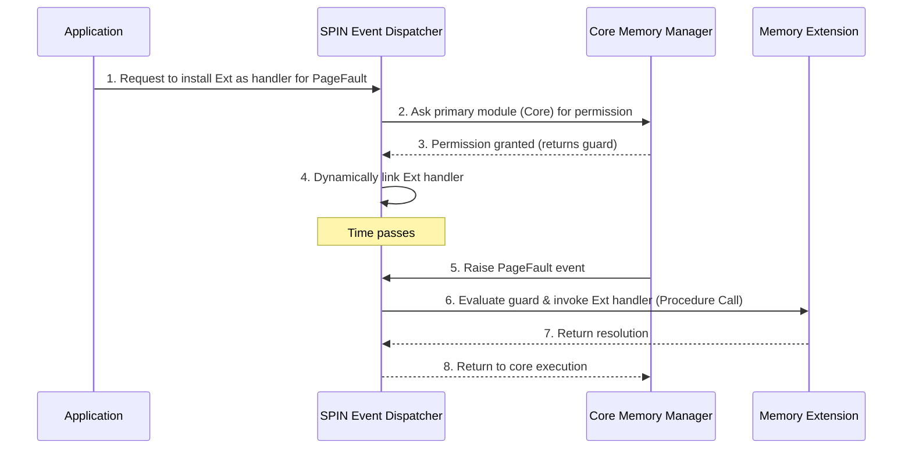

# L02b The SPIN Approach

> [!summary] TL;DR
> The SPIN operating system achieves high performance and extensibility by safely co-locating application-specific kernel extensions within the kernel's virtual address space. It uses Modula-3, a strongly-typed, memory-safe language, to enforce isolation between the kernel and its extensions at compile time and run time. By replacing expensive hardware border crossings with cheap procedure calls, SPIN allows fine-grained, event-based customization of core services like CPU scheduling and memory management without sacrificing protection.

## Learning outcomes

- Understand the limitations of monolithic and microkernel architectures regarding extensibility and performance.
- Explain how Modula-3's strong typing, interfaces, and automatic storage management provide safe kernel extensibility.
- Describe SPIN's protection domain mechanisms (create, resolve, combine) and capability-based addressing via pointers.
- Analyze the event-based customization model in SPIN using events, handlers, and guards.
- Evaluate the performance benefits of in-kernel co-location by comparing procedure call overhead against hardware context switch overhead.

## Motivation and the problem

Operating systems face a constant tension between generality and specialization. A general-purpose OS provides abstractions that work reasonably well for most applications, but they often perform poorly for specialized applications like databases or high-performance network servers. Such applications might require custom disk buffering, page replacement, or thread scheduling. Historically, there were two main approaches. Monolithic kernels (e.g., traditional UNIX) provide high performance but hardcode policies, making them exceptionally difficult to extend. Microkernels (e.g., Mach) move services to user space to improve extensibility and reliability, but they suffer from severe performance penalties due to the frequent, high-overhead border crossings (context switches and IPC) required to invoke these services. SPIN aims to provide the performance of a monolithic kernel with the flexibility of a microkernel.

## Core concepts

### Approaches to extensibility: Hydra capabilities

<!-- coverage: L02b-01 -->
Hydra was an early capability-based operating system designed to separate mechanisms (how things are done) from policies (what is done). It introduced the concept of capabilities—unforgeable tokens or keys presented to the OS during access requests to ensure resource security. While Hydra allowed applications to manage resources through multi-level policies, its capability-based protection mechanism was heavyweight. Every capability transfer required validation, introducing significant overhead. Consequently, to mitigate the cost of these security checks, resource managers in Hydra were implemented as large, coarse-grained objects. This design reduced border crossings but severely limited the system's extensibility for fine-grained operations.

> [!note] Capability
> An unforgeable reference to a resource that serves both to identify the resource and to grant specific access rights to the holder.

### Approaches to extensibility: Mach microkernel

<!-- coverage: L02b-02 -->
The Mach operating system popularized the microkernel architecture by implementing core OS services as normal, user-level processes running above a minimal kernel. The kernel itself provided only limited mechanisms like threads, tasks, and basic inter-process communication (IPC). While this structure provided excellent portability and extensibility—allowing users to easily replace OS services—it suffered from a fatal flaw: poor performance. Every interaction between an application and an OS service required crossing hardware protection boundaries (border crossings). The high overhead of trapping into the kernel, copying messages, context switching, and returning drastically degraded the overall system performance, particularly for fine-grained operations.

### SPIN design goals

<!-- coverage: L02b-03 -->
SPIN was designed with three primary goals: extensibility, safety, and good performance. To achieve extensibility, SPIN provides a modular infrastructure where applications can install fine-grained extensions to modify the OS's interface and implementation. To ensure safety, SPIN guarantees that an extension cannot compromise the integrity of the kernel or other applications, regardless of whether the extension contains bugs or malicious code. Finally, to achieve good performance, SPIN relies on co-location, placing extensions directly inside the kernel's virtual address space. By doing so, communication between the base system and the extensions occurs via standard procedure calls rather than expensive hardware traps and context switches.

### Modula-3 type safety and logical protection domains

<!-- coverage: L02b-04 -->
Instead of relying on hardware memory management units (MMUs) to separate the kernel from extensions, SPIN uses language-level features provided by Modula-3. Modula-3 is a strongly-typed language that provides type safety and automatic storage management (garbage collection). The compiler guarantees that pointers cannot be forged or arbitrarily cast, and array bounds are checked. This eliminates unauthorized memory access, allowing the kernel and extensions to safely share a single virtual address space. In SPIN, protection boundaries are logical rather than physical. A logical protection domain is a namespace containing code and exported interfaces. The compiler and an in-kernel dynamic linker ensure that extensions can only invoke procedures and access data structures explicitly exposed to their domain.

> [!note] Logical Protection Domain
> A compiler-enforced software boundary that controls access to names and interfaces, removing the need for hardware-enforced virtual address spaces for isolation.

### Capabilities as language pointers

<!-- coverage: L02b-05 -->
In traditional capability systems, capabilities are either managed by special hardware or protected within the OS kernel via complex indirection tables. SPIN takes a drastically simpler approach: it uses Modula-3 pointers as capabilities. Because Modula-3 is strongly typed and safe, a pointer cannot be fabricated or manipulated to access arbitrary memory. A pointer inherently guarantees that its target is a valid object of the expected type. Therefore, passing a pointer across an interface transfers both the identity of the resource and the authority to use it, at zero run-time cost beyond a standard memory load. For applications running in unprotected user spaces (like C programs), SPIN provides externalized references—safe integer indices into an in-kernel table of valid pointers.

### Protection domain mechanisms: create, resolve, combine

<!-- coverage: L02b-06 -->
SPIN manages logical protection domains through three primary mechanisms exposed by the Domain interface. The Create operation initializes a new protection domain from a safe, compiler-verified object file. At this point, the domain's imported interfaces are unresolved. The Resolve operation mimics a dynamic linker: it binds unresolved symbols in a target domain to exported symbols in a source domain. Finally, the Combine operation creates a new aggregate domain that exports the union of the interfaces from two existing domains. Together, these mechanisms allow extensions to dynamically load, link, and expose customized services at run time, entirely within the kernel's address space.

### Event-based customization: events and handlers

<!-- coverage: L02b-07 -->
SPIN uses an event-based communication model to wire together default OS mechanisms and custom extensions. An event is essentially a message announcing a state change or a request for service, such as a page fault or a network packet arrival. Any procedure exported by an interface can act as an event. Extensions customize system behavior by registering event handlers with a central SPIN Event Dispatcher. The dispatcher dynamically binds handlers to events, optimizing them to direct procedure calls when only one handler exists. Furthermore, handlers can be restricted by guards—boolean predicates evaluated before invocation. For instance, an IP extension might register a handler for the PacketArrived event with a guard that checks if the packet protocol matches a specific value, ensuring fine-grained, instance-specific event dispatching.

### SPIN default core services: memory management

<!-- coverage: L02b-08 -->
SPIN avoids hardcoding monolithic memory policies by decomposing memory management into fine-grained, extensible components: physical addresses, virtual addresses, and translation (mapping). It provides core interfaces for allocating frames, managing virtual spaces, and handling translation events. For example, rather than providing a rigid address space abstraction, SPIN exports interfaces to allocate a translation context, add or remove mappings, and handle page fault events. An extension can combine these primitives to construct Mach-style tasks, traditional UNIX address spaces, or entirely custom memory models tailored for specific applications, all while interacting with the core services safely and efficiently.

### SPIN default core services: CPU scheduling

<!-- coverage: L02b-09 -->
Similar to memory management, SPIN delegates scheduling policies to extensions. The core system provides basic primitives and abstraction semantics, interacting with extensions via events. Core scheduling events include thread blocking, unblocking, checkpointing, and resuming. The SPIN global scheduler manages the multiplexing of the physical processor among different extension-level thread packages. If a specialized application requires real-time guarantees or user-level threading, it can provide an extension that implements custom handlers for these events. Because these extensions are confined to their specific protection domains, a buggy custom scheduler will only degrade the performance of the applications that explicitly use it, protecting the rest of the system.

### Modern descendants: eBPF and safe kernel extensions

<!-- coverage: L02b-10 -->
The vision of safe, in-kernel co-location pioneered by SPIN is vividly realized in modern systems through eBPF (Extended Berkeley Packet Filter) in Linux. eBPF allows users to load custom programs into the kernel to modify networking, tracing, and security policies without writing kernel modules. Where SPIN relied on Modula-3's compiler for safety, eBPF uses a static in-kernel verifier that checks for loops, out-of-bounds accesses, and invalid memory references before JIT-compiling the bytecode. Like SPIN, eBPF achieves extreme performance by running extension code in kernel mode, replacing user-space border crossings with direct kernel-level execution. Unikernels also reflect SPIN's ideals, linking applications and OS code into a single address space for performance, albeit usually relying on hardware virtualization for protection.

## Mechanisms step by step

> [!example] Extending the Page Fault Handler
> This diagram illustrates how an application installs a custom memory extension to handle page faults, bypassing the default system policy.

The process relies entirely on procedure calls. When the PageFault event is raised, the SPIN dispatcher routes it directly to the installed extension. Because both the dispatcher and the extension reside in the kernel address space, this entire flow avoids context switching overhead.

## Worked examples

> [!example] Event Dispatch vs Border Crossing Overhead
> Let's analyze the performance impact of co-location in SPIN compared to a traditional microkernel architecture.
>
> **Scenario:** An application needs to process an incoming network packet, which requires custom filtering logic.
>
> **Microkernel approach (e.g., Mach):**
> - Hardware trap to kernel: ~100 cycles
> - Context switch from kernel to user-level network service: ~2000 cycles
> - Execute filter logic: ~50 cycles
> - Context switch from user service back to kernel: ~2000 cycles
> - **Total cost:** $pprox 4150$ cycles per packet.
>
> **SPIN approach:**
> - Hardware trap to kernel (NIC interrupt): ~100 cycles
> - Event dispatch (Procedure call via dynamic linking): ~10 cycles
> - Execute filter logic (Extension): ~50 cycles
> - Return from procedure: ~10 cycles
> - **Total cost:** $pprox 170$ cycles per packet.
>
> **Result:** By replacing two expensive context switches (border crossings) with two inexpensive procedure calls, SPIN reduces the overhead by a factor of over 24x ($4150 / 170 pprox 24.4$). The in-kernel dynamic linking makes the extension execution practically free relative to the trap overhead.

## Comparison

| Feature | Monolithic Kernel | Microkernel (Mach) | Extensible OS (SPIN) |
| :--- | :--- | :--- | :--- |
| **Performance** | High (few border crossings) | Low (many border crossings) | High (in-kernel extensions) |
| **Extensibility** | Poor (hardcoded policies) | Excellent (user-level servers) | Excellent (dynamic loading) |
| **Protection Mechanism**| Hardware address spaces | Hardware address spaces | Language-level type safety |
| **Extension Location** | Hard to add, in-kernel | User space | In-kernel |
| **When to use** | General-purpose, stable workloads | Highly fault-tolerant, modular designs | High-performance, specialized apps |

## Paper deep dives

- [Extensibility, Safety and Performance in the SPIN Operating System](../Papers/L02-SPIN.md): This foundational paper introduces the SPIN architecture, demonstrating how language-level safety and dynamic in-kernel linking can provide microkernel-like extensibility with monolithic kernel performance. It details the Modula-3 runtime integration and event-based dispatching model.
- [Exokernel: An Operating System Architecture for Application-Level Resource Management](../Papers/L02-Exokernel.md): Explores an alternative approach to extensibility by safely multiplexing raw hardware resources directly to applications, forcing them to implement their own library operating systems rather than extending the kernel.
- [On Micro-Kernel Construction](../Papers/L02-On-Microkernel-Construction.md): Jochen Liedtke's critique of early microkernels (like Mach), showing that microkernels are not inherently slow and that performance issues stem from poor implementation rather than architectural flaws.
- [Improved Address-Space Switching on Pentium Processors by Transparently Multiplexing User Address Spaces](../Papers/L02-Improved-Address-Space-Switching.md): Presents hardware-level optimizations for reducing context switch overhead, addressing the same performance bottlenecks that motivated SPIN's software-level co-location.

## Modern descendants

> [!note] The Legacy of Safe In-Kernel Execution
> The core thesis of SPIN—that safety checks can eliminate the need for expensive hardware address spaces—has deeply influenced modern operating systems. The most prominent descendant is Linux **eBPF** (Extended Berkeley Packet Filter). eBPF uses an in-kernel verifier (checking for out-of-bounds access and infinite loops) to guarantee safety, rather than a strong language compiler. This allows developers to write restricted C programs, compile them to eBPF bytecode, and run them safely inside the Linux kernel at native speed. Other descendants include **Unikernels** (like MirageOS or IncludeOS), which link a single application directly with minimal OS components into a single address space, and **WebAssembly (Wasm)** runtimes that provide fast, language-agnostic sandbox environments that mirror SPIN's logical protection domains.

## Pitfalls and exam traps

> [!warning] Exam Traps
> - **Trap:** Believing SPIN relies on hardware MMUs for isolation between extensions.
>   - **Fact:** SPIN relies entirely on the Modula-3 compiler and language type safety for logical protection domains inside the kernel.
> - **Trap:** Assuming capabilities in SPIN are heavy and complex like in Hydra.
>   - **Fact:** A capability in SPIN is simply a language pointer. There is no run-time checking overhead because the compiler enforces type safety.
> - **Trap:** Confusing SPIN's architecture with microkernels.
>   - **Fact:** While SPIN provides extensibility like a microkernel, extensions run in the kernel's address space (co-location), not in user space.

## Practice

- [Practice L02](../Practice/Practice-L02.md)

## Lab

- [lab-02-extensibility](../labs/lab-02-extensibility/README.md): Safe extensibility today: bpftrace and eBPF, plus application-level paging with userfaultfd

## Further reading

- [Extensibility, Safety and Performance in the SPIN Operating System](https://dl.acm.org/doi/10.1145/224056.224077) (SOSP 1995)
- [Linux kernel documentation on eBPF](https://docs.kernel.org/bpf/index.html)
