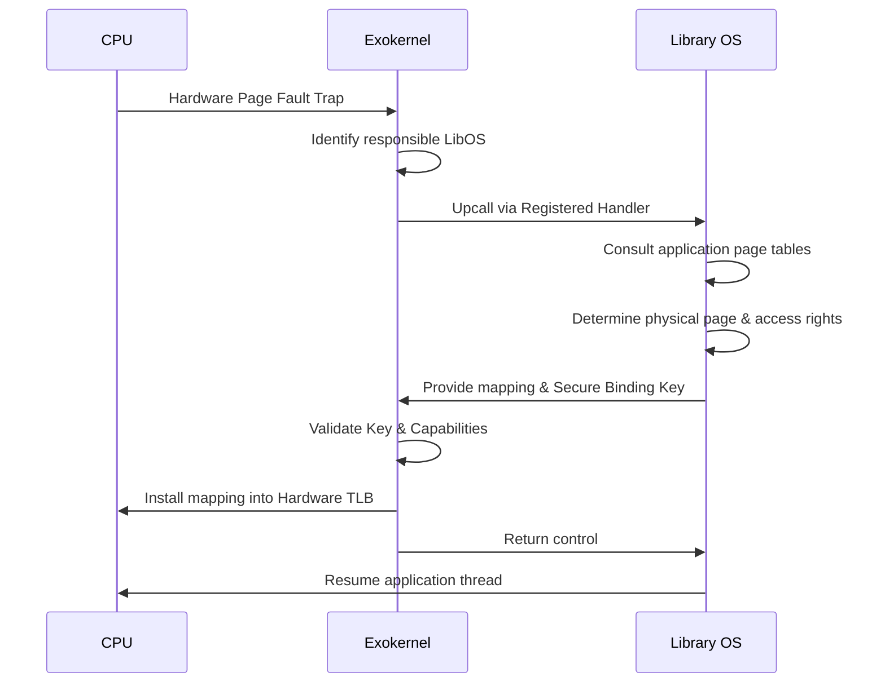

# L02c The Exokernel Approach

> [!summary] TL;DR
> The Exokernel architecture radically shifts resource management out of the operating system kernel and into application-level libraries.
> By safely multiplexing raw hardware resources rather than providing high-level abstractions, the kernel is kept extremely small and efficient.
> Applications link against Library Operating Systems (LibOSes) that implement customized abstractions tailored to their specific performance and functionality needs.
> This approach completely separates resource protection from resource management.

## Learning outcomes

- Describe the fundamental principle of separating protection from management in the Exokernel architecture.
- Explain the role of Library Operating Systems and how they provide customized abstractions to applications.
- Evaluate the methods used for secure bindings, including hardware mechanisms, software caching, and downloading code into the kernel.
- Trace the processes of visible resource revocation and the abort protocol.
- Analyze the mechanisms for Exokernel memory management, software TLBs, and CPU scheduling.
- Compare the performance claims and design philosophies of Exokernel against SPIN and traditional monolithic kernels.

## Motivation and the problem

Traditional operating systems limit the performance, flexibility, and functionality of applications by fixing the interface and implementation of operating system abstractions.
Monolithic systems centralize management using general-purpose abstractions like processes, virtual memory, and interprocess communication.
These fixed abstractions force applications to pay substantial overhead for features they might not need, hide critical low-level information (like timer interrupts or raw device I/O), and restrict implementation freedom.
For example, database management systems often struggle to implement efficient record storage on top of a generic file system that optimizes for sequential access.
The goal of the Exokernel is to address these limitations by exposing hardware as directly as possible, allowing applications to manage resources in ways that best suit their specific requirements.

## Core concepts

### Exokernel principle: separate protection from management

<!-- coverage: L02c-01 -->
The central tenet of the Exokernel architecture is the complete separation of resource protection from resource management.
The kernel is solely responsible for protecting resources, tracking ownership, and guarding binding points to ensure that mutually distrustful applications do not interfere with one another.
It actively avoids managing how resources are utilized, avoiding policies like page replacement algorithms or specific file system layouts.
Instead, the kernel securely exposes all hardware resources-such as physical memory pages, CPU time slices, and disk blocks-through a low-level interface.
This design principle ensures that the kernel remains small, simple, and exceptionally fast, while applications retain complete freedom to manage the physical resources allocated to them.

> [!note] Separation of Protection and Management
> Protection refers to ensuring isolation and security (e.g., Application A cannot read Application B's memory).
> Management refers to policy decisions (e.g., deciding which page to evict from memory).
> In an Exokernel, the kernel handles protection, and the library OS handles management.

### Library operating systems

<!-- coverage: L02c-02 -->
A Library Operating System (LibOS) is untrusted, application-level software that implements traditional operating system abstractions-such as virtual memory, interprocess communication, and network protocols-on top of the raw hardware interfaces exported by the Exokernel.
Because these abstractions are implemented as libraries, applications simply link against them.
This allows developers to extend, specialize, or entirely replace the operating system interface to match the application's exact needs.
For instance, a web server might use a LibOS optimized for rapid network connections and file serving, while a garbage-collected language runtime might select a LibOS with virtual memory primitives tailored for fast page tracking.
A single system can run multiple radically different LibOSes simultaneously.

### Secure bindings

<!-- coverage: L02c-03 -->
A secure binding is a protection mechanism that safely decouples the authorization of a resource from its actual use.
In traditional systems, the kernel must interpret and authorize every resource access at runtime, which imposes high overhead.
In the Exokernel approach, the complex authorization checks and policy decisions are performed only once, when the resource is initially requested or "bound" by the library OS.
Once the secure binding is established, the Exokernel returns an encrypted key or installs a capability.
Subsequent accesses to the resource happen rapidly because the kernel only needs to perform a simple, fast check of the key or hardware tag without needing to understand the higher-level semantics of the resource.

### Methods for secure bindings: hardware, software caching, downloading code

<!-- coverage: L02c-04 -->
Exokernels implement secure bindings using three primary techniques.
The first is hardware support, such as TLB entries or frame buffer ownership tags, which allows the hardware itself to enforce the binding extremely fast.
The second method is software caching, where the kernel caches frequently used secure bindings, like a software TLB that holds virtual-to-physical address mappings constructed by the LibOS.
The third method is downloading untrusted application code directly into the kernel environment.
By running application-specific code (such as a packet filter) securely within the kernel, the system eliminates expensive domain crossings and allows the code to execute in response to events even when the application itself is not currently scheduled on the CPU.

### Visible resource revocation

<!-- coverage: L02c-05 -->
In an Exokernel, the kernel allocates raw physical resources to a library OS, but the kernel retains the authority to take them back.
Visible resource revocation is a protocol where the Exokernel explicitly informs the library OS that specific physical resources (like memory pages) are being revoked.
The Exokernel provides a "repossession vector" describing the targeted resources.
Instead of the kernel transparently paging out memory, the library OS is given a chance to participate in the revocation process.
The library OS can choose exactly which pages to relinquish, write dirty data to disk if necessary, and update its own internal bookkeeping, enabling highly optimized, application-specific resource management.

### Abort protocol

<!-- coverage: L02c-06 -->
While visible revocation relies on the cooperation of the library OS, an Exokernel must remain robust against misbehaving or compromised applications that refuse to yield resources.
The abort protocol is a forceful mechanism invoked when a library OS fails to respond to a revocation request within a specific timeframe.
The Exokernel will break the secure bindings by force, reclaiming the physical resource directly.
If the kernel has been previously "seeded" by the library OS with an autosave procedure, it might attempt to safely stash the resource state.
Otherwise, the kernel simply seizes the resource, which usually results in terminating the uncooperative application to maintain overall system stability.

### Exokernel memory management and the software TLB

<!-- coverage: L02c-07 -->
Memory management in an Exokernel involves the library OS handling page faults and virtual-to-physical address mapping.
When a page fault occurs, the Exokernel upcalls the responsible library OS through a registered handler.
The library OS resolves the fault, determines the correct physical page, and presents the mapping and a secure binding key back to the kernel to install in the hardware TLB.
Because context switches flush the hardware TLB, the Exokernel maintains a software TLB for each library OS.
On a context switch, the kernel dumps the hardware TLB into the outgoing LibOS's software TLB and preloads the hardware TLB from the incoming LibOS's software TLB.
This ensures the library OS finds some of its mappings immediately, significantly reducing context switch overhead.

### Exokernel CPU scheduling with a linear vector of time slots

<!-- coverage: L02c-08 -->
CPU scheduling in the Exokernel is designed to be deterministic and transparent.
The kernel maintains a linear vector (an array) of time slots.
Each slot represents a specific quantum of CPU time.
Library OSes explicitly request and mark their desired time slots at startup or during execution.
The Exokernel schedules the CPU by simply advancing through this vector in a round-robin fashion, granting the CPU to the library OS holding the current slot.
During a library OS's time quantum, the Exokernel does not interfere, allowing the application to implement its own internal thread scheduling algorithms without kernel preemption, thus avoiding the inefficiencies of nested scheduling.

### Packet filters and downloaded code

<!-- coverage: L02c-09 -->
To handle incoming network packets efficiently without imposing protocol semantics, the Exokernel allows library OSes to download packet filters into the kernel.
These filters act as secure bindings for the network interface.
When a packet arrives, the kernel executes the downloaded code to determine which application owns the packet, effectively demultiplexing network traffic directly in kernel space.
This avoids the overhead of copying packets to user space or waking up a heavy kernel thread just to inspect headers.
Unlike SPIN, where extensions are written in a safe language (Modula-3), early Exokernels achieved safety by compiling simple, bounded filter languages into machine code at runtime, ensuring the filter could not infinite-loop or access unauthorized memory.

### Exokernel performance claims versus SPIN

<!-- coverage: L02c-10 -->
Exokernel systems like Aegis demonstrated massive performance improvements over monolithic systems (often an order of magnitude faster for exceptions and protected control transfers) due to the simplicity of the hardware-exposed interface.
When compared to the SPIN operating system, Exokernel takes a different philosophical approach.
SPIN relies on language safety (Modula-3) and strong typing to securely load extensions directly into the kernel address space.
Exokernel relies on architectural separation, exporting resources securely to user space or downloading carefully verified, bounded code (like packet filters).
Exokernel proponents argue that downloading arbitrary trusted code into the kernel compromises protection and that Exokernel's separation allows applications to safely fail without crashing the whole system. 

### Modern descendants: unikernels and library OSes

<!-- coverage: L02c-11 -->
The Exokernel philosophy heavily influenced modern system designs.
Unikernels (like MirageOS or IncludeOS) are direct descendants; they compile an application together with a specialized LibOS into a single, minimal bootable image that runs directly on a hypervisor, eliminating context switching entirely for single-purpose cloud instances.
In modern Linux, eBPF (Extended Berkeley Packet Filter) allows safely downloading sandboxed code into the kernel for networking, tracing, and security, directly mirroring the Exokernel's use of downloaded packet filters.
Furthermore, virtualization technologies leverage hardware like EPT (Extended Page Tables) to allow guest operating systems to manage their own page tables safely, reflecting the Exokernel concept of separating protection (the hypervisor) from management (the guest OS).

## Mechanisms step by step

Here is a step-by-step trace of how a library OS handles a page fault in an Exokernel system.

## Worked examples

Consider the performance impact of the software TLB during a context switch.
Assume a hardware TLB has 64 entries.
A context switch in a traditional monolithic kernel might flush the entire TLB, resulting in 64 expensive TLB misses for the newly scheduled process as it warms up its cache.
If a TLB miss takes 50 CPU cycles to resolve via a full page table walk, a cold start costs 3,200 cycles (64 * 50).
In the Exokernel, the kernel preloads the incoming library OS's mapped entries from the software TLB into the hardware TLB during the context switch.
If the kernel can preload all 64 entries at a cost of 5 cycles per entry, the context switch adds 320 cycles of overhead (64 * 5), saving 2,880 cycles immediately upon execution of the library OS.
This allows the application to hit the ground running with its mapping state already restored.

## Comparison

| Feature | Monolithic (e.g., Linux, UNIX) | Microkernel (e.g., Mach, L4) | Exokernel (e.g., Aegis) | SPIN |
| :--- | :--- | :--- | :--- | :--- |
| **Resource Management** | Centralized in kernel | Delegated to trusted user-level servers | Delegated to untrusted Library OSes | Kernel extensions via safe language |
| **Abstractions** | Fixed, high-level (files, sockets, processes) | Fixed, high-level IPC and threads | Low-level hardware (pages, TLB, time slots) | High-level, customized via extensions |
| **Protection Mechanism** | Hardware address spaces | Hardware address spaces | Secure bindings | Language safety (Modula-3) |
| **Extensibility** | Loadable kernel modules (requires root) | Replaceable servers | Customized Library OS per application | Downloadable kernel extensions |

## Paper deep dives

- [Extensibility, Safety and Performance in the SPIN Operating System](../Papers/L02-SPIN.md)
The SPIN paper introduces an approach to safe extensibility by allowing applications to safely download extensions into the kernel's address space.
It relies on the strong typing and memory safety features of the Modula-3 programming language to prevent extensions from corrupting kernel data structures.

- [Exokernel: An Operating System Architecture for Application-Level Resource Management](../Papers/L02-Exokernel.md)
This foundational paper proposes the complete separation of resource management from protection.
It introduces the Aegis exokernel and the ExOS library operating system, demonstrating that exposing raw hardware directly to applications via secure bindings yields dramatic performance improvements and unparalleled flexibility compared to monolithic systems.

- [On Micro-Kernel Construction](../Papers/L02-On-Microkernel-Construction.md)
Liedtke's paper critically examines the performance bottlenecks of early microkernels (like Mach) and argues that microkernels can be extremely fast if designed from scratch with performance in mind.
It introduces the L4 microkernel family, emphasizing minimal abstractions and incredibly fast IPC mechanisms.

- [Improved Address-Space Switching on Pentium Processors by Transparently Multiplexing User Address Spaces](../Papers/L02-Improved-Address-Space-Switching.md)
This paper explores techniques for mitigating the cost of TLB flushes during context switches on x86 processors without tagged TLBs.
By cleverly multiplexing multiple user address spaces into a single hardware address space, the system can context switch without flushing the TLB, sharing similarities with Exokernel's software TLB strategies for reducing switch overhead.

## Modern descendants

As explored in the core concepts, modern descendants of the Exokernel architecture include unikernels (like MirageOS) which compile applications directly with a specialized LibOS for cloud deployments.
Technologies like eBPF in Linux embody the "downloaded code" approach for network packet filtering and system tracing without kernel recompilation.
Additionally, hardware virtualization features like Extended Page Tables (EPT) and Nested Page Tables (NPT) allow hypervisors to separate protection from guest OS resource management.

## Pitfalls and exam traps

> [!warning] Security vs. Protection
> Do not confuse resource protection with language safety.
> A common exam trap is assuming Exokernel uses a safe programming language to ensure isolation.
> It does not; it relies on low-level secure bindings and hardware boundaries.
> SPIN is the architecture that relies on language safety (Modula-3).

> [!warning] Who manages what?
> A critical mistake is attributing resource management policies to the Exokernel.
> The Exokernel **never** implements page replacement (like LRU) or thread scheduling algorithms.
> It only implements protection and allocation.
> The Library OS implements the management policies.

## Practice

- [Practice L02](../Practice/Practice-L02.md)

## Lab

- [[labs/lab-02-extensibility/README|lab-02-extensibility]]: Safe extensibility today: bpftrace and eBPF, plus application-level paging with userfaultfd

## Further reading

- [The Exokernel Operating System Architecture](https://pdos.csail.mit.edu/6.828/2008/readings/engler95exokernel.pdf) (Original SOSP '95 paper)
- Linux Kernel Documentation on [eBPF](https://docs.kernel.org/bpf/index.html), the modern equivalent of downloaded packet filters.
