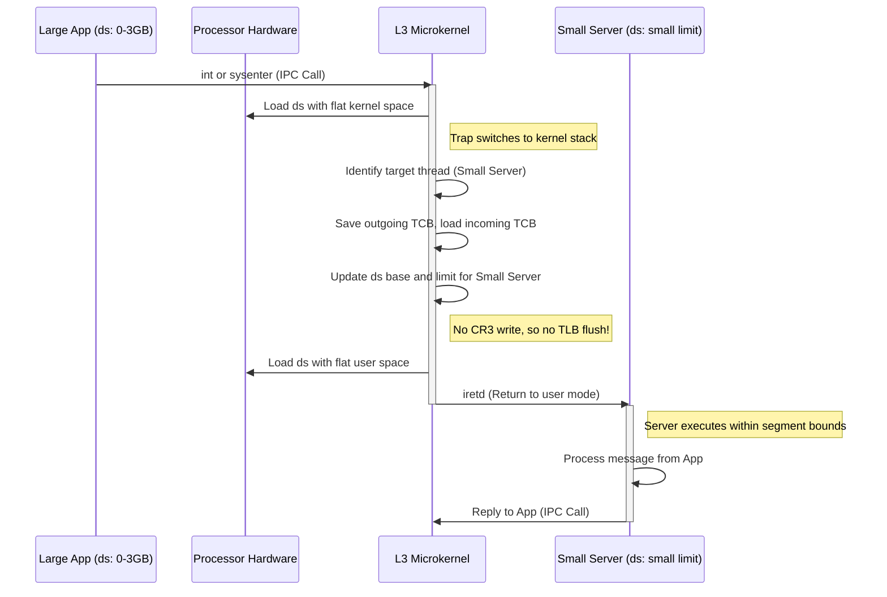

# L02d The L3 Microkernel Approach

> [!summary] TL;DR
> The L3 microkernel approach directly challenges the assumption that microkernel-based operating systems are inherently inefficient due to border crossing and context switching overheads.
> Liedtke argued that poor performance in early microkernels like Mach stemmed from prioritizing portability over hardware-specific optimization.
> By tailoring the microkernel to the precise characteristics of the underlying processor architecture, L3 demonstrated that Inter-Process Communication (IPC) and address space switches can be astonishingly fast.
> L3 introduced techniques such as multiplexing small protection domains into a single hardware address space using segment registers, thereby avoiding costly Translation Lookaside Buffer (TLB) flushes on context switches.

## Learning outcomes

- Contrast the design philosophy of the L3 microkernel with earlier systems like Mach-OS.
- Analyze the explicit and implicit costs of border crossings, including TLB and cache effects.
- Explain how small protection domains can be multiplexed using hardware segment registers to avoid TLB flushes on context switches.
- Calculate the theoretical and practical overhead of address-space switches based on processor-specific cycles.
- Evaluate the trade-offs between hardware portability and microkernel performance.

## Motivation and the problem

In the early 1990s, microkernels were widely criticized for their perceived poor performance compared to monolithic kernels.
Systems like Mach-OS were built with hardware portability as a primary goal, which resulted in significant overhead during Inter-Process Communication (IPC) and border crossings.
Because services were placed in separate address spaces, crossing from a user application to a system service required expensive address space switches, leading to Translation Lookaside Buffer (TLB) flushes and cache pollution.
This led researchers to explore alternatives like SPIN and Exokernel, which moved extensibility into the kernel to avoid border crossings entirely.
Jochen Liedtke took a different approach, theorizing that the microkernel concept was fundamentally sound, and the performance issues were simply artifacts of poor, overly generalized implementations.

## Core concepts

### Microkernel-based OS structure and its perceived costs

<!-- coverage: L02d-01 -->
> [!note] Definition: Microkernel Structure
> A microkernel architecture moves traditional operating system services (like file systems, network stacks, and device drivers) out of the privileged kernel space and runs them as isolated user-level processes.
> The kernel itself only provides the bare minimum mechanisms required for these services to communicate and function securely.

The motivation behind the microkernel architecture is to improve modularity, security, and fault tolerance by minimizing the amount of code running in privileged mode.
However, this structure inherently requires frequent communication between user-level applications and system services running in separate address spaces.
Early implementations, particularly Mach-OS, suffered from severe performance degradation because these communications required kernel intervention.
The perceived costs were attributed to the overhead of frequent border crossings between user and kernel modes, the context switching overhead, and the loss of memory locality due to flushed caches and TLBs.
This led the systems community to generally conclude that microkernels were inherently slow and unsuitable for high-performance applications.

### Explicit and implicit costs of border crossings

<!-- coverage: L02d-02 -->
> [!note] Definition: Explicit vs. Implicit Costs
> Explicit costs are the direct CPU cycles required to execute the instructions for a mode switch, saving registers, and validating arguments.
> Implicit costs are the delayed performance penalties incurred after a switch, primarily due to cache misses and TLB misses as the new context re-establishes its working set.

When a thread communicates with a service in another address space, it triggers a border crossing.
The explicit costs include the trap into the kernel, the context switch itself (saving and restoring the thread control block), and the return to user mode.
While these can be measured easily, the implicit memory effects are often far more dominant.
Because the communicating threads reside in different address spaces, switching between them typically requires flushing the Translation Lookaside Buffer (TLB) to maintain isolation.
Once the new thread starts executing, it suffers a series of TLB misses and cache misses as it brings its code and data into the processor's fast memory.
These implicit costs increase linearly with the size of the thread's working set and can easily dwarf the explicit instruction cycle count of the switch itself.

### L3 thesis for OS structure

<!-- coverage: L02d-03 -->
> [!note] Definition: The L3 Thesis
> Liedtke's core argument was that microkernels are not inherently slow, but that portability is the enemy of performance in kernel design.
> By abandoning portability and ruthlessly optimizing the kernel for the specific underlying processor architecture, a microkernel can achieve IPC performance close to the theoretical hardware limits.

The L3 approach argued that an operating system should consist of processor-specific microkernel implementations supporting processor-independent abstractions at higher layers.
Rather than writing generic C code that could compile on any architecture, Liedtke advocated for writing highly optimized, often assembly-level code tailored to the exact caching, TLB, and pipeline behavior of the target CPU.
This design philosophy dramatically reduced the explicit costs of IPC.
For example, L3 could perform a border crossing (including TLB and cache misses) in just 123 cycles on a 486 processor, compared to the 900 cycles required by Mach on the exact same hardware.
This proved that the microkernel paradigm could be exceptionally fast if implemented correctly.

### Minimal abstractions in the microkernel

<!-- coverage: L02d-04 -->
> [!note] Definition: Minimal Abstractions
> A true microkernel must only implement features that are absolutely necessary to enforce protection and allow secure communication between isolated user-level domains.
> Any feature that can be implemented at user-level without compromising security should be removed from the kernel.

L3 strictly adhered to the principle of minimal abstractions, providing only Address Spaces, Threads, IPC, and Unique Identifiers (UIDs) within the privileged kernel.
By keeping the kernel drastically small and focused, its memory footprint is minimized.
A smaller kernel footprint implies that the kernel's code and data are more likely to remain resident in the processor's caches and TLB, reducing the cache pollution caused when user-level threads invoke kernel mechanisms.
This minimalism is a direct counter to monolithic designs, where the kernel provides high-level abstractions like sockets, files, and complex scheduling policies, which bloat the kernel and increase the likelihood of cache displacement during border crossings.

### Address space switching cost and the TLB

<!-- coverage: L02d-05 -->
> [!note] Definition: TLB Flushing Overhead
> In processors with untagged TLBs, an address space switch requires invalidating the entire TLB because the virtual-to-physical mappings of the old space are no longer valid.
> The cost is not just the flush instruction itself, but the subsequent TLB misses required to reload the new address space's working set.

The performance penalty of switching address spaces is heavily dependent on the processor's TLB architecture.
Some processors, like the MIPS R4000, feature tagged TLBs, where each entry includes an Address Space Identifier (ASID).
On these systems, a context switch simply involves changing the current ASID register, and no TLB flush is needed.
However, prominent architectures of the time (like the Intel 486 and Pentium) used untagged TLBs.
On these processors, modifying the page table base register (`cr3` on x86) automatically flushed the TLB.
If a new thread has a working set of $n$ pages, it will incur $n$ TLB misses immediately after the switch.
If a TLB miss costs $m$ cycles, the implicit cost of the switch adds an overhead of $n \times m$ cycles, which can be devastating for frequent IPCs.

### Small protection domains with segment registers

<!-- coverage: L02d-06 -->
> [!note] Definition: Multiplexing Small Spaces
> To avoid TLB flushes on untagged architectures like x86, L3 utilized the processor's segmentation hardware.
> By mapping multiple small address spaces into a single, large underlying hardware address space, the kernel can switch between them by merely updating segment base and limit registers, bypassing the page table switch entirely.

Liedtke recognized that many system services (like device drivers or simple file servers) require very little memory.
On the Pentium processor, L3 divided a 512 MB region of the 4 GB virtual address space into multiple "small user spaces" (e.g., up to 64 MB each).
All of these small spaces were mapped into the same physical page directory, shared by all large user address spaces.
When IPC targeted a small address space, L3 simply modified the base and size of the user's data segment (`ds`) to restrict access to that specific small space's memory region.
This segment update takes a handful of cycles and does not trigger a TLB flush, turning a costly address space switch into a trivial segment register reload, vastly accelerating RPCs to typical microkernel services.

### Large protection domains and cache and TLB pollution

<!-- coverage: L02d-07 -->
> [!note] Definition: Cache and TLB Pollution
> When switching between large, memory-intensive protection domains, the new domain's working set inevitably evicts the previous domain's cache lines and TLB entries.
> This loss of locality imposes a hard architectural limit on how fast context switching can be, regardless of software optimization.

While small protection domains solve the TLB flush problem for lightweight services, switching between two large applications (e.g., a database and a massive compiler) inherently involves severe memory effects.
In these cases, the segment trick cannot be used, and the page table root must be changed, flushing the untagged TLB.
Even with a tagged TLB, the large working set of the new application will overwrite the cache entries of the old one.
Liedtke acknowledged that these costs cannot be mitigated by the OS.
However, he correctly argued that switching between massive working sets is expensive in any OS architecture (monolithic or microkernel).
Therefore, this fundamental hardware limitation should not be used as an argument against microkernel IPC, which is primarily concerned with fast communication between lightweight system services and user apps.

### Thread switch and IPC cost

<!-- coverage: L02d-08 -->
> [!note] Definition: Thread Switching and IPC
> A thread switch requires saving the volatile processor state of the outgoing thread and restoring the state of the incoming thread.
> IPC combines this thread switch with the transfer of a message or capabilities between the two distinct execution contexts.

The explicit cost of a thread switch includes saving general-purpose registers, the stack pointer, and the instruction pointer into a Thread Control Block (TCB).
In L3, the IPC path was meticulously hand-coded in assembly to minimize memory accesses and pipeline stalls.
The kernel passed short IPC messages entirely through the processor's registers, avoiding memory reads and writes altogether.
By tightly integrating the IPC mechanism with the thread scheduler, L3 avoided unnecessary scheduler queue manipulations when a thread yielded directly to an IPC target.
This hyper-optimization resulted in IPC costs that were competitive with the specialized mechanisms found in SPIN and Exokernel, proving that microkernels could achieve bare-metal performance.

### Memory effects: locality and footprint

<!-- coverage: L02d-09 -->
> [!note] Definition: Footprint Optimization
> To maximize cache efficiency, the kernel code that executes frequently (like the IPC path and the TLB miss handlers) must be small enough to reside permanently in the CPU's primary instruction cache without displacing user-level code.

Mach-OS was criticized for its massive codebase, which destroyed spatial locality.
When Mach handled an IPC, its large footprint caused a massive influx of kernel instructions and data into the cache, evicting the user process's working set.
Upon returning to the user process, the cache had to be repopulated from main memory.
L3 combated this by drastically shrinking the kernel.
With a minimal kernel footprint, the IPC fast path occupied only a few cache lines.
Consequently, an L3 border crossing barely perturbed the processor's caches, leaving the user process's working set largely intact.
This focus on instruction locality is why L3's implicit IPC costs were an order of magnitude lower than those of generic, portability-focused kernels.

### Microkernels are processor specific

<!-- coverage: L02d-10 -->
> [!note] Definition: Hardware Specificity
> To achieve optimal performance, the lowest level of a microkernel must be intimately tied to the specific features, quirks, and timing characteristics of the processor it runs on, trading hardware portability for extreme speed.

Liedtke's most controversial assertion was that portability at the microkernel level is a mistake.
L3's remarkable performance on the 486 and Pentium was achieved precisely because it exploited processor-specific features, such as the exact cycle timings of segment register loads versus cache misses, and the specific layout of the x86 page tables.
For example, L3 used knowledge of the x86 `iretd` instruction and segment limit bounds-checking hardware to enforce security at zero software cost.
While this means the kernel must be completely rewritten for a new processor architecture (like ARM or PowerPC), Liedtke argued that the microkernel is so small that this rewrite is trivial compared to the immense performance gains.
The processor-independent abstractions are built on top of this highly optimized base.

### Mach versus L3 comparison

<!-- coverage: L02d-11 -->
> [!note] Definition: Portability vs. Performance
> Mach exemplifies the "portability first" design, leading to a bloated, slow kernel.
> L3 exemplifies the "performance first" design, leading to a lean, hardware-specific, and blindingly fast kernel.

The comparison between Mach and L3 serves as the classic case study in OS design tradeoffs.
Mach abstracted the hardware away, using a complex internal object model that resulted in an enormous memory footprint and terrible cache locality.
A border crossing in Mach on a 486 took roughly 900 cycles.
In contrast, L3 embraced the hardware, resulting in a microscopic footprint and pristine cache locality.
The identical border crossing in L3 took a mere 123 cycles (with the theoretical hardware minimum being 107 cycles).
L3 conclusively proved that the microkernel abstraction itself was not the source of poor performance; rather, Mach's generic, monolithic-like implementation strategy was to blame.
L3 rehabilitated the microkernel concept in the eyes of systems researchers.

### Modern descendants: L4 family and seL4

<!-- coverage: L02d-12 -->
> [!note] Definition: The L4 Family and seL4
> The principles established by L3 evolved into the L4 family of microkernels.
> The most prominent modern descendant, seL4, combines L4's high performance with rigorous formal verification, mathematically proving its security and correctness.

Jochen Liedtke evolved the concepts of L3 into L4, which further refined IPC performance and kernel minimalism.
The L4 architecture spawned numerous academic and commercial variants (e.g., Fiasco, Pistachio, OKL4).
Today, the most significant descendant is seL4.
Developed by Data61 (formerly NICTA), seL4 takes L4's principles of minimalism and processor-specific optimization and adds formal mathematical proofs.
seL4 is the world's first operating system kernel to have a machine-checked proof of functional correctness, guaranteeing immunity against buffer overflows, null pointer dereferences, and memory leaks, while still maintaining the blazing fast IPC performance that Liedtke originally pioneered.
It is widely used in high-security embedded systems, aviation, and autonomous vehicles.

## Mechanisms step by step

The following sequence illustrates how L3 performs a fast IPC from a large user space application to a server located in a small user space on a Pentium processor without flushing the TLB.

1. The large application triggers a trap to enter the kernel.
2. The processor loads the kernel's segment descriptor, granting access to the entire address space.
3. The kernel determines the target thread and performs the necessary register swaps in the Thread Control Blocks.
4. Recognizing the target is a small address space, the kernel updates the `flat user space` segment descriptor's base and limit to match the server's restricted memory region.
5. The kernel executes an `iretd` instruction to return to the server.
6. The processor's segmentation hardware natively enforces the new memory boundaries, preventing the small server from reading the large app's memory, all without ever flushing the TLB.

## Worked examples

### Address-Space Switch Overhead on Intel 486

On the Intel 486, the explicit cost of an IPC system call involving a true address-space switch (modifying the `cr3` register) requires evaluating the base explicit instructions and the dynamic TLB reload cost.
The baseline explicit cost for the IPC path leading up to and including the page table switch is 14 cycles.
The implicit cost depends on $n$, the number of TLB misses caused by the flush, where each miss costs $m = 9$ cycles.
The formula for the total cost is: $14 + 9n$ cycles.
To find the minimum cost, we use the theoretical minimum working set for the newly scheduled thread which is 4 pages ($n = 4$).
Thus, the minimal switch overhead is $14 + (9 \times 4) = 50$ cycles.
To find the maximum cost, we assume the thread's working set fills the 32-entry TLB entirely ($n = 32$).
In this worst-case scenario, the overhead climbs to $14 + (9 \times 32) = 302$ cycles.

### Segment-Based Switch on Pentium

On the Pentium processor, moving from a large address space to a small address space avoids the $cr3$ modification.
A true page-table switch on the Pentium (Large to Large) costs $50 + 9n$ cycles, resulting in an overhead between 95 and 914 cycles.
A segment-based switch (Large to Small or Small to Small) requires reloading the segment registers (`ds`, `es`, `fs`, `gs`) with the updated `flat user space` descriptor.
The explicit cost of this segment manipulation is exactly 23 cycles.
By avoiding the TLB flush, the implicit cost drops to 0, demonstrating a massive performance gain for remote procedure calls to small services.

## Comparison

| Feature | Mach-OS | L3 Microkernel | SPIN / Exokernel |
| :--- | :--- | :--- | :--- |
| **Primary Goal** | Hardware portability and modularity | Extreme performance on specific hardware | Extensibility without border crossings |
| **Kernel Size** | Large, monolithic-like footprint | Minimal, tiny cache footprint | Small core, extensive library OS / extensions |
| **Optimization** | Generic C code, platform independent | Hand-optimized, processor-specific assembly | Safe language (SPIN) or raw hardware access (Exokernel) |
| **IPC Overhead** | ~900 cycles (on 486) | ~123 cycles (on 486) | Avoided or highly optimized via in-kernel execution |
| **TLB Handling** | Frequent flushes on context switch | Segment multiplexing to avoid flushes | Dependant on extension placement |
| **When to use** | Legacy academic research systems | Modern high-performance embedded systems | Specialized, highly customized application environments |

## Paper deep dives

- [Extensibility, Safety and Performance in the SPIN Operating System](../Papers/L02-SPIN.md): SPIN tackled the microkernel performance problem by allowing applications to safely download extensions directly into the kernel's address space. It relied on the type-safety of Modula-3 to ensure these extensions could not crash the system, thereby eliminating the need for expensive hardware-enforced border crossings.
- [Exokernel: An Operating System Architecture for Application-Level Resource Management](../Papers/L02-Exokernel.md): The Exokernel architecture securely multiplexed raw hardware resources, pushing all traditional OS abstractions into unprivileged library operating systems. This gave applications unprecedented control over performance, completely bypassing the rigid abstractions enforced by traditional monolithic or microkernel designs.
- [On Micro-Kernel Construction](../Papers/L02-On-Microkernel-Construction.md): Liedtke's seminal paper systematically dismantled the myth that microkernels are inherently slow. By deeply analyzing the cache, TLB, and explicit instruction costs on the x86 architecture, he proved that a meticulously engineered, hardware-specific microkernel could achieve IPC performance orders of magnitude faster than systems like Mach.
- [Improved Address-Space Switching on Pentium Processors by Transparently Multiplexing User Address Spaces](../Papers/L02-Improved-Address-Space-Switching.md): This paper details the ingenious segment multiplexing technique used in L3 to overcome the limitations of the Pentium's untagged TLB. By dynamically mapping small protection domains into a single hardware address space, Liedtke turned expensive page-table switches into cheap segment register updates.

## Modern descendants

The architectural principles set forth by L3 have had a profound and lasting impact on modern operating systems research.
The immediate successor to L3 was L4, which became an entire family of high-performance microkernels.
The most prominent modern descendant is seL4, which combines the aggressive optimization strategies of L3 with rigorous formal verification.
seL4 provides a mathematically proven guarantee of correctness, ensuring absence of common bugs like buffer overflows, while still delivering blazing-fast IPC.
This makes it a cornerstone technology for modern high-security environments, such as avionics, autonomous vehicles, and trusted execution environments on mobile devices.
Beyond the L4 family, the realization that border crossings can be minimized through hardware-specific tricks influenced technologies like eBPF in Linux, which safely runs user-defined code inside the kernel to avoid context switches.

## Pitfalls and exam traps

> [!warning] Exam Trap: Implicit vs. Explicit Costs
> Do not confuse explicit and implicit costs.
> Explicit costs are the CPU cycles spent executing the context switch code (saving registers, etc.).
> Implicit costs are the subsequent penalties due to cache and TLB misses.
> The implicit costs are almost always the dominant factor in performance degradation.

> [!warning] Exam Trap: The Role of Portability
> A common misconception is that all modern OS design values portability above all else.
> Liedtke explicitly argued that microkernels must sacrifice portability for performance.
> If you see a question asking why Mach was slow, the answer is often tied to its pursuit of generic, portable abstractions at the expense of hardware-specific optimizations.

> [!warning] Exam Trap: Small Address Spaces on Pentium
> Remember that the "segment multiplexing" trick on the Pentium only works for *small* address spaces.
> Switching between two massive, memory-hungry applications still requires a page table switch and incurs the full TLB flush penalty.

## Practice

- [Practice L02](../Practice/Practice-L02.md)

## Lab

- [lab-01-syscall-and-context-switch](../labs/lab-01-syscall-and-context-switch/README.md): Border crossings: syscall, context switch, and address space switch costs

## Further reading

- Jochen Liedtke's original publications on L3 and L4 are essential for understanding low-level OS optimization.
- The seL4 project documentation (https://sel4.systems/) provides excellent insights into how L4 concepts are applied in modern, formally verified systems.
