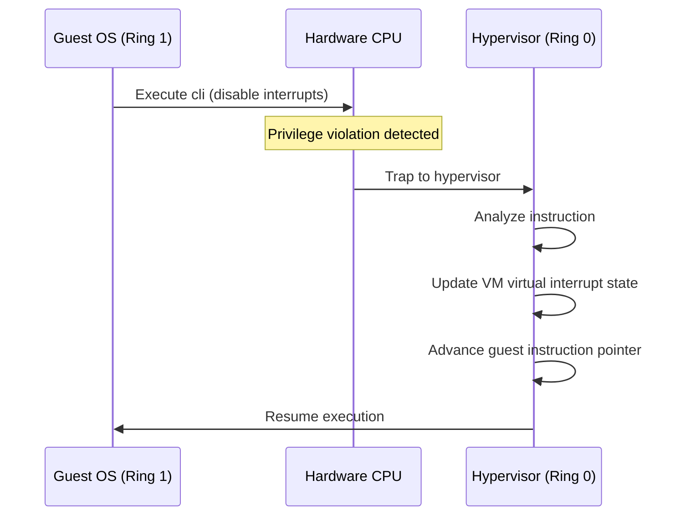

# L03a Introduction to Virtualization

> [!summary] TL;DR
> Virtualization allows multiple operating systems to share a single physical machine safely and efficiently by multiplexing hardware resources.
> A hypervisor or Virtual Machine Monitor (VMM) sits between the hardware and the guest operating systems to enforce isolation.
> Modern virtualization relies on hardware assistance, while earlier techniques used trap-and-emulate, binary translation, or paravirtualization to achieve high performance.
> These foundational techniques pave the way for cloud computing and massive server consolidation.

## Learning outcomes

- **Define** platform virtualization, hypervisors, and the motivations behind server consolidation.
- **Differentiate** between native (bare-metal) and hosted hypervisors.
- **Compare** full virtualization (trap-and-emulate, binary translation) with paravirtualization.
- **Explain** the mechanics of virtualizing CPU, memory, and I/O devices.
- **Analyze** the architectural decisions in the Xen hypervisor and VMware ESX Server.

## Motivation and the problem

The primary motivation for virtualization is server consolidation.
Before widespread virtualization, servers typically ran a single operating system and application stack, leading to massive under-utilization of hardware resources (often below 20%).
Buying separate physical servers for every service was costly in hardware, space, cooling, and power.

The problem is that operating systems are designed to have exclusive access to the underlying hardware.
They expect to manage physical memory, program the CPU, and directly interact with devices.
If multiple OSes run on the same hardware, their uncoordinated access would lead to corruption and crashes.
Virtualization solves this by introducing a layer that multiplexes physical resources into multiple independent virtual resources, allowing unmodified (or slightly modified) guest OSes to safely coexist.

## Core concepts

### Platform virtualization and hypervisors

<!-- coverage: L03a-01 -->
> [!note] Platform Virtualization
> The process of creating a virtual representation of a physical machine, allowing multiple independent virtual machines (VMs) to run concurrently on a single physical host.

A hypervisor, also known as a Virtual Machine Monitor (VMM), is the software layer that provides this virtualization.
It sits below the guest operating systems and above the hardware (or a host OS).
The hypervisor's job is to create the illusion of a complete, dedicated machine for each guest OS.
It is responsible for allocating resources like CPU time and memory, enforcing isolation so that a crash in one VM does not affect others, and mediating access to shared I/O devices.
This enables high utilization and multi-tenancy on shared infrastructure, fundamentally enabling modern cloud computing.

### Native (bare-metal) versus hosted hypervisors

<!-- coverage: L03a-02 -->
> [!note] Hypervisor Types
> **Native (Type 1)** hypervisors run directly on the physical hardware.
> **Hosted (Type 2)** hypervisors run as an application within a conventional host operating system.

Native hypervisors are deployed on the bare metal and have direct control over the hardware resources.
Examples include VMware ESX, Xen, and Microsoft Hyper-V.
They generally offer superior performance, stability, and security because they eliminate the overhead of a host OS kernel routing their operations.
Hosted hypervisors, such as VMware Workstation or Oracle VirtualBox, rely on a host OS (like Windows or Linux) to manage the hardware.
They are easier to install for desktop virtualization and testing but incur additional context-switching overhead since the VMM must ask the host OS to perform hardware operations on its behalf.

### Full virtualization and trap-and-emulate

<!-- coverage: L03a-03 -->
> [!note] Trap-and-Emulate
> A technique where the guest OS is run at a lower privilege level than the hypervisor.
> When the guest attempts a privileged operation, the CPU traps to the hypervisor, which emulates the operation safely.

Full virtualization aims to run a guest operating system entirely unmodified.
In a classical architecture that perfectly supports virtualization, all sensitive and privileged instructions will trap if executed in an unprivileged state.
The hypervisor runs in the most privileged ring, while the guest OS kernel is demoted to a less privileged ring.
When the guest OS tries to, for example, modify a hardware page table or disable interrupts, a hardware trap occurs.
The VMM intercepts this trap, performs the equivalent action on the virtual state of that VM, and then resumes guest execution.
This provides complete isolation but historically suffered from high overhead due to frequent trapping.

### Binary translation

<!-- coverage: L03a-04 -->
> [!note] Binary Translation
> A software technique that dynamically inspects and modifies guest executable code on the fly to replace non-virtualizable instructions with safe equivalents or explicit VMM calls.

Older x86 processors were not classically virtualizable because certain sensitive instructions (like reading the processor flags) did not trap when executed in user mode; they simply failed silently or behaved differently.
To achieve full virtualization on such hardware, VMware introduced dynamic binary translation.
The hypervisor scans the guest OS binary at runtime, looking for these problematic instructions.
It then dynamically rewrites those basic blocks, inserting traps or calls to the VMM before executing them.
This ensures that the VMM maintains control without requiring any source code modifications to the guest OS.
While effective, binary translation incurs CPU overhead and requires a complex translation cache.

### Para-virtualization

<!-- coverage: L03a-05 -->
> [!note] Paravirtualization
> A virtualization approach where the guest OS is modified to be aware of the hypervisor, replacing privileged operations with explicit hypercalls for better performance.

Paravirtualization, heavily popularized by the Xen hypervisor, rejects the goal of keeping the guest OS unmodified.
Instead, it alters the guest OS source code (typically less than 2% of the kernel) to replace sensitive hardware interactions with hypercalls directly to the hypervisor.
For example, instead of updating a page table and trapping, the guest OS explicitly asks Xen to update the page table on its behalf.
This drastically reduces the overhead of virtualization because it eliminates the cost of unpredictable traps, complex emulation, and binary translation.
The trade-off is that proprietary OSes like older Windows versions could not easily be paravirtualized without vendor support.

### What must be virtualized: memory, CPU, devices

<!-- coverage: L03a-06 -->
> [!note] Resource Virtualization
> To create a complete virtual machine, the hypervisor must virtualize the CPU (execution context), memory (address translation), and I/O devices (storage and network).

Virtualizing the CPU involves time-multiplexing the physical processors across multiple virtual CPUs (vCPUs) and intercepting privileged instructions.
Memory virtualization requires maintaining a mapping from the guest's physical memory to the machine's actual physical memory, historically done via shadow page tables managed by the VMM.
Device virtualization involves either emulating a generic piece of hardware (like an IDE controller) or providing a paravirtualized device driver (like Xen's split driver model) where the guest explicitly communicates with the VMM via shared memory ring buffers to send and receive data.
Each subsystem requires distinct strategies to balance performance and isolation.

### Modern descendants: hardware-assisted virtualization (VT-x, AMD-V, ARM EL2)

<!-- coverage: L03a-07 -->
> [!note] Hardware-Assisted Virtualization
> CPU extensions that introduce a new hypervisor mode with distinct privilege levels and hardware structures to support virtualization without binary translation or paravirtualization.

Modern virtualization is dominated by hardware assistance.
Intel VT-x and AMD-V introduced a new execution mode (VMX root operation for the hypervisor, VMX non-root operation for the guest).
The guest OS runs in its native ring 0, but sensitive instructions trigger a VM exit directly to the hypervisor.
Additionally, Extended Page Tables (EPT) and Nested Page Tables (NPT) allow the hardware MMU to handle the guest-physical to machine-physical memory translation, completely eliminating the need for complex shadow page tables.
ARM introduced EL2 specifically for hypervisors.
These features combined the performance benefits of paravirtualization with the compatibility of full virtualization, making modern hypervisors simpler and dramatically faster.

## Mechanisms step by step

Here is the step-by-step flow of handling a privileged instruction in a trap-and-emulate full virtualization scenario:

1. The VMM sets up the CPU to run the guest OS at a lower privilege level (e.g., Ring 1 instead of Ring 0).
2. The guest OS attempts to execute a privileged instruction (e.g., modifying the interrupt flag).
3. The CPU hardware detects the privilege violation and immediately triggers a trap (exception).
4. Execution transitions to the VMM's trap handler in the highest privilege level (Ring 0).
5. The VMM inspects the trap details, identifies the faulting instruction, and determines the guest's intent.
6. The VMM updates the internal virtual state of that specific VM to reflect the effect of the instruction.
7. The VMM increments the guest's instruction pointer and resumes execution of the guest OS.

## Worked examples

Consider the overhead of memory virtualization using shadow page tables versus Extended Page Tables (EPT) during a page fault.

Let us quantify the cost of updating a page table in a virtualized system.
Suppose a guest OS allocates a new page and updates its page table.

**With Shadow Page Tables (Trap-and-Emulate):**
The guest OS page table is marked read-only by the VMM.
1. Guest writes to the PTE: 1 instruction.
2. CPU traps: 500 cycles context switch to VMM.
3. VMM emulates write, updates shadow PTE, and updates guest PTE: 1000 cycles.
4. VMM resumes guest: 500 cycles.
**Total cost:** 2000 cycles per page table update.

**With Hardware-Assisted EPT:**
The guest directly writes to its own page table.
1. Guest writes to the PTE: 1 instruction (1 cycle).
2. The hardware MMU traverses the EPT automatically on the next memory access.
**Total cost:** 1 cycle (ignoring the later TLB/EPT walk latency, which is done in hardware).

This arithmetic clearly demonstrates why EPT revolutionized virtualization performance by eliminating the massive 2000-cycle software overhead for every page table manipulation.

## Comparison

| Feature | Full Virtualization (Binary Translation) | Paravirtualization (Xen) | Hardware-Assisted Virtualization |
| :--- | :--- | :--- | :--- |
| **Guest OS Modification** | Requires no guest OS modifications, running completely unmodified binaries. | Requires source code changes to the guest OS kernel. | Requires no guest OS modifications, running completely unmodified binaries. |
| **Performance Overhead** | Performance overhead is high because translation and shadow structures are costly. | Performance overhead is low because hypercalls replace expensive traps. | Performance overhead is the lowest since hardware handles isolation and translation natively. |
| **Implementation Complexity**| Implementation complexity is extremely high in the VMM due to the binary translator. | Implementation complexity is high in the guest OS but lower in the VMM. | Implementation complexity is low in software but requires high complexity in hardware silicon. |
| **When to use** | Best used for legacy systems on older x86 hardware. | Best used for highly optimized cloud instances where host OS control is possible. | This is the modern standard for almost all cloud and desktop workloads. |

## Paper deep dives

- [Xen and the Art of Virtualization](../Papers/L03-Xen.md): This paper introduced the paravirtualization approach on the x86 architecture.
It demonstrated that by slightly modifying the guest OS (creating XenoLinux), Xen could achieve near-native performance for multiplexing operating systems.
This heavily outperformed full virtualization systems of the time.
Xen moved the guest OS to Ring 1 and utilized hypercalls for privileged operations.
It also introduced asynchronous I/O rings for highly efficient network and disk virtualization.
- [Memory Resource Management in VMware ESX Server](../Papers/L03-VMware-ESX-Memory.md): This foundational paper explains how VMware ESX handles memory overcommitment when multiple VMs require more memory than physically exists.
It introduces the ballooning technique, where a guest-level driver explicitly requests memory from the guest OS and hands it back to the hypervisor.
This allows the hypervisor to reclaim memory without blindly swapping and inducing double-paging.
It also discusses content-based page sharing (KSM) and an idle memory tax to ensure fair distribution.

## Modern descendants

The legacy of these early virtualization technologies is evident everywhere today.
**Hardware-Assisted Virtualization (Intel VT-x, AMD-V, EPT/NPT)** has become ubiquitous, making software binary translation obsolete.
The I/O ring buffer concepts from Xen directly inspired **virtio**, the standard interface for paravirtualized network and disk devices used by Linux and KVM today.
**KVM (Kernel-based Virtual Machine)** has largely superseded Xen in many deployments by turning the standard Linux kernel itself into a hypervisor.
Additionally, the concept of content-based page sharing introduced by VMware is implemented in Linux as **KSM (Kernel Samepage Merging)**.
Finally, the desire for even lighter-weight isolation has driven the rise of containerization (Docker, Kubernetes) and **unikernels**, which strip away the guest OS entirely to run a single application linked with just the necessary OS libraries.

## Pitfalls and exam traps

> [!warning] Exam Trap: Shadow Page Tables vs EPT
> Do not confuse the mechanisms of memory virtualization.
> Shadow page tables are maintained entirely in software by the hypervisor trapping on guest page table updates.
> EPT (Extended Page Tables) is a hardware feature where the MMU performs a 2D walk of both the guest and hypervisor page tables without trapping.

> [!warning] Exam Trap: Ballooning
> Ballooning does not mean the hypervisor forces the guest OS to page out.
> The hypervisor asks the balloon driver to allocate memory.
> The guest OS decides which pages to swap to disk using its own native algorithms.
> The hypervisor simply reclaims the physical memory frames that the balloon driver holds.

## Practice

- [Practice L03](../Practice/Practice-L03.md)

## Lab

- [lab-03-virtualization](../labs/lab-03-virtualization/README.md): KVM and libvirt by hand: lifecycle, vCPU pinning, ballooning, and KSM page sharing

## Further reading

- [Intel 64 and IA-32 Architectures Software Developer Manuals](https://software.intel.com/content/www/us/en/develop/articles/intel-sdm.html)
- [Linux KVM Documentation](https://www.kernel.org/doc/html/latest/virt/kvm/index.html)
