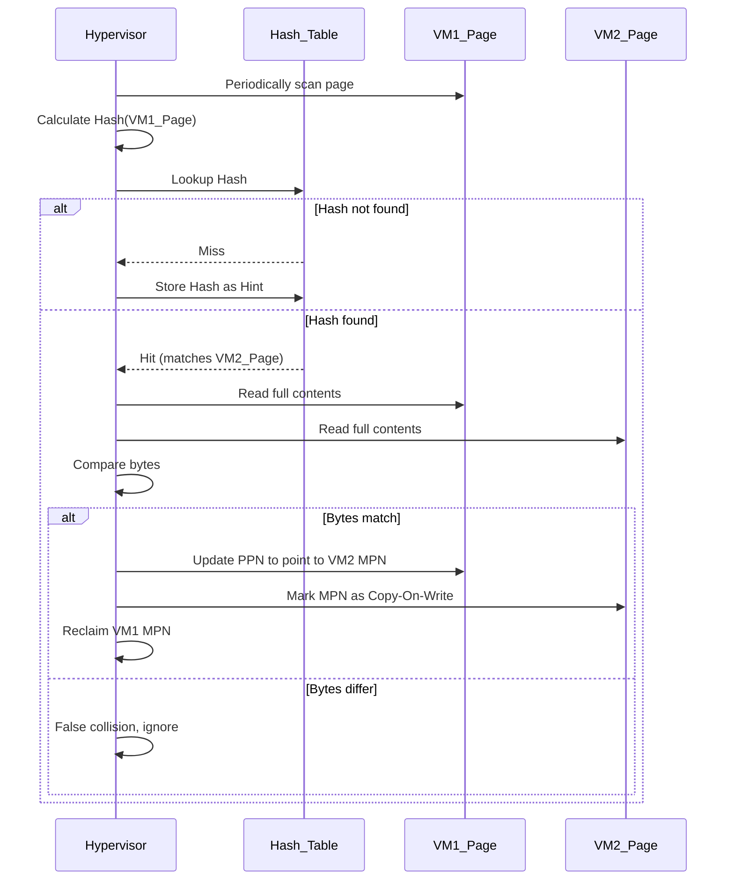
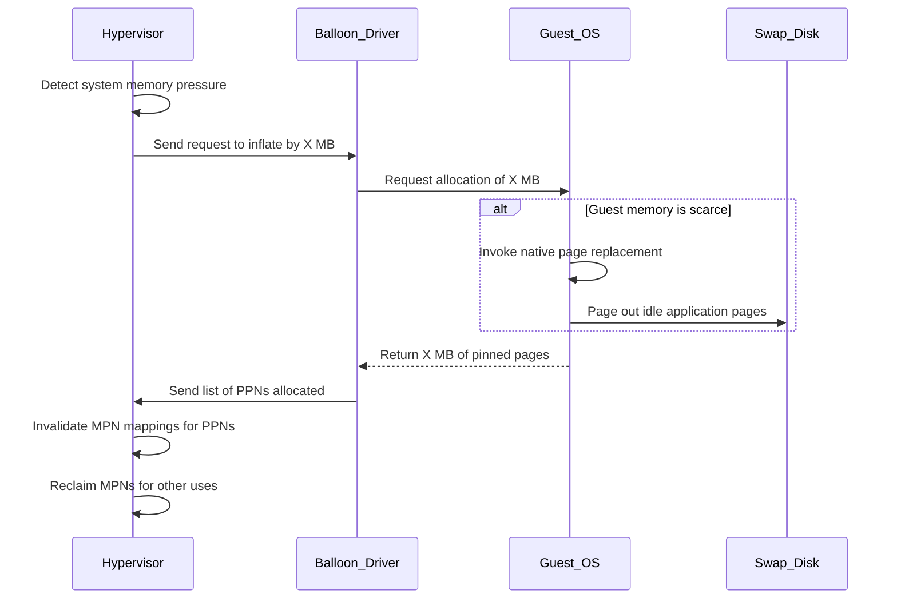

# L03b Memory Virtualization

> [!summary] TL;DR
> Memory virtualization ensures that multiple guest operating systems can safely share the physical memory of a single host without interfering with each other.
> The hypervisor introduces an extra level of indirection between the physical memory the guest expects and the actual machine memory it receives.
> Advanced techniques like ballooning, content-based page sharing, and dynamic idle-adjusted shares allow the hypervisor to efficiently overcommit memory.
> Both full virtualization and paravirtualization offer different trade-offs in how address translation and page table updates are managed.

## Learning outcomes

- Describe the difference between virtual, physical, and machine addresses in a virtualized environment.
- Explain how shadow page tables enable full memory virtualization.
- Contrast the memory management approaches of full virtualization and paravirtualization.
- Calculate the effective memory allocation of a virtual machine using the dynamic idle-adjusted shares algorithm.
- Illustrate the mechanisms of ballooning and content-based page sharing.
- Evaluate the trade-offs between pure share-based and working-set based memory allocation policies.

## Motivation and the problem

Traditional operating systems assume they have exclusive control over the entire physical memory of the machine.
In a virtualized environment, multiple virtual machines run concurrently on a single physical server.
The hypervisor must provide each guest OS with the illusion of contiguous, zero-based physical memory.
This illusion must be maintained while securely isolating virtual machines and preventing them from accessing each other's memory.
Furthermore, the hypervisor often needs to overcommit memory to achieve high server consolidation ratios, requiring mechanisms to dynamically reclaim and share memory across boundaries without breaking the expectations of the guest OS.

## Core concepts

### Virtual, physical, and machine addresses

<!-- coverage: L03b-01 -->
> [!note] Definition
> In virtualization, "virtual" addresses are used by guest applications, "physical" addresses are the zero-based addresses expected by the guest OS, and "machine" addresses refer to the actual hardware RAM.

The addition of a hypervisor introduces a new layer of memory addressing.
Guest applications continue to use virtual addresses, which the guest OS translates to what it believes are physical addresses.
The hypervisor must then translate these guest physical addresses into actual machine addresses.
This extra level of indirection is necessary because the guest OS cannot be allowed to arbitrarily map machine memory, as that would violate isolation.
The hypervisor maintains a mapping from physical page numbers (PPN) to machine page numbers (MPN) for each virtual machine.

### Shadow page tables

<!-- coverage: L03b-02 -->
> [!note] Definition
> A shadow page table is a data structure maintained by the hypervisor that maps guest virtual addresses directly to host machine addresses for use by the hardware memory management unit (MMU).

The guest OS maintains its own page tables mapping virtual addresses to guest physical addresses.
However, the hardware MMU needs a direct mapping from virtual addresses to machine addresses to perform translations efficiently.
The hypervisor constructs and maintains shadow page tables to provide this direct mapping.
By keeping the shadow page table synchronized with the guest page table, ordinary memory references can execute at hardware speed.
The cost of this approach is the overhead required to maintain consistency between the guest page table and the shadow page table.

### Efficient mapping in full virtualization

<!-- coverage: L03b-03 -->
> [!note] Definition
> Full virtualization relies on hardware traps to intercept and emulate privileged operations, such as page table updates, without requiring modifications to the guest OS.

In a fully virtualized setting, the hypervisor write-protects the memory pages containing the guest OS page tables.
Whenever the guest OS attempts to update its page table, a privilege exception or page fault is triggered.
The hypervisor catches this trap, inspects the intended update, and applies the corresponding change to the shadow page table.
After the shadow page table is updated, the hypervisor resumes the guest OS.
While this provides complete transparency, the frequent traps caused by page table updates can lead to significant performance overhead, especially for workloads that frequently create or destroy processes.

### Efficient mapping in para-virtualization

<!-- coverage: L03b-04 -->
> [!note] Definition
> Paravirtualization modifies the guest OS to be aware of the hypervisor, allowing it to explicitly cooperate for memory management operations like page table updates.

Paravirtualized guests, such as XenoLinux, do not rely on shadow page tables.
Instead, the guest OS has direct read access to the hardware page tables but must use hypercalls to request updates.
The guest OS batches these update requests and passes them to the hypervisor, which validates and applies them to the machine page tables.
This batching drastically reduces the number of context switches into the hypervisor compared to the trap-and-emulate approach of full virtualization.
The hypervisor ensures safety by verifying that the guest OS only maps pages it currently owns and does not create writable mappings to the page tables themselves.

### Hardware nested paging (EPT and NPT)

<!-- coverage: L03b-05 -->
> [!note] Definition
> Hardware nested paging, implemented as Extended Page Tables (EPT) by Intel and Nested Page Tables (NPT) by AMD, offloads the secondary address translation to the CPU hardware.

Hardware nested paging eliminates the need for software-managed shadow page tables.
The CPU MMU is designed to perform a two-dimensional page walk.
It first translates the guest virtual address to a guest physical address using the guest OS page tables.
It then translates the guest physical address to a host machine address using the extended page tables managed by the hypervisor.
This hardware support significantly reduces the overhead of page table updates because the hypervisor no longer needs to intercept them.
However, it can increase the cost of a TLB miss, as the hardware must perform many more memory accesses to resolve both levels of translation.

### Dynamically increasing and reclaiming memory

<!-- coverage: L03b-06 -->
> [!note] Definition
> Dynamic memory resizing allows the hypervisor to adjust the amount of machine memory allocated to a virtual machine in response to changing workloads and system pressure.

To support memory overcommitment, the hypervisor must be able to reclaim memory from one virtual machine to give it to another.
The naive approach is for the hypervisor to blindly page out a virtual machine's machine pages to a swap disk.
This is highly inefficient because the hypervisor lacks semantic knowledge of which pages are actively used by the guest OS.
Blind swapping can lead to the double paging problem, where the hypervisor swaps out a page that the guest OS immediately tries to access or page out to its own virtual disk.
Effective reclamation requires cooperation with the guest OS, often implemented via [ballooning](#ballooning), or intelligent sharing mechanisms.

### Ballooning

<!-- coverage: L03b-07 -->
> [!note] Definition
> Ballooning is a technique where a hypervisor-controlled module inside the guest OS allocates or deallocates guest physical pages to influence the guest's native memory management.

A balloon driver is installed as a pseudo-device driver within the guest OS.
When the hypervisor needs to reclaim memory, it instructs the balloon to inflate.
The balloon driver requests memory from the guest OS using standard kernel allocation interfaces.
If memory is scarce, this forces the guest OS to invoke its own intelligent paging algorithms to free up space, potentially swapping idle applications to the guest's virtual disk.
The balloon driver then pins these allocated pages and communicates their physical page numbers to the hypervisor.
The hypervisor can safely reclaim the underlying machine pages because the guest OS will not access the memory owned by the balloon driver.
When memory pressure subsides, the hypervisor instructs the balloon to deflate, returning the memory to the guest OS.

### Sharing memory across VMs: content-based page sharing

<!-- coverage: L03b-08 -->
> [!note] Definition
> Content-based page sharing identifies and merges identical machine pages across different virtual machines to reduce overall memory footprint.

Server consolidation often involves running multiple virtual machines with similar operating systems or applications.
This results in redundant copies of code, shared libraries, and even zero-filled pages.
The hypervisor periodically scans machine memory and computes a hash for each page.
If the hash matches an entry in a global hash table, the hypervisor performs a full byte-by-byte comparison to confirm the contents are identical.
Identical pages are then mapped to a single machine page, and the redundant copies are reclaimed.
The shared machine page is marked as copy-on-write (COW), ensuring that if any virtual machine attempts to modify it, a private copy is instantly created.

### Memory allocation policies: pure share-based

<!-- coverage: L03b-09 -->
> [!note] Definition
> A pure share-based policy allocates memory to virtual machines strictly proportional to the number of shares they have been assigned, regardless of their actual memory usage.

In a pure share-based system, each virtual machine is given a certain number of shares that represent its relative importance or resource entitlement.
The hypervisor divides the total available machine memory among the virtual machines based on their fraction of the total shares.
If a virtual machine is not actively using its allocated memory, that memory remains idle and is not reallocated to other virtual machines that might be under memory pressure.
This approach guarantees resource availability and strict isolation but leads to poor overall memory utilization.
It effectively treats memory as a statically partitioned resource once the shares are assigned.

### Memory allocation policies: working-set based

<!-- coverage: L03b-10 -->
> [!note] Definition
> A working-set based policy allocates memory based on the active memory footprint of each virtual machine, aiming to optimize overall system throughput.

A working-set policy dynamically estimates how much memory each virtual machine actually needs to run efficiently.
The hypervisor reclaims memory from virtual machines with large amounts of idle memory and gives it to virtual machines with growing working sets.
This approach maximizes aggregate system performance and memory utilization by ensuring that memory is directed where it is most needed.
However, it can conflict with quality-of-service guarantees.
A low-priority virtual machine might consume a large amount of memory simply because it has a large working set, starving a high-priority virtual machine that happens to have a smaller or more bursty memory footprint.

### Dynamic idle-adjusted shares and the idle memory tax

<!-- coverage: L03b-11 -->
> [!note] Definition
> The idle memory tax is a parameter in the dynamic min-funding revocation algorithm that charges virtual machines more for retaining idle memory than for retaining active memory.

To balance proportional sharing with efficient utilization, VMware ESX Server uses dynamic idle-adjusted shares.
The system calculates a price for memory based on the shares-per-page ratio.
When memory must be reclaimed, the hypervisor revokes it from the virtual machine that holds the cheapest memory.
The idle memory tax modifies this calculation by artificially reducing the effective share price of idle pages.
If the tax rate is set to zero percent, the system behaves exactly like a pure share-based policy.
If the tax rate is high, idle pages become very cheap to revoke, and the system behaves more like a working-set policy.
This allows administrators to control the trade-off between strict allocation guarantees and overall memory efficiency.

### Modern descendants: KSM and virtio-balloon

<!-- coverage: L03b-12 -->
> [!note] Definition
> Modern Linux systems utilize Kernel Samepage Merging (KSM) for page sharing and the virtio-balloon driver for dynamic memory reclamation in KVM environments.

The concepts pioneered by VMware and Xen have evolved into standard features in modern virtualization stacks like KVM.
Kernel Samepage Merging (KSM) is a Linux kernel feature that scans memory for identical pages and merges them, functioning similarly to the content-based page sharing introduced in ESX Server.
The virtio framework provides a standardized interface for paravirtualized devices, including the virtio-balloon device.
The virtio-balloon driver operates within the guest OS and cooperates with the KVM hypervisor to inflate and deflate, managing memory pressure just as the original ESX balloon driver did.
These mechanisms are now fundamental to cloud computing platforms, allowing them to achieve high density and efficient resource utilization.

## Mechanisms step by step

The following diagram illustrates the sequence of operations for content-based page sharing:

The following diagram illustrates the sequence of operations for ballooning to reclaim memory:

## Worked examples

### Calculating Idle Memory Tax

Assume a system has two virtual machines, VM A and VM B.
VM A is assigned 2000 shares and has allocated 1000 pages ($P_A = 1000$).
VM B is assigned 1000 shares and has allocated 1000 pages ($P_B = 1000$).
VM A has 800 active pages ($f_A = 0.8$) and 200 idle pages.
VM B has 900 active pages ($f_B = 0.9$) and 100 idle pages.
The idle memory tax rate is set to $\tau = 0.50$ (50 percent).

In ESX Server, the tax penalizes idle pages using a multiplier $k = \frac{1}{1 - \tau}$.
Here, $k = \frac{1}{1 - 0.50} = 2.0$.
The effective adjusted page allocation is:
$$\text{Adjusted Pages} = P \cdot (f + k \cdot (1 - f)) = \text{Active Pages} + k \cdot \text{Idle Pages}$$

For VM A:
$$\text{Adjusted Pages}_A = 800 + 2.0 \times 200 = 800 + 400 = 1200$$
$$\text{Effective Share Price}_A = \frac{S_A}{\text{Adjusted Pages}_A} = \frac{2000}{1200} \approx 1.67$$
(Without tax, VM A's base share price would have been $2000 / 1000 = 2.00$.)

For VM B:
$$\text{Adjusted Pages}_B = 900 + 2.0 \times 100 = 900 + 200 = 1100$$
$$\text{Effective Share Price}_B = \frac{S_B}{\text{Adjusted Pages}_B} = \frac{1000}{1100} \approx 0.91$$
(Without tax, VM B's base share price would have been $1000 / 1000 = 1.00$.)

When memory reclamation occurs, the hypervisor revokes pages from the VM with the lowest effective share price.
Since $0.91 < 1.67$, VM B is targeted first because its lower total share allocation outweighs its slightly lower idleness.
However, observe the impact of the tax: if VM A had 800 idle pages ($f_A = 0.2$), its adjusted pages would swell to $200 + 2.0 \times 800 = 1800$, dropping its price to $2000 / 1800 \approx 1.11$, bringing it much closer to revocation despite having twice VM B's shares.
The idle tax ensures idle pages artificially inflate the divisor, depressing the effective share price and preventing idle memory hoarding.

## Comparison

| Feature | Full Virtualization | Paravirtualization | Hardware Assisted (EPT/NPT) |
| :--- | :--- | :--- | :--- |
| **Guest OS Modification** | None required. | Requires source code modifications. | None required. |
| **Page Table Management** | Hypervisor maintains shadow page tables. | Guest manages tables, hypervisor validates. | Hardware handles nested translation. |
| **Update Mechanism** | Traps on every page table modification. | Hypercalls, often batched. | Hardware directly updates extended tables. |
| **Performance Overhead** | High due to frequent trapping and emulation. | Low due to efficient hypercalls. | Low for updates, but TLB misses are costly. |
| **Complexity** | Extremely high in the hypervisor. | Moderate in both hypervisor and guest. | Low in software, complex in hardware. |
| **When to Use** | Running legacy closed-source OSes on older CPUs. | Running modified open-source OSes for max performance. | Running modern OSes on modern hardware. |

## Paper deep dives

- [Xen and the Art of Virtualization](../Papers/L03-Xen.md)
  The Xen paper introduces a high-performance paravirtualized architecture designed to host up to 100 virtual machines on a single server. It argues against the complexity of full virtualization on the x86 architecture, proposing instead a modified guest operating system that cooperates with the hypervisor. This approach yields performance that closely tracks bare metal, utilizing techniques like batched page table updates and asynchronous I/O rings to minimize hypervisor transitions.
- [Memory Resource Management in VMware ESX Server](../Papers/L03-VMware-ESX-Memory.md)
  The ESX Server paper details the practical mechanisms required to efficiently overcommit memory in a commercial virtualization product without modifying the guest operating systems. It introduces the ballooning technique for cooperative memory reclamation and content-based page sharing to eliminate redundancy. Furthermore, it presents the proportional-share allocation algorithm combined with an idle memory tax to balance strict resource guarantees with overall system utilization.

## Modern descendants

The techniques discussed in these papers have become foundational elements of modern cloud infrastructure.
Hardware nested paging, introduced as Intel EPT and AMD NPT, has largely replaced software shadow page tables, moving the complexity of secondary address translation into the processor itself.
The virtio standard, which defines interfaces for paravirtualized devices, includes the virtio-balloon driver to manage memory pressure in KVM environments, directly reflecting the design of the original ESX balloon.
Kernel Samepage Merging (KSM) is a standard Linux feature that implements content-based page sharing, allowing the OS to merge identical pages not only across virtual machines but also across standard processes.
These advancements have made virtualization near-ubiquitous, enabling the high density and efficiency required by massive public cloud providers.

## Pitfalls and exam traps

> [!warning] Exam Trap
> A common misconception is that the hypervisor pages out memory using the same algorithms as a native operating system. Be aware that blind paging by the hypervisor causes double paging. The correct answer to how hypervisors efficiently reclaim memory is usually ballooning.

> [!warning] Exam Trap
> Do not confuse full virtualization with hardware-assisted virtualization. Full virtualization using software (like early VMware) relies on binary translation and shadow page tables. Hardware-assisted virtualization relies on CPU extensions (like VT-x/AMD-V and EPT/NPT) to avoid software trapping.

> [!warning] Exam Trap
> Remember that the idle memory tax does not mean the VM pays a monetary cost. It means the algorithm makes idle pages mathematically "cheaper" to revoke, pushing the allocation policy closer to a working-set model rather than a pure share-based model.

## Practice

- [Practice L03](../Practice/Practice-L03.md)

## Lab

- [lab-03-virtualization](../labs/lab-03-virtualization/README.md): KVM and libvirt by hand: lifecycle, vCPU pinning, ballooning, and KSM page sharing

## Further reading

- Intel 64 and IA-32 Architectures Software Developer's Manual (Volume 3, Section on Virtual-Machine Control Structures and EPT).
- AMD64 Architecture Programmer's Manual (Volume 2, Section on Nested Paging).
- Linux Kernel Documentation for Kernel Samepage Merging (KSM) and Virtio.
