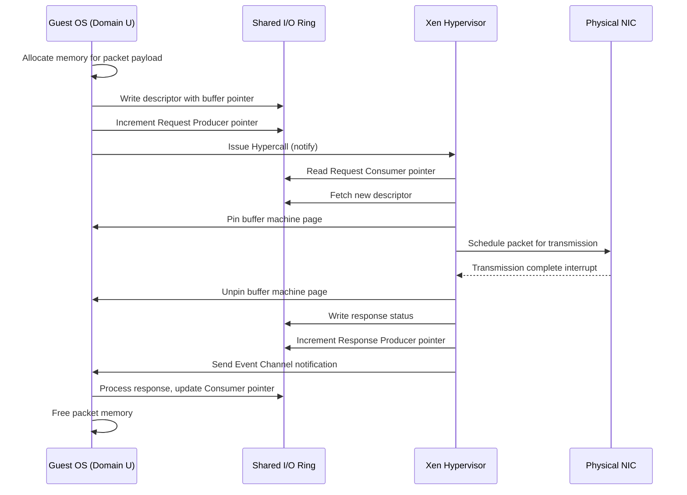

# L03c CPU and Device Virtualization

> [!summary] TL;DR
> Virtualizing the CPU and I/O devices requires giving each guest operating system the illusion of owning the underlying hardware while ensuring safety and isolation.
> CPU virtualization relies on time-sharing the physical CPU and safely handling program discontinuities, such as exceptions and system calls, often through binary translation or paravirtualization.
> Device virtualization must efficiently handle both control and data transfer, avoiding the overhead of copying data across protection boundaries by using shared memory mechanisms like asynchronous I/O rings.

## Learning outcomes

- Explain the mechanisms used to virtualize the CPU and I/O devices.
- Compare full virtualization and paravirtualization approaches to handling program discontinuities.
- Illustrate how control and data transfer occur between a guest OS and the hypervisor in both virtualized environments.
- Analyze the design of Xen's asynchronous I/O rings and their impact on performance.
- Evaluate proportional-share and fair-share CPU scheduling policies in hypervisors.

## Motivation and the problem

Virtualizing memory is only one piece of the virtualization puzzle; the CPU and I/O devices must also be virtualized to provide a complete and isolated environment for guest operating systems.
The core challenge is that operating systems expect to interact with the CPU and devices directly, manipulating privileged state and executing privileged instructions.
If multiple guest OSes attempt to control the hardware simultaneously, the system will crash or leak data.
The hypervisor must intervene to multiplex these resources safely.
However, this intervention introduces overhead.
Safely and efficiently sharing the CPU requires careful scheduling and trap-and-emulate mechanisms.
Virtualizing I/O devices is even more difficult because devices have complex interfaces, require frequent interrupts, and transfer large amounts of data.
The goal is to provide isolation and the illusion of ownership without crippling performance through excessive context switches or memory copies.

## Core concepts

### CPU virtualization goals: illusion of ownership and fair sharing

<!-- coverage: L03c-01 -->
> [!note] Definition
> CPU virtualization is the process of time-multiplexing physical processors among multiple virtual machines such that each guest operating system believes it has continuous, exclusive use of one or more CPUs.

The primary goal of CPU virtualization is to provide each virtual machine with the illusion that it fully owns the processor.
The hypervisor achieves this by allocating a certain amount of CPU time to each VM and context-switching between them.
The hypervisor generally does not inspect how the guest OS utilizes the CPU during its allocated timeslice; the guest's internal process scheduler remains responsible for its own threads.
Another crucial goal is fair sharing, meaning the hypervisor must ensure that all VMs receive their appropriate allocation of CPU cycles according to administrative policies.
A challenge arises when a guest OS spends CPU time handling events (like interrupts) on behalf of the hypervisor or other VMs.
To maintain fairness, the hypervisor must accurately account for this time and compensate the guest OS, ensuring that it is not penalized for performing system-level work.

### Proportional-share and fair-share CPU schedulers

<!-- coverage: L03c-02 -->
> [!note] Definition
> Proportional-share and fair-share are CPU scheduling policies used by hypervisors to allocate physical CPU cycles among competing virtual machines based on weights or equal distribution.

The hypervisor must decide which virtual machine gets to run on the physical CPU at any given moment.
Two common scheduling policies are proportional-share and fair-share.
In a proportional-share policy, each VM receives a share of the CPU that is proportional to a weight assigned to it, or sometimes proportional to the number of active processes running inside it.
This allows administrators to prioritize critical VMs by giving them higher weights.
In a fair-share policy, the hypervisor attempts to give an equal share of the CPU to every running VM, regardless of its internal workload.
Xen, for instance, uses Borrowed Virtual Time (BVT), which aims for fair sharing but allows latency-sensitive domains to temporarily "borrow" time to reduce dispatch latency.
By adjusting these scheduling parameters, the hypervisor can provide performance isolation, ensuring that a misbehaving or CPU-bound guest does not starve other VMs of processor time.

### Handling program discontinuities: exceptions, syscalls, page faults, interrupts

<!-- coverage: L03c-03 -->
> [!note] Definition
> Program discontinuities are events that disrupt the normal flow of instruction execution, such as hardware interrupts, software exceptions, page faults, and system calls, requiring hypervisor intervention.

When a program running inside a guest OS triggers a discontinuity, the event must be handled safely.
In a non-virtualized system, the hardware traps directly to the OS kernel.
In a virtualized system, these traps are intercepted by the hypervisor.
The hypervisor packages these discontinuities as software interrupts and delivers them to the appropriate guest OS.
This process is complex because the guest OS expects to execute privileged instructions to handle the event.
In a fully virtualized environment running on uncooperative hardware (like older x86), some privileged instructions fail silently instead of trapping.
The hypervisor must use binary translation to dynamically rewrite the guest's code, inserting explicit traps to ensure control returns to the hypervisor.
In a paravirtualized environment like Xen, the guest OS is modified to run at a lower privilege level (ring 1) and registers exception handler tables with the hypervisor.
Xen allows "fast" system calls where applications trap directly to the guest OS, avoiding the hypervisor entirely, but page faults must pass through Xen to securely read the faulting address.

### Device virtualization in full virtualization

<!-- coverage: L03c-04 -->
> [!note] Definition
> Device virtualization in a fully virtualized system involves the hypervisor emulating the exact hardware registers and behaviors of specific physical devices to an unmodified guest OS.

In full virtualization, the guest operating system operates under the assumption that it has exclusive access to physical I/O devices, using standard device drivers to interact with them.
For control transfer from the guest to the hypervisor, any attempt by the guest to read or write to memory-mapped I/O registers or I/O ports results in a trap.
The hypervisor intercepts this trap, decodes the instruction, and updates the internal state of the emulated device.
For control transfer from the hypervisor to the guest, the hypervisor emulates device hardware interrupts, injecting them into the guest's virtual interrupt controller.
Data transfer occurs implicitly as a side effect of these emulated control operations.
This approach is highly compatible, allowing unmodified OSes to run, but it incurs a massive performance overhead.
Every single I/O register access requires a costly trap and context switch into the hypervisor, making full virtualization unsuitable for high-throughput network and disk I/O.

### Device virtualization in para-virtualization

<!-- coverage: L03c-05 -->
> [!note] Definition
> Device virtualization in a paravirtualized system replaces emulated hardware with simplified, idealized virtual device interfaces that the guest OS accesses via hypercalls and shared memory.

Paravirtualization discards the goal of emulating specific physical devices.
Instead, the guest OS is modified to include paravirtualized device drivers that communicate directly with the hypervisor using a streamlined interface.
The guest OS is fully aware that it is running in a virtualized environment and does not attempt to directly access physical hardware registers.
This approach significantly reduces the overhead of virtualization.
The hypervisor provides access to a set of generic virtual devices (like a generic block device or network interface).
Because the interface is designed specifically for software interaction rather than physical wire signaling, it avoids the numerous traps required to emulate hardware state machines.
The hypervisor must still account for the CPU time spent multiplexing the underlying physical devices and routing data to the appropriate virtual machines, but the per-operation cost is drastically lower than in full virtualization.

### Control transfer: hypercalls and software interrupts (event channels)

<!-- coverage: L03c-06 -->
> [!note] Definition
> Control transfer in paravirtualization relies on hypercalls for synchronous requests from the guest to the hypervisor, and software interrupts (event channels) for asynchronous notifications from the hypervisor to the guest.

Control transfer mechanisms must bridge the privilege gap between the guest OS and the hypervisor efficiently.
When a paravirtualized guest needs to perform a privileged operation or initiate I/O, it issues a hypercall.
A hypercall is a synchronous software trap, analogous to a system call, that securely transfers control to the hypervisor.
The hypervisor validates the request, executes it, and returns control to the guest.
Conversely, when the hypervisor needs to notify the guest of an event, such as an I/O completion or a virtual timer expiration, it uses an asynchronous event mechanism.
Xen implements this using event channels, which act as lightweight software interrupts.
Pending events are recorded in a bitmap shared between the hypervisor and the guest.
The hypervisor updates the bitmap and optionally invokes a callback handler registered by the guest OS.
The guest can also explicitly mask these events (similar to disabling interrupts) to defer handling during critical sections.

### Data transfer in Xen: asynchronous I/O rings

<!-- coverage: L03c-07 -->
> [!note] Definition
> Asynchronous I/O rings are shared memory circular buffer structures used in Xen to transfer data efficiently between a guest OS and the hypervisor without copying.

To minimize the overhead of moving data across protection domains, Xen avoids explicit data copying between the guest OS and the hypervisor.
Instead, data transfer relies on asynchronous I/O rings residing in memory shared between the guest and Xen.
An I/O ring contains descriptors that point to the actual data buffers allocated by the guest OS.
The ring is managed using shared producer and consumer pointers.
To initiate an I/O request, the guest OS places a descriptor in the ring, updates the request producer pointer, and issues a hypercall.
Xen reads the descriptor, processes the request, and eventually places the response in the same ring, updating the response producer pointer and sending an event notification.
Because the descriptors only contain pointers to machine pages, the underlying data buffers are never copied.
Xen protects these buffers by pinning the underlying page frames during the transfer, ensuring safety without the cost of data duplication.

### Network and disk virtualization in Xen

<!-- coverage: L03c-08 -->
> [!note] Definition
> Xen virtualizes networks and disks by providing each guest with pairs of I/O rings for transmission and reception, processing requests from all domains using internal scheduling algorithms.

In Xen, each virtual network interface has two I/O rings: one for transmission (Tx) and one for reception (Rx).
To transmit a packet, the guest OS enqueues a descriptor pointing to the packet buffer in the Tx ring and issues a hypercall.
Xen uses a round-robin scheduler to service the Tx rings of all active domains, ensuring fair access to the physical network card.
For reception, the guest OS provides empty page frames in the Rx ring.
When a physical packet arrives, Xen determines the destination domain, copies the packet into one of the provided page frames (or swaps the page frame entirely if the packet is a full page), and updates the Rx ring.
Disk virtualization operates similarly with a virtual block device (VBD) ring.
Xen batches and reorders disk requests from multiple domains to optimize physical disk access patterns, translating virtual disk offsets to physical sectors while enforcing access control policies.

### Modern descendants: virtio and SR-IOV

<!-- coverage: L03c-09 -->
> [!note] Definition
> Virtio is a standardized paravirtualized device standard, while SR-IOV (Single Root I/O Virtualization) is a hardware extension that allows a single PCIe device to appear as multiple separate physical devices.

The principles established by Xen's paravirtualized I/O rings evolved into virtio, the standard for network and disk device virtualization in modern hypervisors like KVM.
Virtio defines standard shared-memory ring queues (virtqueues) and a common protocol for interacting with block, network, and balloon devices, allowing a single guest driver to work across different hypervisors.
For workloads requiring line-rate network performance (such as 100 Gbps Ethernet), even virtio introduces too much overhead.
Modern systems rely on SR-IOV, a hardware capability where the physical network interface card (NIC) exposes multiple Virtual Functions (VFs).
The hypervisor maps a VF directly into the guest OS's memory space using IOMMU hardware.
The guest OS interacts directly with the physical NIC through the VF, completely bypassing the hypervisor for the data path, achieving near-native performance while the hypervisor retains control over configuration via the Physical Function (PF).

## Mechanisms step by step

Here is the process of a guest OS transmitting a network packet via Xen's asynchronous I/O rings.

1. **Preparation**: The guest OS constructs the network packet in its own memory.
2. **Enqueue**: The guest writes a descriptor containing the physical address of the packet buffer into the Tx I/O ring.
3. **Notify**: The guest updates the shared request producer pointer and issues a hypercall to alert Xen.
4. **Fetch**: Xen reads the ring, finds the new descriptor, and pins the associated machine page to prevent the guest from unmapping it during transfer.
5. **Transmit**: Xen passes the buffer to the physical NIC driver for transmission.
6. **Completion**: Upon successful transmission, the NIC interrupts Xen.
7. **Response**: Xen unpins the page, writes a completion response into the I/O ring, and updates the response producer pointer.
8. **Event**: Xen sets a bit in the guest's event bitmap and invokes the event callback to notify the guest.
9. **Cleanup**: The guest processes the response and reclaims the memory used by the packet.

## Worked examples

**Example 1: CPU Scheduling Fairness**

Suppose a hypervisor uses a proportional-share scheduler with a total slice period of 100 ms.
There are three virtual machines: VM-A with weight 50, VM-B with weight 30, and VM-C with weight 20.
Total weight = 50 + 30 + 20 = 100.
- VM-A receives (50 / 100) * 100 ms = 50 ms of CPU time per period.
- VM-B receives (30 / 100) * 100 ms = 30 ms of CPU time per period.
- VM-C receives (20 / 100) * 100 ms = 20 ms of CPU time per period.

If VM-A blocks for I/O after using only 10 ms, the remaining 40 ms is redistributed proportionally between the runnable VMs (B and C).
Their relative weights are 30 and 20 (total 50).
- VM-B gets an extra (30 / 50) * 40 ms = 24 ms.
- VM-C gets an extra (20 / 50) * 40 ms = 16 ms.

**Example 2: Ring Buffer Capacity**

Consider an asynchronous I/O ring configured with a size of 256 descriptors.
Each descriptor is 16 bytes.
Total ring size = 256 * 16 = 4096 bytes (exactly one 4KB page).
If the guest OS enqueues requests faster than Xen processes them, the Request Producer pointer advances.
If the Request Producer wraps around and catches up to the Response Producer pointer, the ring is full, and the guest must block or drop requests.
The maximum number of outstanding requests is 255 (to distinguish full from empty).

## Comparison

| Feature | Full Virtualization | Paravirtualization (Xen) | SR-IOV (Hardware Assisted) |
| :--- | :--- | :--- | :--- |
| **Guest OS Modifications** | None required (runs unmodified OS). | Extensive modifications required to the kernel. | Requires specific VF device driver in the guest. |
| **CPU Discontinuities** | Trap-and-emulate or binary translation. | Hypercalls and registered exception handlers. | Hypercalls and hardware virtualization extensions (VT-x). |
| **Device Model** | Emulates specific legacy hardware (e.g., NE2000). | Idealized generic virtual devices (e.g., VIF, VBD). | Direct access to physical hardware slices (Virtual Functions). |
| **Data Transfer Overhead** | Very high (traps on every MMIO access). | Low (shared memory rings, no data copies). | Near zero (direct DMA from guest memory to NIC). |
| **Use Case** | Legacy operating systems, proprietary software. | High-performance environments where OS source is available. | Maximum I/O throughput environments (10GbE+ networks). |

## Paper deep dives

- [Xen and the Art of Virtualization](../Papers/L03-Xen.md)
This paper presents the design of the Xen hypervisor, focusing on paravirtualization to achieve high performance and secure isolation.
By requiring the guest operating system to be modified, Xen avoids the extreme overheads associated with fully virtualizing the x86 architecture.
The authors detail the mechanisms for memory management (guest-managed page tables validated by Xen), CPU virtualization (running the guest in ring 1 and using hypercalls), and the asynchronous I/O ring structures that enable high-throughput device virtualization.
The paper demonstrates that a paravirtualized system can scale to host many virtual machines with near-native performance.

- [Memory Resource Management in VMware ESX Server](../Papers/L03-VMware-ESX-Memory.md)
While primarily focused on memory, this paper is crucial for understanding the context of full virtualization.
It details how VMware ESX Server manages resources without requiring guest OS modifications.
The paper highlights the complexities of trap-and-emulate architectures and introduces mechanisms like the balloon driver (a pseudo-device driver installed in the guest) to reclaim memory.
It contrasts heavily with Xen's approach by demonstrating the lengths to which a hypervisor must go to infer guest OS behavior when it cannot rely on explicit paravirtualized cooperation.

## Modern descendants

The concepts pioneered by early hypervisors like Xen have evolved into standard components of modern cloud infrastructure.
- **virtio**: Xen's paravirtualized I/O rings directly inspired the virtio standard, which is now the default I/O virtualization framework in KVM and QEMU.
- **Hardware Virtualization (Intel VT-x, AMD-V)**: Modern CPUs include explicit support for virtualization, eliminating the need for complex binary translation or the ring 1 paravirtualization tricks used by early Xen.
The hypervisor runs in VMX Root mode, while guests run unmodified in VMX Non-Root mode.
- **SR-IOV and IOMMU**: For extreme device performance, Single Root I/O Virtualization allows a PCIe device to present itself as multiple Virtual Functions, which are mapped directly into guest memory using an IOMMU, bypassing the hypervisor entirely for the data path.
- **Unikernels**: Systems like MirageOS take paravirtualization to its logical extreme, compiling a single application directly against a library OS that interfaces directly with hypervisor ring buffers, resulting in tiny, highly secure, single-address-space virtual machines.

## Pitfalls and exam traps

> [!warning] Pitfalls
> - **Assuming paravirtualization requires ABI changes**: It requires OS kernel changes, but the Application Binary Interface (ABI) remains identical.
> Unmodified user-space applications (like Apache or a database) run perfectly on a paravirtualized guest kernel.
> - **Confusing hypercalls with system calls**: An application makes a system call to trap into the guest OS.
> The guest OS makes a hypercall to trap into the hypervisor.
> They are distinct boundaries.
> - **Thinking full virtualization is always slower**: While traditionally true due to trap-and-emulate overheads, modern hardware virtualization extensions (VT-x) make full CPU virtualization nearly as fast as paravirtualization.
> The major performance difference now lies in device I/O, where paravirtualized drivers (virtio) are still required for high performance unless SR-IOV is used.
> - **Data copying in Xen rings**: A common trap is to think Xen copies the data payload into the I/O ring.
> The ring only contains *descriptors* (pointers).
> The actual payload remains in the guest's memory, and Xen maps or pins that memory.

## Practice

- [Practice L03](../Practice/Practice-L03.md)

## Lab

- [lab-03-virtualization](../labs/lab-03-virtualization/README.md): KVM and libvirt by hand: lifecycle, vCPU pinning, ballooning, and KSM page sharing

## Further reading

- [Virtualization in the x86 Architecture (Intel)](https://www.intel.com/content/www/us/en/virtualization/virtualization-technology/intel-virtualization-technology.html)
- [Virtio: Towards a De-Facto Standard for Virtual I/O Devices](https://dl.acm.org/doi/10.1145/1400097.1400108)
- [Kernel-based Virtual Machine (KVM) Documentation](https://www.kernel.org/doc/html/latest/virt/kvm/index.html)
