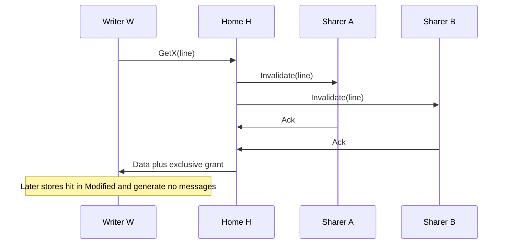

# L04a Shared Memory Machines

> [!summary] TL;DR
> A shared-memory machine lets every processor name every memory location, but the wires that implement that fiction decide latency, coherence traffic, and how expensive a spin loop is.
> Dance-hall machines put all memory equally far from every CPU, an SMP hangs uniform memory off one bus, and a hardware DSM (distributed shared memory) puts a slice of memory next to each CPU.
> A memory consistency model is the cross-address contract the programmer may rely on.
> Cache coherence is the single-address mechanism that keeps private caches from violating that contract.
> Scalable locks and scalable OS structures exist because a bus, and a dance-hall home, stop scaling long before the CPUs do.

## Learning outcomes

- Draw dance-hall, SMP, and hardware-DSM organizations and state which distance is uniform.
- State Lamport sequential consistency as program order plus one total order, and apply it to a two-address litmus.
- Separate cache coherence (one address) from memory consistency (many addresses).
- Compare write-invalidate and write-update on a counted bus trace, including when each protocol wins.
- Explain why a non-cache-coherent machine pushes coherence into software, and why a dance-hall layout makes local spinning impossible.
- Name the C11 atomic orders and say which real machines (x86 TSO, ARM) already provide more than `memory_order_relaxed`.

## Motivation and the problem

Parallel programs on a shared-memory machine communicate by writing and reading the same addresses.
That programming model is attractive because a lock, a barrier flag, and a shared counter look like ordinary variables.
The hardware bill for the illusion shows up in three places: how far a given address is, what happens to private caches when that address is written, and which reorderings of different addresses the programmer is allowed to observe.
Those three questions are the whole of this note.
Later notes hang locks, barriers, LRPC, scheduling, and the OS itself on the answers.
If the interconnect treats every shared location as remote, then a spinning waiter burns the network.
If caches are private and not coherent, software must flush and invalidate or the lock flag is a lie.
If the consistency model is weaker than sequential consistency, a "correct" lock written as ordinary loads and stores can fail even when the coherence protocol is perfect.

## Core concepts

### Dance hall architecture

<!-- coverage: L04a-01 -->

> [!note] Definition
> A dance-hall machine places the processors on one side of an interconnection network and the memory modules on the other.
> Every processor can name every location, and every location is reached by a trip across that network.

The lecture draws the CPUs in one row and the memory banks in the other, with the network between them.
There is no memory module that is physically next to a CPU.
A load or store of a shared address is therefore a network transaction no matter which CPU issues it, and a spin loop on a shared flag is a stream of those transactions.
Mellor-Crummey and Scott use this layout as the cautionary case in their 1991 synchronization paper: if every flag is equally far from every processor, you cannot implement the "spin on a locally accessible flag" trick that makes their locks and barriers scale.
The architecture can still be a uniform-memory-access machine, because the distance does not depend on which CPU asks.
Uniform and far is a worse deal than uniform and close, and it is a much worse deal than "most references are to the memory on my own board."
Dance hall is an architectural shape, not a consistency model.
You can build sequential consistency on top of it, and you can attach private caches to the CPUs, but the caches do not create a local home for an arbitrary shared address unless the coherence protocol happens to hold the line.
The name is only a picture of the floor plan.
Do not confuse it with a dance-hall consistency model; there is no such thing.

### Symmetric multiprocessor (SMP) architecture

<!-- coverage: L04a-02 -->

> [!note] Definition
> An SMP connects the processors to memory through one shared bus (or a switch that behaves like one), so the access time from any CPU to memory is the same.
> Each CPU has a private cache.
> "Symmetric" means the operating system does not have to treat one CPU as the only one that can run kernel code or reach every device.

On a single bus the coherence protocol can be a snooper.
Every cache watches every transaction, so a write can invalidate or update the other copies without a directory lookup.
The Sequent Symmetry, one of the two machines in the MCS study, is this kind of machine: a cache-coherent bus SMP.
The symmetry is what a traditional Unix kernel wants.
Any CPU can take a timer interrupt, run the scheduler, and complete a system call, so the kernel does not grow a special "master processor" bottleneck.
The cost is the bus itself.
Every cache miss, every invalidate, and every uncached atomic (test-and-set, fetch-and-add, swap) consumes a bus cycle that nobody else can use.
A handful of CPUs hide this.
A few dozen CPUs, all spinning on one flag with test-and-set, saturate the bus and slow down even the CPUs that are doing useful work.
An SMP is the right picture for the locking algorithms that "spin on a cached read."
The line sits in the waiter's cache in Shared state, the spin hits locally, and the bus stays quiet until the holder writes the flag.
That optimization is false on a machine whose private caches are not coherent, and it is only half true on a dance-hall machine whose "local hit" still has to be invented by the protocol.

### Distributed shared memory (DSM) architecture

<!-- coverage: L04a-03 -->

> [!note] Definition
> In this lecture a DSM machine is hardware distributed shared memory.
> Each CPU (or small group of CPUs) has a local memory module attached to it, and it reaches other modules through the interconnect.
> Every address is still one name in one shared address space.

Local accesses hit the memory on the same board and do not cross the network.
Remote accesses pay the network, the directory (if the protocol has one), and often an extra hop to the home node that tracks sharers.
Private caches sit next to the CPUs here too.
The BBN Butterfly, the other machine in the MCS study, is the canonical teaching example: memory is physically distributed, there is no cache-coherence protocol of the snooping kind, and a location is local only if the software or the allocator placed it in the local module.
This is not the software DSM of TreadMarks (Lesson 7).
Software DSM pages memory across workstation NICs and uses page faults as the coherence events.
Hardware DSM (sometimes called a CC-NUMA machine when the caches are coherent, or a NUMA machine when the latencies differ) does the translation in the interconnect.
The lecture's point is the latency split, not the later software-DSM consistency tricks.
Placing a spin flag in local memory, or placing a queue node on the spinning CPU's own module, is how an MCS lock gets O(1) remote traffic on a machine with no coherent caches.
If the flag lives at a fixed global address in some other module, the spin is remote forever.
A dance-hall machine cannot make that placement choice.
A hardware DSM can, which is why the same paper that attacks dance-hall layouts is comfortable on the Butterfly.

### Memory consistency model

<!-- coverage: L04a-04 -->

> [!note] Definition
> A memory consistency model is the set of executions a programmer is allowed to observe.
> It answers, for a set of loads and stores issued by several processors, which return values and which final memory states are legal.

The model is a contract, not a circuit.
The hardware, the compiler, and the language runtime may each reorder, buffer, or coalesce operations, as long as every execution a program can actually see is one the model permits.
Programmers write locks and lock-free structures against that contract.
If they assume a stronger contract than the machine provides, the program is wrong even though every individual load and store "worked."
The lecture introduces the model before coherence on purpose.
Coherence is one implementation technique for one special case (a single address, in the presence of caches).
The model is the specification for every address together.
Two machines can be coherent and still disagree on whether the Dekker litmus (both processors see the other's flag as 0) is allowed.
That disagreement is a difference in consistency model.
Families you will meet later, but should not mix up here, include sequential consistency, total store order (the x86 model), processor consistency, weak ordering, and release consistency.
This note treats sequential consistency as the baseline the lecture defines, and the last section says what real languages actually give you.
A useful test when you read any model is to ask three questions.
Does it respect each processor's program order?
Does it require a single total order of all stores that every processor agrees on?
Are there explicit fence or special-access operations that recover a stronger order at synchronization points?
Sequential consistency answers yes, yes, and "no fences required."
Weaker models answer the first two with qualifications and rely on the third.

### Sequential consistency

<!-- coverage: L04a-05 -->

> [!note] Definition
> Sequential consistency (Lamport, 1979) requires that the result of an execution is the same as if the operations of all the processors were executed in some sequential order, and the operations of each individual processor appear in that sequence in program order.

The lecture splits the same definition into two bullets.
Program order: the memory accesses of one processor show up in the order that processor issued them.
Arbitrary interleaving: operations from different processors may be merged in any way, so the programmer cannot assume a particular interleaving, only that some interleaving exists and that it respects each processor's own order.
"Arbitrary" is a statement about what you must be prepared for, not permission for the hardware to violate program order.
A common exam trap is to read the slide as "the machine may reorder one processor's accesses."
Under sequential consistency it may not, or rather it may reorder internally only when the result is indistinguishable from a legal interleaving.

The standard two-address litmus makes the rule concrete.
Initially `x = y = 0`.

```text
P1: x = 1        P2: y = 1
    r1 = y           r2 = x
```

Sequential consistency forbids the outcome `r1 == 0 && r2 == 0`.
In any total order that respects program order, P1's store of `x` stands before P1's load of `y`, and P2's store of `y` stands before P2's load of `x`.
If P1's store is first in the total order, P2's later load of `x` must see 1.
If P2's store is first, P1's later load of `y` must see 1.
The outcome where each load happens "before" the other processor's store in real time, because of a store buffer, is exactly the execution a store buffer produces and sequential consistency bans.
x86 allows that outcome.
x86 is TSO, not sequential consistency: a load may pass an earlier store to a different address that is still sitting in the store buffer.
A sequentially consistent implementation must drain or snoop that buffer before the load returns, or the litmus fails.
That drain is why "SC is the intuitive model" and "SC is the cheap model" are different claims.
The intuition is free.
The implementation on a machine with caches, store buffers, and an out-of-order core is not.

### Memory consistency versus cache coherence

<!-- coverage: L04a-06 -->

> [!note] Definition
> Cache coherence is the single-address property: for any one location, there is a total order of the writes to that location, and a read returns the value of the last write in that order (eventually, and immediately if the reader is the writer).
> Memory consistency is the multi-address property: which interleavings of accesses to different locations are legal.

The lecture's line is that coherence is how a machine with private caches implements its consistency model.
That is the right relationship, and it is worth unpacking because exams treat the two words as synonyms.
They are not.
Coherence does not mention two different addresses.
The Dekker litmus can fail on a machine whose caches are perfectly coherent, because each processor's store buffer drains the two stores in an order the other processor does not see yet.
Nothing about the coherence protocol for `x` looks at `y`.
Consistency does not require caches.
A machine with no caches at all still has a consistency model, because the network can still reorder two writes that are headed at different homes.
A useful slogan is "coherence is per line, consistency is per program."
The single-writer-multiple-reader invariant (a line is either in one cache in a writable state, or in many caches in a read-only state) is a coherence invariant.
Program order across a flag store and a data store is a consistency invariant.
Release consistency and acquire/release atomics exist to restore just enough of the consistency invariant at synchronization points without paying for full sequential consistency on every ordinary load and store.
When you read a paper that says "the machine is cache-coherent," do not import sequential consistency for free.
The Sequent Symmetry is coherent and still has a memory model.
The programmer-visible model of a modern x86 PC is TSO even though MESI (or a descendant) makes each line coherent.
Write the two words in the exam answer as if they were different mechanisms, because they are.

### Non-cache-coherent multiprocessors

<!-- coverage: L04a-07 -->

> [!note] Definition
> A non-cache-coherent (NCC) multiprocessor gives every CPU a shared address space and a private cache, and then refuses to keep those caches coherent in hardware.
> Software decides when a cached copy is stale and when a write must be pushed out to the memory that other CPUs actually read.

The shared names still work.
If CPU 0 stores to address A and CPU 1 loads A, and both loads and stores go all the way to memory, CPU 1 sees the store.
The bug appears when CPU 1's load hits a stale line in its private cache, or CPU 0's store sits in its cache and never becomes visible.
Software fixes that with explicit cache operations around communication: write back (flush) the lines you published, and invalidate the lines you are about to consume.
Synchronization libraries on an NCC machine wrap those operations inside lock acquire, lock release, and barrier completion.
Application code that shares data only through those libraries can pretend the machine is coherent.
Application code that shares data with bare stores cannot.
The BBN Butterfly is the teaching NCC machine in this course.
A spin flag is local only when it is allocated in the spinning processor's own memory module.
There is no snooping bus that will quietly move the line into the spinner's cache and keep it there.
That is why the MCS lock, which allocates the queue node in the spinner's local memory and has the predecessor write that node, works on the Butterfly as well as on the Symmetry.
A test-and-set loop on a single global flag does not.
NCC is also why some of the barrier algorithms in [L04c](L04c-Barrier-Synchronization.md) are specified with "the flag lives in the consumer's memory."
On a coherent machine the same algorithm is merely an optimization.
On an NCC machine it is the difference between a local spin and a network storm.
Do not describe an NCC machine as "having no caches."
The lecture's point is that the caches are private and software-managed.
The machine still has them, and they still make repeated local accesses cheap once software has made the line local.

### Cache-coherent multiprocessors

<!-- coverage: L04a-08 -->

> [!note] Definition
> A cache-coherent (CC) multiprocessor keeps a single-writer-multiple-reader invariant in hardware.
> A write is either propagated to the other caches that hold the line, or those caches are told to drop it, before (or as) the write becomes visible under the consistency model.

Snooping protocols fit a bus or a small SMP, because every cache can see every transaction.
Directory protocols fit a hardware DSM, because a home node records the sharer set and sends point-to-point invalidations instead of broadcasting.
Both are cache-coherent.
They differ in where the traffic goes, not in the contract they offer for a single address.
The states you should be able to walk are the MESI family.
Modified: this cache is the only owner and the line is dirty.
Exclusive: this cache is the only owner and the line is clean.
Shared: zero or more caches hold a clean copy.
Invalid: this cache does not hold the line.
A store in Shared or Invalid state must obtain Modified (or Exclusive, then Modified) before it retires.
That upgrade is the bus or directory transaction a lock release pays when it stores the flag.
A spin loop that only loads a Shared line generates no transactions at all, which is the entire performance idea of the "spin on read" lock in [L04b](L04b-Synchronization.md).
Coherence does not make the interconnect free.
It concentrates the cost into the moments when a line changes writers, which is exactly the moment a contended lock changes hands.
A coherent machine can still be a dance-hall machine.
Coherence gives you a local copy after the first miss, but the first miss and every later invalidate still cross the network to a distant home.
A coherent hardware DSM plus careful placement is the combination that actually scales: the directory tracks sharers, and the spinning CPU's flag line lives in its own memory so the steady-state spin does not.

### Write-invalidate versus write-update

<!-- coverage: L04a-09 -->

> [!note] Definition
> Write-invalidate: on a write, the hardware tells every other cache that holds the line to drop it.
> The writer then owns the line and later writes hit locally.
> Write-update: on a write, the hardware sends the new value to every other cache that holds the line, so those copies stay valid.

Invalidate wins when one CPU writes the line many times before anyone else reads it, and when lines bounce between writers (migratory data: a lock, a counter, a queue tail).
The first write pays an invalidation.
The rest of the writer's run is silent.
Update wins when many CPUs repeatedly read a line that is rarely written, and when the alternative would be a burst of read misses after each invalidate.
Update loses when the line is written often, because every store becomes a broadcast for the whole sharer set, including stores whose new value nobody needed yet.
Update also consumes bus bandwidth proportional to the number of writes times the number of sharers.
Invalidate consumes bandwidth proportional to the number of times the writer changes, which for a single writer is one.
The lecture states both protocols as broadcasts on a system bus.
On a directory machine the same choice exists, but the "broadcast" is a loop over the sharer list.
False sharing, covered in [L04f](L04f-Shared-Memory-Multiprocessor-OS.md), punishes invalidate harder than people expect: two CPUs writing different words of the same line invalidate each other on every store, even though the program never shares a variable.
Update would keep both words live, at the price of broadcasting both stores.
Real machines picked invalidate (MESI and its descendants) because migratory data and write runs are the common case, and because an update protocol has to say what happens to a write that arrives at a full cache.
The worked example below puts numbers on both protocols so the comparison is not a slogan.

### Scalability of shared memory machines

<!-- coverage: L04a-10 -->

> [!note] Definition
> A shared-memory machine scales when adding CPUs adds throughput for the workload you actually run, rather than adding only contention.
> The walls are the bus or the network, the home node or directory of a hot line, the lock that protects a kernel structure, and the extra latency of a remote miss.

An SMP bus is the clearest wall.
If one transaction takes T bus cycles, the bus supplies 1/T transactions per cycle no matter how many CPUs you attach.
Once the offered load exceeds that, every miss gets slower, and a test-and-set spin can consume the entire bus by itself.
A hardware DSM moves the wall out.
Local hits do not cross the network, different homes serve different addresses in parallel, and a directory sends invalidations only to sharers.
The new walls are the hot home (every lock tail that lives in one module), the diameter of the network, and the software that accidentally shares one cache line across many CPUs.
Dance-hall placement brings the wall back, because it deletes the local hit.
This is the MCS paper's architectural conclusion, and it is the reason Tornado, Corey, and Cellular Disco (all in [L04f](L04f-Shared-Memory-Multiprocessor-OS.md)) obsess over locality of kernel objects.
Scalability is a property of a workload plus a machine, not of a machine alone.
A perfectly partitioned scientific code scales on a large CC-NUMA box.
A kernel with one global page-table lock does not, even on the same box.
When you are asked "does shared memory scale?" the honest answer is: the addressing model can, the bus-based implementation cannot, and the OS and the synchronization library decide which one you actually get.
Count remote transactions per operation, not CPUs per cabinet.
An algorithm that does O(1) remote transactions per lock acquire keeps working as the CPU count grows.
An algorithm that does O(n) remote transactions per acquire stops, and it stops earlier on a bus than on a network.

### Modern descendants: weak memory models and C11 atomics

<!-- coverage: L04a-11 -->

> [!note] Definition
> A weak memory model lets the hardware and the compiler reorder ordinary accesses, and requires an explicit atomic or fence when the programmer needs program order to be visible to another CPU.
> C11 and C++11 encode that contract as atomic operations with a memory order, rather than as a single sequentially consistent machine.

The orders you should be able to rank, from strongest to weakest, are `memory_order_seq_cst`, `memory_order_acq_rel` (and the split `acquire` / `release` pair), and `memory_order_relaxed`.
`seq_cst` gives a single total order of all sequentially consistent atomics, which is what most textbook locks assume.
`release` on a store and `acquire` on a load form a pair: if the acquire reads the value the release wrote, everything before the release happens-before everything after the acquire.
That is exactly the publication pattern of a lock-free queue or of "store the data, then store the flag."
`relaxed` guarantees atomicity of the location and nothing about other locations.
It is the right order for a pure counter statistic, and the wrong order for a flag that publishes a buffer.
x86 hardware is TSO.
It already forbids reordering stores with older stores, and loads with older loads, but it allows a load to pass an older store to a different address.
Mapping `seq_cst` to x86 costs a fence (or an `xchg`) that TSO does not give you for free.
Mapping `acquire` and `release` to x86 is almost free, because TSO is already that strong.
ARM and RISC-V are weaker.
A store-release and a load-acquire are real instructions or instruction pairs there, and a relaxed atomic is a plain access with no barrier.
The Linux kernel does not speak C11 in the core, but it implements the same ideas: `smp_store_release`, `smp_load_acquire`, `smp_mb`, `smp_rmb`, and `smp_wmb`, plus `READ_ONCE` and `WRITE_ONCE` to stop the compiler from splitting or deleting an access.
Two traps matter for this course.
First, a coherent MESI machine plus a C compiler that reorders ordinary stores will still fail the publication pattern unless the flag store is an atomic release.
Coherence is not a compiler barrier.
Second, `memory_order_consume` was an attempt to make dependent reads cheap on ARM, and in practice compilers implement it as `acquire`.
Do not build a design on consume.
The lecture's sequential consistency is the model you use to understand the algorithms.
The C11 orders are the model you use to write them on hardware that is not sequentially consistent.

## Mechanisms step by step

A directory write-invalidate on a four-node hardware DSM runs as follows.
The line's home is node H.
The sharer set is {A, B}.
The writer is W, and W is not a sharer.
H is not a sharer either.



Step by step:

1. W cannot store until it holds the line in Modified.
   It sends one request to the home.
2. The home looks up the sharer vector, finds A and B, and sends one invalidation to each.
3. A and B drop the line and each return an acknowledgement.
   The home waits for both, because the consistency model must not let a later read by A still see the old value once W's store is visible.
4. The home sends the data and the exclusive ownership to W, and records the sharer set as {W} in Modified.
5. W's next stores to the same line retire in the core and do not touch the network, until some other node requests the line.

That is six messages for the ownership change, then zero messages for a run of local stores.
A write-update variant of the same step replaces the two invalidations with two data updates, and A and B keep the line.
The next read by A is then local, and the next store by W is another pair of updates.
The mechanism is the same directory.
Only the payload and the end state of the sharers change.

## Worked examples

### Example 1: eight stores, one writer, four snooping caches

Assumption: a snooping bus, one line, four CPUs.
All four caches already hold the line Shared.
CPU 0 then stores to the line 8 times, and nobody else touches it.

Write-invalidate.
The first store issues one bus upgrade that invalidates the other three caches.
Stores 2 through 8 hit in Modified and generate no bus transaction.
Bus transactions = 1.

Write-update.
Each of the 8 stores broadcasts the new word.
Bus transactions = 8.

The ratio on this write run is 8 / 1 = 8.
Invalidate is eight times cheaper here because the extra stores are silent.

### Example 2: eight migratory stores, round robin

Same bus, same four CPUs.
The store order is CPU0, CPU1, CPU2, CPU3, and then the same four again, one store each.
Assumption: one bus transaction both invalidates the previous owner and returns the line (a cache-to-cache transfer counted as a single bus occupancy).

Write-invalidate.
Every store finds the line in another cache, so every store pays one transaction.
Bus transactions = 8.

Write-update.
Every store still broadcasts.
Bus transactions = 8.

The counts match.
The difference is what the other caches can do afterward.
Invalidate left them with no copy, so a read of the line by CPU 0 after CPU 1's store is a miss.
Update left them with the new value, so that read hits, and the price was paid on every store whether or not anyone was going to read.
For a lock word or a ticket counter, which is written and not widely read between writes, invalidate is the better protocol.
For a sensor value published once and read by many CPUs, update (or, in practice, one invalidate plus many Shared reads) is the better shape.
MESI implements the second shape without an update protocol: one write, then many cached reads, until the next write.

### Example 3: directory message count

Use the four-node scenario from the mechanism section.
Home H, sharers A and B, writer W, one write that changes ownership.

Messages: 1 request + 2 invalidations + 2 acks + 1 data grant = 6.
Check: 1 + 2 + 2 + 1 = 6.
A second store by W, while W still holds Modified, adds 0 messages.
Two ownership changes of this shape add 12 messages.
If a careless algorithm invalidates on every one of 8 stores by ping-ponging the line, the bill is 8 x 6 = 48 messages on this directory, against 6 messages for a write run that stays on W.
That factor of 8 is the same factor as Example 1, moved from a bus to a directory.
It is also why a lock that bounces a single flag among n waiters costs O(n) transactions per handoff, which is the problem [L04b](L04b-Synchronization.md) exists to fix.

## Comparison

| Organization | Where memory sits | Latency shape | Coherence style that fits | What a spin loop costs |
| --- | --- | --- | --- | --- |
| Dance hall | All modules across the network from all CPUs | Uniform and remote | Possible, but every miss is remote | Cannot be made local by placement |
| SMP (bus) | One memory, one bus | Uniform and close until the bus saturates | Snooping invalidate (MESI) | Free while the line is Shared; a burst on release |
| Hardware DSM | A module next to each CPU | Local is cheap, remote is not | Directory, invalidate in practice | Local if the flag lives in local memory or a local cache |
| NCC multiprocessor | Often distributed | Local only for addresses placed locally | None in hardware | Remote unless software placed the flag locally |
| Software DSM (Lesson 7, not this lecture) | Other machines' DRAM, via the NIC | Page-fault granularity | Software, page based | Not the model these locks assume |

| Protocol | Traffic on a write run of W stores by one CPU | Traffic when the writer changes every store | Readers after a write |
| --- | --- | --- | --- |
| Write-invalidate | 1 ownership transaction, then silence | One transaction per store | Miss once, then hit until the next write |
| Write-update | W broadcasts | W broadcasts | Hit, if they kept the line |

## Paper deep dives

[Algorithms for Scalable Synchronization on Shared-Memory Multiprocessors](../Papers/L04-MCS-Scalable-Synchronization.md) is the paper that turns this lecture into a design rule.
Mellor-Crummey and Scott show that busy-waiting need not create interconnect contention, provided every waiter spins on a flag that is locally accessible, either because a coherent cache is holding it or because it was allocated in local memory on a machine like the Butterfly.
They measure on a cache-coherent bus SMP (the Sequent Symmetry) and on an NCC distributed-memory machine (the BBN Butterfly).
Their closing architectural claim is that scalable software synchronization weakens the case for special-purpose synchronization hardware, and that it argues against dance-hall organizations in which every shared location is equally far from every processor.
Read the paper note for the lock and barrier algorithms themselves.
The part that belongs to this lesson is the pair of machines and the dance-hall conclusion.

[Lightweight Remote Procedure Call](../Papers/L04-LRPC.md) is about same-machine cross-domain calls, but the costs it removes are memory-system costs.
A traditional local RPC copied arguments through the kernel and switched address spaces, which on the Firefly's C-VAX blew away the TLB.
LRPC's shared argument stack and handoff of the caller's thread are a bet that the common case is a local, cache-resident interaction rather than a network round trip.
The measured null call is 157 microseconds against a 109 microsecond lower bound set by traps and context switches, so 48 microseconds of that path is protocol rather than the memory hardware.
That split is the same kind of accounting this lesson asks for: how much of the cost is the interconnect and the TLB, and how much is the protocol you stacked on top.

[Using Processor-Cache Affinity Information in Shared Memory Multiprocessor Scheduling](../Papers/L04-Cache-Affinity-Scheduling.md) treats the private cache of an SMP as a scheduling resource.
Squillante and Lazowska's point, for this lesson, is that a cache is not just a coherence participant.
It is also a prediction that the same thread, run again on the same CPU, will hit.
Their partial reading (skip the queueing model) is the policy discussion in [L04e](L04e-Scheduling.md).
The architectural premise is the SMP with private caches from this note.

[Performance of Multithreaded Chip Multiprocessors and Implications for Operating System Design](../Papers/L04-Multithreaded-Chip-Multiprocessors.md) moves the same question inside one chip.
Fedorova, Seltzer, Small, and Nussbaum show that L1 miss rate can move a lot while IPC barely moves, and that L2 miss rate moves IPC.
The shared last-level cache of a chip multiprocessor is a new "bus": it is shared, it is closer than DRAM, and it saturates when the scheduler co-locates threads whose working sets do not fit.
The lesson's coherence story is about correctness of shared lines.
This paper is about capacity of a shared cache.
Both are reasons the OS cannot pretend CPUs are independent.

[Tornado: Maximizing Locality and Concurrency in a Shared Memory Multiprocessor Operating System](../Papers/L04-Tornado.md) takes the hardware-DSM picture as the given and rebuilds the kernel so that its own data structures have homes.
A clustered object has one name and a chosen number of representations, so a page-fault path on a 16-processor NUMAchine does not bounce one global lock across the interconnect.
The microbenchmark that matters here is the in-core page fault at 46 microseconds on one NUMAchine CPU, with slowdown staying modest as CPUs are added, against commercial kernels whose multithreaded page-fault paths fell over.
Tornado is what you get when you believe the scalability section of this note and then apply it to the OS.

[Corey: An Operating System for Many Cores](../Papers/L04-Corey.md) starts from a 16-core AMD machine whose topology is itself a small hardware DSM: cores share an L3 inside a chip and pay more to reach another chip's memory.
Boyd-Wickizer and coauthors show that a kernel structure the application did not need to share (file-descriptor tables, address-space metadata) becomes a coherence hot spot anyway.
Address ranges, shares, and kernel cores are the tools they give the application to say which lines should be shared.
The partial reading is sections 1, 2, 3, and 10.
For this lesson the useful claim is empirical: coherence traffic from accidental sharing dominates long before the interconnect's raw bandwidth does.

[Cellular Disco: Resource Management Using Virtual Clusters on Shared-Memory Multiprocessors](../Papers/L04-Cellular-Disco.md) puts a virtual-machine monitor on a 32-processor SGI Origin 2000, which is a cache-coherent hardware DSM, and then carves it into cells.
The goal is fault containment and resource management without giving up the shared-memory programming model inside a cell.
The partial reading is sections 1, 2, 3, and 8.
The number to remember is their claim that virtualization overhead stayed under 10 percent for most of the workloads they ran.
The architectural moral is that a large CC-NUMA machine is already a distributed system, and pretending it is one uniform SMP is how both faults and contention spread.

## Modern descendants

x86 PCs and servers are cache-coherent SMPs or multi-socket CC-NUMA machines.
The on-chip interconnect replaced the bus, but the contract is still MESI-family coherence plus TSO.
Intel's directory-like snoop filters and AMD's probe filters exist so that a 64-core socket does not broadcast every miss.
ARM servers (Neoverse, Graviton, and the rest) are coherent too, and their consistency model is weaker than TSO, which is why the C11 acquire and release mappings are not free there.
Hardware DSM as a product category won: multi-socket EPYC and Xeon machines are CC-NUMA, with local DRAM on each socket and a coherent interconnect between sockets.
Dance-hall floor plans did not survive as a product, which is the outcome Mellor-Crummey and Scott argued for.
Software DSM survived in a different niche (distributed runtimes, some research systems) and is Lesson 7, not the coherence protocol inside the socket.
The practical programmer-visible descendant of this whole lecture is the C and C++ memory model, plus the kernel's `smp_*` barriers.
If you can say which order you need, and you can count how many caches a write will invalidate, you have the skill this lesson is for.

## Pitfalls and exam traps

> [!warning] Coherence is not consistency
> A machine can be cache-coherent and still allow the Dekker outcome `r1 == r2 == 0`.
> Coherence orders writes to one address.
> Sequential consistency also orders accesses to different addresses inside one processor.
> If your answer uses the two terms interchangeably, it is wrong.

> [!warning] "Arbitrary interleaving" does not cancel program order
> Under sequential consistency the interleaving of different processors is arbitrary.
> The relative order of one processor's own accesses is not.
> The hardware may execute out of order only when no legal sequentially consistent execution would notice.

> [!warning] NCC does not mean "no caches"
> A non-cache-coherent multiprocessor has private caches and no hardware protocol that keeps them coherent.
> Software flush and invalidate, or careful placement of flags in local memory, is the coherence protocol.
> Do not describe the Butterfly as an uncached machine.

> [!warning] This DSM is not TreadMarks
> Lesson 4a DSM is a hardware floor plan: local memory modules, one shared address space, optional hardware coherence.
> Lesson 7 DSM is a software page-coherence system on a cluster.
> Using the wrong one in an answer about MCS locks or write-invalidate broadcasts will not survive a careful grader.

> [!warning] Write-update is not "always nicer to readers"
> Update keeps sharers valid only by putting every store on the interconnect.
> A write run of W stores costs W broadcasts under update and 1 ownership transfer under invalidate.
> Migratory data (locks, counters, queue tails) favors invalidate.

> [!warning] A compiler is not bound by MESI
> Cache coherence does not stop the compiler from sinking a store of a flag below a store of the payload, or from deleting a "redundant" load of a flag.
> Publication across CPUs needs an atomic, a fence, or a volatile-equivalent such as `WRITE_ONCE`.
> C11 `memory_order_release` is the usual tool.
> A plain `int` store is not.

## Practice

- [Practice L04](../Practice/Practice-L04.md), questions on L04a (concepts L04a-01 through L04a-11).

## Lab

- [lab-04-cache-coherence](../labs/lab-04-cache-coherence/README.md): coherence traffic, false sharing, and memory-ordering litmus tests.

## Further reading

- Lamport, "How to Make a Multiprocessor Computer That Correctly Executes Multiprocess Programs," IEEE Transactions on Computers, 1979. https://doi.org/10.1109/TC.1979.1675439
- Mellor-Crummey and Scott, TOCS 1991, sections on the Symmetry, the Butterfly, and the dance-hall conclusion. https://doi.org/10.1145/103727.103729
- Adve and Gharachorloo, "Shared Memory Consistency Models: A Tutorial," IEEE Computer, 1996. https://doi.org/10.1109/2.546611
- C11 atomics and memory orders. https://en.cppreference.com/w/c/language/atomic and https://en.cppreference.com/w/cpp/atomic/memory_order
- Linux kernel memory-ordering helpers (`smp_load_acquire`, `smp_store_release`, `smp_mb`). https://www.kernel.org/doc/html/latest/core-api/wrappers/memory-barriers.html
- A current MESI-family description in a vendor manual is the right companion when you want states rather than slogans. Intel's System Programming Guide is the x86 reference. https://www.intel.com/content/www/us/en/developer/articles/technical/intel-sdm.html
