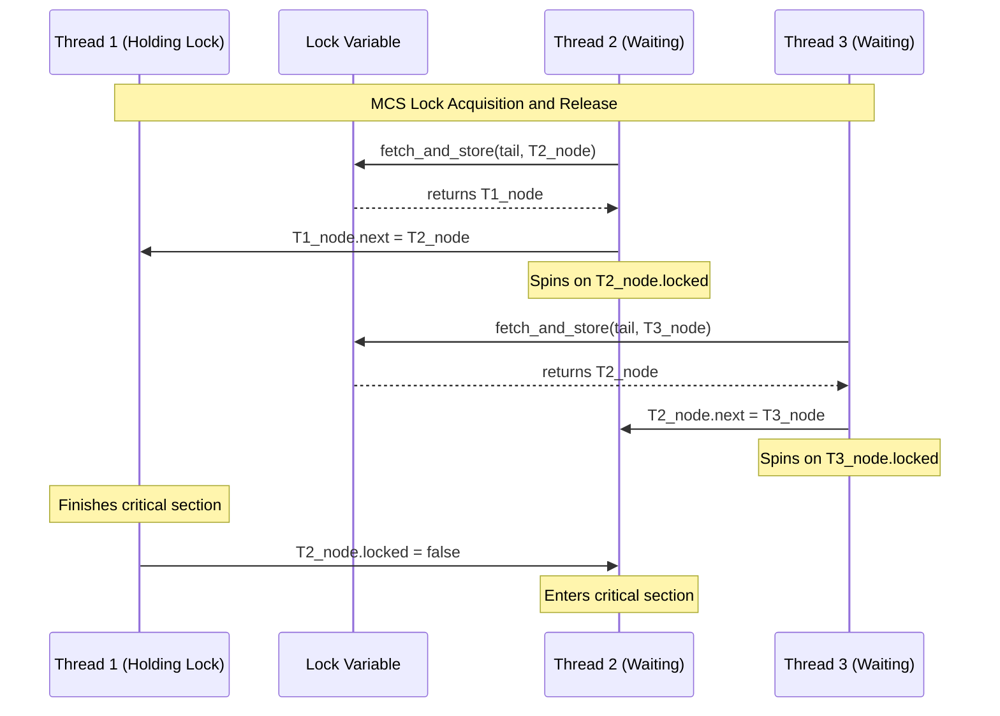

# L04b Synchronization

> [!summary] TL;DR
> Synchronization primitives like locks and barriers are essential for coordinating access to shared data and phases of computation in parallel systems. Scaling these primitives to many processors is challenging because naive busy-waiting strategies generate excessive memory and interconnect contention. By designing algorithms that spin only on locally-accessible variables, such as Anderson array-based locks and MCS linked-list locks, we can eliminate this contention and achieve scalability without needing specialized hardware.

## Learning outcomes

- Understand the role of lock and barrier synchronization in parallel programming.
- Analyze the scalability limits of naive spinlocks and how atomic read-modify-write instructions are used.
- Compare the design, space complexity, and network traffic characteristics of advanced lock algorithms like ticket locks, Anderson locks, and MCS locks.
- Evaluate the impact of cache coherence and network contention on synchronization performance.

## Motivation and the problem

Parallel computation on shared-memory multiprocessors requires coordinating threads to ensure data consistency.
Threads communicate by sharing data structures in memory.
When multiple threads attempt to read and write to the same shared structures simultaneously, race conditions can occur, leading to incorrect program behavior.
Synchronization constructs are needed to prevent overlapping conflicting operations.
Busy-wait synchronization is fundamental when scheduling overhead exceeds the expected wait time or when scheduler-based blocking is impossible, such as inside an operating system kernel.
However, typical implementations of busy-waiting can produce large amounts of memory and interconnection network contention.
This contention creates performance bottlenecks that become significantly more pronounced as the number of processors increases.

## Core concepts

### Lock and barrier primitives

<!-- coverage: L04b-01 -->
> [!note] Definition
> A lock provides mutual exclusion to ensure that only one thread can access a shared data structure at a time, while a barrier ensures that no thread advances beyond a specific computation phase until all participating threads have arrived at that point.

Locks are fundamental building blocks used to protect short critical sections, such as updating a shared counter or modifying a linked list.
In shared-memory multiprocessors, locks are often implemented as spinlocks where a waiting thread repeatedly checks a shared variable until the lock becomes available.
Barriers are typically used in parallel applications that proceed in phases, such as iterative scientific simulations or data-parallel algorithms.
A barrier prevents any thread from starting the next phase until all threads have completed the current phase.
The performance of both primitives is critical because they are executed frequently and can easily become bottlenecks if not designed to scale with the number of processors.

### Atomic read-modify-write instructions

<!-- coverage: L04b-02 -->
> [!note] Definition
> Atomic read-modify-write (RMW) instructions are hardware-supported operations that read a memory location, modify its value, and write it back in a single, indivisible step.

If multiple threads attempt to acquire a lock using separate read and write instructions, they might both read the lock as free and simultaneously set it to acquired.
To prevent this, hardware provides atomic RMW operations like test-and-set, fetch-and-increment, and fetch-and-store (swap).
A test-and-set instruction takes a memory location, returns its current value, and unconditionally sets it to a non-zero value.
A fetch-and-increment instruction returns the current value and increments it by a specified amount.
A fetch-and-store instruction atomically exchanges a register value with the value in memory.
These atomic operations form the foundation upon which complex synchronization algorithms are built.

### Scalability issues: latency, waiting time, contention

<!-- coverage: L04b-03 -->
> [!note] Definition
> Synchronization scalability is limited by latency (the overhead of acquiring or releasing an uncontended lock), waiting time (the delay before acquiring a contended lock), and contention (the network traffic generated by multiple processors competing for the lock).

When many processors busy-wait on a single synchronization variable, they create a hot spot that consumes a disproportionate share of the interconnection network bandwidth.
This network contention degrades performance for all traffic on the system, not just the synchronization traffic.
In cache-coherent systems, heavy contention causes frequent cache line invalidations, forcing processors to repeatedly fetch the variable from main memory.
An ideal synchronization algorithm minimizes latency when uncontended while keeping network traffic strictly bounded when heavily contended.
Designing for scalability means ensuring that waiting processors spin only on locally-accessible memory locations rather than a single globally shared variable.

### Naive spinlock (spin on test-and-set)

<!-- coverage: L04b-04 -->
> [!note] Definition
> A naive spinlock uses a continuous loop of atomic test-and-set operations on a single shared flag until the lock is acquired.

A thread waiting for a lock repeatedly executes a test-and-set instruction on the lock variable.
If the lock is free, the instruction sets it to acquired and returns the previous free state, allowing the thread to enter the critical section.
If the lock is already held, the instruction returns the acquired state, and the thread tries again.
This approach has severe scalability problems because every test-and-set operation writes to memory and consumes interconnection network bandwidth.
Even if the lock is held for a long time, the waiting threads generate a continuous stream of expensive atomic operations.
This heavy polling disrupts useful work across the entire multiprocessor system by saturating the memory bus.

### Caching spinlock (spin on read)

<!-- coverage: L04b-05 -->
> [!note] Definition
> A caching spinlock, or test-and-test-and-set lock, polls the lock status using standard read operations and only attempts an atomic test-and-set when the read indicates the lock might be free.

On cache-coherent multiprocessors, waiting threads spin on a cached copy of the lock variable.
This eliminates network contention while the lock is held because the read operations are satisfied entirely from the local cache.
When the thread holding the lock releases it by writing a free value, the caches of all spinning threads are invalidated.
All waiting threads then experience a cache miss, fetch the new value, observe that the lock is free, and simultaneously attempt a test-and-set operation.
Only one thread succeeds in acquiring the lock, but all threads cause remote invalidations and generate a massive burst of network traffic.
While better than a naive spinlock, the caching spinlock still scales poorly due to this invalidation storm upon lock release.

### Spinlock with delay and exponential backoff

<!-- coverage: L04b-06 -->
> [!note] Definition
> A spinlock with exponential backoff introduces a dynamically increasing delay between consecutive polling attempts to reduce network contention.

Instead of immediately retrying after a failed test-and-set or cache invalidation, a waiting thread pauses for a certain duration.
If the lock is still unavailable on the next attempt, the thread doubles its delay time, up to a maximum threshold.
This exponential backoff drastically reduces the number of threads simultaneously attempting to acquire the lock when it is released.
It disperses the atomic operations over time, smoothing out network traffic and mitigating the invalidation storm.
However, backoff strategies must balance contention reduction against the risk of increased latency if the lock becomes free while the next thread in line is still sleeping.
Finding the optimal backoff parameters can be difficult as it depends heavily on the specific hardware architecture and workload.

### Ticket lock

<!-- coverage: L04b-07 -->
> [!note] Definition
> A ticket lock uses two counters - a request counter and a release counter - to grant lock access in strict first-in-first-out (FIFO) order.

When a thread wants to acquire the lock, it performs a fetch-and-increment on the request counter to obtain a unique ticket.
The thread then spins, reading the release counter until its value matches the thread's ticket.
When a thread finishes its critical section, it simply increments the release counter, effectively signaling the next thread in line.
This guarantees fairness and eliminates starvation, as threads are served in the exact order they arrived.
To reduce polling overhead, a ticket lock can employ proportional backoff where a thread delays for a time proportional to the difference between its ticket and the current release counter.
Despite its fairness, the ticket lock still requires all waiting threads to spin on a single shared release counter, leading to invalidation storms on cache-coherent machines.

### Array-based queuing lock (Anderson)

<!-- coverage: L04b-08 -->
> [!note] Definition
> The Anderson lock is an array-based queuing lock where each waiting thread spins on a unique, locally-cached element of a circular array.

The lock maintains a shared array of flags, with each element padded to reside in a different cache line to prevent false sharing.
A thread acquires the lock by performing a fetch-and-increment on a shared next-slot counter to claim a position in the array.
It then spins entirely on its designated array element until that element is marked as having the lock.
To release the lock, the thread sets its own array element to waiting and sets the next element in the array to having the lock.
This ensures that every thread spins on a distinct, locally-cached variable, generating zero network traffic while waiting.
The primary disadvantage is its space complexity, as the array size must be proportional to the maximum number of threads that could potentially contend for the lock.

### Linked-list queuing lock (MCS)

<!-- coverage: L04b-09 -->
> [!note] Definition
> The MCS lock is a list-based queuing lock that guarantees FIFO ordering, spins only on locally-accessible variables, and requires memory proportional only to the number of currently waiting threads.

Each thread allocates a queue node record containing a next pointer and a locked flag in its own local memory.
To acquire the lock, a thread uses a fetch-and-store operation to append its node to the tail of the shared lock queue.
If the queue was not empty, the thread links its node to the previous tail node and spins on its own local locked flag.
To release the lock, a thread modifies the locked flag of its successor's node, signaling it to proceed.
The MCS lock achieves optimal O(1) network transactions per lock acquisition regardless of whether the machine has coherent caches or distributed shared memory.
It provides the scalability of the Anderson lock but with a much smaller, dynamic memory footprint.

### MCS lock with only fetch-and-store

<!-- coverage: L04b-10 -->
> [!note] Definition
> The standard MCS lock uses compare-and-swap for safe lock release, but an alternative implementation can rely solely on fetch-and-store at the cost of strict FIFO ordering.

In the standard release operation, compare-and-swap ensures that the queue tail is only set to null if no other threads have appended themselves.
If compare-and-swap is unavailable, a thread releasing the lock can use fetch-and-store to swap a null pointer into the tail.
If it discovers that other threads had actually joined the queue in the meantime, it has accidentally detached them from the lock structure.
The thread must then patch these victim threads back into the queue, potentially behind newer threads that arrived during the repair process.
This alternative maintains the core benefits of local spinning and constant space per lock.
However, it introduces significant complexity and allows newly arriving threads to bypass older threads, violating strict FIFO fairness.

### Comparison of lock algorithms

<!-- coverage: L04b-11 -->
> [!note] Definition
> Lock algorithms are evaluated based on their space requirements, fairness, network traffic generation, and reliance on specific atomic hardware instructions.

The naive test-and-set lock and the caching spinlock are space-efficient but suffer from severe scalability issues due to massive network contention.
The ticket lock solves the fairness problem by guaranteeing FIFO ordering but still generates contention when the shared release counter is updated.
The Anderson array-based lock eliminates contention by having threads spin on distinct variables, but it requires static space proportional to the maximum number of processors.
The MCS lock provides the best balance, combining the zero-contention local spinning of the Anderson lock with dynamic space allocation proportional only to the active requestors.
Choosing the right lock depends on the expected contention level and the underlying hardware architecture of the multiprocessor system.

### Modern descendants: Linux qspinlock

<!-- coverage: L04b-12 -->
> [!note] Definition
> The Linux qspinlock is a highly optimized queuing spinlock that combines the low overhead of a simple spinlock under light contention with the scalability of an MCS lock under heavy contention.

In its uncontended state, the qspinlock requires only a single atomic compare-and-exchange operation to acquire, storing the lock state in a single word.
When contention is detected, waiting CPUs fall back to forming an MCS-style queue to ensure that polling happens on locally cached variables.
The queue nodes are pre-allocated per-CPU structures, avoiding the need for dynamic memory allocation during lock acquisition.
The qspinlock design allows the lock state, the queue tail pointer, and the pending bits to be packed efficiently into a 32-bit integer.
This hybrid approach provides excellent performance across a wide range of workloads, making it the default spinlock implementation in the modern Linux kernel.

## Mechanisms step by step

The MCS lock mechanism operates by constructing a linked list of waiting threads.
When a thread arrives, it swaps its own node pointer into the global lock tail.
If a previous tail existed, the arriving thread updates the previous tail's next pointer to link itself into the queue.
The thread then spins on a flag within its own node, which is stored in locally-accessible memory.
When a thread releases the lock, it looks at its next pointer and flips the local flag of its successor.
This single remote write wakes up exactly one thread, generating minimal network traffic.

## Worked examples

Consider a scenario with a caching spinlock (test-and-test-and-set) on a cache-coherent machine with 10 waiting threads.
When the lock is released, 1 write operation invalidates the caches of all 10 waiting threads.
All 10 threads experience a cache miss and issue a read request, resulting in 10 bus transactions.
They all see the lock as free and attempt a test-and-set operation, resulting in 10 more bus transactions.
Only 1 thread succeeds, while the other 9 fail and resume spinning on their cached copies.
This single lock handoff required 21 bus transactions, demonstrating the linear scaling of the invalidation storm.
In contrast, an MCS lock handoff requires only 1 remote write to update the successor's locked flag, resulting in just 1 bus transaction regardless of how many threads are waiting.

## Comparison

| Algorithm | Space Complexity | Fairness | Network Traffic (Contended) | Hardware Primitives |
| :--- | :--- | :--- | :--- | :--- |
| Test-and-set | O(1) | None | High (linear per release) | test-and-set |
| Ticket | O(1) | FIFO | Medium (linear reads) | fetch-and-increment |
| Anderson | O(P) static | FIFO | Low (constant per handoff) | fetch-and-increment |
| MCS | O(N) dynamic | FIFO | Low (constant per handoff) | fetch-and-store (swap) |

Test-and-set locks are simple but scale poorly under contention.
Ticket locks ensure fairness but still cause invalidation storms on shared counters.
Anderson locks solve contention by spinning locally but waste memory by requiring arrays sized for the total number of processors.
MCS locks are the optimal choice for high-contention scenarios, providing FIFO fairness, local spinning, and dynamic space usage proportional only to the actively waiting threads.

## Paper deep dives

- [Algorithms for Scalable Synchronization on Shared-Memory Multiprocessors](../Papers/L04-MCS-Scalable-Synchronization.md): Mellor-Crummey and Scott introduce the MCS lock and tree-based barriers, demonstrating that synchronization contention can be eliminated in software by spinning on locally-accessible variables. They prove that their algorithms generate O(1) remote references per lock acquisition, significantly outperforming traditional naive spinlocks and ticket locks on large-scale shared-memory multiprocessors.
- [Lightweight Remote Procedure Call](../Papers/L04-LRPC.md): Bershad et al. present LRPC, a communication facility designed for fast cross-domain calls on shared-memory multiprocessors. By minimizing data copying and leveraging shared memory for argument passing, LRPC reduces the overhead of traditional RPC mechanisms.
- [Using Processor-Cache Affinity Information in Shared Memory Multiprocessor Scheduling](../Papers/L04-Cache-Affinity-Scheduling.md): Squillante and Lazowska explore the performance benefits of scheduling threads on processors where their data is likely still cached. They show that cache affinity scheduling can significantly improve throughput by reducing the number of cache misses incurred when threads migrate between processors.
- [Performance of Multithreaded Chip Multiprocessors and Implications for Operating System Design](../Papers/L04-Multithreaded-Chip-Multiprocessors.md): Fedorova et al. analyze how the architecture of multithreaded chip multiprocessors affects operating system design, particularly regarding thread scheduling and resource contention. They highlight the need for OS schedulers to account for shared resources like L2 caches and memory bandwidth to optimize overall system performance.
- [Tornado: Maximizing Locality and Concurrency in a Shared Memory Multiprocessor Operating System](../Papers/L04-Tornado.md): Gamsa et al. describe Tornado, an operating system designed to maximize locality and concurrency by using object-oriented design and clustered objects. Tornado minimizes shared state and locks, allowing it to scale efficiently on large shared-memory multiprocessors by handling most requests on local processors.
- [Corey: An Operating System for Many Cores](../Papers/L04-Corey.md): Boyd-Wickizer et al. introduce Corey, an OS that gives applications control over the sharing of operating system data structures. By avoiding unnecessary sharing of resources like address spaces and file descriptors, Corey allows applications to scale predictably on many-core architectures.
- [Cellular Disco: Resource Management Using Virtual Clusters on Shared-Memory Multiprocessors](../Papers/L04-Cellular-Disco.md): Bugnion et al. present Cellular Disco, a virtual machine monitor that provides fault containment and scalable resource management on large-scale shared-memory multiprocessors. It uses virtualization to run multiple commodity operating systems simultaneously while minimizing hardware-specific modifications.
## Modern descendants

Modern operating systems have heavily adapted the concepts of scalable synchronization for multiprocessor environments.
The Linux kernel uses the qspinlock, a hybrid algorithm that acts as a simple spinlock when uncontended but queues threads in an MCS-like structure when contention occurs.
Read-Copy-Update (RCU) is another critical modern descendant, heavily used in Linux for read-mostly data structures.
RCU allows multiple readers to access data concurrently without locking, while writers create a copy of the data, update it, and reclaim the old version only after all pre-existing readers have finished.
In distributed systems, the principles of avoiding centralized bottlenecks are reflected in consensus protocols like Raft and distributed data stores like Dynamo.
These systems partition state and coordinate through localized communication to achieve scalability similar to how the MCS lock distributes spinning variables.

## Pitfalls and exam traps

> [!warning] Exam Trap
> Be careful not to confuse the space complexity of Anderson locks with MCS locks. Anderson locks require an array of size P (total processors) for every lock, making them O(P) space per lock. MCS locks only allocate a node when a thread is actively waiting, making them dynamic O(N) space where N is the number of actively contending threads.

> [!warning] Exam Trap
> Do not assume that test-and-test-and-set locks solve the network contention problem completely. While they eliminate network traffic during the spinning phase, they still cause a massive cache invalidation storm when the lock is finally released.

> [!warning] Exam Trap
> When calculating bus transactions for a lock handoff, remember to count both the invalidation messages (when a shared variable is written) and the subsequent read misses (when the spinning threads fetch the new value).

## Practice

- [Practice L04](../Practice/Practice-L04.md)

## Lab

- [lab-05-spinlocks](../labs/lab-05-spinlocks/README.md): Spinlock zoo: TAS, TTAS, backoff, ticket, Anderson, and MCS in C11

## Further reading

- [Algorithms for Scalable Synchronization on Shared-Memory Multiprocessors](https://www.cs.rochester.edu/u/scott/papers/1991_TOCS_synch.pdf) by Mellor-Crummey and Scott.
- Linux Kernel Documentation on [qspinlocks](https://www.kernel.org/doc/Documentation/locking/spinlocks.txt) and [RCU](https://www.kernel.org/doc/Documentation/RCU/whatisRCU.txt).
- The Art of Multiprocessor Programming by Maurice Herlihy and Nir Shavit for theoretical foundations of synchronization.

