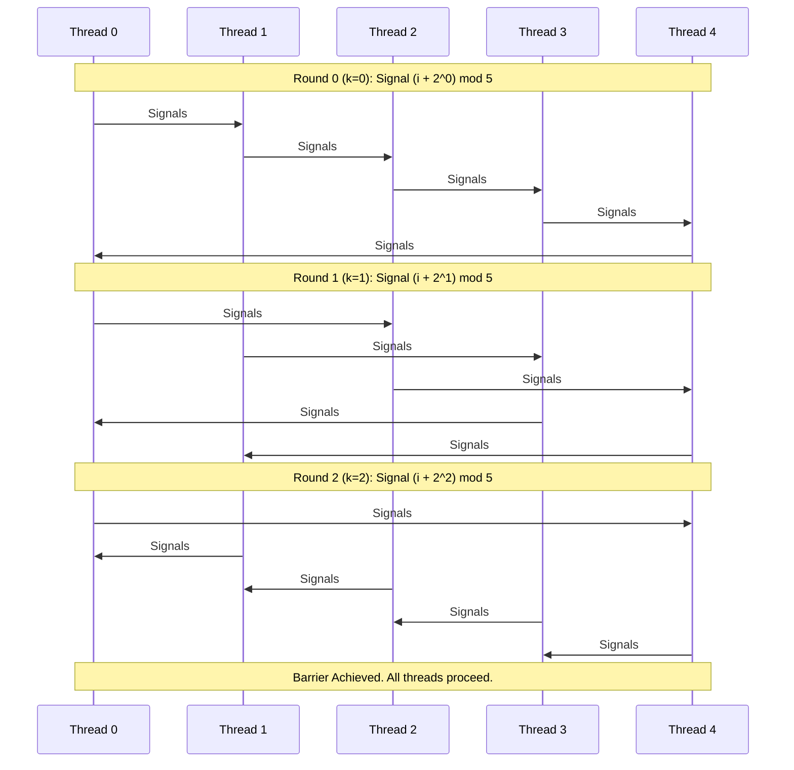

# L04c Barrier Synchronization

> [!summary] TL;DR
> Barrier synchronization ensures that all threads in a parallel application reach a specific execution point before any proceed.
> Simple centralized barriers using a single counter suffer from extreme memory contention and poor scalability.
> Advanced algorithms - such as combining trees, tournament barriers, and dissemination barriers - distribute the coordination state to minimize contention, ensure local spinning, and scale efficiently across hundreds of processors.

## Learning outcomes

- **Explain** the performance bottlenecks of simple centralized barriers, particularly regarding memory and interconnect contention.
- **Compare** the network transaction costs and critical path lengths of centralized, tree-based, tournament, and dissemination barriers.
- **Trace** the state transitions and message patterns of advanced barrier algorithms across multiple rounds.
- **Evaluate** the appropriateness of different barrier algorithms depending on whether the underlying hardware supports shared memory, cache coherence, or message passing.

## Motivation and the problem

Parallel applications, such as large-scale scientific simulations or matrix computations, often execute in phases.
To ensure correctness, no thread can proceed to phase $N+1$ until all threads have completed their work and written their results for phase $N$.
This coordination is called a barrier.

The fundamental problem with implementing barriers is contention.
If all $N$ threads atomically decrement a single shared counter and then spin-wait on a single shared flag, the memory module housing these variables becomes a hot spot.
In a cache-coherent system, the spinning flag is replicated, but the final update causes a massive broadcast invalidation and a subsequent storm of memory requests as all threads try to read the new value simultaneously.
This contention can cripple the interconnection network, slowing down the entire system and severely limiting scalability.

## Core concepts

### Centralized counting barrier

<!-- coverage: L04c-01 -->
A centralized counting barrier uses a single shared counter initialized to the number of participating threads, $N$.
As each thread arrives at the barrier, it atomically decrements the counter.
If the counter is greater than zero, the thread spins, waiting for the barrier to be released.
The last thread to arrive decrements the counter to zero, which signals that all threads have reached the barrier. 

> [!note] Definition
> A **centralized counting barrier** is the simplest barrier synchronization primitive, using a single shared counter and a shared flag to coordinate all threads in a system.

To safely reuse the barrier for the next phase, the last thread must reset the counter to $N$.
However, a naive implementation suffers from a race condition: a fast thread might leave the current barrier, finish its next phase, and enter the barrier again before the counter is completely reset, incorrectly slipping through.
To prevent this, threads must use two spin loops: one waiting for the counter to reach zero, and another waiting for it to be reset to $N$.
This approach causes extreme hot-spot contention and scales poorly.

### Sense-reversing barrier

<!-- coverage: L04c-02 -->
The sense-reversing barrier eliminates the need for two spin loops in a centralized barrier by introducing a shared boolean variable called `sense`.
Each thread maintains its own private, local copy of the `sense` variable. 

> [!note] Definition
> A **sense-reversing barrier** optimizes the centralized barrier by toggling a single shared boolean flag to release waiting threads, avoiding the need to reset the counter before threads can proceed.

When a thread arrives, it decrements the shared counter.
If it is not the last thread, it spins waiting for the global `sense` to match its local `sense`.
The last thread to arrive resets the counter to $N$ and then simply toggles the global `sense` variable.
This single action simultaneously releases all waiting threads.
In the next barrier phase, threads will wait for the `sense` to toggle back.
While this halves the spinning overhead compared to the two-loop counting barrier, it still relies on a centralized spinning location, meaning it scales poorly on machines without broadcast-based cache coherence.

### Combining tree barrier

<!-- coverage: L04c-03 -->
To eliminate the single hot spot of a centralized barrier, a combining tree barrier distributes the state across multiple variables organized as a tree.
Processors are divided into groups of $K$, with each group assigned to a leaf node of the tree. 

> [!note] Definition
> A **combining tree barrier** hierarchicalizes synchronization by having groups of threads synchronize at leaf nodes, and the last thread of each group recursively synchronizes at the parent node, up to the root.

When a thread arrives, it decrements the counter of its assigned leaf node.
If it is the last thread in its group, it proceeds up the tree to decrement the parent node's counter, while the other threads spin locally on a flag at the leaf.
This process continues until the final thread reaches the root node and decrements it to zero.
The root thread then toggles the root's release flag, triggering a downward wave of wakeups: as each parent node is released, it updates the flags of its children. 

While this prevents a single hot spot, the spin locations for a thread are not strictly static (a thread might spin at different levels depending on arrival order).
Furthermore, deep trees can increase the critical path latency, and non-cache-coherent systems still suffer from threads spinning on remote memory locations.

### MCS tree barrier (4-ary arrival, binary wakeup)

<!-- coverage: L04c-04 -->
The MCS (Mellor-Crummey and Scott) tree barrier refines the tree approach to ensure that every thread spins only on statically determined, locally accessible variables, eliminating all remote spinning and network contention during the wait phase.

> [!note] Definition
> The **MCS tree barrier** uses a 4-ary tree for arrival tracking and a binary tree for wakeups, statically assigning each thread a distinct, local variable to spin on.

For the arrival phase, the MCS barrier uses a 4-ary tree, as empirical evidence shows this provides the optimal balance between network messages and tree depth.
Each parent node contains a statically allocated array (`ChildNotReady`) where each child thread writes to signal its arrival.
A thread spins waiting for its specific children to arrive.
For the wakeup phase, a separate binary tree is used.
Once the root observes all arrivals, it writes to a specific `ChildPointer` variable for each of its two children, who in turn wake their children.
Because every thread waits on a variable allocated in its local memory or cached locally, the barrier generates only $O(1)$ network transactions per thread.

### Tournament barrier

<!-- coverage: L04c-05 -->
A tournament barrier organizes threads into a binary tree and conducts a series of pairwise synchronization rounds, mimicking a sports tournament. 

> [!note] Definition
> A **tournament barrier** pairs threads in a binary tree hierarchy where a statically determined "winner" advances to the next round, completely avoiding the need for expensive atomic fetch-and-add instructions.

In each round, two threads synchronize.
One thread (the "loser") signals the other and then drops out to spin-wait on a local flag.
The other thread (the "winner") advances to the next round to synchronize with another winner.
This continues for $\lceil \log_2 N \rceil$ rounds until the overall champion reaches the root.
The champion then initiates the wakeup phase, which ripples back down the tree.
Because the winners and losers are statically predetermined, spin locations are perfectly static, and no atomic read-modify-write instructions are required.
This makes the tournament barrier ideal for distributed memory clusters or systems lacking atomic hardware primitives.

### Dissemination barrier

<!-- coverage: L04c-06 -->
The dissemination barrier abandons the hierarchical tree structure entirely in favor of a symmetric, peer-to-peer signaling pattern. 

> [!note] Definition
> A **dissemination barrier** achieves synchronization through a cyclic, peer-to-peer signaling pattern over $\lceil \log_2 N \rceil$ rounds, avoiding a single root bottleneck.

In round $k$ (starting at $k=0$), thread $i$ signals thread $(i + 2^k) \pmod N$, and then spins waiting to be signaled by thread $(i - 2^k) \pmod N$.
This butterfly-like pattern ensures that after $\lceil \log_2 N \rceil$ rounds, every thread has transitively received arrival information from every other thread in the system. 

Unlike tree barriers, all threads participate actively in every round, meaning there is no single root thread that acts as a bottleneck.
It requires exactly $\lceil \log_2 N \rceil$ rounds on the critical path, and because threads signal statically determined partners, it avoids atomic instructions and guarantees local spinning.

### Barrier algorithm comparison: space, messages, critical path, shared memory versus message passing

<!-- coverage: L04c-07 -->
When choosing a barrier algorithm, the system architecture dictates the best approach, as each algorithm involves different trade-offs in space, network messages, and critical path length.
Centralized barriers are space-efficient but have an $O(N)$ critical path and generate excessive messages due to hot spots, making them suitable only for small scale SMPs with broadcast cache coherence.
Combining trees require $O(N)$ space and reduce contention, but their critical path is $O(\log_K N)$; they are ideal for medium systems where strict static pinning isn't necessary.
The MCS tree achieves the theoretical minimum network messages with a critical path of $O(\log_4 N)$, making it superior for large-scale NUMA architectures.
The tournament barrier uses $O(N)$ space, has a critical path of $O(\log_2 N)$, and relies entirely on message passing rather than shared memory atomics, making it perfect for clusters.
The dissemination barrier sends more total messages ($O(N \log N)$) but has a perfectly parallel critical path of exactly $\lceil \log_2 N \rceil$ rounds, which is excellent for systems lacking shared memory or atomics that prioritize lowest latency.

## Mechanisms step by step

Here is the step-by-step execution of a Dissemination Barrier for $N=5$ threads.
Since $N=5$, the barrier requires $\lceil \log_2 5 \rceil = 3$ rounds.

## Worked examples

**Example 1: Dissemination Barrier Message Count**
Consider a dissemination barrier with $N = 12$ processors.
- The number of rounds required is $\lceil \log_2(12) \rceil = 4$ rounds.
- In each round, every processor sends exactly 1 message to its partner.
- Therefore, each round requires 12 messages.
- Total messages for the barrier = $4 \times 12 = 48$ messages.

**Example 2: Tournament Barrier Message Count**
Consider a tournament barrier with $N = 8$ processors.
- **Arrival Phase (Bottom-Up):**
  - Round 0: 8 threads form 4 pairs. 4 losers send messages to 4 winners. (4 messages)
  - Round 1: 4 winners form 2 pairs. 2 losers send to 2 winners. (2 messages)
  - Round 2: 2 winners form 1 pair. 1 loser sends to 1 champion. (1 message)
  - Total arrival messages = $4 + 2 + 1 = 7$ messages.
- **Wakeup Phase (Top-Down):**
  - The champion signals the 1 loser from Round 2. (1 message)
  - The 2 active threads signal the 2 losers from Round 1. (2 messages)
  - The 4 active threads signal the 4 losers from Round 0. (4 messages)
  - Total wakeup messages = $1 + 2 + 4 = 7$ messages.
- **Total Network Transactions** = $7 \text{ arrival} + 7 \text{ wakeup} = 14$ messages.
Notice that for $N$ processors, the total messages are exactly $2(N-1)$.

## Comparison

| Algorithm | Network Messages | Critical Path | Atomic Instructions | Best Used For |
| :--- | :--- | :--- | :--- | :--- |
| **Centralized** | $O(N)$ (or worse with contention) | $O(N)$ | Yes | Small scale SMPs with broadcast cache coherence. |
| **Combining Tree** | $O(N)$ | $O(\log_K N)$ | Yes | Medium systems where hot spots must be avoided, but static pinning isn't strict. |
| **MCS Tree** | $O(N)$ | $O(\log_4 N)$ | Yes | Large-scale NUMA or cache-coherent systems; minimal remote spinning. |
| **Tournament** | $O(N)$ | $O(\log_2 N)$ | No | Clusters or systems without atomic instructions. |
| **Dissemination** | $O(N \log N)$ | $O(\log_2 N)$ | No | Systems lacking shared memory or atomics, prioritizing lowest latency critical path. |

## Paper deep dives

- [Algorithms for Scalable Synchronization on Shared-Memory Multiprocessors](../Papers/L04-MCS-Scalable-Synchronization.md): Introduces the MCS spin lock and the MCS tree barrier, demonstrating how algorithm design can eliminate $O(N)$ hot-spot contention by ensuring threads spin only on statically determined, locally accessible variables, scaling gracefully on NUMA architectures.
- [Lightweight Remote Procedure Call](../Papers/L04-LRPC.md): Details the optimization of cross-domain communication on the same machine using shared memory and careful thread management.
- [Using Processor-Cache Affinity Information in Shared Memory Multiprocessor Scheduling](../Papers/L04-Cache-Affinity-Scheduling.md): Evaluates scheduling policies that utilize cache affinity, showing that moving threads away from their cached data can cause severe performance degradation due to cache misses.
- [Performance of Multithreaded Chip Multiprocessors and Implications for Operating System Design](../Papers/L04-Multithreaded-Chip-Multiprocessors.md): Analyzes how hardware multithreading affects OS design, particularly how sharing caches and execution units between threads requires cache-aware scheduling.
- [Tornado: Maximizing Locality and Concurrency in a Shared Memory Multiprocessor Operating System](../Papers/L04-Tornado.md): Describes an object-oriented OS architecture designed for scalable multiprocessors, minimizing shared data structures to eliminate locks and contention.
- [Corey: An Operating System for Many Cores](../Papers/L04-Corey.md): Argues that OS abstractions should allow applications to control the sharing of OS data structures (like address spaces and file descriptors) to avoid scalability bottlenecks on many-core chips.
- [Cellular Disco: Resource Management Using Virtual Clusters on Shared-Memory Multiprocessors](../Papers/L04-Cellular-Disco.md): Extends the Disco virtual machine monitor to scale across large NUMA machines by clustering resources and fault domains.

## Modern descendants

The principles of scalable barrier synchronization and contention avoidance have profoundly influenced modern infrastructure.
The Linux kernel uses ticket spinlocks and increasingly qspinlocks (queued spinlocks, a direct descendant of MCS locks) to prevent lock starvation and cache-line bouncing on massive x86 servers.
The Read-Copy-Update (RCU) mechanism in Linux pushes this further by avoiding locks entirely for readers, heavily leveraging the concept of local-only access.
In distributed systems, the peer-to-peer logic of the dissemination barrier echoes in gossip protocols used by Dynamo-style stores (like Cassandra) to propagate state changes without a centralized bottleneck.

## Pitfalls and exam traps

> [!warning] Exam Trap: Dissemination Message Counts
> A common mistake when calculating the cost of a dissemination barrier is treating it like a tree.
> Remember that in a dissemination barrier, *every* thread sends exactly one message in *every* round.
> If there are $N$ threads and $R = \lceil \log_2 N \rceil$ rounds, the total number of messages is exactly $N \times R$. 

> [!warning] Pitfall: Spin Locations on NUMA
> Implementing a naive combining tree on a NUMA (Non-Uniform Memory Access) machine can still yield poor performance if the tree nodes are allocated in a single memory bank.
> To achieve true scalability, the variables a thread spins on must be physically allocated on the memory module local to that thread, which is the core insight of the MCS barrier.

## Practice

- [Practice L04](../Practice/Practice-L04.md)

## Lab

- [lab-06-barriers](../labs/lab-06-barriers/README.md): Barrier algorithms: library barrier costs and a round and message simulator

## Further reading

- [Linux Kernel Documentation on spinlocks](https://docs.kernel.org/locking/spinlocks.html)
- [MCS locks in the Linux Kernel](https://lwn.net/Articles/590243/)
