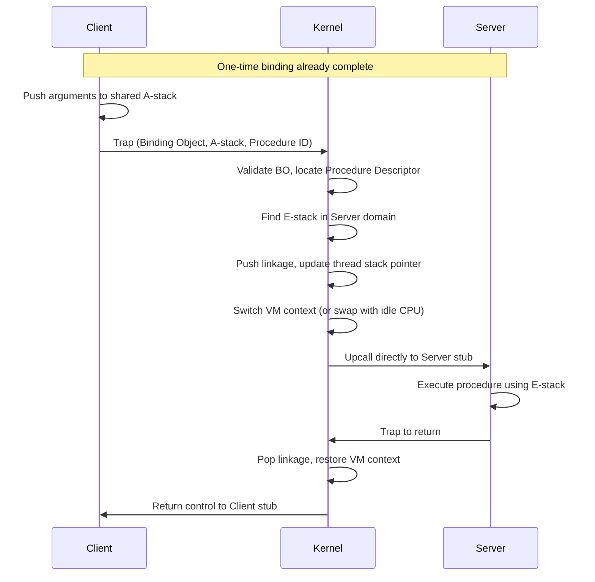

# L04d Lightweight RPC

> [!summary] TL;DR
> Lightweight Remote Procedure Call (LRPC) optimizes communication between protection domains on the same machine.
> By combining the control transfer model of capability systems with the programming semantics of RPC, it drastically reduces data copies and context switches.
> This makes cross-domain calls significantly faster, encouraging microkernel designs where services run safely in separate domains without a performance penalty.

## Learning outcomes

- Explain why most RPCs occur on the same machine rather than across a network.
- Analyze the overhead of traditional cross-domain RPCs in terms of data copies and control transfers.
- Describe how LRPC uses the shared A-stack and one-time binding to reduce data copies and validation overhead.
- Explain how handoff scheduling and privately mapped E-stacks minimize context switch latency.
- Illustrate how LRPC leverages idle processors on a shared-memory multiprocessor to cache domain contexts.

## Motivation and the problem

Traditional operating systems often group many services into a single large kernel to avoid the high overhead of crossing protection boundaries.
While remote procedure call (RPC) provides an excellent abstraction for distributed systems, its implementation in traditional systems treats same-machine cross-domain calls exactly like cross-machine network calls.
This results in unnecessary data copying, multiple full context switches, and heavy kernel involvement, making local RPCs prohibitively slow.
As a result, developers are forced to trade safety for performance by placing separate, weakly related subsystems in a shared protection domain.
LRPC solves this by isolating the common case of local communication and optimizing it deeply.

## Core concepts

### RPC on the same machine and why it is common

<!-- coverage: L04d-01 -->
Measurements from systems like Taos and V show that the vast majority of RPCs occur between protection domains on the same machine, rather than across a network.
This happens because operating systems naturally localize processing and resources to provide acceptable performance for common requests, using techniques like file caching to avoid expensive network round-trips.
Despite being local, these calls must cross protection domains to ensure safety, modularity, and fault isolation between the client and the server.
Thus, a fast cross-domain mechanism is essential to achieve good performance without compromising the structural safety of the system.

> [!note] Cross-domain communication
> Communication between separate protection boundaries (like a user process and a kernel, or two separate user-space services) running on the same physical machine.

### Costs of RPC: copies and control transfer

<!-- coverage: L04d-02 -->
Traditional local RPC is expensive due to heavy copying overhead and complex control transfers.
When a client makes an RPC, the arguments are copied from the client stack to a message buffer, then copied into the kernel buffers, then from the kernel to the server domain, and finally to the server execution stack.
This results in four distinct data copies per call, and four more on the return path.
Furthermore, the control transfer requires trapping to the kernel, blocking the client thread, placing a server thread on the run queue, scheduling it, and performing a full virtual memory context switch, all of which add significant latency to the operation.

> [!warning] Exam trap
> Do not assume that all four copies in a traditional RPC are strictly necessary for safety.
> LRPC proves that a carefully managed shared buffer can eliminate intermediate kernel copies while maintaining complete isolation between domains.

### Making RPC cheaper: binding and the A-stack

<!-- coverage: L04d-03 -->
To reduce overhead, LRPC shifts much of the setup cost to a one-time binding phase that occurs before any calls are made.
During this phase, the client requests access to a specific server interface.
The kernel establishes a Procedure Descriptor (PD) and allocates a shared argument stack (A-stack) that is explicitly mapped into both the client and server domains.
The client receives a Binding Object (BO) that serves as an unforgeable authentication token for future calls.
This upfront setup allows subsequent procedure calls to bypass complex access validation, routing, and dynamic buffer allocation, significantly streamlining the critical transfer path.

> [!note] Binding Object (BO)
> An unforgeable token provided by the kernel to a client during the binding phase, used to authorize fast, direct calls to a specific server interface without repeated heavy access validation.

### Shared argument stack and copy reduction

<!-- coverage: L04d-04 -->
The pairwise-allocated, shared A-stack drastically reduces the number of data copies required for a cross-domain call.
Instead of passing data through intermediate kernel buffers, the client stub copies arguments directly into the A-stack.
Since the A-stack is mapped into the server's domain as well, the server can access these arguments immediately.
This reduces the number of copies from four down to just one (or two, depending on whether the server needs to guarantee the immutability of the arguments).
For large data types passed by reference, only the reference itself is copied to the A-stack, further minimizing memory bandwidth overhead.

### Domain switching and handoff scheduling

<!-- coverage: L04d-05 -->
LRPC minimizes context switch overhead by using a technique known as handoff scheduling, which directly bridges the client and server execution.
Instead of blocking the client and waking up a separate server thread, the client's thread itself crosses the protection boundary to execute the server procedure.
It traps to the kernel, providing the Binding Object and the A-stack.
The kernel validates the call, updates the thread's stack pointer to a privately mapped execution stack (E-stack) in the server domain, and performs an upcall into the server stub.
This completely bypasses the general OS thread scheduler.

> [!note] Handoff scheduling
> A scheduling optimization where a thread transitions directly from executing in one domain to executing in another, bypassing the general OS thread scheduler and its associated queuing delays.

### RPC on SMP: caching domains on idle processors

<!-- coverage: L04d-06 -->
On shared-memory multiprocessors (SMP), LRPC reduces the cost of context switching even further by caching domain contexts on idle processors.
When a cross-domain call occurs, the kernel checks if an idle processor is already spinning in the context of the requested server domain.
If one is found, the kernel simply swaps the physical processors for the calling thread and the idle thread.
This technique avoids invalidating the Translation Lookaside Buffer (TLB) and keeps hardware caches warm, significantly lowering the latency of the call compared to a full virtual memory context switch on a single processor.

## Mechanisms step by step

The sequence of events in an LRPC call involves careful coordination between the client stub, the kernel, and the server stub to minimize latency.

## Worked examples

Consider the performance difference in data copying and scheduling between traditional RPC and LRPC.
Assume a cross-domain call passes a 256-byte payload.
In traditional RPC, this payload is copied 4 times on the call and 4 times on the return, totaling 8 copies.
Total bytes copied = 8 * 256 = 2048 bytes.
If memory copying costs 1 nanosecond per byte, the copy overhead is 2048 nanoseconds.
Additionally, the general scheduler involves a sleep and wakeup, costing perhaps 100 microseconds (100,000 nanoseconds).

In LRPC, the payload is copied once into the shared A-stack by the client, and read directly by the server.
On return, results are copied once.
Total copies = 2.
Total bytes copied = 2 * 256 = 512 bytes.
The copy overhead is 512 nanoseconds.
Handoff scheduling bypasses the run queues, costing only a simple kernel trap and upcall, which might take 10 microseconds (10,000 nanoseconds).
The LRPC design reduces the total overhead from approximately 102 microseconds down to roughly 10.5 microseconds, an order of magnitude improvement.

## Comparison

| Feature | Traditional RPC | Lightweight RPC (LRPC) |
| --- | --- | --- |
| **Primary Target** | Cross-machine and local | Cross-domain (local) only |
| **Data Transfer** | 4 copies per call/return | 1 copy via shared A-stack |
| **Thread Model** | Client blocks, server thread wakes | Client thread crosses domain to execute server code |
| **Scheduling** | General OS scheduler | Handoff scheduling |
| **Access Validation** | Checked on every individual call | Checked once during binding phase |
| **Context Switch** | Full VM switch | Domain caching on idle CPUs |

## Paper deep dives

- [Lightweight Remote Procedure Call](../Papers/L04-LRPC.md): This paper details the design and implementation of LRPC on the Taos operating system.
It focuses on isolating the common case of same-machine communication and optimizing it deeply.
The authors demonstrate that cross-domain procedure calls can be made nearly as fast as simple procedure calls, enabling the practical use of microkernel architectures without severe performance penalties.

- [Algorithms for Scalable Synchronization on Shared-Memory Multiprocessors](../Papers/L04-MCS-Scalable-Synchronization.md): While focused on synchronization, this paper shares the theme of optimizing primitive operations for shared-memory architectures, emphasizing that reducing memory contention and cache invalidations (similar to LRPC's domain caching) is critical for performance.

- [Using Processor-Cache Affinity Information in Shared Memory Multiprocessor Scheduling](../Papers/L04-Cache-Affinity-Scheduling.md): Discusses the importance of scheduling threads on processors where their state is already cached, a concept directly related to LRPC's technique of caching domain contexts on idle processors to keep TLBs and hardware caches warm.

- [Performance of Multithreaded Chip Multiprocessors and Implications for Operating System Design](../Papers/L04-Multithreaded-Chip-Multiprocessors.md): Explores OS design implications for CMPs.
LRPC's careful management of shared state (like the A-stack) and avoidance of global locks on the critical path aligns well with scaling OS services on multithreaded hardware.

- [Tornado: Maximizing Locality and Concurrency in a Shared Memory Multiprocessor Operating System](../Papers/L04-Tornado.md): Tornado emphasizes object-oriented structuring to maximize locality and concurrency.
LRPC's approach to localizing communication channels (pairwise A-stacks) rather than using global message buffers reflects a similar philosophy of minimizing shared bottlenecks.

- [Corey: An Operating System for Many Cores](../Papers/L04-Corey.md): Corey allows applications to control the sharing of OS data structures.
LRPC provides a specialized, non-shared path (the specific BO and A-stack linkage) for inter-domain communication, avoiding the contention that Corey aims to eliminate at a broader OS level.

- [Cellular Disco: Resource Management Using Virtual Clusters on Shared-Memory Multiprocessors](../Papers/L04-Cellular-Disco.md): Cellular Disco manages resources across virtual clusters; fast, localized communication mechanisms like LRPC are essential building blocks for efficiently coordinating such segmented systems on a single physical machine.

## Modern descendants

The philosophy of LRPC heavily influenced modern fast inter-process communication (IPC) mechanisms.
- **L4 microkernels**: The L4 family of microkernels took the concept of fast IPC to the extreme, passing small messages entirely in CPU registers and completely eliminating memory copies on the fast path, descending directly from the realization that cross-domain calls must be as lightweight as possible.
- **Android Binder**: The Binder IPC mechanism in Android heavily uses shared memory mapped between the kernel and user processes, along with kernel-mediated capability tokens (similar to Binding Objects), to achieve fast cross-process communication for mobile applications.
- **virtio**: In virtualized environments, virtio uses shared memory rings (vrings) between the guest OS and the host hypervisor to minimize copies and exits during high-throughput I/O, echoing LRPC's use of shared A-stacks.

## Pitfalls and exam traps

> [!warning] Exam trap
> Do not confuse LRPC with a network protocol.
> LRPC is strictly designed and optimized for same-machine, cross-domain communication.
> It explicitly trades network transparency for raw local performance.

> [!warning] Exam trap
> Be careful when thinking about concurrency in LRPC.
> The client and server do not execute concurrently during an LRPC.
> The client's thread is exactly what crosses the domain to execute the server's code; there is only one thread of control moving back and forth.

## Practice

- [Practice L04](../Practice/Practice-L04.md)

## Lab

- [lab-07-rpc-costs](../labs/lab-07-rpc-costs/README.md): Where RPC time goes: copies, crossings, and zero-copy on one machine

## Further reading

- Bershad, B. N., et al. "Lightweight Remote Procedure Call." ACM Transactions on Computer Systems (TOCS), 1990.
The foundational paper describing the implementation in the Taos OS.
