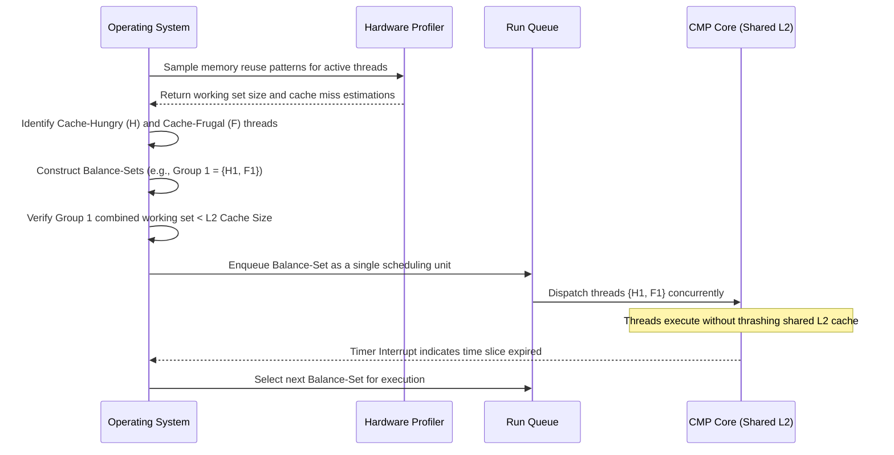

# L04e Scheduling

> [!summary] TL;DR
> This note covers operating system scheduling in parallel architectures, focusing on the tension between fairness, load balancing, and cache affinity.
> It explores scheduling policies from simple First-Come-First-Served to advanced processor-centric approaches that minimize cache pollution.
> The lesson also examines scheduling on modern multithreaded chip multiprocessors, emphasizing techniques like balance-set scheduling to manage shared L2 cache contention effectively.

## Learning outcomes

- Evaluate the impact of cache affinity on thread scheduling decisions.
- Compare and contrast thread-centric and processor-centric scheduling policies.
- Calculate performance metrics such as throughput and response time under varying scheduler constraints.
- Analyze the challenges of shared L2 cache contention on Chip Multiprocessors.
- Describe balance-set scheduling algorithms that construct cache-friendly thread groups.

## Motivation and the problem

Modern multiprocessor scheduling is fundamentally limited by memory access latencies rather than pure CPU cycles.
When a thread executes on a specific processor, it naturally brings its working set into that processor's L1 and L2 caches.
If the operating system moves that thread to a different processor, the thread suffers severe cold cache misses, significantly degrading performance.
The central problem is designing schedulers that balance CPU load across the system while honoring cache affinity.
The scheduler must maximize throughput and minimize response time without starving threads or leaving cores unnecessarily idle.

## Core concepts

### Scheduling goals and cache affinity

<!-- coverage: L04e-01 -->
Scheduling goals in parallel systems revolve around maximizing throughput, minimizing response time, and ensuring fairness among all active threads.
However, these theoretical goals often conflict with the physical reality of hardware memory hierarchies and access latencies.
Cache affinity is the phenomenon where a thread performs significantly better when scheduled on a processor it previously ran on, because its working set is already present in that processor's cache hierarchy.
If a thread is migrated, or if another memory-intensive thread pollutes the cache between executions, the original thread will experience costly cache misses upon resumption.
Schedulers must carefully weigh the immediate benefit of using an idle processor against the latency penalty of rebuilding the cache state from main memory.

> [!note] Cache Affinity
> The performance benefit gained by scheduling a thread on a processor where its data and instructions are already present in the hardware cache hierarchy.

### First come first served

<!-- coverage: L04e-02 -->
First-Come-First-Served (FCFS) is the simplest approach to scheduling, typically implemented with a single global queue of runnable threads.
When a processor becomes idle, it simply pops the first thread off the queue and begins execution without any further analysis.
While this guarantees fairness and is extremely easy to implement, it completely ignores the performance impact of cache affinity.
A thread might bounce between different processors in successive time slices, continually paying the high cost of cold cache misses.
This dynamic makes FCFS highly inappropriate for modern parallel systems where cache miss latencies dominate execution time.

> [!warning] FCFS Pitfall
> FCFS achieves excellent load balancing since no processor remains idle if work is available, but the complete disregard for cache affinity can destroy overall system throughput.

### Fixed processor scheduling

<!-- coverage: L04e-03 -->
Fixed processor scheduling, a thread-centric policy, aims to maximize cache affinity by permanently binding a thread to a specific CPU upon creation.
When a thread is first created, the scheduler assigns it to a processor, often based on the current system load to ensure initial balance.
From that point on, the thread will only ever run on its assigned processor, eliminating the possibility of cache migration penalties.
While this guarantees maximum potential cache affinity, it can lead to severe load imbalances over time.
If some processors end up with long-running threads while others complete their tasks quickly, the system will have idle cores alongside overloaded ones.

### Last processor scheduling

<!-- coverage: L04e-04 -->
Last processor scheduling is a dynamic thread-centric policy that improves upon fixed processor scheduling by favoring affinity without enforcing strict binding.
Each processor attempts to select the thread that most recently executed on it during the last operation cycle.
If a processor becomes idle and its last scheduled thread is runnable, the processor will immediately pick it up to reuse the warm cache.
If the thread is not available, the processor is free to look elsewhere for work rather than remaining idle.
This policy strongly favors affinity, keeping threads local to their caches, but it can still suffer from load imbalance if work is not evenly distributed.

### Minimum intervening policy

<!-- coverage: L04e-05 -->
The Minimum Intervening (MI) policy is a processor-centric approach that tracks cache pollution explicitly to make informed scheduling decisions.
It maintains an affinity index for each thread-processor pair, which represents the number of other threads that have executed on that processor since the target thread last ran there.
A smaller index indicates higher affinity because fewer intervening threads mean less of the original thread's cache footprint has been evicted.
Whenever a processor becomes idle, it selects the runnable thread with the lowest affinity index for that specific CPU.
This approach carefully models cache decay over time to optimize throughput.

### Minimum intervening with limited queue

<!-- coverage: L04e-06 -->
In a system with a large number of processors and threads, maintaining the full affinity index matrix for the Minimum Intervening policy is computationally expensive and requires significant memory overhead.
The Limited Minimum Intervening policy optimizes this by only storing the affinity information for the top few processors where a thread most recently executed.
For all other processors in the system, the thread is assumed to have no cache affinity whatsoever.
This heuristic captures the vast majority of practical cache reuse scenarios while drastically reducing the scheduling and memory overhead.
It provides a scalable compromise between strict cache tracking and global system efficiency.

### Implementation issues: global versus per-processor queues

<!-- coverage: L04e-07 -->
A single global run queue presents a major performance bottleneck in multiprocessor systems due to extreme lock contention when multiple CPUs attempt to dispatch threads simultaneously.
To solve this concurrency issue, modern operating systems implement local, policy-based queues for every individual processor.
A thread's position within a local queue is determined by a calculated priority, typically combining a base priority, thread age to prevent starvation, and cache affinity metrics.
If a specific processor runs out of threads in its local queue, it can pull some threads from other processors to maintain utilization.
This distributed queue architecture significantly improves scheduler scalability and reduces synchronization overhead.

### Performance metrics: throughput, response time, variance

<!-- coverage: L04e-08 -->
Scheduler performance is evaluated using three primary metrics that capture both system efficiency and user experience.
Throughput is a system-centric metric measuring the total number of threads or jobs that get executed and completed per unit of time.
Response time is a user-centric metric measuring the elapsed time from a thread's submission to its final completion.
Variance measures whether the response time changes significantly over time; users strongly prefer consistent execution times over highly variable ones.
When picking a scheduling policy, a CPU might choose to stay idle until a thread with high affinity becomes available, deliberately sacrificing short-term utilization to boost long-term throughput by avoiding cache misses.

### Load balancing and work stealing

<!-- coverage: L04e-09 -->
When using per-processor local queues, the system must actively prevent situations where one CPU is overloaded while another sits completely idle.
Work stealing is a critical load balancing technique where an idle processor examines the run queues of other processors and migrates threads to its own queue.
While this migration breaks cache affinity for the stolen thread, the cost of the cold cache misses is often outweighed by the benefit of utilizing an otherwise idle CPU resource.
Work stealing algorithms typically target the coldest threads in the victim's queue, which are those that have not run recently, to minimize the cache penalty.
This ensures that threads actively utilizing a warm cache are left undisturbed.

### Cache-aware scheduling on multicore and multithreaded processors

<!-- coverage: L04e-10 -->
On modern Chip Multiprocessors (CMPs), multiple hardware threads share the same core, and multiple cores typically share a Last-Level Cache (LLC, such as L2).
Contention for this shared LLC between concurrently executing threads is a primary performance bottleneck that traditional schedulers fail to address.
Cache-aware schedulers use system profiling to determine if a thread is cache-frugal or cache-hungry based on its memory reuse patterns.
For each core, the OS then co-schedules a specific mix of frugal and hungry threads to ensure their combined working sets do not exceed the LLC capacity.
This careful grouping prevents cache thrashing and maintains high Instructions Per Cycle (IPC) for all sharing threads.

### Modern descendants: Linux CFS and EEVDF, sched domains

<!-- coverage: L04e-11 -->
Modern operating system scheduling has evolved to handle incredibly complex hardware topologies while respecting cache affinity.
The Linux Completely Fair Scheduler (CFS) and its successor EEVDF (Earliest Eligible Virtual Deadline First) use virtual runtime to ensure fair CPU distribution without strict time quantums.
To handle multicore and NUMA architectures, Linux utilizes Scheduling Domains to map the physical hardware topology, including SMT threads, cores, and sockets.
The kernel strongly biases scheduling decisions to keep threads within their lowest hierarchical domain, such as the same L3 cache, to preserve affinity.
Work stealing is only initiated across domain boundaries when load imbalance reaches a critical threshold that outweighs the migration penalty.

## Mechanisms step by step

The following sequence diagram illustrates the balance-set scheduling mechanism used to prevent L2 cache thrashing on Chip Multiprocessors.

## Worked examples

**Affinity Index Calculation**
Consider a Minimum Intervening (MI) scheduler managing a single processor, P1.
We must track the affinity index for three threads: A, B, and C.
- Time T0: P1 executes Thread A. The Affinity Index for A on P1 is 0.
- Time T1: P1 executes Thread B. The Affinity Index for A on P1 becomes 1 because Thread B intervened. The Affinity Index for B on P1 is 0.
- Time T2: P1 executes Thread C. The Affinity Index for A on P1 becomes 2 because Threads B and C intervened. The Affinity Index for B on P1 is 1, and C is 0.
- Time T3: P1 becomes idle, and both Thread A and B are runnable.
- The MI policy compares the indexes: Thread B has an index of 1, while Thread A has an index of 2.
- The scheduler selects Thread B over Thread A to minimize cache reloading overhead.

**Balance-Set Cache Math**
Suppose a multithreaded core has an L2 cache size of 1024 KB.
We have four runnable threads with the following profiled working set sizes: T1 is 800 KB, T2 is 600 KB, T3 is 150 KB, and T4 is 100 KB.
A naive scheduler might co-schedule T1 and T2 on the same core simultaneously.
Their combined working set is 800 KB + 600 KB = 1400 KB, which significantly exceeds the 1024 KB L2 cache, resulting in severe thrashing and low IPC.
A balance-set scheduler deliberately groups threads to fit entirely within the cache limits.
It creates Group 1 containing {T1, T3} with a combined size of 950 KB, which is safely under 1024 KB.
It creates Group 2 containing {T2, T4} with a combined size of 700 KB, which is also under the limit.
The scheduler then alternates between Group 1 and Group 2, completely eliminating L2 thrashing and maximizing hardware throughput.

## Comparison

| Policy | Approach | Strengths | Weaknesses | Best Use Case |
| :--- | :--- | :--- | :--- | :--- |
| First-Come-First-Served | Global Queue | Simple, perfectly fair, guarantees no idle processors if work exists. | Destroys cache affinity, introduces severe lock contention. | Legacy single-processor systems. |
| Fixed Processor | Thread-centric | Maximum cache affinity, zero migration overhead. | Highly vulnerable to extreme load imbalance and idle cores. | Real-time systems with predictable workloads. |
| Last Processor | Thread-centric | High affinity, allows migration if absolutely necessary. | Can still suffer from mild load imbalance. | General purpose SMP with uniform task lengths. |
| Minimum Intervening | Processor-centric | Explicitly models cache pollution for optimal choices. | High memory overhead for tracking large thread counts. | Systems where cache miss penalties are extreme. |
| Balance-Set | CMP-centric | Eliminates shared cache thrashing, maximizes IPC on modern cores. | Requires continuous hardware profiling overhead. | Modern multithreaded multicores like SMT. |

## Paper deep dives

- [Algorithms for Scalable Synchronization on Shared-Memory Multiprocessors](../Papers/L04-MCS-Scalable-Synchronization.md): This paper introduces the MCS lock, demonstrating how careful queue management at the hardware level reduces cache invalidation traffic during lock contention, which directly impacts scheduling latency and throughput.
- [Lightweight Remote Procedure Call](../Papers/L04-LRPC.md): Bershad et al. explore fast cross-domain communication in microkernels. While focused on RPC, the underlying principles of minimizing context switch overhead and preserving cache state are central to efficient thread scheduling.
- [Using Processor-Cache Affinity Information in Shared Memory Multiprocessor Scheduling](../Papers/L04-Cache-Affinity-Scheduling.md): This foundational paper mathematically models the performance benefits of cache affinity, introducing policies like Minimum Intervening to dynamically balance CPU utilization against the cost of cache reloading.
- [Performance of Multithreaded Chip Multiprocessors and Implications for Operating System Design](../Papers/L04-Multithreaded-Chip-Multiprocessors.md): Fedorova et al. analyze the impact of shared L2 cache contention on IPC in chip multiprocessors. They propose balance-set scheduling, a technique that groups threads based on their cache working sets to prevent thrashing, resulting in up to a 45% performance improvement.
- [Tornado: Maximizing Locality and Concurrency in a Shared Memory Multiprocessor Operating System](../Papers/L04-Tornado.md): Tornado demonstrates an object-oriented OS design heavily optimized for multiprocessors. It utilizes per-processor data structures to eliminate global locks and maximize scheduling locality.
- [Corey: An Operating System for Many Cores](../Papers/L04-Corey.md): Corey explores granting applications direct control over OS data structure sharing. By isolating resources like address spaces and run queues to specific cores, it minimizes the scheduling contention prevalent in large multicore systems.
- [Cellular Disco: Resource Management Using Virtual Clusters on Shared-Memory Multiprocessors](../Papers/L04-Cellular-Disco.md): This paper tackles scheduling and fault containment in large-scale NUMA machines by partitioning the hardware into virtual clusters. It requires the hypervisor to carefully schedule virtual CPUs to respect physical NUMA boundaries.

## Modern descendants

Modern operating systems have fully internalized the lessons of cache-aware scheduling.
Linux uses Scheduling Domains to mathematically map the physical topology of the machine, encompassing SMT siblings, physical cores, and NUMA nodes.
The kernel strongly biases scheduling to keep threads within their lowest hierarchical domain to preserve affinity, and only initiates work stealing across domains when load imbalances are severe.
Furthermore, modern technologies like eBPF allow administrators to inject custom, highly optimized scheduling logic directly into the kernel for specialized workloads.
Additionally, unikernels entirely bypass general-purpose OS schedulers by compiling the application and a minimal scheduler into a single address space for maximum performance and highly predictable cache behavior.

## Pitfalls and exam traps

> [!warning] Exam Trap: Priority Inversion vs. Affinity
> Do not confuse priority inversion with cache affinity issues.
> Priority inversion occurs when a low-priority thread holds a lock needed by a high-priority thread.
> Cache affinity scheduling might intentionally delay a high-priority thread if it lacks affinity on the current idle core, but this is a performance optimization, not an inversion bug.

> [!warning] Exam Trap: FCFS Fairness
> While FCFS is strictly fair in terms of dispatch order, it is fundamentally unfair to system throughput.
> Continually migrating threads under FCFS forces them to spend their timeslices fetching memory rather than executing actual instructions.

## Practice

- [Practice L04](../Practice/Practice-L04.md)

## Lab

- [lab-08-scheduling](../labs/lab-08-scheduling/README.md): Affinity scheduling: taskset, perf sched, chrt, cgroups, and a policy simulator

## Further reading

- Linux kernel documentation on CFS and EEVDF scheduler internals.
- Linux kernel documentation on Scheduling Domains and NUMA topology.
