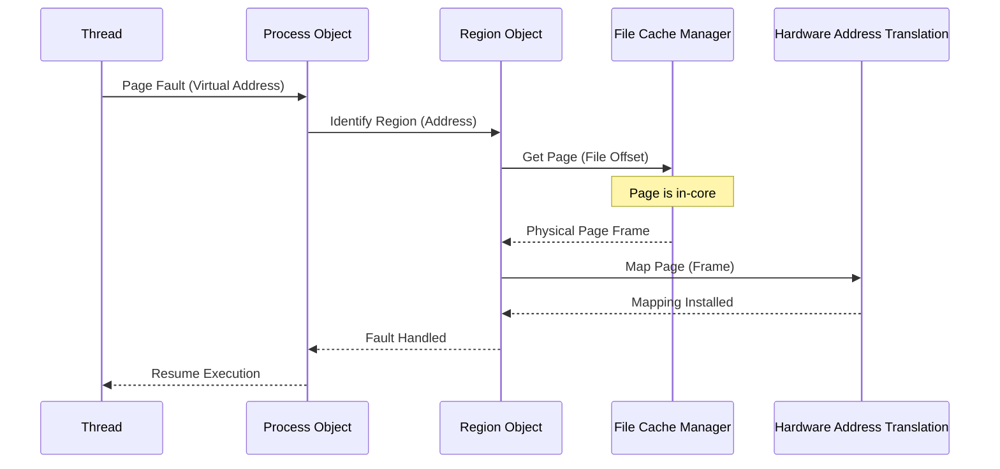

# L04f Shared Memory Multiprocessor OS

> [!summary] TL;DR
> Shared memory multiprocessors introduce unique scaling challenges for operating systems, including NUMA latency, false sharing, and lock contention.
> To address these, operating systems must be redesigned to maximize locality and minimize shared data structures.
> Tornado achieves this through clustered objects and object-oriented memory management.
> Corey introduces address ranges, shares, and dedicated cores to give applications control over sharing.
> Cellular Disco uses virtualization to provide scalability and fault containment on large multiprocessors without rewriting the underlying operating system.

## Learning outcomes

* Describe the performance bottlenecks in shared memory multiprocessors, such as false sharing and NUMA effects.
* Explain the principles of designing scalable operating system structures.
* Analyze the object-oriented design of Tornado and how clustered objects improve locality.
* Compare the different degrees of clustering and their appropriate use cases.
* Evaluate how Corey provides applications with control over operating system sharing.
* Explain how Cellular Disco uses virtualization to achieve fault containment and scalability.

## Motivation and the problem

As multiprocessors scale, traditional operating system designs become a severe bottleneck.
Early multiprocessor operating systems relied on coarse-grained locks, which were sufficient when core counts were low.
However, modern systems feature deep memory hierarchies, non-uniform memory access times, and many cores.
When many threads access global OS data structures concurrently, contention and cache invalidations destroy performance.
The fundamental problem is that the operating system must manage shared resources while keeping memory accesses as local as possible.

## Core concepts

### Challenges of parallel systems

<!-- coverage: L04f-01 -->
> [!note] Definition
> Parallel systems face performance degradation due to physical architecture limits, specifically when multiple processors compete for shared resources or data.

The primary challenge in parallel systems is managing the bottleneck created by global data structures.
As the number of processors increases, the memory latency also increases due to complex interconnects and deeper memory hierarchies.
When multiple processors attempt to access or modify a single data structure, cache coherence protocols generate massive overhead.
This contention forces processors to wait, severely degrading overall system throughput.
To scale effectively, an operating system must avoid centralizing state and instead distribute or replicate data structures.

### NUMA architecture

<!-- coverage: L04f-02 -->
> [!note] Definition
> Non-Uniform Memory Access (NUMA) is an architecture where memory access time depends on the memory location relative to the processor.

In a NUMA system, processors and memory are grouped into nodes connected by an interconnecting network.
A processor can access its local memory much faster than memory attached to a remote node.
This architectural reality means that OS designers must carefully place data near the processors that use it.
If an operating system ignores NUMA topology, threads will frequently fetch data across the interconnect, suffering high latency penalties.
NUMA-aware scheduling and memory allocation are therefore critical for achieving high performance on modern multiprocessors.

### False sharing

<!-- coverage: L04f-03 -->
> [!note] Definition
> False sharing occurs when independent variables reside on the same cache line, causing unnecessary cache invalidations when different processors modify them.

Modern processors fetch memory in chunks called cache blocks or cache lines.
If two threads on different cores update separate variables that happen to fall into the same cache line, the hardware treats them as shared.
The cache coherence protocol will bounce the cache line back and forth between the cores, even though no actual data sharing is occurring programmatically.
This phenomenon degrades performance significantly because the cache misses act exactly like true contention.
Operating systems and applications must pad data structures or align them to cache line boundaries to prevent false sharing.

### OS design principles for scalability

<!-- coverage: L04f-04 -->
> [!note] Definition
> Scalable OS design relies on minimizing shared data, keeping memory accesses local, and exploiting cache affinity.

To scale on a multiprocessor, an operating system must limit the amount of sharing of system data structures.
Cache decisions are paramount; the OS should exploit the affinity of caches by scheduling threads on processors where their data is likely already cached.
Memory accesses should be kept as local as possible to avoid interconnect traffic and NUMA latency penalties.
When shared services are required, the OS should replicate or partition the underlying data structures to reduce locking overhead.
These principles ensure that concurrent executions of services do not artificially bottleneck on shared kernel state.

### Page fault service in a parallel OS

<!-- coverage: L04f-05 -->
> [!note] Definition
> Page fault servicing involves translating a virtual address to a physical frame, which requires both independent thread actions and serialized OS operations.

A page fault requires looking up the TLB and page table, fetching data from disk to a physical frame, and updating the TLB.
TLB and page table lookups are thread-specific and can be executed in parallel.
However, locating data on disk and updating the page table often involve global OS structures, creating a serialization bottleneck.
In a multi-process workload, distinct page tables eliminate most serialization because threads run independently on specific CPUs.
In a multi-threaded workload sharing an address space, the OS must carefully manage shared page tables to minimize serialization and locking contention.

### Tornado clustered objects

<!-- coverage: L04f-06 -->
> [!note] Definition
> A clustered object in Tornado appears as a single logical object but consists of multiple representative objects distributed across processors.

Tornado uses an object-oriented approach where every virtual and physical resource is an independent object.
A clustered object partitions the state of a resource into multiple representatives, each serving a specific subset of processors.
Clients access the object using a single reference, and the system automatically directs the call to the local representative.
This design ensures that independent requests on different processors do not contend for the same locks or cache lines.
Clustered objects allow the OS to optimize for the common case by localizing data access and hiding the complexity of replication from the client.

### Degree of clustering: replicated, partitioned, true shared

<!-- coverage: L04f-07 -->
> [!note] Definition
> The degree of clustering refers to how an object's state is distributed, ranging from a single shared instance to full replication per processor.

The implementer of a clustered object can choose the degree of clustering based on access patterns.
A single representation (true shared) is used for objects that are read-mostly or infrequently accessed, minimizing memory overhead.
Replicated objects maintain a copy of the state on every processor, which is ideal for read-heavy data that requires fast local access but makes updates expensive.
Partitioned objects divide the data among representatives, such as distributing a hash table across cores to balance the load.
Tornado allows dynamic or mixed strategies, such as one representative per cluster of CPUs, to balance memory usage, access speed, and update consistency.

### Object references, translation tables, and miss handling

<!-- coverage: L04f-08 -->
> [!note] Definition
> Tornado routes calls to clustered objects using per-processor translation tables that map a universal object reference to a local representative.

Each processor in Tornado maintains a translation table mapped at a consistent virtual address.
When a thread invokes a clustered object, it uses an object reference as an index into this local table.
If the table entry is empty, a miss occurs, and a global miss handler is invoked to resolve the reference.
The object's specific miss handler then decides whether to create a new local representative or map the reference to an existing one.
This mechanism introduces a slight overhead on the first access but ensures that subsequent calls use a direct pointer to the optimal representative.

### Objectization of memory management

<!-- coverage: L04f-09 -->
> [!note] Definition
> Tornado breaks memory management into independent objects, such as Process, Region, File Cache Manager (FCM), and Cached Object Representative (COR).

In Tornado, the address space is represented by a Process Object, which contains multiple Region Objects.
Each Region Object corresponds to a memory mapped area and is backed by a File Cache Manager.
A Cached Object Representative handles the actual page I/O, while a DRAM object manages physical page frames.
By dividing memory management into these objects, concurrent page faults to different regions do not contend for the same locks.
The objectization allows the system to replicate the Process Object per CPU while keeping the COR globally shared, optimizing each component independently.

### Protected procedure call

<!-- coverage: L04f-10 -->
> [!note] Definition
> Protected Procedure Calls (PPCs) are the mechanism for inter-process communication in Tornado, preserving the locality of client requests.

Tornado implements IPC using Protected Procedure Calls rather than traditional message passing.
When a thread communicates with a service on the same processor, no context switch is required, making the call extremely fast.
If the communication targets a different processor, a full context switch occurs, transferring execution to the remote node.
This design maps the locality and concurrency of client requests directly to the servicing of those requests in the kernel.
It eliminates the need for shared synchronization structures that would otherwise be required to wake up server threads.

### Hierarchical locking and existence guarantees

<!-- coverage: L04f-11 -->
> [!note] Definition
> Tornado replaces traditional hierarchical locking with non-hierarchical, object-internal locking and existence guarantees.

Traditional operating systems use hierarchical locking, where multiple coarse-grained locks must be acquired in a specific order to prevent deadlocks.
This approach kills concurrency, as a thread might lock an entire address space just to handle a fault in one region.
Tornado encapsulates all locking within individual object representatives, eliminating global locks.
To prevent objects from being deleted while in use, Tornado provides existence guarantees using a reference counting garbage collection scheme.
This allows threads to operate concurrently on different regions of the same process without acquiring a global process lock.

### Dynamic memory allocation in a parallel OS

<!-- coverage: L04f-12 -->
> [!note] Definition
> Dynamic memory allocation in a parallel OS must provide processor-local allocation pools to avoid contention and false sharing.

To support clustered objects effectively, Tornado requires a scalable dynamic memory allocator.
The allocator partitions free memory pools into clusters, ensuring that allocations are served from local memory whenever possible.
Small memory blocks are allocated from separate pools to prevent false sharing across different processors.
Tornado optimizes the allocation locks using load-linked and store-conditional instructions, minimizing overhead.
This design allows multiple processors to allocate and free memory simultaneously without creating a central bottleneck.

### Corey: address ranges, shares, dedicated cores

<!-- coverage: L04f-13 -->
> [!note] Definition
> Corey is a multicore OS that provides applications with new abstractions (address ranges, shares, and dedicated cores) to explicitly manage sharing.

Corey addresses scalability by pushing the decision of what to share up to the application level.
Address ranges allow applications to manipulate memory mappings for specific segments without locking the entire address space.
Shares provide a mechanism for processes to explicitly declare which OS data structures (like file descriptors) they will share, avoiding default global visibility.
Dedicated cores allow an application to reserve specific processors exclusively for kernel activities or specific application tasks.
By giving applications control over sharing, Corey avoids the hidden scalability bottlenecks inherent in standard POSIX interfaces.

### Cellular Disco: virtualization for scalability and fault containment

<!-- coverage: L04f-14 -->
> [!note] Definition
> Cellular Disco uses a virtual machine monitor to partition a large shared-memory multiprocessor into smaller, manageable virtual clusters.

Modifying an existing operating system to scale on a massive multiprocessor is highly complex and costly.
Cellular Disco inserts a virtualization layer between the hardware and the operating system.
This layer runs multiple instances of a standard, unmodified operating system, each managing a subset of the hardware resources.
This approach provides fault containment because a crash in one OS instance does not bring down the entire machine.
It achieves scalability by avoiding the OS-level bottlenecks, while the hypervisor transparently manages resource sharing across the hardware.

### Modern descendants: per-CPU data and RCU in Linux

<!-- coverage: L04f-15 -->
> [!note] Definition
> Modern monolithic kernels like Linux have adopted scalable structures such as per-CPU variables and Read-Copy-Update (RCU) synchronization.

The lessons from Tornado and Corey heavily influenced modern mainstream operating systems.
Linux extensively uses per-CPU data structures to ensure that statistics and local queues do not suffer from false sharing or lock contention.
Read-Copy-Update (RCU) allows lockless read access to shared data structures, mimicking the concurrency benefits of Tornado's existence guarantees.
Modern network stacks often dedicate specific CPU queues to packet processing, similar to Corey's dedicated cores.
These techniques allow traditional monolithic kernels to scale gracefully on massive NUMA multiprocessors.

## Mechanisms step by step

Here is the step-by-step mechanism of handling an in-core page fault using Tornado's clustered objects.

1. A thread triggers a page fault exception, which the hardware delivers to the local processor.
2. The exception handler invokes the local representative of the Process Object.
3. The Process Object looks up the faulting virtual address to identify the responsible Region Object.
4. The Region Object translates the virtual address into a file offset and calls the local representative of the File Cache Manager (FCM).
5. The FCM checks its localized cache state and finds that the required physical page is already resident in memory.
6. The FCM returns the physical page frame address to the Region Object.
7. The Region Object invokes the Hardware Address Translation (HAT) object to install the mapping in the local page table.
8. The thread resumes execution seamlessly.

## Worked examples

Consider the overhead of resolving a clustered object reference for the first time in Tornado.
When a processor accesses a clustered object, it uses a local translation table.
If the entry is empty, the system must execute the miss handler to map the object.

1. Initial table lookup: 1 instruction.
2. Miss detection and trap to global miss handler: 20 instructions.
3. Save state and call specific object miss handler: 50 instructions.
4. Object miss handler determines mapping (e.g., local representative exists but was not mapped): 30 instructions.
5. Install mapping in translation table and restore state: 50 instructions.
6. Total overhead: 151 instructions.

Arithmetic check:
1 + 20 + 50 + 30 + 50 = 151 instructions.
For a modern processor executing 4 instructions per cycle at 2 GHz, this overhead is roughly 38 cycles or 19 nanoseconds.
Because this miss occurs only on the first access per processor, the amortized cost across thousands of subsequent fast-path accesses (1 instruction each) approaches zero.

## Comparison

| Feature | Tornado | Corey | Cellular Disco | Traditional OS |
| :--- | :--- | :--- | :--- | :--- |
| **Primary Goal** | Maximize locality via objects | Application control over sharing | Scalability without OS rewrite | General purpose multitasking |
| **Structure** | Object-oriented, clustered | Monolithic with new abstractions | Virtual Machine Monitor | Monolithic |
| **Sharing Default** | Partitioned or replicated | Private by default, explicitly shared | Shared physical, partitioned virtual | Globally shared data structures |
| **Strengths** | Extreme concurrency for OS services | Custom optimization for parallel apps | Fault containment, runs legacy OS | Easy to program, standard POSIX |
| **Costs/Overheads** | Complex miss handling and GC | Requires application rewrites | Virtualization overhead | High lock contention and cache misses |
| **When to Use** | Research and massive NUMA | High-performance user applications | Large SMPs needing fault isolation | Desktop and standard server workloads |

## Paper deep dives

- [Algorithms for Scalable Synchronization on Shared-Memory Multiprocessors](../Papers/L04-MCS-Scalable-Synchronization.md)
This paper introduces the MCS lock, a scalable queue-based spinlock that eliminates the massive cache coherence traffic generated by traditional test-and-set locks.
By having each processor spin on a locally cached flag rather than a global variable, the MCS lock ensures that lock handoffs require a constant number of network transactions regardless of the number of waiting processors.

- [Lightweight Remote Procedure Call](../Papers/L04-LRPC.md)
LRPC optimizes inter-process communication on identical machines by combining the semantics of RPC with the efficiency of shared memory.
It avoids unnecessary data copying and context switch overheads by allowing the client thread to execute the server's code in the server's domain using a shared argument stack.

- [Using Processor-Cache Affinity Information in Shared Memory Multiprocessor Scheduling](../Papers/L04-Cache-Affinity-Scheduling.md)
This research highlights the performance benefits of scheduling threads on processors where their data is already resident in the cache.
It demonstrates that naive load balancing can degrade performance by causing excessive cache misses, and proposes affinity-based scheduling algorithms to mitigate this.

- [Performance of Multithreaded Chip Multiprocessors and Implications for Operating System Design](../Papers/L04-Multithreaded-Chip-Multiprocessors.md)
This paper explores how chip multiprocessors (CMPs) change the assumptions of traditional multiprocessor scheduling.
It argues that the OS must be aware of the shared caches and execution units on a single chip to make intelligent scheduling decisions that minimize contention.

- [Tornado: Maximizing Locality and Concurrency in a Shared Memory Multiprocessor Operating System](../Papers/L04-Tornado.md)
The Tornado paper presents an OS built entirely around clustered objects to maximize locality and minimize shared locks.
It proves that by applying object-oriented design and non-hierarchical locking, an operating system can achieve near-linear scalability for common services like page fault handling and thread creation.

- [Corey: An Operating System for Many Cores](../Papers/L04-Corey.md)
Corey challenges the POSIX standard by demonstrating that default sharing of OS state limits multicore scalability.
By introducing address ranges, shares, and dedicated cores, the paper shows how empowering applications to dictate sharing patterns leads to massive performance gains for parallel workloads like MapReduce.

- [Cellular Disco: Resource Management Using Virtual Clusters on Shared-Memory Multiprocessors](../Papers/L04-Cellular-Disco.md)
Cellular Disco demonstrates that a hypervisor can effectively partition a large shared-memory multiprocessor to provide fault containment and scalability.
It shows that virtualization overheads can be kept minimal while avoiding the immense engineering effort required to rewrite a monolithic OS for a massive SMP architecture.

## Modern descendants

The architectural concepts pioneered by Tornado, Corey, and Cellular Disco are deeply embedded in modern systems.
Linux relies heavily on per-CPU data structures to avoid false sharing and lock contention for network statistics and memory allocation.
Read-Copy-Update (RCU) in Linux provides the lockless read performance and existence guarantees envisioned by Tornado's garbage collection scheme.
The concept of dedicated cores from Corey is now standard practice in high-performance packet processing frameworks like DPDK.
Cellular Disco's approach to virtualization for fault containment paved the way for modern hypervisors like KVM and VMware ESXi, which partition massive servers into manageable virtual machines.

## Pitfalls and exam traps

> [!warning] Exam Trap: False Sharing vs. True Sharing
> Do not confuse false sharing with true sharing.
> True sharing occurs when threads actually need to read and write the same variable, requiring synchronization.
> False sharing is a hardware artifact where independent variables share a cache line, causing unnecessary invalidations.

> [!warning] Exam Trap: Tornado Locking
> Remember that Tornado avoids hierarchical locking.
> It does not solve lock contention by creating a massive lock hierarchy; instead, it uses existence guarantees and localizes locks inside object representatives.

> [!warning] Exam Trap: Corey's Abstractions
> Corey does not automatically optimize POSIX applications.
> An application must be explicitly rewritten to use Corey's address ranges and shares to see scalability benefits; legacy applications may actually run slower if not adapted.

## Practice

- [Practice L04](../Practice/Practice-L04.md)

## Lab

- [lab-09-scalable-structures](../labs/lab-09-scalable-structures/README.md): Scalable kernel-style structures: per-CPU counters, read-mostly data, and false sharing

## Further reading

- [Memory Barriers: a Hardware View for Software Hackers (McKenney)](https://www.kernel.org/doc/Documentation/memory-barriers.txt)
- [Unreliable Guide to Locking (Linux Kernel Documentation)](https://www.kernel.org/doc/Documentation/locking/spinlocks.txt)
- [DPDK: Data Plane Development Kit](https://www.dpdk.org/)
