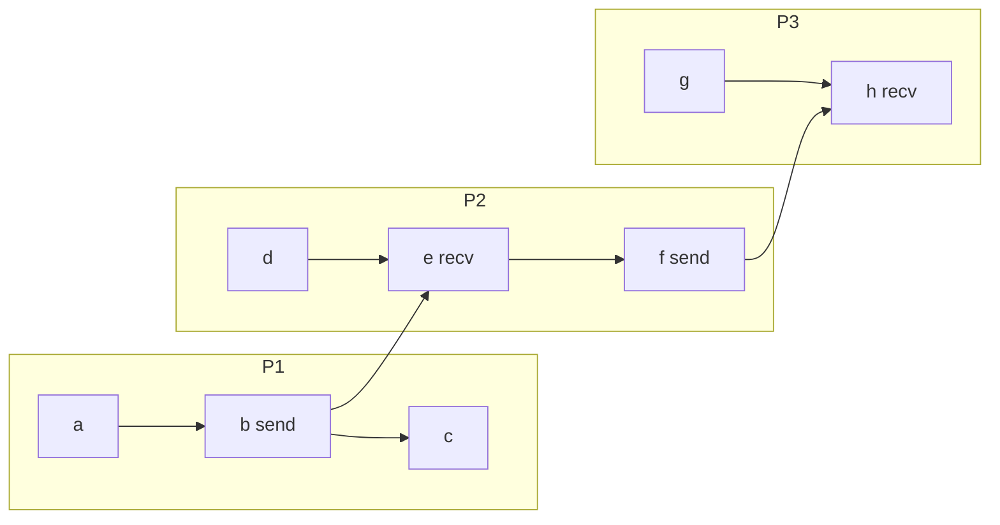

# L05a Distributed Systems Definitions

> [!summary] TL;DR
> A distributed system is a set of nodes that do not share physical memory and that talk only by sending messages.
> It is "distributed" in Lamport's sense when the message delay is not negligible next to the time between events on one node.
> The happened-before relation is the partial order you can actually observe: program order on one process, plus the send of a message before its receive, closed under transitivity.
> Events with no chain either way are concurrent, so no single clock reading can put them in the "true" order.
> Every later topic in this part (logical clocks, RPC latency, active packets, and distributed objects) starts from that partial order and from the fact that a message is expensive.

## Learning outcomes

- State Lamport's test for when a system is distributed, using message time and inter-event time.
- Classify an event as a local computation, a send, or a receive, and say which of those create an edge in the order.
- Draw the happened-before relation for a small execution and mark the concurrent pairs.
- Apply transitivity to turn a path of edges into a single happened-before fact.
- Explain why concurrency is the reason a distributed system has no global total order of real events.

## Motivation and the problem

Shared-memory code can pretend there is one timeline.
A load or a store is visible, in some coherence order, to the other cores, and a lock or a barrier can force a point where everyone agrees on what has already happened.
A distributed system does not have that timeline.
Each node has its own memory, its own program counter, and a clock that is not the same device as anyone else's clock.
The only causal signal that leaves a node is a message, and that message takes long enough that the receiver cannot treat "now" on the sender as "now" locally.
If you sort logs by wall-clock time anyway, you will invent orders that never happened, and you will miss orders that did.
Lamport's 1978 paper replaces the fictional global clock with a relation you can compute from the execution itself.
This lesson is only that relation.
[L05b](L05b-Lamport-Clocks.md) puts numbers on it.

> [!note] Why the delay has to matter
> If every message arrived in essentially zero time, the nodes could share one clock and one memory image and the system would behave like a tightly coupled multiprocessor.
> The interesting problems (ordering, buffering, timeouts, partial failure) show up only because the message is slow relative to local computation.

## Core concepts

### Definition of a distributed system

<!-- coverage: L05a-01 -->

> [!note] Definition
> A distributed system is a collection of nodes connected by a network (a LAN or a WAN) that do not share physical memory.
> Nodes coordinate only by sending and receiving messages.
> Lamport's formal test: the system is distributed when the message transmission time `Tm` is not negligible compared with the time `Te` between events inside a single process.

The course states the same idea in operational language.
There is no physical memory shared between nodes.
Communication is a message on the network, not a store to a common address.
And the time to deliver that message is large next to the time a node spends computing between its own events.
That third clause is the one that makes the definition a performance fact rather than a wiring diagram.
Two processes on one machine that share an address space and call each other through a local procedure are not, by this test, a distributed system, even if a textbook draws them as boxes.
Two processes on one machine that talk through a network stack can be distributed in this sense, because the stack's delay dominates.

A concrete scale comes from the Firefly RPC measurements used later in [L05c](L05c-Latency-Limits.md).
An inter-machine call that sends no arguments and returns no result takes 2.66 milliseconds.
The same system's minimal same-machine RPC already takes 937 microseconds, which the Firefly paper reports as about 60 times a local procedure call.
Dividing the cross-machine null RPC by that implied local call gives `2660 / (937/60) = 2660 * 60 / 937 = 170.3`, so the network hop is on the order of 170 local calls.
A node can execute a long stretch of its own events while one message is in flight.
Any design that assumes the receiver observes the send "at the same time" is using a model this definition rejects.

The definition does not require the nodes to be geographically far apart.
A machine room on one reliable LAN still qualifies when `Tm` is not negligible next to `Te`.
It also does not require failures.
Partial failure and partitions make the system harder, but the ordering problem exists even when every message arrives.

### Events: computation, send, receive

<!-- coverage: L05a-02 -->

> [!note] Definition
> An event is one of three things a process does: a local computation, the send of a message, or the receive of a message.
> Processes are sequential, so the events of one process form a total order.
> A send happens before the matching receive.

Lamport's model is deliberately small.
A process is a sequence of events.
The sequence is the program order: if event `a` is earlier than event `b` in the text of process `i`, then `a` happened before `b` on `i`.
Local computation covers everything that does not cross the network: arithmetic, a local lock, a read of local memory, a timer interrupt handled on that node.
A send is the act of handing a message to the network, and it is an event of the sender.
A receive is the act of taking that message out of the network, and it is an event of the receiver.
The paper allows several sends to be one event, but a single receive does not coincide with another send or receive.
That keeps the diagram a set of points with a clean edge per message.

Two beliefs fix the edges you are allowed to draw before you even look at clocks.
First, a process does not run its events backwards or in parallel with itself.
Second, a message cannot be received before it is sent.
There is no third belief of the form "the receive happens within X microseconds."
The model records that the send precedes the receive, and it records nothing about how long the gap was.

These three event types are also the only places a later protocol can attach a timestamp.
A computation updates the local clock because the process moved forward.
A send reads the clock and puts that value in the message.
A receive combines the local clock with the value from the message.
If you timestamp only the sends, you cannot order two local computations that have no message between them, and you cannot enforce "my request is at the head of the queue" in the mutual-exclusion algorithm of [L05b](L05b-Lamport-Clocks.md#distributed-mutual-exclusion-lock-algorithm).

> [!warning] A message is two events, not one
> Students draw a message as a single dot sitting between two processes.
> The send and the receive are different events on different processes, and only the send-before-receive edge connects them.
> Anything the receiver does after the receive is ordered after the send.
> Anything the receiver did before the receive is not.

### Happened-before relation

<!-- coverage: L05a-03 -->

> [!note] Definition
> Event `a` happened before event `b`, written `a -> b`, when either (1) `a` and `b` are in the same process and `a` comes first in that process, or (2) `a` is the send of a message and `b` is the receive of that same message.
> The relation is the smallest relation that contains those two rules and is closed under transitivity, covered in the next section.
> If neither `a -> b` nor `b -> a`, the events are concurrent.

Happened-before is not wall-clock time and it is not "could have affected."
It is exactly the set of pairs a perfect observer can justify from program order and from the messages that were actually sent.
Lamport is explicit that the relation uses the messages that were sent, not the messages that could have been sent.
A pair of events on different machines with no chain of messages between them has no happened-before edge, even if a faster network would have let one influence the other.

Read the relation as potential causality.
If `a -> b`, then `a` could have affected the state that `b` saw: the effect travels along program order inside a process, or it travels inside a message.
If there is no path, there is no way for the result of `a` to have been an input to `b`.
That is why the relation is the right specification for "what must a clock respect."
A logical clock is correct when it numbers events so that `a -> b` implies the number of `a` is less than the number of `b`.
The converse is false, and that false converse is the whole point of [partial order and its limits](L05b-Lamport-Clocks.md#partial-order-and-its-limits).

The same relation is what a distributed debugger, a causal-consistency store, and a Raft log are all approximating.
They differ in how much of the relation they track and in what they do when the path is missing.
They do not get a stronger order by wishing for a shared clock.

### Transitivity of happened-before

<!-- coverage: L05a-04 -->

> [!note] Definition
> Happened-before is transitive: if `a -> b` and `b -> c`, then `a -> c`.
> A chain of program-order steps and message edges is one happened-before fact, even when the ends of the chain never communicated directly.

Transitivity is what makes the relation describe the system rather than only the neighbors.
Process P1 does not send a message to P3 in the worked example below.
P1 sends to P2, and P2 later sends to P3.
The event on P1 still happened before the receive on P3, because the state that P2 put in the second message can depend on what P1 sent.
Drop transitivity and you would conclude that P1 and P3 are unordered, which would let a clock assign P3's receive an earlier number than P1's send.
That assignment violates the only rule a logical clock is required to keep.

Transitivity also explains why "I never talked to you" is not the same as "I am concurrent with you."
Indirect communication still orders the endpoints.
In a service with a front-end, a cache, and a database, the client's request happened before the database write if the front-end's message to the cache and the cache's message to the database form a chain, even though the client opened only one connection.

The closure is finite for any real execution.
Each process has a finite prefix, each message is one edge, and the transitive closure is the reachability relation on that DAG.
There are no cycles: a cycle would mean an event happened before itself, which program order and send-before-receive cannot produce.
If your diagram has a cycle, you have drawn a receive before its send or you have ordered a process against itself.

### Concurrent events

<!-- coverage: L05a-05 -->

> [!note] Definition
> Events `a` and `b` are concurrent, written `a || b`, when they are on different processes and no chain of program order and messages connects them in either direction.
> Equivalently, `a` did not happen before `b` and `b` did not happen before `a`.
> Concurrent does not mean "at the same wall-clock instant."
> It means the execution itself does not say which came first.

Concurrency is the reason happened-before is a partial order and not a total order.
Two independent clients can both submit a request, and until those requests meet at a common process there is no fact of the matter about which request "really" happened first.
Any total order you publish (a log, a lock queue, a commit timestamp) is an extension you chose, not a measurement you made.
The tie-break in [Lamport's total order](L05b-Lamport-Clocks.md#lamport-total-order-and-tie-breaking) is exactly this choice, and it has to be an arbitrary but agreed rule such as process id.

Concurrency is also why replicas diverge if they apply updates in the order the updates happen to arrive.
If `a || b`, both orders `a` then `b` and `b` then `a` are consistent with happened-before.
A system that needs one answer (a lock, a bank balance, a unique DNS name) must add a protocol that picks an extension.
A system that can keep both answers (a shopping cart that merges, a Dynamo-style sibling set) can expose the concurrency instead of hiding it.

Do not confuse concurrency with parallelism.
Two events can be concurrent and still be far apart in real time: a job on one continent and a job on another with no traffic between them.
Two events can be almost simultaneous in real time and still be ordered, if a message from one has already been received by the other.
The relation does not read the oscilloscope.
It reads the messages.

## Mechanisms step by step

Build the relation from a trace in four steps.

1. Write each process as a left-to-right sequence of events.
   That sequence is program order, and every adjacent pair is a happened-before edge.
2. Draw one edge from each send to its matching receive.
   The send is on the sender's sequence.
   The receive is on the receiver's sequence.
3. Take the transitive closure.
   Any path, including paths that change process at a message, is a happened-before pair.
4. Every pair with no path either way is concurrent.
   Those pairs are the ones a later total order is free to break either way.

The diagram is the running example for the rest of the lesson.
P1's events are `a`, then `b` (a send), then `c`.
P2's events are `d`, then `e` (the receive of `b`), then `f` (a send).
P3's events are `g`, then `h` (the receive of `f`).
There is no message from P1 to P3 and no message into `g`.

## Worked examples

Take the diagram above and list the ordered pairs that are not just the adjacent edges.

Program order gives `a -> b -> c`, `d -> e -> f`, and `g -> h`.
The messages give `b -> e` and `f -> h`.
Transitivity adds, among others:

- `a -> e`, `a -> f`, and `a -> h` (the chain `a -> b -> e -> f -> h`)
- `b -> f` and `b -> h`
- `d -> f` and `d -> h` (because `d -> e` and `e` is on the path to `h`)
- `e -> h`

Now the concurrent pairs.
`g` has an outgoing edge only to `h`, and nothing points at `g`.
So `g` is concurrent with `a`, `b`, `c`, `d`, `e`, and `f`.
`c` is after `b` on P1, but no edge leaves `c`, and no edge from P2 or P3 reaches `c`.
So `c || d`, `c || e`, `c || f`, `c || g`, and `c || h`.
`d` is before the receive on P2, so `d` is concurrent with `a` and `b`: P2 had not yet observed P1.
Check one non-pair so the test stays sharp: `a` and `h` are not concurrent, because the path `a -> b -> e -> f -> h` exists.

Count the edges a clock must respect.
Direct edges: 3 on P1's adjacent steps wait, P1 has two adjacent steps (`a-b`, `b-c`), P2 has two (`d-e`, `e-f`), P3 has one (`g-h`), plus 2 messages, so 7 direct edges.
The clock condition only has to number those 7 correctly.
Transitivity is then free: if every direct edge increases the number, every path does too.
That is why the logical-clock rule in the next lesson is stated on program order and on a single message, not on the whole closure.

A second numeric check, on the definition rather than the diagram.
Firefly's cross-machine null RPC is 2.66 ms and its same-machine RPC is 937 us.
The ratio is `2.66 / 0.937 = 2.84`.
Even the on-box RPC, which never touches the Ethernet, is already about 60 times a local procedure call.
Both numbers satisfy `Tm` not negligible next to `Te` if `Te` is a local call.
A design that special-cases "same machine" still has to treat the call as a message with send and receive events, which is what LRPC and Spring doors do for a different reason: they keep the protection boundary while cutting the copies.

## Comparison

| Model | What orders events | What is concurrent | What you pay |
| --- | --- | --- | --- |
| Single process | Program order, a total order | Nothing inside the process | No messages |
| Shared-memory multiprocessor | Program order plus the coherence order on each location | Accesses the memory model leaves unordered | Cache-line transfers, not network messages |
| Lamport distributed system | Program order plus send-before-receive, then transitive closure | Any pair with no path | `Tm` much larger than a local event; no shared physical memory |
| Wall-clock total order | A reading of each node's physical clock | Pairs the clocks happen to stamp with the same number | Looks total, but can order a receive before its send when clocks are skewed |

Use happened-before when the question is "what could have caused this."
Use a chosen total order when the question is "who gets the lock" or "which write wins."
Use wall-clock order only after you have proved the clocks cannot create an anomaly, which is the physical-clock condition in [L05b](L05b-Lamport-Clocks.md#lamport-physical-clock-conditions).

## Paper deep dives

Leslie Lamport's [Time, Clocks, and the Ordering of Events in a Distributed System](../Papers/L05-Time-Clocks-Ordering.md) (CACM 1978) is the source of this lesson.
The paper defines the happened-before relation from program order and messages, shows that logical clocks can respect it, extends the partial order to a total order with a process-id tie break, and uses that total order to build a distributed mutual-exclusion algorithm.
The same paper then states the two physical-clock conditions that keep real-time anomalies from appearing when you mix logical rules with drifting hardware clocks.

[Limits to Low-Latency Communication on High-Speed Networks](../Papers/L05-Limits-Low-Latency.md) (Thekkath and Levy, TOCS 1993) measures where a cross-machine RPC actually spends its time once the messages of this lesson are no longer free.
On DECstation 5000/200 hosts and a FORE ATM network they record a 170 microsecond user-to-user round trip, and they show that a faster wire does not by itself cut the small-packet latency.

[The x-Kernel](../Papers/L05-x-Kernel.md) (Hutchinson and Peterson, IEEE TSE 1991) is an operating-system architecture for building those messages out of protocol objects instead of a pile of special-case kernel code.
On a Sun 3/75 and a 10 Mbit Ethernet, a one-byte UDP/IP round trip is 2.00 ms in the x-kernel against 5.36 ms on the SunOS socket path.

[Active Networks: Vision and Reality](../Papers/L05-Active-Networks-ANTS.md) (Wetherall, SOSP 1999) asks what happens if the message carries not only data but the code that intermediate nodes should run.
ANTS capsules keep that code out of the slow path by caching it, and the paper's measurements show both the flexibility and the Java user-level cost.

[Building Reliable, High-Performance Communication Systems from Components](../Papers/L05-Ensemble-Systems-from-Components.md) (Liu and colleagues, SOSP 1999) builds the same kind of message path from many small protocol layers and then uses a theorem prover to collapse the common path.
A 4-layer reliable-multicast stack drops from 13 microseconds of send overhead to 2 microseconds on a 300 MHz UltraSPARC.

[Performance of the Firefly RPC](../Papers/L05-Firefly-RPC.md) (Schroeder and Burrows, SOSP 1989) is a partial reading.
The syllabus does not assign sections, so it is not a required exam reading by itself, but the lecture uses its accounting: a null inter-machine RPC is 2.66 ms, and a same-machine RPC is 937 us.
Those are the numbers behind `Tm` versus `Te` in this lesson.

## Modern descendants

Vector clocks (Fidge and Mattern, independently, around 1988) store the whole partial order instead of a single number, so they can tell concurrency from causality.
Dynamo-style stores use that vector, or a compact version of it, to keep sibling values when two writes were concurrent rather than pretending one happened first.
Hybrid logical clocks keep Lamport's "if it happened before, the number is smaller" rule while staying close to wall time, which is what a SQL transaction timestamp wants.
Raft does not replace happened-before: a leader's log is one chain of the relation, and the term number is how a new leader refuses to order a receive before a send it never saw.
Spanner's TrueTime is the physical-clock side of the same problem, covered with the drift bounds in the next lesson.
None of these systems recovered a shared physical memory.
They all still pay a message.

## Pitfalls and exam traps

> [!warning] "Concurrent" is not "simultaneous"
> `a || b` means there is no happened-before path.
> The events can be seconds apart.
> A pair that really did overlap in real time can still be ordered if a message connects them.

> [!warning] Transitivity crosses process boundaries
> If P1 sends to P2 and P2 later sends to P3, P1's send happened before P3's receive.
> The exam picture often omits the direct P1-to-P3 message on purpose.
> The path is still there.

> [!warning] Happened-before does not say "b was caused by a"
> It says `a` could have affected `b` along the messages that were sent.
> Independent events that happen to be ordered by a clock reading are not a happened-before pair unless a path exists.

> [!warning] A total order is extra structure
> Sorting by process id, by a lock queue, or by a database timestamp adds pairs the execution did not contain.
> That is legal only when you say you are extending the partial order, and only when the extension still respects every real edge.

## Practice

- [Practice L05](../Practice/Practice-L05.md)

## Lab

- [lab-10-clocks-and-mutex](../labs/lab-10-clocks-and-mutex/README.md) builds this relation in a simulator, then checks a logical clock and Lamport mutual exclusion against it.

## Further reading

- Lamport, "Time, Clocks, and the Ordering of Events in a Distributed System," CACM 1978. <https://doi.org/10.1145/359545.359563>
- Schroeder and Burrows, "Performance of Firefly RPC," SOSP 1989, for the 2.66 ms and 937 us figures used as the scale of `Tm`. <https://doi.org/10.1145/74850.74859>
- The lesson notes that use the relation: [Lamport clocks](L05b-Lamport-Clocks.md), [latency limits](L05c-Latency-Limits.md).
