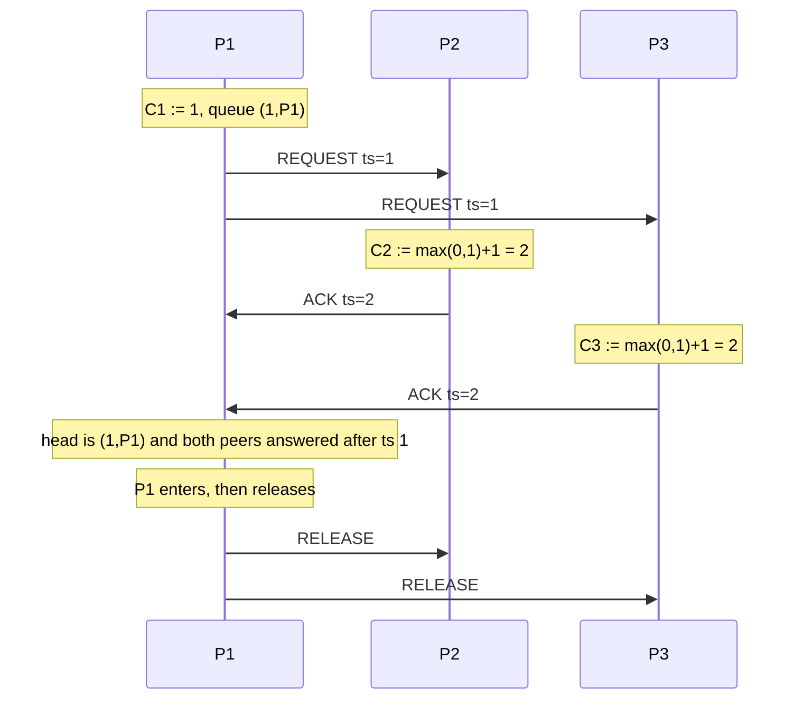

# L05b Lamport Clocks

> [!summary] TL;DR
> A Lamport clock is a counter per process that numbers events so happened-before always increases the number.
> The update is local-increment, and on receive the counter jumps to one past the maximum of the local value and the sender's timestamp.
> That numbering is only a partial order: equal or incomparable timestamps do not mean the events were concurrent, and concurrent events can receive arbitrary numbers.
> Breaking ties with a fixed process order turns the partial order into a total order that no longer means time, and that total order is enough to build a distributed lock.
> The lock costs `3(N-1)` messages in the straightforward form, and redundant acknowledgements can be dropped until the cost approaches `2(N-1)`.

## Learning outcomes

- Apply the two logical-clock conditions and the receive rule to a short execution.
- Show a pair of events whose clock order is not a happened-before order, and say what that limits.
- Build Lamport's total order with an explicit tie break and use it to decide who enters a critical section.
- Count request, acknowledgement, and release messages for N processes, then show which acknowledgements a later message makes redundant.
- Check the physical-clock inequality `mu >= epsilon / (1 - kappa)` with concrete drift numbers.

## Motivation and the problem

[Happened-before](L05a-Distributed-Systems-Definitions.md#happened-before-relation) tells you which events could have affected which other events, but it is a graph, not a name you can put in a message.
A process that wants a lock, or a replica that wants to apply updates in one order, cannot ship the whole graph in every packet.
Lamport's move is to summarize the graph with one integer per event, maintained with only the information a process already has: its own past, and the timestamp inside each message it receives.
The integer is not time.
It is a name that respects causality and that every process can compute without shared memory.
Once every event has a name, a fixed rule for equal names (the process id) gives one total order, and a total order is exactly what mutual exclusion needs.
The second half of the lesson puts the integers back in contact with real clocks, because users do care about wall time and a drifting crystal can order a reply before the request that caused it.

## Core concepts

### Lamport logical clocks

<!-- coverage: L05b-01 -->

> [!note] Definition
> Each process `i` keeps a counter `Ci`, its logical clock.
> The timestamp of an event on `i` is the value of `Ci` when that event happens.
> The counter only moves forward.
> For a message, the timestamp that travels on the wire is the sender's clock, and the receiver sets its own clock from the greater of the two sides.

The implementation is three lines and it is worth memorizing as rules rather than as code.

- Before a local event, or before sending, process `i` sets `Ci := Ci + 1` and uses that new value as the event's timestamp.
- The send carries the timestamp `T = Ci`.
- On receiving a message stamped `T`, process `j` sets `Cj := max(Cj, T) + 1`, and that new value is the timestamp of the receive event.

The course states the receive rule as `Cj(receive) = max(Ci(send) + 1, Cj)` after the receiver has accounted for its own progress.
Both forms do the same job: the receive's number is strictly larger than the send's number, and it is strictly larger than the receiver's previous number.
Nothing in the rule looks at a quartz oscillator.
A process that has been quiet for an hour and then receives a message stamped 5 will set its clock to 6, not to "an hour later."
That is a feature.
The clock tracks causality, so a quiet process does not invent a gap that other processes would have to honor.

Space is one integer per process, independent of how many processes exist.
That compactness is why the clock is still used as a building block even though it throws away concurrency information.
The price shows up in the partial-order section: from the integers alone you cannot reconstruct which events were concurrent.

### Logical clock conditions

<!-- coverage: L05b-02 -->

> [!note] Definition
> The clock condition is: if `a -> b`, then `C(a) < C(b)`.
> It splits into two local rules.
> If `a` and `b` are events of the same process `i` and `a` comes first, then `Ci(a) < Ci(b)`.
> If `a` is a send on `i` and `d` is the matching receive on `j`, then `Ci(a) < Cj(d)`.

The first rule is just "the counter increments between events of one process."
The second rule is why the receiver takes `max(local, T) + 1` instead of `local + 1`.
Suppose `Ci(a) = 10` and the receiver's clock is still 4.
Incrementing the receiver to 5 would stamp the receive with 5, and `5 < 10` violates the condition even though the message edge says the send happened before the receive.
Taking `max(4, 10) + 1 = 11` restores the condition.
If the receiver is already at 40, `max(40, 10) + 1 = 41`, which is still greater than 10, so a fast receiver does not move backwards.

The condition is one direction only.
`C(a) < C(b)` does not imply `a -> b`.
Forcing the other direction is impossible with a single integer, because concurrent events need incomparable names and the integers are totally ordered.
The course records the practical consequence: when `b` and `d` are concurrent, their timestamps are arbitrary.
Either number can be larger, and a protocol must not treat the larger number as "happened later" unless it has an independent reason.

Any clock that increments on the direct edges automatically respects the transitive closure.
If `a -> b` and `b -> c` each raise the number, then `C(a) < C(c)`.
You do not need a third implementation rule for paths that cross several processes.
That is the same counting argument as in [L05a](L05a-Distributed-Systems-Definitions.md#worked-examples): honor the direct edges and transitivity is free.

### Partial order and its limits

<!-- coverage: L05b-03 -->

> [!note] Definition
> Lamport clocks assign a number to every event so that happened-before is embedded in the ordinary order of the numbers.
> The embedding is not an isomorphism.
> Different events can receive the same number, and a smaller number does not prove happened-before.
> The structure you actually captured is still a partial order.

Two limits matter on an exam.

First, the clock can order events that are concurrent.
In the worked trace below, P1's local event `c` and P2's event `d` are concurrent, but the counters may still satisfy `C(c) < C(d)` or the reverse, depending on who has received what.
A debugger that prints "c then d" because `4 < 7` is adding an edge the execution does not have.
That is harmless for a display and fatal for a protocol that uses the edge to drop an update.

Second, the clock cannot tell you why a number is smaller.
`C(a) < C(h)` might mean there is a message path from `a` to `h`, or it might mean some unrelated process ran its counter up and a later message imported that large value.
After a few receives, one busy client can drag every other clock upward, and the numbers stop looking like a count of causal steps.
Vector clocks, in the descendants section, exist because of this limit: each process keeps one slot per process, and slot `k` advances only because of process `k`.
Dominance of the whole vector is then exactly happened-before.

The limit is also why you must not use a Lamport timestamp as a unique id without a tie break.
Two processes can both stamp an event with 5.
The partial order says those events are unordered by the clock.
A map keyed only by the integer will collide.

### Lamport total order and tie breaking

<!-- coverage: L05b-04 -->

> [!note] Definition
> Define `a => b` when either `Ci(a) < Cj(b)`, or `Ci(a) = Cj(b)` and process `i` precedes process `j` in a fixed total order on process ids.
> The course's example of that fixed order is "the greater process id is ordered first."
> The symbol `=>` is a total order.
> It contains happened-before, and it orders every pair the partial order left open.

The tie break is arbitrary and it must be the same arbitrary rule at every process.
Process id works because every process already knows the id in the message and no extra round is required to agree on it.
"Greater id goes first" and "smaller id goes first" are both correct.
They produce different total orders.
Mixing them, so that P1 thinks higher ids win and P2 thinks lower ids win, produces two heads of the lock queue and the mutual-exclusion proof collapses.
Pick one in the exam and use it on every comparison.

Once the total order exists, the timestamp has stopped meaning "time."
The course says this directly: after you have the total order, the timestamps are meaningless as times.
They are just the keys of a sort.
Event `a` can be ordered before event `b` because `Pi` has a larger id, even though `a` and `b` are concurrent and neither could have affected the other.
That is acceptable for a lock, because a lock needs one winner, not a causal explanation.
It is not acceptable as a substitute for happened-before in a causal-consistency proof.

The total order is also not unique.
Any other agreed tie break gives another total order that still respects every happened-before edge.
Algorithms that say "the Lamport order" without stating the tie break are incomplete.
State the rule next to the clock.

### Distributed mutual exclusion lock algorithm

<!-- coverage: L05b-05 -->

> [!note] Definition
> Lamport mutual exclusion uses one queue per process, ordered by the total order above.
> To acquire, a process timestamps a request and sends it to every other process.
> Each receiver inserts the request and replies with an acknowledgement.
> The requester enters when its request is at the head of its own queue and it has heard from every other process at a timestamp later than the request.
> To release, it deletes its request and sends a release to everyone, and each receiver deletes that request.

There is no shared memory, so there is no test-and-set location.
The queue is replicated.
Each process stores the requests it has heard about, sorted by `(timestamp, process id)` using the agreed tie break.
The algorithm's safety does not come from one process holding "the" queue.
It comes from the fact that every process inserts requests in the same total order, and a process does not enter until it knows that no earlier request is still unknown to it.
The acknowledgement, or any later message from that peer, is the proof that the peer's earlier requests have already arrived.
Because messages from one sender arrive in order and are not lost, a later timestamp from `j` means every request `j` sent before that timestamp is already in the queue.

The assumptions are part of the algorithm, not scenery.

- Messages between a given pair are delivered in send order.
- Messages are not lost.
- The queues use the same total order.

Drop the first assumption and a request can arrive after an acknowledgement that was meant to prove the request had already been seen.
Drop the second and a process can wait forever for an acknowledgement from a live peer, or enter without having seen a request that is still in flight.
The algorithm as stated does not tolerate crashes.
A crashed process looks like a process that has not acknowledged, and everyone else waits.
Later locks (a majority vote, a lease, a failure detector) exist to remove that assumption.
Do not add them silently and still call the result Lamport's algorithm.

The enter rule in full, for process `i` with request timestamp `Ti`:

1. `(Ti, i)` is the minimum element of `i`'s queue.
2. For every other process `j`, `i` has received at least one message from `j` whose timestamp is greater than `Ti`.

The second clause is stronger than "I received an acknowledgement," and that extra strength is what the optimization in the next section uses.
A request or a release from `j` with a large enough timestamp is as good as an acknowledgement.

Release is the delete step.
Process `i` removes `(Ti, i)` from its own queue and sends release to the others.
On receipt they remove `(Ti, i)`.
The new head, if it is a local request and the "heard from everyone" clause already holds, enters.
No extra grant message is required.

### Message complexity of Lamport mutual exclusion

<!-- coverage: L05b-06 -->

> [!note] Definition
> One acquire-and-release, with no piggybacking, sends `N - 1` requests, `N - 1` acknowledgements, and `N - 1` releases.
> The total is `3(N - 1)`.
> An acknowledgement can be omitted when some other message from the same process already carries a timestamp greater than the request it would have acknowledged.
> In the fully queued case that omission removes the acknowledgement wave and leaves `2(N - 1)`.

The `3(N - 1)` count is for one critical-section episode of one process, talking to each of the other `N - 1` processes three times.
It is not `3N`.
The process does not send to itself.
For `N = 3` the straightforward episode is 6 messages.
For `N = 10` it is 27.
The count grows linearly with `N` per critical section, so the algorithm is a teaching algorithm and a correctness argument, not a design for a large lock service.
A token on a ring is `O(N)` in the worst waiting time too, but the steady-state message cost of passing a token can be one message per handoff.
Maekawa's quorum algorithm is `O(sqrt(N))` requests.
Those comparisons belong in the table below.
They do not change the Lamport count.

The optimization follows from the enter rule, and it matches the course's remark that a later unlock can stand in for an acknowledgement.
Suppose process `i`'s request precedes process `j`'s request in the total order, and `j` has already inserted `i`'s request.
Then `j` does not have to acknowledge `i` immediately if `j` will soon send its own request or, more usefully, if the process that is ahead of `j` will release.
Two concrete savings:

- If `j` itself sends a request stamped `Tj > Ti` to `i`, that request is a message from `j` with a timestamp above `Ti`.
  It satisfies clause 2 of `i`'s enter rule.
  The acknowledgement from `j` to `i` is redundant.
- If `i` is ahead of `j` and `i` still holds the lock, `i` can defer the acknowledgement of `j`.
  The release `i` sends when it leaves carries a timestamp above `Tj` (the release is a later event on `i`, so the clock has moved past `Ti` and, after `i` received `j`'s request, past `Tj` as well).
  That release both deletes `i` from `j`'s queue and proves to `j` that `i` has reported a later timestamp.
  One message does the job of acknowledgement plus release.

When every process requests and the acknowledgements are all replaced this way, each episode contributes `(N - 1)` requests and `(N - 1)` releases, which is `2(N - 1)`.
Ricart and Agrawala's 1981 algorithm commits to that bound as the normal case: a process replies immediately if it does not want the lock or if its own request is later, and it delays the reply until it leaves the critical section otherwise.
There is no separate release broadcast.
The delayed reply is the grant.
The message count is exactly `2(N - 1)` per entry, not only in the lucky piggyback case.
Lamport's paper is the `3(N - 1)` algorithm plus the observation that a later message can replace an acknowledgement.
Ricart-Agrawala is the published algorithm that always sends two waves.
Do not swap the two counts on the exam.

### Lamport physical clock conditions

<!-- coverage: L05b-07 -->

> [!note] Definition
> A physical clock `Ci(t)` reads a real-time value at real time `t`.
> PC1 bounds how fast one clock drifts from real time: the absolute value of `dCi/dt - 1` is less than `kappa`, with `kappa` much less than 1, for every process.
> PC2 bounds how far two clocks sit from each other: the absolute value of `Ci(t) - Cj(t)` is less than `epsilon` for every pair and every `t`.

PC1 says each clock is a reasonable watch.
If `kappa = 10^-6`, then over one real second the clock advances somewhere between `1 - 10^-6` and `1 + 10^-6` seconds.
It does not run at half speed and it does not jump by minutes.
PC2 says the watches are synchronized tightly enough that at any single real time their readings differ by less than `epsilon`.
PC2 is not free.
Something (a synchronization protocol, a GPS receiver, a common backplane) has to keep establishing it, because PC1 alone lets two clocks walk apart at about `2 * kappa` per second.

These conditions do not mention messages.
They become a distributed-systems statement only when you ask them to protect happened-before against the anomaly users care about: event `a` really happened before event `b` in wall time, a person can see that, and the clock numbers say the opposite.
The classic picture is a user who issues a request on one machine and sees the reply generated on another machine, then looks at a log sorted by clock and finds the reply first.
Logical clocks cannot create that picture, because the reply's send is a later event than the request's receive along the message path, so the logical number of the reply is larger.
Physical clocks can create it if the receiver's watch is behind the sender's watch by more than the message delay.

The requirement that prevents the anomaly is: a message sent at real time `t` on `i` and subject to a minimum delay `mu` must be stamped at the receiver with a reading greater than `Ci(t)`.
In clock-difference form, for every pair and every `t`,

`Ci(t + mu) - Cj(t) > 0`.

PC1 and PC2 imply this inequality when `mu` is large enough relative to the skew.
The next section is that algebra.
The conditions by themselves are only the assumptions.
The inequality is the theorem you use.

### IPC time and clock drift

<!-- coverage: L05b-08 -->

> [!note] Definition
> Let `mu` be a lower bound on the real time it takes a message to travel from one process to another.
> To avoid the anomaly above it is enough that `mu >= epsilon / (1 - kappa)`, where `epsilon` is the PC2 bound and `kappa` is the PC1 bound.
> If the network can deliver a message faster than that, no clock-synchronization scheme with those bounds is safe, and you must either tighten `epsilon` or stop trusting physical timestamps for order.

The derivation is short and it is the one to reproduce.

Start from the goal `Ci(t + mu) - Cj(t) > 0`.
Split the difference by adding and subtracting `Ci(t)`:

`Ci(t + mu) - Cj(t) = (Ci(t + mu) - Ci(t)) + (Ci(t) - Cj(t))`.

PC1 says clock `i` runs at a rate greater than `1 - kappa`, so over a real interval of length `mu` it advances by more than `mu * (1 - kappa)`:

`Ci(t + mu) - Ci(t) > mu * (1 - kappa)`.

PC2 says `Ci(t) - Cj(t) > -epsilon`, because the clocks differ by less than `epsilon` in either direction.
Add the two lower bounds:

`Ci(t + mu) - Cj(t) > mu * (1 - kappa) - epsilon`.

The right-hand side is positive when `mu * (1 - kappa) > epsilon`, which rearranges to

`mu >= epsilon / (1 - kappa)`.

Every symbol in that display is a bound you choose or measure, not a timestamp.
`kappa` is a property of the oscillator.
`epsilon` is a property of the synchronization protocol.
`mu` is a property of the network, and it is a lower bound.
An average latency does not appear.
A single fast message shorter than `mu` breaks the proof even if almost every message is slower.

The implementation rule that goes with the proof is the physical version of the receive rule.
When a message arrives with timestamp `T`, the receiver sets its clock to at least `T` plus the minimum delay, if its own reading is behind, and it never moves the clock backwards.
That is the same `max` as the logical rule, with real numbers and with `mu` added so the receive is stamped observably later than the send.
If you omit `mu` and the two clocks are skewed by almost `epsilon`, a fast message can still be stamped in the past relative to its sender.

### Modern descendants: vector clocks and hybrid logical clocks

<!-- coverage: L05b-09 -->

> [!note] Definition
> A vector clock stores one Lamport counter per process.
> Process `i` increments slot `i` on its own events, and on receive it takes the component-wise maximum with the sender's vector and then increments its own slot.
> Happened-before is exactly vector dominance: `a -> b` if and only if `V(a)` is less than or equal to `V(b)` in every slot and strictly less in one.
> A hybrid logical clock keeps a physical component and a logical component in one timestamp, so the order still respects happened-before while the physical component stays close to wall time.

Vector clocks pay `O(N)` integers in every message to remove the limit in the partial-order section.
If neither vector dominates the other, the events are concurrent, and a store can keep both updates instead of dropping one.
Dynamo uses this idea for version vectors on replicated keys: concurrent writes become siblings, and a later read must reconcile them.
The cost is the vector itself.
At hundreds of replicas a full vector is too wide, so production systems compress it (a version vector per client rather than per replica, or a dotted version vector) and accept that the compression can no longer name every concurrent pair.

Hybrid logical clocks are the other direction: stay near physical time, because users and transactions want a timestamp that means "about when," but do not let the physical component violate causality.
One standard shape (Kulkarni, Demirbas, and colleagues) is a pair `(l, c)` where `l` is a physical reading and `c` is a counter.
When a process does an event or receives a message, `l` becomes the maximum of the local physical clock, the previous `l`, and the message's `l`.
If that maximum did not move `l` forward, `c` increments; if `l` moved forward, `c` resets.
The lexicographic order of the pairs then satisfies the Lamport clock condition, and `l` cannot run far from the physical clock unless the physical clocks themselves are far apart.
CockroachDB's hybrid logical clocks are this design: transactions get a timestamp that causality cannot invert, without waiting for a TrueTime-style uncertainty interval on every commit.

Spanner's TrueTime is the pure physical descendant of PC1 and PC2.
Each timestamp is an interval `[earliest, latest]` whose width is the current `epsilon`, and a commit waits out that interval so the chosen timestamp is provably after the previous one in real time.
That buys externally consistent transactions and costs the wait.
A Lamport clock never waits and never gives you external consistency.
Pick the descendant that matches the question: concurrency detection (vector), causality plus wall time (hybrid), or real-time external order (TrueTime).

## Mechanisms step by step

The sequence is the unoptimized algorithm for one entrant and a quiet system.
The worked example adds a second requester so the queue and the deferred-acknowledgement optimization are both visible.

## Worked examples

**Logical clock on the L05a diagram.**
Use the events from [L05a](L05a-Distributed-Systems-Definitions.md#mechanisms-step-by-step): P1 does `a`, `b` (send), `c`; P2 does `d`, `e` (receive of `b`), `f` (send); P3 does `g`, `h` (receive of `f`).
Start all clocks at 0.
Apply "increment, then stamp" for each local step, and `max(local, T) + 1` at a receive.

- `a` on P1: `C1 = 1`.
- `d` on P2, concurrent with `a`: `C2 = 1`.
- `g` on P3: `C3 = 1`.
- `b` send on P1: `C1 = 2`, message carries 2.
- `e` receive on P2: `C2 = max(1, 2) + 1 = 3`.
- `c` on P1: `C1 = 3`.
- `f` send on P2: `C2 = 4`, message carries 4.
- `h` receive on P3: `C3 = max(1, 4) + 1 = 5`.

Check the condition on the long path `a -> h`.
`C(a) = 1 < 5 = C(h)`.
Check a concurrent pair that the clock nevertheless ordered: `c` and `d` are concurrent, and `C(d) = 1 < 3 = C(c)`.
The smaller number is not a happened-before edge.
Check the receive rule numerically: without the `max`, P3 would have stamped `h` with `1 + 1 = 2`, and `2 < 4 = C(f)` would violate the message edge.

**Mutual exclusion for N = 3.**
Processes P1, P2, P3.
Tie break: a greater process id is ordered first when timestamps are equal.
Clocks start at 0.
Only P1 and then P3 request, so there is no tie and the id rule stays idle.
This is the trace to reproduce.

1. P1 requests.
   `C1 = 1`.
   Queue1 = `[(1, P1)]`.
   REQUEST to P2 and P3.
   That is 2 messages.
2. P2 receives.
   `C2 = max(0, 1) + 1 = 2`.
   Queue2 = `[(1, P1)]`.
   ACK timestamp 2 to P1.
   1 message.
3. P3 receives.
   `C3 = 2`.
   Queue3 = `[(1, P1)]`.
   ACK timestamp 2 to P1.
   1 message.
4. P1 receives the first ACK.
   `C1 = max(1, 2) + 1 = 3`.
   It receives the second.
   `C1 = max(3, 2) + 1 = 4`.
   `(1, P1)` is at the head, and both peers have been heard from at a timestamp greater than 1.
   P1 enters.
5. P3 requests while P1 is inside.
   `C3 = 3`.
   Queue3 = `[(1, P1), (3, P3)]` because 1 < 3.
   REQUEST timestamp 3 to P1 and P2.
   2 messages.
6. P2 receives P3's request.
   `C2 = max(2, 3) + 1 = 4`.
   Queue2 = `[(1, P1), (3, P3)]`.
   ACK to P3.
   1 message.
7. P1 receives P3's request inside the critical section.
   `C1 = max(4, 3) + 1 = 5`.
   Queue1 = `[(1, P1), (3, P3)]`.
   ACK to P3.
   1 message.
8. P3's request is not at the head.
   P3 waits, even though both acknowledgements have arrived.
9. P1 releases.
   The release event sets `C1 = 6`.
   P1 deletes `(1, P1)` and sends RELEASE to P2 and P3.
   2 messages.
10. P2 and P3 delete `(1, P1)`.
    Queue3's head is now `(3, P3)`, and P3 has already heard from P1 and from P2 at timestamps above 3 (the ACK from P1 was stamped after P1's receive, and the ACK from P2 was stamped 4).
    P3 enters.

Count P1's episode: 2 requests + 2 acknowledgements + 2 releases = 6 = `3 * (3 - 1)`.
Count P3's episode the same way once P3 eventually releases: another 2 + 2 + 2 = 6.
Messages actually on the wire through P3's entry, before P3's release: P1's 2 requests, 2 acknowledgements to P1, P3's 2 requests, 2 acknowledgements to P3, P1's 2 releases.
That is 10.
The missing 2 are P3's later releases, which complete the second episode's `3(N - 1)`.

**The same trace with the acknowledgement of the waiter folded into the release.**
At step 7, P1 is ahead of P3 in the queue.
P1 defers the acknowledgement to P3.
The RELEASE at step 9, stamped 6, which is greater than P3's request timestamp 3, is the message from P1 that P3's enter rule needs.
P2's acknowledgement is still required in this trace, because P2 sends nothing else with a timestamp above 3.
Messages saved: 1.
If P2 had also been a requester ordered behind P1, P2 could likewise have withheld its acknowledgement and let P1's release serve, or let P2's own later request serve as P1's proof about P2.
In the fully queued case the whole acknowledgement wave disappears and each episode costs `2 * (3 - 1) = 4` messages instead of 6.
For general `N` that is the drop from `3(N - 1)` to `2(N - 1)`.

**Physical-clock arithmetic.**
Let `kappa = 10^-6` and `epsilon = 10^-3` seconds (clocks kept inside a 1 ms window).
The minimum safe message delay is

`mu >= 0.001 / (1 - 0.000001) = 0.001 / 0.999999`.

`1 / 0.999999 = 1.000001000001...`, so `mu >= 0.001000001` seconds, which is 1.000001 ms.
A LAN whose fastest packet is 200 microseconds is under that bound.
PC2 at 1 ms is too loose for that LAN, and a send can be stamped later than the receive.
Tighten the synchronization to `epsilon = 50 * 10^-6` seconds (50 microseconds).
Then

`mu >= 50e-6 / 0.999999 = 50.00005` microseconds.

A 200 microsecond minimum delay is now above the bound, and the anomaly is ruled out for these constants.
The interesting quantity is the ratio `epsilon / mu`, not the raw drift of the crystal.
`kappa` at `10^-6` barely moves the result: it adds about one part in a million to `epsilon`.

## Comparison

| Algorithm | Messages per entry | What you must assume | When to use it |
| --- | --- | --- | --- |
| Lamport, no piggyback | `3(N - 1)` | FIFO, no loss, no crash, agreed tie break | Teaching the total order; small `N` |
| Lamport with later messages replacing acknowledgements | approaches `2(N - 1)` | Same, plus careful use of the enter rule | The optimization the course asks for |
| Ricart-Agrawala | `2(N - 1)` exactly | Same failure assumptions; delayed reply is the grant | When you want the tighter bound as the normal path |
| Central server | 2 or 3 (request, grant, release) | The server is the single point of failure and of order | `N` is large and a coordinator is acceptable |
| Vector clock, no lock | `O(N)` integers per message, no rounds | You only needed concurrency, not exclusion | Sibling versions, causal delivery |

| Clock | Respects happened-before | Detects concurrency | Tracks wall time | Bytes on the wire |
| --- | --- | --- | --- | --- |
| Lamport | Yes, one direction | No | No | One integer |
| Vector | Yes, both directions | Yes | No | `N` integers |
| Hybrid logical | Yes, one direction | No | Yes, within sync error | Two integers |
| TrueTime interval | By waiting out `epsilon` | No | Yes, with an explicit error bar | An interval, plus the wait |

## Paper deep dives

[Time, Clocks, and the Ordering of Events](../Papers/L05-Time-Clocks-Ordering.md) is this lesson's paper.
The logical-clock condition, the total order, the mutual-exclusion algorithm, and the physical-clock inequality are all in that one article.
Read the lesson as a worked expansion of it, not as a replacement.

[Limits to Low-Latency Communication](../Papers/L05-Limits-Low-Latency.md) is what `mu` looks like when you measure it.
Their hardware-level ATM round trip for a single cell is 73 microseconds, and the user-to-user RPC on that path is 170 microseconds.
A physical-clock bound that needs `mu` above a millisecond is not talking about this network.
A bound that needs `mu` above 50 microseconds might be.

[The x-Kernel](../Papers/L05-x-Kernel.md) and [ANTS](../Papers/L05-Active-Networks-ANTS.md) and [Ensemble](../Papers/L05-Ensemble-Systems-from-Components.md) are about how the message that carries a Lamport timestamp is built, not about the timestamp.
The clock does not care whether the packet was assembled by a protocol graph, a capsule, or a stack of micro-protocols.
Those papers care because they determine `Tm` and whether the FIFO and no-loss assumptions are true.

[Firefly RPC](../Papers/L05-Firefly-RPC.md) is the partial reading behind the scale of a real RPC.
A null call at 2.66 ms is a perfectly legal `mu` lower bound only if no call is faster than that.
The paper's number is a typical elapsed time on that hardware, not a proven minimum, so it is the wrong kind of number to drop straight into `epsilon / (1 - kappa)`.
Use it to feel how large `Tm` is.
Use a real lower bound when you check the inequality.

## Modern descendants

Vector clocks and hybrid logical clocks are the two that the coverage row names, and they are developed in the concept section above.
Raft's log index plus term is a total order chosen by a leader, closer to Lamport's `=>` than to a vector clock: it picks one extension of happened-before and uses it for state-machine replication.
A follower refuses a log that would put a receive before a send the follower has already accepted, which is the clock condition in operational form.
Dynamo-style sibling versions are the vector-clock descendant in storage systems.
Spanner, CockroachDB, and Yugabyte all publish a transaction timestamp; only Spanner waits out a TrueTime interval, and the others typically use a hybrid logical clock so commits do not pay `epsilon` on the critical path.
Those are different theorems.
Do not describe CockroachDB as "using TrueTime."

## Pitfalls and exam traps

> [!warning] The clock condition is only one way
> `a -> b` implies `C(a) < C(b)`.
> The exam will show `C(a) < C(b)` and ask whether `a` happened before `b`.
> The answer is no, not from the numbers alone.

> [!warning] The receive rule adds one after the max
> `max(Cj, T)` without the increment can stamp the receive equal to the send, which breaks a strict `<`.
> `Cj + 1` without the max can stamp the receive less than the send.
> You need both.

> [!warning] `3(N - 1)` counts three waves, not three messages
> For N = 3 the unoptimized episode is 6, not 9 and not 3.
> The process does not message itself.
> The optimized figure `2(N - 1)` is what remains after the acknowledgement wave is removed, and it is not the Ricart-Agrawala algorithm unless you also change the reply rule.

> [!warning] `mu` is a minimum, and `epsilon` is a maximum skew
> Plugging in an average ping and a typical offset does not satisfy the theorem.
> One packet faster than `mu`, or one moment when the clocks differ by `epsilon` or more, is an anomaly the proof no longer covers.

> [!warning] Higher process id is a convention, not a law
> The course orders the greater id first on a tie.
> Lamport's paper only requires some agreed total order on processes.
> State which one you are using, and do not switch halfway through a queue.

## Practice

- [Practice L05](../Practice/Practice-L05.md)

## Lab

- [lab-10-clocks-and-mutex](../labs/lab-10-clocks-and-mutex/README.md) simulates the counters, the total order, and both message counts.

## Further reading

- Lamport, CACM 1978, the paper this note expands. <https://doi.org/10.1145/359545.359563>
- Ricart and Agrawala, "An Optimal Algorithm for Mutual Exclusion in Computer Networks," CACM 1981, for the `2(N - 1)` reply algorithm. <https://doi.org/10.1145/358527.358537>
- Kulkarni, Demirbas, Madeppa, Avva, and Leone on hybrid logical clocks, the usual citation target for the `(physical, logical)` pair used by CockroachDB.
- [L05a definitions](L05a-Distributed-Systems-Definitions.md) for the relation the clock is required to respect.
