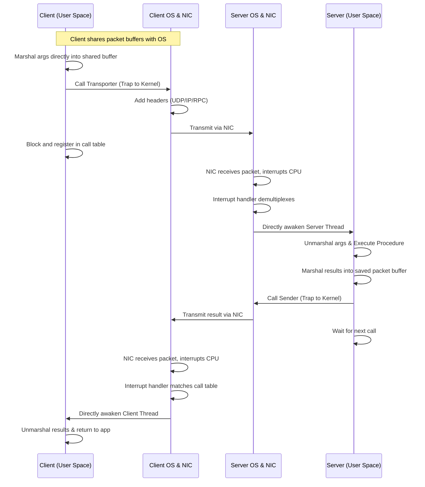

# L05c Latency Limits

> [!summary] TL;DR
> While network bandwidth has increased by orders of magnitude, communication latency has not scaled at the same rate.
> Lowering latency is critical for distributed applications that rely on frequent, small-packet synchronization, such as Remote Procedure Calls (RPC).
> Achieving low latency requires a holistic approach that strips away software overhead, reduces data copying, optimizes context switches, and leverages simple controller hardware interfaces.

## Learning outcomes

- Differentiate between latency and throughput in the context of network communications.
- Identify the hardware and software components that contribute to end-to-end RPC latency.
- Trace the lifecycle of data copying in a standard RPC mechanism and explain techniques to eliminate unnecessary copies.
- Explain the role of context switching in RPC performance and how techniques like spin-waiting and direct thread awakening mitigate this cost.
- Evaluate the optimizations applied in the Firefly RPC system to achieve low-latency communication on a multiprocessor architecture.

## Motivation and the problem

Network communication forms the backbone of distributed systems, dictating the feasibility of architectures like distributed shared memory and remote paging.
However, while advances in network technologies (like FDDI and ATM over legacy Ethernet) have drastically improved throughput, they have not inherently solved the latency problem.
For remote procedure calls, which are characterized by frequent exchanges of small synchronization packets, latency and CPU overhead are the true bottlenecks.
If the operating system cannot process and deliver these small packets swiftly, the high bandwidth of the network goes underutilized, and applications stall waiting for data.

## Core concepts

### Latency versus throughput

<!-- coverage: L05c-01 -->
> [!note] Latency and Throughput
> **Latency** is the elapsed time for a single event to occur (e.g., a message round-trip), whereas **throughput** measures the number of events executed per unit time (e.g., megabits per second).

Higher network bandwidth directly translates to higher throughput, making it easier to transfer large payloads like files.
However, high bandwidth does not necessarily result in low latency for small packets.
Thekkath and Levy's experiments demonstrated that upgrading from a 10 Mbps Ethernet to a 100 Mbps FDDI network improved throughput by a factor of ten, yet the round-trip latency for a 60-byte message barely improved (253 microseconds on Ethernet versus 263 microseconds on FDDI).
This discrepancy arises because latency is heavily dominated by software processing overhead and host-controller interactions, rather than just the time the signal spends on the wire.

### Components of RPC latency

<!-- coverage: L05c-02 -->
The end-to-end latency of a Remote Procedure Call can be decomposed into hardware and software overheads.
Hardware overhead dictates how the network interfaces with the CPU, while software overhead encompasses the operating system's effort to prepare messages for transmission and route them upon reception.

The precise components of this latency include:
- **Time on the wire**: The physical transmission time of the packet, which is inversely proportional to bandwidth.
- **Controller latency**: The delay introduced by the network interface controller (NIC) moving data between its internal buffers and the host bus.
- **Control and data transfer**: The overhead for the CPU to program the controller via descriptors and move data across the host bus (if the NIC lacks DMA capabilities).
- **Vectoring the interrupt**: The architectural cost of transitioning control to the device driver's interrupt handler upon packet arrival.
- **Interrupt service**: The time the host software spends performing bookkeeping and clearing the interrupt state.

### Marshaling and data copying

<!-- coverage: L05c-03 -->
The most significant source of software overhead in standard RPC systems is data copying.
Marshaling involves converting structured in-memory arguments into a flat network packet, which often forces data to traverse multiple memory boundaries.

In a naive implementation, an RPC call involves three distinct copies on the sending side alone:
1.
**Stub copy**: The client stub copies the procedure arguments from the application's stack into an RPC message buffer in user space.
2.
**Kernel copy**: The operating system kernel copies the RPC message from the user-space buffer into its own kernel-space buffer.
3.
**Controller copy**: The network controller copies the data from the kernel buffer into its internal transmission buffer (via DMA or programmed I/O).

Because this process is mirrored on the receiving end, a single round-trip RPC can incur up to six data copies, consuming substantial CPU cycles and memory bandwidth.

### Reducing copies: driver buffers and shared descriptors

<!-- coverage: L05c-04 -->
To mitigate the severe penalty of data copying, systems can employ techniques that flatten the memory hierarchy between the user space and the network controller.
One approach is to move the marshaling logic directly into the kernel, eliminating the intermediate user-space buffer, though this sacrifices modularity.

A more flexible approach is the use of **shared descriptors**.
By leaving the stub in user space but sharing a descriptor with the kernel, the stub can inform the OS of the exact stack layout of the arguments.
The kernel can then use scatter-gather I/O to read the arguments directly from the user's stack, bypassing the user-to-kernel copy.
Even further, systems like Firefly map a pool of packet buffers into a shared memory region accessible by both user address spaces and the kernel.
This allows the stub to marshal arguments directly into a buffer that the network controller can transmit, achieving a zero-copy software path.

### Control transfer and context switches

<!-- coverage: L05c-05 -->
RPC inherently involves transferring control between the client and the server, which manifests as a series of expensive context switches.
When a client makes a synchronous RPC, the sequence typically unfolds as follows:
1.
The client blocks waiting for a reply, prompting the OS to context switch to another process.
2.
The packet arrives at the server, causing a context switch to the server process handling the RPC.
3.
After execution, the server sends the result and the OS switches away to another process.
4.
The result arrives at the client, triggering a context switch back to the original client process.

Only switches #2 and #4 are critical to the actual latency of the RPC.
If an RPC is known to execute very quickly, the client can employ **spin-waiting** instead of blocking, entirely avoiding context switches #1 and #4.
Furthermore, by designing the interrupt handler to directly awaken the specific waiting thread (as done in Firefly), the system bypasses the generic OS scheduler, minimizing the cost of switches #2 and #4.

### Protocol processing and taking advantage of a reliable LAN

<!-- coverage: L05c-06 -->
Traditional transport protocols like TCP are designed for lossy, wide-area networks, introducing heavy bookkeeping that inflates latency.
When operating within a reliable Local Area Network (LAN), much of this protocol processing can be aggressively pruned.

Optimizations for a reliable LAN include:
- **No low-level acknowledgments**: The RPC result packet inherently serves as the acknowledgment for the call packet, eliminating the need for explicit transport-level ACKs.
- **Hardware checksums**: Offloading packet integrity checks to the network controller hardware removes the need for expensive software checksum calculations over the payload.
- **No client-side buffering**: Because the calling thread is blocked during a synchronous RPC, it retains the original arguments on its stack.
  If a timeout occurs, the client can simply regenerate and retransmit the call packet without needing a dedicated transport-layer buffer.
- **Overlapping transmission**: The server can overlap the buffering of incoming requests with the transmission of outgoing results.

### Firefly RPC performance lessons

<!-- coverage: L05c-07 -->
The Firefly RPC system, built for a VAX multiprocessor, demonstrated that meticulous attention to the "fast path" can yield exceptional performance.
Firefly achieved its low latency through a combination of structural optimizations and low-level tuning.

Key lessons from Firefly include:
- **Custom assignment statements**: Generating stubs that use direct inline assignment statements for marshaling is significantly faster than relying on generic library procedures or interpreters.
- **Direct thread awakening**: The Ethernet interrupt routine demultiplexes incoming packets and directly awakens the waiting server or client thread, cutting the number of wakeups in half compared to routing through a generic OS thread.
- **On-the-fly buffer recycling**: Packet buffers are tied to call table entries.
  When a new packet arrives, the interrupt handler immediately recycles the buffer it replaces, avoiding costly memory allocation during the fast path.
- **Assembly language**: Recoding the critical fast path of the Ethernet send/receive operation in assembly language yielded a 3x speedup over the Modula-2+ equivalent.

## Mechanisms step by step

The following sequence diagram illustrates the fast path of a highly optimized RPC, such as the Firefly implementation, which avoids extra context switches and uses shared memory buffers.



Where Mermaid cannot capture the buffer recycling nuance, consider this ASCII representation of the shared call table:

```text
+-------------------------+
| Shared Call Table       |
+---------+---------------+
| Thread  | Packet Buffer |
+---------+---------------+
| Client A| [Call Pkt ]   | -> Swapped with result packet on arrival
| Server B| [Result Pkt]  | -> Swapped with call packet on arrival
+---------+---------------+
```

## Worked examples

Consider the latency breakdown of the Firefly RPC system for a null call (no arguments, no results).
The total measured latency was 2661 microseconds.
We can calculate the expected latency by summing the component costs:

1. **Stubs and RPC Runtime**: The client and server stubs, along with the runtime routing, take approximately 606 microseconds.
2. **Call Packet Transfer**: The send and receive operations for the 74-byte call packet (including checksums, traps, interprocessor interrupts, NIC transmission, and interrupt handling) take 954 microseconds.
3. **Result Packet Transfer**: The send and receive operations for the identical 74-byte result packet take another 954 microseconds.

Total calculated latency = 606 + 954 + 954 = 2514 microseconds.
The calculated time differs from the measured time (2661 microseconds) by only 147 microseconds, demonstrating a highly accurate accounting of the system's behavior.
If UDP checksums were disabled, the system would save 90 microseconds per transfer (180 microseconds total), dropping the latency by roughly 7%.

## Comparison

| Feature | Standard RPC | Optimized RPC (e.g., Firefly) |
| :--- | :--- | :--- |
| **Data Copying** | Client stub $\rightarrow$ User buffer $\rightarrow$ Kernel buffer $\rightarrow$ NIC | Client stub $\rightarrow$ Shared memory buffer $\rightarrow$ NIC |
| **Context Switching** | Client block, OS schedule, Server interrupt, OS schedule, OS schedule back | Spin-wait or direct thread awakening by interrupt handler |
| **Buffer Management** | Dynamic allocation per packet | Pre-allocated, recycled in call table during interrupt |
| **Protocol** | Heavyweight (TCP, software checksums, ACKs) | Lightweight (UDP, implicit ACKs, hardware checksums) |
| **When to use** | Inter-network, WAN environments with high loss rates | High-speed, reliable LANs and multiprocessors |

## Paper deep dives

- [Time, Clocks, and the Ordering of Events in a Distributed System](../Papers/L05-Time-Clocks-Ordering.md) explores how to establish a consistent temporal order of events across distributed nodes without a global clock, laying the foundation for distributed synchronization.
- [Limits to Low-Latency Communication on High-Speed Networks](../Papers/L05-Limits-Low-Latency.md) empirically demonstrates that increasing network bandwidth (e.g., ATM, FDDI) does not automatically lower latency, exposing controller interfaces and host software as the true bottlenecks.
- [The x-Kernel: An Architecture for Implementing Network Protocols](../Papers/L05-x-Kernel.md) provides a modular operating system architecture for composing network protocols efficiently, balancing abstraction with performance.
- [Active Networks: Vision and Reality: Lessons from a Capsule-based System](../Papers/L05-Active-Networks-ANTS.md) introduces the concept of injecting custom code into network packets (capsules) to execute on routers, challenging the static nature of traditional network infrastructure.
- [Building Reliable, High-Performance Communication Systems from Components](../Papers/L05-Ensemble-Systems-from-Components.md) details the Ensemble system, which uses micro-protocols to build robust distributed communication frameworks while maintaining high performance through techniques like event-driven execution.
- [Performance of the Firefly RPC](../Papers/L05-Firefly-RPC.md) dissects the micro-architectural costs of a remote procedure call, proving that meticulous tuning of the fast path, buffer recycling, and direct thread scheduling can drastically reduce communication latency.

## Modern descendants

The architectural lessons from early low-latency RPC systems are highly visible in modern infrastructure.
**eBPF (Extended Berkeley Packet Filter)** and **XDP (eXpress Data Path)** allow custom packet processing logic to be executed directly within the kernel or even offloaded to the NIC, bypassing the traditional network stack to drastically reduce latency.
**DPDK (Data Plane Development Kit)** and **RDMA (Remote Direct Memory Access)** take the zero-copy and shared descriptor concepts to the extreme by enabling user-space applications to access network hardware directly, bypassing the operating system kernel entirely.
Furthermore, **unikernels** eliminate the user/kernel boundary altogether, running a single application in a single address space, which naturally eradicates the context-switching and boundary-crossing overheads that plagued legacy RPC systems.

> [!tip] Hardware Offloading
> The trend of moving protocol processing (like checksums and segmentation) into hardware, as advocated in these early papers, is now standard practice in modern SmartNICs and DPUs (Data Processing Units).

## Pitfalls and exam traps

> [!warning] Bandwidth is not Latency
> A common exam trap is assuming that migrating to a network with 10x the bandwidth will improve the performance of an RPC-heavy application by 10x.
> Remember that RPC is dominated by small packets where latency-constrained by software overhead and controller interaction-is the true bottleneck, not the time on the wire.

> [!warning] The Cost of Layers
> Be careful not to underestimate the cost of abstraction.
> Layering RPC over TCP/IP provides reliability but introduces massive overhead from buffering, windowing, and software checksums.
> Optimized systems assume a reliable LAN to strip these layers away.

## Practice

- [Practice L05](../Practice/Practice-L05.md)

## Lab

- [lab-07-rpc-costs](../labs/lab-07-rpc-costs/README.md): Where RPC time goes: copies, crossings, and zero-copy on one machine

## Further reading

- [eBPF Documentation](https://ebpf.io/)
- [DPDK Official Site](https://www.dpdk.org/)
- [Understanding RDMA](https://www.snia.org/education/what-is-rdma)
