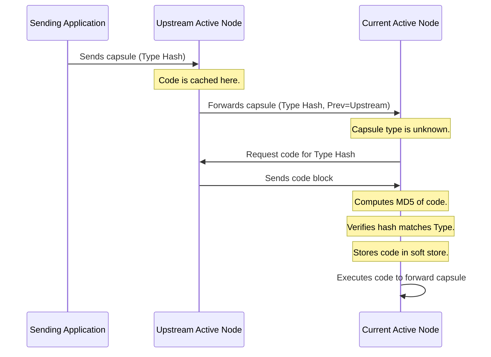

# L05d Active Networks

> [!summary] TL;DR
> Active Networks propose moving beyond static packet routing by allowing packets to carry executable code or references to code.
> This enables routers to dynamically change their behavior and deploy new network services without upgrading the underlying infrastructure.
> The ANTS toolkit implements this vision using a capsule-based approach, where packets encapsulate forwarding logic that is executed safely in Java sandboxes at active nodes.
> While performance overhead and security remain challenges, the concept heavily influenced modern software-defined networking and programmable data planes.

## Learning outcomes

By the end of this lesson, you should be able to:
- Explain the limitations of traditional IP routing that active networks attempt to solve.
- Describe the ANTS capsule model and its mechanisms for code distribution.
- Evaluate the security and performance implications of executing mobile code on network routers.
- Compare active networks with the x-kernel architecture for protocol implementation.
- Identify modern descendants of active networks such as SDN and eBPF.

## Motivation and the problem

In a traditional distributed system, once a packet leaves a node, the primary challenge is routing it reliably and quickly to its destination.
Intermediate routers rely on static routing tables and standard IP protocols to perform a simple lookup and determine the next hop.
This rigid architecture makes it notoriously difficult to introduce new network services or protocols, as doing so requires physical or firmware upgrades across millions of devices globally.
Active networks solve this stagnation by embedding programmability directly into the network layer.
By allowing the packets themselves to dictate how they are processed, network operators and applications can introduce custom routing, caching, or multicast protocols dynamically.

## Core concepts

### Routing on the internet and the case for active networks

<!-- coverage: L05d-01 -->
> [!note] Definition
> Active Networks is a network architecture where nodes (routers) perform customized computations on the messages flowing through them, rather than simply forwarding packets based on static rules.

Traditional internet routing relies on standard IP headers and static routing tables maintained by intermediate routers.
When a packet arrives, the router inspects the destination IP address, consults its routing table, and forwards the packet to the appropriate interface.
This approach is highly optimized and scalable, but it heavily restricts innovation because upgrading the protocol stack requires global consensus and hardware updates.
Active networks propose changing this simple lookup mechanism into a dynamic code execution process.
Packets carry a payload along with executable code (or references to code) that the router runs to determine the next step for the packet.
This makes the nodes active and shifts the paradigm from a dumb network with smart endpoints to a smart network capable of deploying application-specific services on the fly.
The primary advantage is immense flexibility, allowing applications to ignore the physical constraints of the network and introduce custom protocols like reliable multicast or anycast without modifying the core infrastructure.

### Implementation challenges of active networks

<!-- coverage: L05d-02 -->
Implementing active networks in the real world introduces severe challenges, particularly concerning security, performance, and deployment.
One major hurdle is modifying the existing protocol stack to support dynamic code execution, which is complex and computationally expensive.
We cannot expect every node on the internet to be capable of executing custom code due to varying hardware constraints.
Security is a massive concern because allowing untrusted code to run on critical network infrastructure opens the door to malicious attacks, such as denial of service or routing manipulation.
Furthermore, performance bottlenecks arise because executing code for every packet introduces significant latency compared to hardware-accelerated IP lookups.
To mitigate these issues, practical active network designs restrict active nodes to the edges of the network and rely on strong sandboxing to protect the routers from misbehaving code.

### ANTS toolkit

<!-- coverage: L05d-03 -->
> [!note] Definition
> The Active Node Transfer System (ANTS) toolkit is an application-level framework that implements a capsule-based active network architecture using Java.

The ANTS toolkit takes the payload and Quality of Service (QoS) requirements from an application and wraps them into a capsule before passing them to the protocol stack.
This capsule contains an ANTS header and the application payload, which is then encapsulated within a standard IP packet.
If a conventional IP router receives this packet, it ignores the ANTS header and forwards the packet using the standard IP rules.
If an active node receives the packet, it processes the ANTS header to execute the specific routing logic required by the capsule.
This hybrid approach is brilliant because it allows active nodes to be deployed incrementally, typically at the edges of the network, while the core internet remains unchanged.
By using Java, ANTS leverages inherent safety features like the Java sandbox to ensure that executed code cannot harm the node or interfere with other capsules.

### ANTS capsules and header

<!-- coverage: L05d-04 -->
In the ANTS model, a capsule is an extended IP packet that acts much like a mobile agent, directing its own path through the network.
The ANTS header contains a critical Type field, which is an MD5 hash (fingerprint) of the code to be executed.
It also includes a Previous field, which stores the identity of the upstream active node that most recently successfully processed the capsule.
The MD5 hash acts as a unique, self-certifying identifier for the forwarding routine, preventing spoofing and versioning conflicts.
Instead of carrying the actual code in every packet, which would incur massive overhead, the capsule only carries this hash reference.
When a node needs the code, it uses the Previous field to request it from the upstream node, implementing a highly efficient demand-loading mechanism.

### ANTS APIs

<!-- coverage: L05d-05 -->
The ANTS toolkit exposes a core set of APIs that capsules use to interact with the active node environment.
These APIs are deliberately restricted to ensure safety and prevent resource exhaustion.
There are APIs for routing, allowing the capsule to dictate where it should be sent next based on custom logic.
Another crucial set of APIs handles the manipulation of a soft store, which is a temporary, local storage space on the routing node.
The soft store is used to cache the forwarding code itself, as well as to maintain temporary state for specific network flows, such as multicast subscription lists.
Finally, there are APIs for querying the node to gather information about the network environment, enabling adaptive routing decisions.

### Capsule implementation and code caching

<!-- coverage: L05d-06 -->
When an active node receives a capsule, it checks if it has previously processed capsules of this specific type.
If the type is recognized, the node retrieves the forwarding code from its local soft store, executes it, and proceeds.
If the node has never seen this type before, it cannot process the capsule immediately.
Instead, it suspends the capsule, reads the Previous field from the header, and sends a request to that upstream node asking for the code.
The upstream node retrieves the code from its soft store and transmits it downstream.
Upon receiving the code, the current node computes its MD5 fingerprint to verify it matches the capsule's Type field, executes it, stores it in the soft store, and resumes forwarding.
If the code is unavailable at the upstream node, the capsule is dropped.

### Potential applications

<!-- coverage: L05d-07 -->
Active networks excel at deploying network-layer services that are notoriously difficult to implement in standard IP.
A prime example is protocol-independent multicast, where active nodes dynamically duplicate packets only at diverging branch points, optimizing bandwidth usage.
Reliable multicast can also be implemented by caching packets at active nodes to handle local retransmissions, avoiding global broadcast storms.
Congestion notification can be drastically improved because active nodes can directly inspect and respond to queue lengths by dropping specific packets or modifying headers.
Other applications include private IP routing, anycasting, and real-time transcoding for mobile devices over slow wireless links.
Ultimately, the primary benefit is the decoupling of network services from the underlying hardware, allowing rapid innovation.

### Pros and cons of active networks

<!-- coverage: L05d-08 -->
> [!note] Definition
> The primary advantage of active networks is immense flexibility for applications, while the main drawbacks are protection and resource management threats.

The biggest pro of active networks is that applications can construct virtual network overlays tailored to their specific needs without waiting for ISP upgrades.
However, this flexibility introduces massive security and resource management threats.
To mitigate protection threats, ANTS uses Java sandboxes for runtime safety, preventing code from accessing unauthorized memory or devices.
It also uses robust MD5 fingerprints to prevent code spoofing and ensures that the soft state storage is strictly size-limited to prevent malicious flows from consuming all node memory.
Resource management is harder to solve globally, as an attacker could flood the network with computationally expensive capsules.
ANTS addresses this locally by restricting API calls and limiting execution time, but global denial-of-service remains a fundamental challenge in pure active networks.

### x-kernel protocol architecture

<!-- coverage: L05d-09 -->
> [!note] Definition
> The x-kernel is an object-oriented operating system architecture designed specifically for implementing network protocols efficiently and modularly.

While active networks focus on dynamic execution in the network, the x-kernel focuses on optimizing protocol implementation on the endpoints.
The x-kernel provides a uniform interface for composing network protocols, splitting them into protocol objects and session objects.
Protocol objects handle the demultiplexing of incoming messages to the correct session, while session objects interpret the messages and maintain connection state.
This explicit structure makes it incredibly easy to snap together complex protocol graphs, avoiding the performance penalties of rigid layering seen in traditional OS designs.
It leverages a process-per-message paradigm, meaning a single thread follows a packet entirely through the protocol stack, avoiding costly context switches.
This highly tuned architecture demonstrates that complex protocol composition can be achieved efficiently if the operating system provides the right abstractions.

### Modern descendants: SDN, P4, and eBPF XDP

<!-- coverage: L05d-10 -->
Although the original active network vision of running mobile Java code on routers never reached widespread deployment, its core ideas evolved into highly successful modern technologies.
Software-Defined Networking (SDN) separated the control plane from the data plane, allowing central controllers to dynamically program routing rules across a network.
The P4 programming language took this a step further, allowing operators to write code that dictates exactly how a hardware switch parses and processes packets at line rate.
In the Linux kernel, eBPF (Extended Berkeley Packet Filter) and XDP (eXpress Data Path) allow developers to safely inject sandboxed bytecode directly into the networking stack.
These modern descendants retained the desire for network programmability but abandoned the risky code-in-a-packet model in favor of out-of-band control and highly constrained, verifiable execution environments.

## Mechanisms step by step

Here is the step-by-step process of how ANTS demand-loads code across active nodes when an unrecognized capsule arrives.

1. An upstream node forwards a capsule containing a type hash and its own address in the previous-node field.
2. The receiving node checks its soft store for the type hash.
3. If missing, the node suspends the capsule and requests the code from the upstream node.
4. The upstream node responds with the serialized Java code.
5. The receiving node verifies the code's MD5 fingerprint against the type hash.
6. The node loads the code into a sandbox, executes it, caches it, and forwards the capsule.

## Worked examples

Let us examine the performance overhead of transferring ANTS capsule code over a network link.
Assume we have an active network where routers are connected by a 10 Mbps (Megabits per second) link.
The ANTS toolkit strictly limits the size of the customized forwarding code to a maximum of 16 KB to prevent excessive network overhead.
We want to calculate the transmission time for a maximum-sized code block.

- Code size: 16 KB (Kilobytes).
- Convert to bits: 16 KB * 1024 bytes/KB * 8 bits/byte = 131072 bits.
- Link speed: 10 Mbps = 10000000 bits per second.
- Transmission time = 131072 bits / 10000000 bits/second = 0.0131072 seconds.

This evaluates to approximately 13.1 milliseconds.
In a wide-area network where one-way transit delays normally range from 100 to 1000 milliseconds, a 13.1-millisecond loading penalty is well within the acceptable jitter bounds.
Since the code is cached after this initial transfer, subsequent packets incur zero transmission penalty for the code, making demand-loading highly efficient for sustained flows.

## Comparison

| Feature | Traditional IP Routing | ANTS Active Networks | x-Kernel Architecture |
| :--- | :--- | :--- | :--- |
| **Execution Model** | Static table lookups. | Dynamic code execution per capsule. | Compiled protocol graphs. |
| **Flexibility** | Extremely low (requires hardware upgrades). | Extremely high (application-defined). | High (customizable OS stack). |
| **Performance** | Wire-speed (hardware accelerated). | Slow (Java sandboxing, software routing). | Fast (process-per-message model). |
| **Code Location** | Fixed in router firmware. | Demand-loaded from upstream nodes. | Fixed in the OS kernel. |
| **Primary Use Case** | Core internet backbone routing. | Edge networks, custom routing overlays. | High-performance endpoint systems. |
| **Security Risk** | Low (dumb pipes). | High (untrusted mobile code). | Moderate (kernel-space execution). |

## Paper deep dives

- [Time, Clocks, and the Ordering of Events in a Distributed System](../Papers/L05-Time-Clocks-Ordering.md)
This foundational paper by Leslie Lamport introduces logical clocks and the happens-before relationship to establish a partial ordering of events in distributed systems without relying on physical clocks.
It solves the critical problem of synchronizing state and determining causality across geographically distributed nodes that experience variable network latency.

- [Limits to Low-Latency Communication on High-Speed Networks](../Papers/L05-Limits-Low-Latency.md)
This paper explores the bottlenecks in high-speed networking, concluding that operating system overhead, memory copies, and context switches are the primary barriers to achieving low latency, rather than the physical network transmission speed itself.
It heavily influenced the design of zero-copy network stacks and user-level networking frameworks.

- [The x-Kernel: An Architecture for Implementing Network Protocols](../Papers/L05-x-Kernel.md)
The x-kernel paper details an object-oriented operating system tailored for building network protocols through highly efficient, composable objects (protocols and sessions).
By utilizing a process-per-message execution model, it eliminates context switching and drastically outperforms traditional implementations like Unix System V streams, providing a blueprint for modern modular networking stacks.

- [Active Networks: Vision and Reality: Lessons from a Capsule-based System](../Papers/L05-Active-Networks-ANTS.md)
David Wetherall's paper reflects on the practical deployment of the ANTS toolkit, verifying that capsule-based active networks are feasible and that code distribution can be handled efficiently via demand loading and MD5 fingerprints.
However, it also acknowledges that significant challenges remain in global resource management and performance scaling, shaping the future of programmable networks.

- [Building Reliable, High-Performance Communication Systems from Components](../Papers/L05-Ensemble-Systems-from-Components.md)
This paper presents Ensemble, a framework for building reliable group communication systems by stacking micro-protocols.
It demonstrates how complex distributed systems can be constructed from simple, verified, and reusable components, emphasizing modularity and formal verification in network protocol design.

- [Performance of the Firefly RPC](../Papers/L05-Firefly-RPC.md)
The Firefly RPC paper analyzes the performance of a highly optimized Remote Procedure Call system built on a multiprocessor architecture.
It highlights the importance of fast-path optimizations, thread pooling, and minimizing memory copies to achieve RPC latencies that approach the theoretical physical limits of the underlying network hardware.

## Modern descendants

The spirit of active networks lives on in several highly successful technologies that dominate modern cloud infrastructure.
Software-Defined Networking (SDN) protocols like OpenFlow achieved the goal of flexible routing by separating the control plane from the data plane, keeping routers fast while centralizing the intelligence.
The P4 programming language brought programmability directly to the switch ASIC, allowing network engineers to define custom packet parsing pipelines without sacrificing wire-speed performance.
In Linux, eBPF (Extended Berkeley Packet Filter) allows developers to attach custom programs to networking hooks inside the kernel, providing immense flexibility for load balancing, firewalling, and monitoring.
Unlike ANTS, these modern descendants strictly avoid carrying code across the network inside packets, opting instead to provision the code out-of-band and execute it in highly controlled, verifiable environments.

## Pitfalls and exam traps

> [!warning] Exam Trap
> Do not confuse the active network payload with the capsule code itself.
> In ANTS, the code is not carried in every packet; the packet only carries an MD5 hash referencing the code, which is demand-loaded on the first encounter.

> [!warning] Exam Trap
> Be careful when describing the x-kernel execution model.
> It uses a process-per-message model, not a process-per-protocol model.
> A single thread follows the packet through the entire protocol graph, which eliminates costly context switches between layers.

> [!warning] Exam Trap
> Remember that ANTS was implemented in Java entirely at the user level, which made it highly portable but terrible for raw performance due to garbage collection and JVM overhead.

## Practice

- [Practice L05](../Practice/Practice-L05.md)

## Lab

- [lab-11-network-latency](../labs/lab-11-network-latency/README.md): Network latency budgets: ping, iperf3, tc netem, and capsule routing

## Further reading

- *Computer Networks* by Andrew S. Tanenbaum (Chapter on Network Layer routing).
- Linux kernel documentation for eBPF and XDP.
