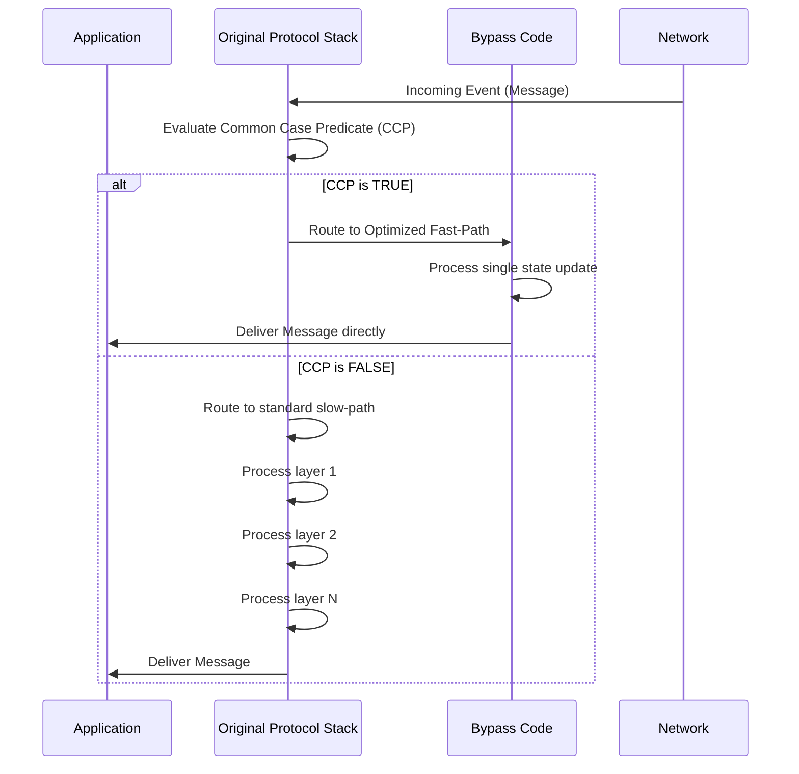

# L05e Systems from Components

> [!summary] TL;DR
> Building distributed systems from modular software components provides immense flexibility but often introduces substantial overheads such as redundant code, function call penalties, and cache misses.
> To address this, the Ensemble system employs a rigorous design cycle combining IOA specifications, OCaml implementations, and NuPrl theorem-proving framework optimizations.
> By leveraging formal methods to derive Common Case Predicates (CCPs), the system bypasses non-critical layer processing, synthesizes optimized code, and compresses headers, achieving monolithic performance without sacrificing component-based maintainability.

## Learning outcomes

- Understand the trade-offs between component-based software design and monolithic architectures in high-performance networking.
- Trace the lifecycle of a protocol from its abstract behavioral specification in IOA to its concrete implementation in OCaml.
- Analyze the use of NuPrl for static and dynamic optimization of communication protocol stacks.
- Evaluate specific optimization techniques, such as header compression, avoiding marshaling, and delaying non-critical processing.
- Apply Common Case Predicates (CCPs) to bypass multi-layered abstraction barriers and optimize common network paths.

## Motivation and the problem

Hardware design has long benefited from component-based architectures to build complex systems systematically.
Applying this approach to software facilitates easy testing, optimization, and system extension by adding or removing modular components.
However, abstraction barriers between software components impose high runtime overheads.
Each component boundary introduces additional function calls, poor data and code locality leading to cache and TLB misses, and redundant code that is unreachable in specific configurations.
This results in unused fields in data structures and sub-optimal compilation due to separate module processing.
The challenge is to maintain the flexibility and verifiability of small, composable micro-protocols while achieving the low latency and high throughput typical of monolithic, hand-optimized systems.

## Core concepts

### Building systems from components: the design cycle

<!-- coverage: L05e-01 -->
The design cycle for high-performance communication systems from components involves a structured transition from formal specification to optimized execution.
It consists of three primary phases: specification, implementation, and optimization.
First, the abstract requirements of the system and individual components are specified formally to ensure they meet the desired properties, such as reliability and ordering.
Next, this specification is refined into an executable programming language that closely matches the semantics of the formal model.
Finally, an automated theorem-proving framework processes the implementation to strip away the overheads associated with modularity, synthesizing an optimized version that collapses abstraction barriers.
This cycle ensures that the final code is mathematically proven to be correct under specific conditions while delivering the performance required by demanding distributed applications.

> [!note] Design Cycle
> The sequence of defining formal requirements, translating them into executable code, and systematically removing modular overheads without altering the program's correctness.

### Specification with IOA

<!-- coverage: L05e-02 -->
I/O Automata (IOA) is used to express abstract specifications of the system at the level of individual components.
It provides a formal model with a C-like syntax, making it accessible to programmers while maintaining rigorous mathematical semantics.
An IOA specification consists of a set of state variables and a set of events that interact with the environment through a series of event-condition-action rules.
IOA is crucial because it includes a composition operator, allowing the specifications of smaller micro-protocols to be mathematically combined to verify the global properties of the overall protocol stack.
By detailing how the system reacts to specific events, such as sending an acknowledgment upon receiving a data message, IOA serves as a sturdy bridge between the theoretical properties of the network and the practical requirements of the eventual implementation.

### Abstract and concrete behavioral specifications

<!-- coverage: L05e-03 -->
Specifications in this design methodology are divided into abstract and concrete behavioral specifications.
An abstract behavioral specification is a high-level, non-deterministic description of a system's functionality that often relies on global variables and unconstrained event scheduling.
It is used to easily derive and verify global distributed properties, such as ensuring FIFO message delivery across a network.
In contrast, a concrete behavioral specification is derived from the abstract model through a process called refinement.
It involves only the state and events local to a single participant in the protocol, specifying precisely when and how actions can be executed.
While abstract specifications guarantee the overarching correctness, concrete specifications map directly onto the executable implementation for individual network nodes.

### Implementation with OCaml

<!-- coverage: L05e-04 -->
Once the concrete behavioral specifications are defined, they are translated into executable code using Objective Caml (OCaml).
OCaml is an object-oriented dialect of ML that offers a unique combination of high-level abstractions, like automated memory allocation and garbage collection, with the ability to compile into highly efficient machine code.
Crucially, OCaml has a precise mathematical semantics that makes its code highly amenable to manipulation by formal verification tools.
This formal grounding allows theorem provers to interpret the implementation, symbolically evaluate expressions, and rewrite the code for optimization purposes while mathematically guaranteeing that the original specifications are not violated.

### Optimization with NuPrl

<!-- coverage: L05e-05 -->
The NuPrl automated formal reasoning system acts as a source-to-source translator and optimizer for the OCaml implementation.
Unoptimized OCaml code is converted into corresponding terms in NuPrl's logical input language.
NuPrl then leverages its theorem-proving capabilities to perform static and dynamic optimizations.
Statically, experts guide NuPrl to identify bypass paths through individual layers by applying function inlining, symbolic evaluation, and directed equality substitutions.
Dynamically, NuPrl automatically composes these static bypasses across an entire protocol stack for specific applications.
It generates optimized code that collapses multiple layers, thereby neutralizing the latency introduced by the modular abstraction barriers while guaranteeing semantic equivalence to the original stack.

### Synthesizing a TCP-IP stack from micro-protocols

<!-- coverage: L05e-06 -->
The synthesis of a complex network stack, such as a TCP-IP equivalent, begins by composing an ensemble suite of targeted micro-protocols.
Instead of relying on a monolithic architecture, the system stacks individual components, such as sliding window, fragmentation, flow control, and encryption modules, to meet the application's demands.
The NuPrl framework evaluates these stacked components and their combined Concrete Behavioral Specifications.
By establishing Common Case Predicates (CCPs), the system identifies the most frequent execution paths, such as unfragmented data packet delivery.
NuPrl then synthesizes a unified bypass function that executes when the CCP is satisfied, effectively flattening the layered micro-protocols into a tightly integrated, optimized stack that avoids inter-layer function calls and redundancies.

### Sources of optimization: common path, header compression, delayed processing

<!-- coverage: L05e-07 -->
Several key optimization strategies are employed to overcome layering overhead.
First, Common Case Predicates (CCPs) identify frequent execution paths, allowing the system to inline functions and eliminate layer boundaries entirely, which significantly improves cache locality.
Second, header compression condenses constant header fields from multiple layers into a single concise identifier, reducing the data processing burden per message.
Third, non-critical processing is delayed; for instance, a message may be delivered immediately while its buffering is deferred, removing buffering overhead from the critical path.
Additional optimizations include utilizing explicit memory management over implicit garbage collection for short-lived message objects and bypassing the general-purpose marshaling mechanism in favor of scatter-gather operations for simple headers.

## Mechanisms step by step

The optimization of a component-based stack dynamically creates a fast-path for frequent messages.
By checking a pre-computed condition at runtime, the system routes packets around the expensive layering barriers.

## Worked examples

Consider a 4-layer reliable multicast protocol stack.
In the unoptimized state, a message must traverse all 4 layers, incurring function call and marshaling overheads at each boundary.
The unoptimized processing overhead for sending a message is 13 microseconds.
The unoptimized processing overhead for delivery is 10 microseconds.
When NuPrl synthesizes a bypass using Common Case Predicates (CCPs), it collapses these 4 layers into a single state update.
The optimized processing overhead for sending drops to 2 microseconds, achieving a reduction of 11 microseconds which saves roughly 84 percent of the original cost.
The optimized overhead for delivery drops to 4 microseconds, representing a reduction of 6 microseconds and a 60 percent savings.
Furthermore, by compressing the headers, an original multi-layer header of 60 bytes containing static routing and protocol data can be reduced to a 16-byte identifier for the common case.
This specific compression saves 44 bytes of bandwidth and marshaling effort per packet.

## Comparison

| Feature | Monolithic System | Component-Based with NuPrl Optimization | Unoptimized Component-Based System |
| :--- | :--- | :--- | :--- |
| **Flexibility** | Low; hard to modify or extend. | High; micro-protocols can be easily swapped. | High; highly modular. |
| **Performance** | High; hand-optimized for speed. | High; latency is often within 50 percent of hand-optimized code. | Low; suffers from layer boundary overheads. |
| **Verifiability** | Low; complex global state makes formal proofs difficult. | High; small components are easily verified using IOA. | High; IOA and component isolation aid proofs. |
| **Code Redundancy** | Low; tightly integrated. | Low; NuPrl strips out unreachable code in the common path. | High; each layer maintains generic capabilities. |
| **When to use** | Standard, static network environments. | High-performance, highly custom or safety-critical distributed systems. | Prototyping and testing new protocols. |

## Paper deep dives

[Time, Clocks, and the Ordering of Events in a Distributed System](../Papers/L05-Time-Clocks-Ordering.md) establishes the foundational concept of logical time using happened-before relationships.
This paper introduces a mechanism to order events in a distributed system without relying on physical clocks, which is a critical assumption in verifying distributed protocols like those specified in Ensemble.

[Limits to Low-Latency Communication on High-Speed Networks](../Papers/L05-Limits-Low-Latency.md) explores the hardware and software bottlenecks that prevent applications from fully utilizing high-speed networks.
It highlights that operating system overhead, such as context switches and layered processing, dominates latency, providing the exact motivation for Ensemble's bypass optimizations.

[The x-Kernel: An Architecture for Implementing Network Protocols](../Papers/L05-x-Kernel.md) presents a groundbreaking operating system architecture designed explicitly for configuring and executing network protocols efficiently.
It establishes the viability of protocol graphs and uniform interfaces, paving the way for the micro-protocol component approach used in Ensemble.

[Active Networks: Vision and Reality: Lessons from a Capsule-based System](../Papers/L05-Active-Networks-ANTS.md) discusses how network nodes can execute custom code injected by packets.
While offering extreme flexibility, it illustrates the performance and security challenges that formal verification and optimization techniques aim to resolve in component systems.

[Building Reliable, High-Performance Communication Systems from Components](../Papers/L05-Ensemble-Systems-from-Components.md) details the Ensemble project's successful use of the NuPrl formal system to optimize component-based communication architectures.
It demonstrates that by applying Common Case Predicates to OCaml implementations, layer boundaries can be collapsed, yielding performance comparable to monolithic systems.

[Performance of the Firefly RPC](../Papers/L05-Firefly-RPC.md) demonstrates that meticulous engineering and common-path optimization can achieve extremely low latency in multiprocessor remote procedure calls.
It provides a historical benchmark for the performance gains achievable through fast-path execution, analogous to Ensemble's synthesized bypass code.
- [Limits to Low-Latency Communication on High-Speed Networks](../Papers/L05-Limits-Low-Latency.md)
- [The x-Kernel: An Architecture for Implementing Network Protocols](../Papers/L05-x-Kernel.md)
- [Active Networks: Vision and Reality: Lessons from a Capsule-based System](../Papers/L05-Active-Networks-ANTS.md)
- [Building Reliable, High-Performance Communication Systems from Components](../Papers/L05-Ensemble-Systems-from-Components.md)
- [Performance of the Firefly RPC](../Papers/L05-Firefly-RPC.md)

## Modern descendants

Modern systems continue to balance modularity with performance by leveraging formal methods and fast-path compilation.
eBPF (Extended Berkeley Packet Filter) allows custom, verifiable micro-programs to run safely inside the Linux kernel, acting as a modern realization of dynamic, high-performance protocol insertion without recompiling the monolithic kernel.
Unikernels, such as MirageOS which is also written in OCaml, strip away general-purpose OS layers to create highly optimized, single-address-space machine images for specific applications.
Furthermore, systems like seL4 utilize rigorous formal verification to mathematically prove the correctness of the microkernel, ensuring safety-critical reliability alongside high performance.

## Pitfalls and exam traps

> [!warning] Exam Traps
> - **Misunderstanding CCPs:** A common pitfall is thinking that a Common Case Predicate permanently replaces the protocol stack. It does not; if the CCP evaluates to false, the system falls back to the standard, unoptimized layer-by-layer processing.
> - **Abstract vs. Concrete Specifications:** Do not confuse abstract behavioral specifications with concrete ones. Abstract specifications define global properties and are not executable, whereas concrete specifications are local to a node and dictate the actual implementation logic.
> - **The Role of NuPrl:** Remember that NuPrl is not a standard compiler. It is an interactive theorem-proving environment that translates code, proves semantic equivalence, and relies on both static expert guidance and dynamic composition to generate optimized bypasses.

## Practice

- [Practice L05](../Practice/Practice-L05.md)

## Lab

- [lab-12-components](../labs/lab-12-components/README.md): Micro-protocol stacks from components and common-path optimization

## Further reading

- [Ensemble Reference Manual](https://dl.acm.org/doi/10.1145/319151.319168)
- [OCaml Language Documentation](https://ocaml.org/docs)
- [NuPrl Theorem Prover](http://www.nuprl.org/)
