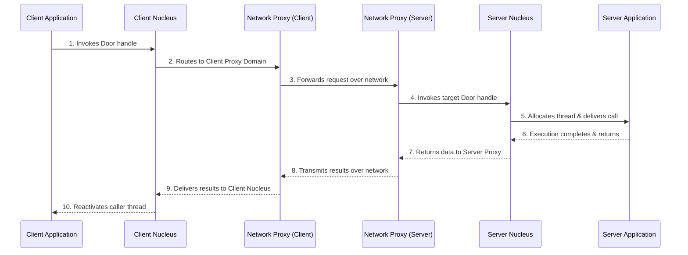

# L06a Spring Operating System

> [!summary] TL;DR
> Spring is a highly modular, distributed, object-oriented operating system built on a microkernel architecture.
> It utilizes strong interfaces defined in an Interface Definition Language (IDL) to ensure that the system is open, extensible, and capable of integrating third-party software.
> By providing mechanisms like doors for fast cross-address-space communication, network proxies for distributed invocation, and subcontracts for flexible remote object semantics, Spring achieves both high performance and robust distributed computing.

## Learning outcomes

- Contrast procedural and object-based operating system designs in the context of extensibility.
- Explain how Spring uses strong interfaces and a microkernel to achieve flexibility.
- Detail the role of the Nucleus, domains, and doors in facilitating fast local inter-process communication.
- Describe how network proxies extend local object invocation transparently across distributed nodes.
- Analyze the use of front objects and capabilities for secure object invocation.
- Understand the separation of virtual memory abstractions into address spaces, memory objects, and pagers.
- Discuss the subcontract mechanism and how it decouples object semantics from interface definitions.

## Motivation and the problem

In the commercial operating system space, designing for continuous and incremental evolution of complex distributed software systems is challenging.
The traditional choice is either building a completely new operating system or incrementally improving an existing one.
Because of the installed base of applications, moving to an entirely new API is difficult to justify.
Sun designed Spring to innovate significantly in the OS space by using object-oriented principles, while remaining compatible with existing UNIX applications.
The goal was to run existing software unchanged, scale to larger capacities via clusters, and allow third-party vendors to extend the system without breaking existing functionality.

## Core concepts

### Procedural versus object-based OS design

<!-- coverage: L06a-01 -->
Operating systems have traditionally been built using a procedural design paradigm, where the code acts as a single monolithic entity.
In a procedural system, there is a shared state represented by global variables, and private states managed within function calls.
This lack of encapsulation makes it difficult to extend or distribute system components safely.

In contrast, Spring adopts an object-based design where the state is entirely contained inside the object.
Methods defined on the object manipulate its internal state, and only these methods are externally visible.
This object-orientation is applied at the lowest levels to build the operating system kernel.
By keeping state localized and access restricted to explicit methods, the operating system services become highly modular.
This makes it far simpler to distribute these services across a parallel or networked system without creating bottlenecks around shared global state.

> [!note] Object-Based OS Design
> An architectural pattern where system resources and services are represented as objects with encapsulated state, interacted with only through well-defined methods, rather than procedural global variables.

### Spring approach: strong interfaces and a microkernel

<!-- coverage: L06a-02 -->
To ensure the system remains open and flexible, Spring enforces strong interfaces for each subsystem.
A strong interface specifies what a software component does without dictating how it is implemented.
Spring uses an Interface Definition Language (IDL) to define these boundaries, which provides flexibility in terms of the underlying programming language used by third-party vendors.

To facilitate this extensibility, Spring employs a microkernel architecture.
The microkernel, known as the Nucleus, handles only thread abstractions and inter-process communication (IPC).
The Virtual Memory Manager (VMM) handles memory abstractions.
All other traditional OS services, such as file systems and naming, run as user-level object managers.
Because these services interact entirely through IDL-defined interfaces, it is as easy to add new system functionality as it is to write a standard application.

> [!note] Strong Interface
> A software boundary that defines the exact operations available on a component, completely hiding the implementation details and language choices from the client.

### Nucleus: domains, doors, and door tables

<!-- coverage: L06a-03 -->
The Nucleus is the microkernel of the Spring OS, responsible for managing execution domains and threads, and facilitating inter-process communication.
A domain in Spring acts as a container or an address space where threads can execute, akin to a process in UNIX.
To allow threads to communicate across domains securely, the Nucleus provides an abstraction called a door.

A door is a software capability that represents an entry point to a target domain.
Each domain maintains a door table, which holds the IDs of all the doors the domain is authorized to access.
When a client domain wants to make a Protected Procedure Call, it invokes a door handle.
The Nucleus validates this handle, allocates a server thread in the target domain, and deactivates the calling thread.
The allocated thread executes the requested method and upon return, the caller is reactivated.
This mechanism is highly optimized, allowing cross-address-space calls to be nearly as fast as local calls.

> [!note] Door
> A secure, kernel-managed capability representing a communication endpoint into a specific target domain, used for fast cross-address-space object invocations.

### Object invocation across the network: network proxies

<!-- coverage: L06a-04 -->
While doors handle communication between domains on the same machine, Spring extends this model transparently across the network using network proxies.
A network proxy is a standard user-mode server domain that forwards door invocations between machines.
To the client and server domains, network communication is entirely invisible; they simply invoke local doors.

When communication is established over the network, a proxy on the server node creates a door to communicate with the server domain.
It then exports a network handle, embedding the door information, to a corresponding proxy on the client node.
The client proxy uses this handle to set up a connection.
The client domain invokes a door inside its local Nucleus, which delivers the call to the client proxy.
The client proxy forwards it over the network to the server proxy, which in turn invokes the actual server door.

> [!note] Network Proxy
> A user-level domain that transparently bridges local door invocations across a network, allowing distributed object communication without kernel-level network awareness.

### Secure object invocation with front objects

<!-- coverage: L06a-05 -->
Spring provides a highly flexible security model to control access to objects.
This is primarily handled through Access Control Lists (ACLs) and software capabilities.
When a client successfully proves its authorization against an object's ACL, the server creates an object reference that acts as a secure capability.
This reference points to a "front object" inside the server.

A front object is not a core Spring object but a language-level wrapper that encapsulates the underlying state along with the specific access rights granted to the principal.
Different clients might receive different front objects pointing to the same underlying state but with different permissions (e.g., read-only versus read-write).
When a request arrives via a door, the front object verifies that the requested operation is permitted by the encapsulated rights before forwarding the call to the actual implementation.
Since door identifiers can be securely passed between domains, a client can delegate its specific rights to another domain by simply passing the door.

> [!note] Front Object
> A secure wrapper within a server that encapsulates both a pointer to the actual underlying object state and the specific access rights granted to the client holding the door.

### Virtual memory management: address space and memory objects

<!-- coverage: L06a-06 -->
Virtual memory management in Spring separates the abstraction of memory caching from the abstraction of memory storage.
The Virtual Memory Manager (VMM) is responsible for managing the linear address space of each domain, breaking it down into regions.
However, the data mapped into these regions is represented by distinct memory objects.

An address space object, managed by the VMM, controls the layout of a domain's virtual memory.
A memory object, on the other hand, represents the actual data backing the memory, such as a file on disk.
Crucially, memory objects themselves do not provide page-in or page-out operations.
They are strictly an abstraction of data that can be mapped.
This separation allows memory objects to be implemented by external servers (like a file system) located on entirely different machines from the VMM that is caching the pages.

> [!note] Memory Object
> An abstraction representing a mappable data source, decoupled from the mechanisms of paging and physical memory caching.

### Pager objects and cached memory objects

<!-- coverage: L06a-07 -->
To bridge the gap between virtual memory caching and physical backing store, Spring uses a two-way connection involving pager objects and cache objects.
When a VMM maps a memory object, it needs to obtain data.
It does this by invoking a pager object provided by the external pager (e.g., a file server).
Conversely, the external pager needs to manage coherency (like invalidating stale pages), which it does by invoking a cache object provided by the VMM.

When the VMM binds to a memory object, it returns a cache_rights object.
The memory object's server uses this to determine if a pager-cache connection already exists.
If not, the VMM and the external pager exchange their respective pager and cache objects.
This dynamic architecture means the same memory object can have distinct cache representations in different VMMs across a network.
Meanwhile, the external pager retains the ability to enforce coherency protocols by invalidating remote cache objects when the underlying data changes.

> [!note] Pager-Cache Object Connection
> A bidirectional communication channel between a Virtual Memory Manager (caching pages) and an external pager (supplying pages), used for page retrieval and coherency maintenance.

### Dynamic client-server relationships

<!-- coverage: L06a-08 -->
Spring is designed so that client-server interactions are independent of the physical locations of the participants.
A client invoking an object should not need to know if the server is in the same address space, on the same machine, or across the globe.
This location transparency allows the system to make dynamic decisions about how requests are routed.

For example, if a server is highly replicated to increase availability, the system can dynamically route a client's request to the closest or least loaded replica.
Alternatively, if a server's data is heavily cached, the client can be dynamically redirected to interact with a local cached copy instead of crossing the network to reach the primary server.
These dynamic relationship changes occur without the client application's knowledge.
This ensures that performance and availability can be optimized at runtime without modifying client code.

> [!note] Location Transparency
> The design principle ensuring that an object's physical location (local, remote, or replicated) is entirely hidden from the client invoking it.

### Subcontract mechanism

<!-- coverage: L06a-09 -->
To implement these dynamic client-server relationships and support a wide variety of object semantics, Spring introduces the subcontract mechanism.
A subcontract is a replaceable module that is given control over the fundamental mechanisms of object invocation and argument passing.
While IDL defines the interface of an object, the subcontract defines the runtime behavior of how that object communicates.

Because the subcontract hides the runtime behavior, client stub generation remains simple.
The stubs simply marshal arguments and hand them off to the subcontract.
The application programmer remains unaware of whether the object uses a simple local call, a remote procedure call, or a complex replication protocol.
Furthermore, a subcontract can be changed dynamically.
If an object is upgraded to a replicated status, it can simply use a replication subcontract while the client's static IDL stubs remain completely unchanged.

> [!note] Subcontract
> A pluggable runtime module in Spring that dictates the underlying communication and state-management semantics (e.g., replication, caching) of an object invocation.

### Subcontract marshal and invoke interfaces

<!-- coverage: L06a-10 -->
The client-side subcontract provides several key interfaces to support object transmission and execution.
The marshal operation takes a live object, writes sufficient state into a communication buffer, and then deletes the local object.
When this buffer arrives at a destination, the unmarshal operation fabricates a fully-fledged Spring object from the data, linking it to the correct method table and subcontract operations vector.

For executing calls, the invoke operation takes over after the stubs have marshalled the arguments.
It executes the call using whatever mechanism is appropriate (e.g., a local door invocation or a network request) and returns the result buffer.
Additionally, an invoke_preamble operation allows the subcontract to inspect or modify the communication buffer before the stubs begin marshalling.
This is useful for optimizing data transfer, such as marshalling directly into shared memory.

> [!note] Marshal and Unmarshal
> The subcontract operations responsible for serializing an object's state into a network buffer for transmission, and reconstructing a valid object instance upon receipt.

## Mechanisms step by step

Let us trace the step-by-step process of a cross-machine object invocation using Spring's network proxies.

1. **Client Invocation:** The client application invokes a method on an object, which translates to a door invocation in the local Nucleus.
2. **Local Delivery:** The Nucleus identifies the door target as the local Network Proxy and hands the call to it.
3. **Network Transit:** The Client Proxy maps the door ID to a network handle and transmits the request over the network to the Server Proxy.
4. **Server Proxy Invocation:** The Server Proxy receives the request, maps the network handle back to a local door ID, and invokes the door in the Server Nucleus.
5. **Target Execution:** The Server Nucleus verifies the door, allocates a server thread in the Server Application domain, and delivers the arguments.
6. **Return Path:** The Server Application completes its task and returns the results to the Server Nucleus, which traces the path back through the proxies to the Client Application.

## Worked examples

### Subcontract Compatibility Resolution
Imagine a Spring system where a client domain receives a marshalled object.
The client's stub expects a generic file object using the singleton subcontract, but the server actually sent a replicated_file object using the replicon subcontract.

1. **Expectation:** The client stub reads the buffer and assumes it needs to call singleton_unmarshal.
2. **Subcontract ID Check:** The singleton subcontract inspects the first 4 bytes of the buffer and sees the ID 0x5245504C (replicon), not its own ID 0x53494E47 (singleton).
3. **Registry Lookup:** The singleton code halts unmarshalling and queries the domain's subcontract registry with 0x5245504C.
4. **Dynamic Link:** The registry resolves 0x5245504C to the library replicon.so.
It dynamically links replicon.so into the client's address space.
5. **Successful Unmarshal:** The registry passes the buffer to replicon_unmarshal, which successfully reads the 3 replicated door IDs from the buffer and creates the proper Spring object.

Through this 5-step process, the client dynamically adapts to the new semantics without altering the original application code.

### Door Invocation Timing
Suppose a fast local cross-address-space door call in Spring takes 11 microseconds.
If a client makes a complex call involving a 4-deep chain of local objects (Client to Domain A to Domain B to Domain C to Domain D):
- The chain involves 4 distinct door calls.
- Forwarding the call down the chain costs 4 * 11 = 44 microseconds.
- Returning the results back up the chain costs another 44 microseconds.
- Total IPC overhead for the deeply nested call is 88 microseconds.

This extremely low latency is what enables Spring to split standard monolithic OS functions into highly modular, separate user-level domains without suffering catastrophic performance degradation.

## Comparison

| Feature | Spring Microkernel (Nucleus) | Monolithic Kernel (e.g., Traditional UNIX) |
| :--- | :--- | :--- |
| **State Location** | State encapsulated in objects within isolated domains. | Shared global state managed within the kernel. |
| **Extensibility** | High. New services are added as user-level domains using subcontracts. | Low. Requires kernel modifications and re-compilation. |
| **Component Interface** | Strictly defined via IDL; language-independent. | C-based procedural system calls. |
| **IPC Mechanism** | Highly optimized door invocations between address spaces. | Heavier system calls, pipes, and sockets. |
| **Network Transparency** | Built-in via network proxies; local and remote calls use the same door interface. | Requires separate APIs (e.g., sockets vs local IPC). |
| **When to Use** | Evolving distributed systems, dynamic object environments, high security requirements. | Static environments, single-machine setups prioritizing legacy performance. |

## Paper deep dives

- [An Overview of the Spring System](../Papers/L06-Spring-Overview.md): This paper introduces the core architecture of Spring, detailing its motivation to move away from procedural OS design toward a strictly object-oriented, microkernel approach.
It covers the use of IDL for defining strong interfaces, the separation of virtual memory into pagers and memory objects, and how UNIX emulation was achieved entirely at the user level without modifying the underlying microkernel.
- [Subcontract: A Flexible Base for Distributed Programming](../Papers/L06-Subcontract.md): This paper explores the subcontract mechanism, a defining feature of Spring that completely decouples the semantics of object communication from the object's interface.
It explains how subcontracts handle marshalling, unmarshalling, and invocation, enabling powerful features like transparent replication and dynamic discovery of new communication protocols at runtime.
- [A Distributed Object Model for the Java System](../Papers/L06-Java-Distributed-Object-Model.md): This paper details how the concepts pioneered in systems like Spring heavily influenced the Java Distributed Object Model, particularly the development of Java RMI.
It highlights how the separation of interfaces and implementations was adapted to a language-centric ecosystem.
- [Performance and Scalability of EJB Applications](../Papers/L06-EJB-Performance.md): This paper examines the practical performance implications of distributed object architectures, using Enterprise JavaBeans as a case study.
It highlights the overheads introduced by distributed middleware and how mechanisms conceptually similar to Spring's caching and subcontracts are vital for scaling enterprise applications.

## Modern descendants

The influence of Spring's architecture can be seen in several modern systems and concepts.
The strict separation of interfaces from implementations via IDL is a foundational concept in gRPC and Protocol Buffers, which govern communication in modern microservices.
The microkernel design and the use of capabilities (doors) heavily influenced subsequent capability-based microkernels like seL4 and Zircon (used in Google Fuchsia).
Furthermore, the concept of a subcontract, transparently injecting behaviors like replication, caching, or load balancing beneath the application layer, is conceptually analogous to modern Service Meshes (like Istio), where a sidecar proxy intercepts communication to apply routing rules and security policies without modifying the application code.

## Pitfalls and exam traps

> [!warning] Exam Trap: Doors vs. Proxies
> Do not confuse doors with network proxies.
> A door is a local, kernel-managed capability for cross-address-space communication on the same machine.
> A network proxy is a user-level domain that takes local door invocations and forwards them over the network.

> [!warning] Exam Trap: Memory Objects vs. Pager Objects
> Remember that a memory object represents the data itself (like a file) but does not know how to page data in or out.
> The VMM talks to a pager object to actually fetch or write the pages, ensuring the separation of memory representation from memory management.

> [!warning] Exam Trap: Subcontracts and Interfaces
> A subcontract does not define the interface of an object; IDL does that.
> The subcontract defines the runtime machinery and semantics (e.g., how to reach the server, whether it is replicated).
> An object's subcontract can change dynamically without changing its IDL interface.

## Practice

- [Practice L06](../Practice/Practice-L06.md)

## Lab

- [lab-13-distributed-objects](../labs/lab-13-distributed-objects/README.md): Distributed objects: Java RMI, subcontract-style invocation, and a generic gRPC call

## Further reading

- [CORBA Architecture and Specification](https://www.omg.org/spec/CORBA/)
- [seL4 Microkernel Reference Manual](https://sel4.systems/Info/Docs/seL4-manual-latest.pdf)
