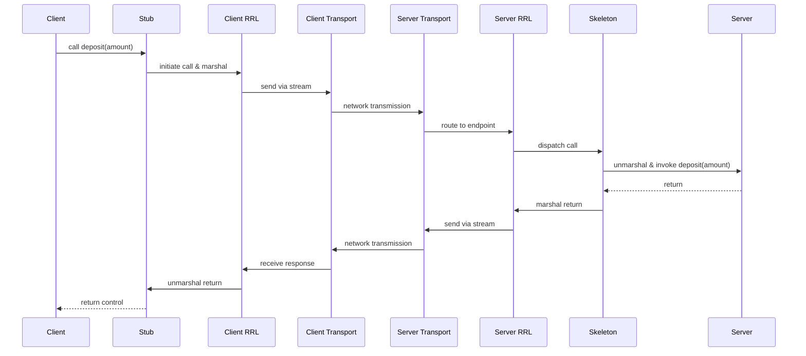

# L06b Java RMI

> [!summary] TL;DR
> Java RMI provides a distributed object model that integrates seamlessly into the Java language, making remote method invocations appear syntactically identical to local calls.
> It handles marshaling, communication, and object location transparently through a layered architecture comprising stubs/skeletons, a remote reference layer, and a transport layer.
> RMI distinguishes itself from local Java semantics by passing non-remote parameters by value (copy) and introducing `RemoteException` to expose the inherent unreliability of distributed networks.

## Learning outcomes

- Explain the differences between the Java distributed object model and the local Java object model.
- Contrast reusing a local implementation with reusing a remote object class for creating remote services.
- Describe the three layers of the Java RMI system architecture and their specific responsibilities.
- Explain the parameter passing semantics for remote versus non-remote objects in Java RMI.

## Motivation and the problem

Building client-server systems using traditional sockets or simple RPC requires manual marshaling, demarshaling, and complex application-level protocols.
While RPC systems abstract communication to a procedure call, they fail to translate well into object-oriented paradigms where objects reside in different address spaces.
Java needed a distributed object model that felt natural and seamless within the language.
The goal was to allow remote method invocation (RMI) between Java objects in different virtual machines while preserving safety, minimizing complexity, and clearly distinguishing the failure modes of distributed calls from local ones.

## Core concepts

### Java distributed object model

<!-- coverage: L06b-01 -->
> [!note] Java distributed object model
> An extension of the local Java object model that supports method invocations on objects residing in different address spaces or machines, while retaining as much native Java semantics as possible.

The Java distributed object model provides a natural, object-oriented way for distributed communication in Java.
It retains much of the local object semantics, such as passing remote object references as arguments and supporting polymorphic type checking using the built-in `instanceof` operator.

However, fundamental differences exist due to the inherent nature of distributed systems.
Clients interact strictly with remote interfaces, never with the implementation classes themselves.
Furthermore, clients must explicitly handle `RemoteException` to deal with potential network or server failures.
Additionally, fundamental `Object` methods like `equals` and `hashCode` are overridden to only support reference equality for remote objects, because determining content equality would require costly and potentially failing remote calls.

### Remote objects and remote interfaces

<!-- coverage: L06b-02 -->
> [!note] Remote interface
> An interface in Java that extends `java.rmi.Remote` and declares the methods of a remote object that can be invoked from a different address space.

A remote object is an entity whose methods can be accessed remotely.
To define one, a programmer creates a remote interface.
This separation ensures that clients only depend on the interface declaration and remain oblivious to the underlying implementation details.

Every method declared in a remote interface must include `java.rmi.RemoteException` in its `throws` clause.
This design forces the client developer to handle potential distributed failures, reflecting the reality that remote calls can fail in ways local calls cannot (such as network partitions or server crashes).
Clients program against these remote interfaces, and the underlying RMI system provides a local proxy (the stub) that implements the interface and forwards the invocations across the network.

### Reuse of local implementation versus reuse of remote object class

<!-- coverage: L06b-03 -->
> [!note] Implementation reuse
> The architectural choice between building a remote service by extending a legacy local class (local reuse) versus extending a base RMI class like `RemoteServer` (remote reuse).

When implementing a remote object, developers face a choice between reusing an existing local implementation or reusing a remote object class.
In the "reuse of local implementation" approach, a class extends a regular local class and implements the remote interface.
The programmer must then explicitly export the object to the RMI runtime to make it accessible and manually handle Java `Object` semantics (like overriding `equals` and `hashCode`).
While this allows for reusing legacy code, it requires more boilerplate and manual management.

The preferred "reuse of remote object class" approach involves extending a class like `RemoteServer` (often via `UnicastRemoteObject`).
The default constructor of this base class automatically exports the object, making it immediately visible to remote clients.
Inherited methods provide appropriate remote semantics automatically, significantly reducing implementation complexity and seamlessly integrating the object into the distributed model.

### Server side and client side of RMI

<!-- coverage: L06b-04 -->
> [!note] RMI workflow
> The asymmetric responsibilities where a server instantiates and publishes a remote object to a registry, and a client looks up the object to obtain a local stub for invocation.

The RMI system strictly decouples the provision of a service from its consumption.
On the server side, an object is made visible to the network through a three-step process: the server instantiates the object, creates a Uniform Resource Locator (URL) for it, and binds the URL to the object instance in a registry (using `java.rmi.Naming.bind`).
This publishes the service for discovery.

On the client side, a client discovers the service by looking up the URL in the bootstrap name server, which returns a local access point (a stub).
The client then invokes methods on this stub exactly as if it were a local object.
The client remains completely unaware of the server's actual location or the transport mechanics, only dealing with the application logic and catching any `RemoteException` thrown during execution.

### Parameter passing semantics for remote objects

<!-- coverage: L06b-05 -->
> [!note] Pass by copy
> The semantic rule in Java RMI where non-remote objects passed as arguments or return values are serialized and copied across the network, rather than passed by reference.

Parameter passing in Java RMI relies heavily on the type of object being transferred.
If a parameter or return value is a remote object, its remote reference (the stub) is passed.
This mirrors local Java semantics where object references are passed.

However, if the object is a non-remote (standard local) object, it is passed by value using an external data representation process known as "pickling" (serialization).
This means the server receives a completely separate copy of the object in its own address space.
Any changes made to this copied object by the server are not visible to the client, preventing unintended side effects across virtual machines.
This semantic shift is crucial for maintaining isolation and safety in a distributed environment.

### RMI implementation: remote reference layer

<!-- coverage: L06b-06 -->
> [!note] Remote reference layer (RRL)
> The middle layer of the RMI architecture responsible for specific invocation protocols and reference semantics, independent of the client stubs and transport.

The Remote Reference Layer (RRL) sits between the stub/skeleton layer and the transport layer.
It is responsible for handling the specific semantics of the invocation.
While stubs and skeletons handle the marshaling of specific arguments, the RRL dictates how the message reaches the target.

The RRL can support various invocation protocols, such as simple unicast invocation to a single server, multicast invocation to a replicated group of servers, or handling persistent references for the lazy activation of long-running services.
The RRL acts much like the Subcontract mechanism in the Spring operating system, hiding the server's location and replication details and allowing different invocation strategies to be employed transparently without altering the application code.

### RMI transport layer: endpoint, transport, channel, connection

<!-- coverage: L06b-07 -->
> [!note] RMI transport
> The lowest layer of the RMI architecture that manages the actual network connections, connection setup, and routing to endpoints.

The transport layer provides the foundation for data transfer and manages the actual network connections while hiding protocol specifics (like TCP or UDP) from higher layers.
It consists of four main abstractions:

1.
**Endpoint**: A protection domain (similar to a sandbox or a Java Virtual Machine) that holds a table of accessible remote objects.
2.
**Transport**: The module that manages the selected protocol, listens for incoming connections, and locates the dispatcher for a remote method.
3.
**Channel**: The conduit between two endpoints, determined by the transport type, over which I/O occurs.
4.
**Connection**: The mechanism concerned with the setup, establishment, liveness monitoring (via periodic heartbeats), and teardown of client-server connections.

This layered approach allows the RMI system to dynamically switch transport protocols depending on network conditions without affecting the application or the remote reference layer.

### Distributed garbage collection

<!-- coverage: L06b-08 -->
> [!note] Distributed garbage collection (DGC)
> A mechanism that tracks remote references across virtual machines using a leasing system to reclaim memory for objects that are no longer referenced by any client.

While local Java relies on a standard garbage collector, RMI requires distributed garbage collection (DGC) to track references that cross virtual machine boundaries.
Without DGC, a server would not know when it is safe to reclaim a remote object's memory.

When a client receives a remote reference, the DGC system registers this holding.
The server keeps the remote object alive as long as at least one remote client (or a local reference) holds it.
Clients are granted a "lease" for the object and must periodically renew this lease by sending heartbeats.
If a client crashes or discards the stub without notifying the server, the lease eventually expires.
Once all leases expire and no local references remain, the server's local garbage collector can safely reclaim the object.

## Mechanisms step by step

The invocation of a remote method travels down through the RMI layers on the client side, across the network, and up through the layers on the server side.

## Worked examples

### Parameter passing size calculation

Suppose a client invokes a remote method `acct.updateProfile(AccountInfo info)` where `AccountInfo` is a non-remote object containing 10 fields.
Serializing this object takes 150 bytes.

If the client passes a non-remote object:
- **Bytes transmitted**: The client serializes the object, sending 150 bytes across the network. 
- **Server state**: The server deserializes it into a new instance and modifies a field. 
- **Return transmission**: Because it was passed by copy, the server's modifications do not affect the client's original object.
  The server transmits 0 bytes back for state synchronization.
  The client's object remains unchanged.

If the client instead passed a remote object reference (a stub):
- **Bytes transmitted**: The client only sends the stub identifier and transport details, which takes roughly 50 bytes.
- **Server state**: The server uses the stub to invoke callbacks to the client.
- **Network overhead**: Every time the server calls a method on the stub, it incurs a full remote network round-trip back to the client.
  If the server makes 10 calls, that is 10 round trips, heavily outweighing the initial 100 bytes saved during parameter transmission.

## Comparison

| Feature | Local object model | Distributed object model |
| :--- | :--- | :--- |
| **Reference passing** | Passed by reference | Remote objects passed by reference (stub) |
| **Non-remote parameters** | Passed by reference | Passed by copy (serialized) |
| **Failure handling** | Handled natively by JVM | Explicit `RemoteException` required for all calls |
| **Equality (`equals`)** | Can evaluate content/deep equality | Evaluates reference equality only |
| **Location** | Resides in a single JVM address space | Objects span multiple virtual machines |

| Approach | Setup complexity | Extensibility | Ideal use case |
| :--- | :--- | :--- | :--- |
| **Reuse local implementation** | High (manual export, `Object` overrides) | High (can extend any legacy class) | Wrapping existing legacy code that already has a complex class hierarchy. |
| **Reuse remote object class** | Low (automatic export via `RemoteServer`) | Low (must extend `RemoteServer`) | Writing new, dedicated distributed services from scratch. |

## Paper deep dives

Wollrath, Riggs, and Waldo's "A Distributed Object Model for the Java System" outlines the design of Java RMI.
The authors argue that while existing RPC systems successfully abstract communication to procedure calls, they fail to translate well to object-oriented languages where objects span different address spaces.
By assuming a homogeneous Java Virtual Machine environment, the system circumvents the complexities of multi-language interoperability (unlike CORBA), allowing it to retain native Java semantics like polymorphic type checking and object references, while explicitly handling distributed failures through `RemoteException`.

- [An Overview of the Spring System](../Papers/L06-Spring-Overview.md)
- [Subcontract: A Flexible Base for Distributed Programming](../Papers/L06-Subcontract.md)
- [A Distributed Object Model for the Java System](../Papers/L06-Java-Distributed-Object-Model.md)
- [Performance and Scalability of EJB Applications](../Papers/L06-EJB-Performance.md)

## Modern descendants

While Java RMI pioneered seamless distributed objects in the Java ecosystem, modern distributed architectures have largely moved away from language-specific RPC. 
- **gRPC**: Uses Protocol Buffers and HTTP/2 to provide a high-performance, language-agnostic RPC framework, bypassing Java's slow native serialization.
- **RESTful microservices**: Stateless, HTTP-based JSON endpoints have replaced stateful RMI objects in modern web services.
- **Apache Thrift**: A cross-language RPC framework that provides similar stub/skeleton generation but supports multiple languages.
Despite this shift, RMI's core abstractions—specifically the separation of interfaces from implementations and the use of proxies (stubs)—remain foundational concepts in modern dependency injection frameworks and distributed systems.

## Pitfalls and exam traps

> [!warning] Parameter mutation traps
> A common exam pitfall is assuming that modifying a non-remote object passed to a remote method will update the client's copy.
> Because non-remote objects are passed by value (pickled and copied), the server operates on a completely separate instance in memory.
> Modifications made by the server are entirely invisible to the client.

> [!warning] Equality checks
> Be careful when comparing remote objects.
> Using `.equals()` on a remote object only evaluates reference equality (whether the stubs point to the same remote backend).
> It will never evaluate deep content equality, as doing so would require a remote network call that could fail and throw an unexpected exception.

## Practice

- [Practice L06](../Practice/Practice-L06.md)

## Lab

- [lab-13-distributed-objects](../labs/lab-13-distributed-objects/README.md): Distributed objects: Java RMI, subcontract-style invocation, and a generic gRPC call

## Further reading

- [Java RMI Specification](https://docs.oracle.com/javase/8/docs/platform/rmi/spec/rmiTOC.html)
- [gRPC Documentation](https://grpc.io/docs/)
