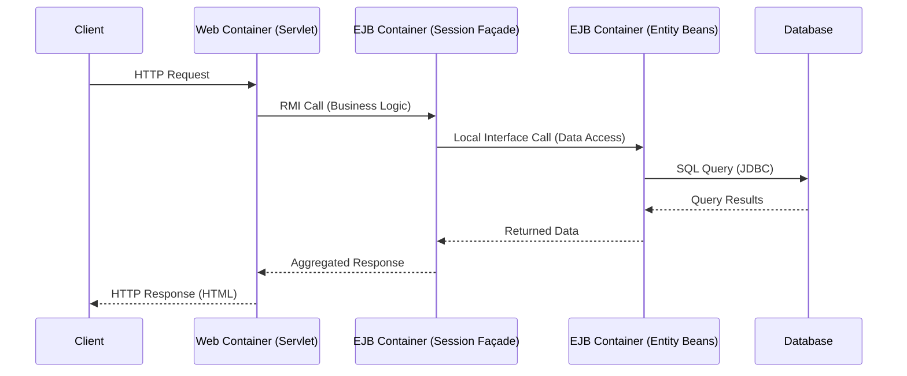

# L06c Enterprise Java Beans

> [!summary] TL;DR
> Enterprise Java Beans (EJB) is a component architecture for building distributed, scalable, and secure server-side applications in Java. It structures giant-scale services into an N-tier model, separating presentation, application, business logic, and database layers. By leveraging containers, EJB provides services like concurrency, security, transactions, and object pooling so developers can focus strictly on business logic. The architecture defines specialized beans (entity, session, and message-driven) to handle persistence and request processing with various design trade-offs around concurrency and communication overhead.

## Learning outcomes

- Explain the motivation behind N-tier applications and the role of Enterprise Java Beans in building them.
- Describe the structure of the EJB architecture, including containers and the different types of beans.
- Compare and contrast different design alternatives for structuring EJB applications, such as coarse-grained session beans, data access objects, and session facades.
- Analyze the trade-offs in concurrency, security, and persistence across these design alternatives.
- Calculate performance metrics related to bean invocation, connection pooling, and communication overhead.

## Motivation and the problem

As web applications evolved into Giant Scale Services (GSS) like e-commerce sites or airline reservation systems, developers faced the complex challenge of maintaining scalability, reliability, and security across multiple enterprises. Originally, applications were monolithic, making it difficult to separate concerns such as database access, user presentation, and core business rules. This complexity resulted in high costs of operation and poor service interoperability.

The EJB architecture was introduced to solve this by structuring distributed services into N-tier applications. It provides a standardized framework where common tasks like database connection pooling, transaction management, and concurrency control are handled by a container. This allows developers to focus entirely on writing the business logic, encapsulated in reusable components called beans, thereby reducing development time and improving overall system resilience.

## Core concepts

### N-tier applications and their concerns

<!-- coverage: L06c-01 -->
> [!note] N-tier architecture
> An architectural pattern that separates an application into multiple distinct logical layers, typically including presentation, application, business logic, and database tiers, to promote modularity and scalability.

Distributed Giant Scale Services are often built using an N-tier architecture to effectively manage complexity. The presentation layer handles generating the web page (often via servlets and JSPs), the application layer manages the flow of the request, the business logic layer executes the core rules (like calculating prices), and the database layer manages data persistence.

In this model, developers must carefully address cross-cutting concerns such as data caching, transaction properties, security, and concurrency. Proper separation of these layers ensures that components can be reused across different client requests and that the system can exploit parallelism when serving multiple simultaneous users. By isolating the business logic from the presentation, the architecture also enhances security by keeping sensitive operations within the corporate network.

### Containers and the EJB structure

<!-- coverage: L06c-02 -->
> [!note] EJB Container
> A protected execution environment within a Java Virtual Machine (JVM) that hosts Java Beans and provides them with essential distributed system services like lifecycle management, security, and transaction control.

The EJB structure relies heavily on containers to manage the execution environment of reusable software components known as Java Beans. A single Java Bean is a bundle of objects providing specific functionality, such as a shopping cart. A container hosts a related collection of these beans to form higher-level services.

In the Java Enterprise Edition (JEE) framework, there are typically four types of containers: the Client and Applet containers (which interact with the client), the Web container (managing presentation logic via servlets), and the EJB container. The EJB container specifically manages the business logic and communicates with the database server. By abstracting the infrastructure into containers, the EJB model ensures that individual beans do not need to implement complex middleware logic themselves, relying instead on the container's robust, tested services.

### Types of beans: entity, session, message-driven

<!-- coverage: L06c-03 -->
> [!note] Bean Types
> The EJB specification defines Entity beans for persistent data, Session beans for workflow and temporary tasks, and Message-driven beans for asynchronous event handling.

Entity beans represent persistent objects, typically mapping directly to a row in a database table. They have primary keys for easy retrieval and can manage their own persistence (Bean-Managed Persistence, BMP) or let the container handle it (Container-Managed Persistence, CMP).

Session beans are associated with a specific client-server session and can either maintain state across multiple interactions (Stateful Session Beans) or discard it after each request (Stateless Session Beans). Message-driven beans are designed for asynchronous behavior, processing messages from queues like JMS (Java Message Service) without tying up the client thread, which is ideal for tasks like processing newsfeeds or stock tickers. Developers must choose between fine-grained beans, which offer high concurrency but complex logic, and coarse-grained beans, which simplify logic but reduce concurrent access.

### Design alternative: coarse-grained session bean

<!-- coverage: L06c-04 -->
In this design, a coarse-grained session bean is associated with each servlet to handle the needs of a single client session. The EJB container's primary role is to coordinate these independent, concurrent sessions. This approach requires minimal container services and keeps the business logic hidden within the corporate network since it resides in the EJB container rather than the Web container.

However, this structure resembles a monolithic kernel, limiting concurrency. Because the single session bean handles all aspects of the request, there is very little opportunity to access different parts of the database in parallel. This design sacrifices potential performance gains from parallel execution for the sake of simplicity.

### Design alternative: data access object

<!-- coverage: L06c-05 -->
> [!note] Data Access Object (DAO)
> A pattern that abstracts and encapsulates all access to the data source, managing the connection and executing data operations while hiding the details from the rest of the application.

This design moves the business logic out of the EJB container and into the Web container alongside the servlets. All database interactions are then handled through Data Access Objects (DAOs) implemented as entity beans. Because multiple entity beans can operate in parallel for a single client session, this design allows for a high degree of concurrency.

It also provides the opportunity to cluster requests from different clients, reducing the number of individual database accesses. The granularity of the DAO dictates the concurrency level, promoting reusability. The significant drawback, however, is that the business logic is exposed outside the secure corporate network since it now resides in the Web container, potentially compromising security.

### Design alternative: session beans with entity beans

<!-- coverage: L06c-06 -->
Also known as the session façade pattern, this alternative keeps the presentation logic in the Web container while locating the business logic, a session façade, and entity beans within the EJB container. The session façade acts as a single point of entry for the client session, managing all necessary data access by communicating with various entity beans. This communication can occur via Java RMI for network flexibility or through local interfaces for faster, in-memory performance.

This design achieves the best of both worlds: it keeps the business logic secure, avoids exposing numerous fine-grained objects over the network, and still allows entity beans to cluster database requests for improved concurrency. The main cost is the overhead of internal communication, which can be mitigated by co-locating the façade and entity beans within the same EJB container.

### Trade-offs in concurrency, security, and persistence across designs

<!-- coverage: L06c-07 -->
Choosing an EJB design involves carefully balancing concurrency, security, and communication costs. Coarse-grained session beans maximize security by keeping business logic in the EJB container but suffer from limited concurrency, behaving much like a monolith. The DAO approach with entity beans maximizes concurrency by allowing parallel database access but weakens security by shifting business logic to the less secure Web container.

The session façade pattern balances these by maintaining security and allowing concurrent entity bean execution, but it introduces the overhead of managing multiple beans and inter-bean communication. Furthermore, relying on Container-Managed Persistence (CMP) simplifies development but may result in less optimized database queries compared to Bean-Managed Persistence (BMP), where developers hand-tune SQL at the cost of larger code size and complexity.

## Mechanisms step by step

When a client requests a service using the session façade pattern, the process involves several steps spanning multiple layers. The client sends an HTTP request to the Web container. The Web container invokes a servlet to handle the presentation logic. The servlet makes a remote method invocation (RMI) to a session façade bean located in the EJB container.

The session façade coordinates the business logic and makes local calls to one or more entity beans to fetch or update required data. The entity beans interact with the database using the container's JDBC connection pool. The database returns the results to the entity beans, which pass them to the session façade. The session façade aggregates the data and returns it to the servlet, which renders the final HTML page for the client.

## Worked examples

Consider the communication overhead in different EJB designs based on the auction site performance study. Suppose a single client interaction requires 5 distinct database accesses.

In a pure session bean design, the servlet makes 1 RMI call to the session bean, which then executes 5 JDBC calls. The total network-level calls between containers is 1.

In a DAO design using remote entity beans, the servlet holding the business logic must make 5 separate RMI calls to 5 entity beans across the network. The total network-level calls between containers is 5.

In a session façade design with remote interfaces between the façade and entity beans, the servlet makes 1 RMI call to the façade. The façade then makes 5 RMI calls to the entity beans. If they are in the same JVM, this is still 5 RMI communication layer overheads unless optimized. By using EJB 2.0 local interfaces, the 5 RMI calls from the façade to the entity beans bypass the communication layer entirely, reducing the overhead to just memory references. This matches the network efficiency of the pure session bean design (1 RMI call from servlet to façade) while maintaining the structural benefits of entity beans.

## Comparison

| Design Alternative | Concurrency | Security | Network Overhead | Best Use Case |
| :--- | :--- | :--- | :--- | :--- |
| **Coarse-grained Session Bean** | Low (monolithic) | High (logic in EJB tier) | Low (1 call per request) | Simple, non-parallelized business logic. |
| **DAO with Entity Beans** | High (parallel access) | Low (logic in Web tier) | High (many fine-grained calls) | High-concurrency needs where security is handled externally. |
| **Session Façade (Remote)** | High | High | High (internal RMI overhead) | Distributed deployments requiring strict security. |
| **Session Façade (Local Interfaces)** | High | High | Low (bypasses RMI internally) | Complex, high-performance applications on a single server. |

## Paper deep dives

- [An Overview of the Spring System](../Papers/L06-Spring-Overview.md)
  The Spring system provides a secure, flexible operating system environment. It uses strongly typed interfaces and distributed objects to allow for seamless cross-machine invocation, laying the groundwork for modern distributed component architectures.
- [Subcontract: A Flexible Base for Distributed Programming](../Papers/L06-Subcontract.md)
  Subcontract introduces a mechanism to separate the object interface from the underlying communication and management protocols. This allows developers to plug in different RPC mechanisms or memory management strategies without altering the application code, a concept echoed in EJB container services.
- [A Distributed Object Model for the Java System](../Papers/L06-Java-Distributed-Object-Model.md)
  This paper details the foundation of Java RMI, explaining how Java's object model is extended to support distributed objects. It highlights the challenges of garbage collection, parameter passing by value versus reference, and remote object tracking across JVMs.
- [Performance and Scalability of EJB Applications](../Papers/L06-EJB-Performance.md)
  By evaluating five different EJB implementations of an auction site, this paper demonstrates that application design significantly outweighs container choice in performance. It reveals that stateless session beans offer the highest throughput, while fine-grained entity bean access severely limits scalability unless optimized with local interfaces.

## Modern descendants

The legacy of EJB's heavyweight component model paved the way for modern lightweight frameworks and distributed systems. The Spring Framework emerged directly as a lightweight alternative to the cumbersome EJB 2.x standard, providing dependency injection and aspect-oriented programming without requiring a full application server. Microservices architectures conceptually mirror the session façade and DAO patterns by splitting giant scale services into independently deployable, fine-grained REST or gRPC services. Modern containerization (Docker, Kubernetes) has largely replaced the EJB container's role in deployment and lifecycle management. Furthermore, the push for high-performance, in-memory communication seen in EJB local interfaces is reflected in modern remote procedure call frameworks like gRPC, which optimize serialization and transport layers.

## Pitfalls and exam traps

> [!warning] Exam Trap
> A common misconception is that adding more Entity Beans inherently improves performance. While Entity Beans allow for parallel database access, the overhead of creating, pooling, and communicating with many fine-grained beans over RMI can severely degrade performance. Always consider the communication cost.

> [!warning] Exam Trap
> Be careful with the location of the business logic. Placing business logic in the Web container (as in the DAO pattern) increases concurrency but exposes the logic outside the EJB container, which is a major security design flaw.

## Practice

- [Practice L06](../Practice/Practice-L06.md)

## Lab

- [lab-13-distributed-objects](../labs/lab-13-distributed-objects/README.md): Distributed objects: Java RMI, subcontract-style invocation, and a generic gRPC call

## Further reading

- Oracle's [Enterprise JavaBeans Technology](https://www.oracle.com/java/technologies/ejb.html) official documentation.
- "Core J2EE Patterns" by Deepak Alur, John Crupi, and Dan Malks for detailed discussions on Session Façade and Data Access Object patterns.
- JSR 318: Enterprise JavaBeans 3.1, which drastically simplified the EJB architecture with annotations.
