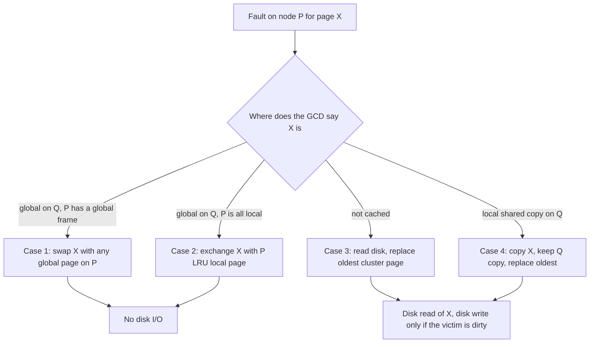
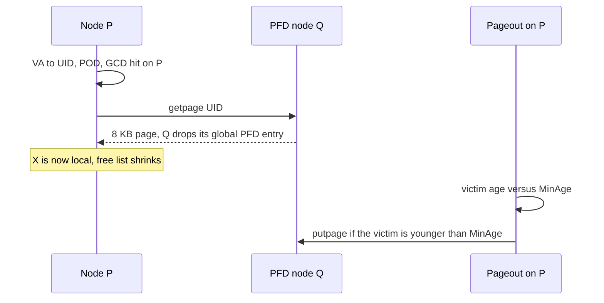

# L07a Global Memory Systems

> [!summary] TL;DR
> A workstation cluster has idle DRAM on some nodes and a disk bottleneck on others.
> Global Memory Service (GMS) inserts cluster memory into the hierarchy between local DRAM and disk, and it pages clean pages to the nodes most likely to be idle.
> Time is split into epochs.
> An initiator publishes a minimum replacement age and a per-node weight, and every node then decides locally whether to discard a victim or forward it.
> On the SOSP 1995 implementation, memory-intensive applications ran 1.5x to 3.5x faster once the cluster held enough idle memory, while a global-cache miss added only about 15 microseconds to a disk read.

## Learning outcomes

- Draw the four GMS page-fault cases and state which boundaries move, which pages are copied versus swapped, and whether disk I/O happens.
- Compute a node's weight, MinAge, and the next initiator from a list of page ages and an epoch budget M.
- Trace a UID through the page ownership directory, the global cache directory, and the page frame directory, and count the network hops for a private page versus a shared page.
- Explain why a crashed node that holds global pages loses no unique data, and why GMS does not solve coherence.
- Compare a global-memory hit with a local disk read using the paper's microbenchmark numbers, and check the ratio by hand.

## Motivation and the problem

Processor speed and network speed pulled away from disk speed in the mid-1990s.
A local memory hit is more than three orders of magnitude faster than a disk read, while a hit in another node's memory is only about two to ten times faster than disk.
The paper's own ratio matches that claim: a non-shared global hit costs 1440 microseconds, and an OSF/1 disk read on the same machines costs 3600 to 14300 microseconds, which is 2.5x to 9.9x slower.
Meanwhile each workstation still managed its own memory as if the others did not exist.
A busy node wrote pages to its local disk while a neighboring idle node had free DRAM.
Dedicated remote-memory servers (Comer and Griffioen, Felten and Zahorjan) and autonomous client caches (N-chance forwarding) had already shown the opportunity.
GMS differs by making one cluster-wide replacement decision at the lowest level of the OS, covering anonymous VM pages, mapped files, and the file cache, and by surviving nodes that join, leave, or crash.

## Core concepts

### Context for distributed subsystems

<!-- coverage: L07a-01 -->

> [!note] Definition
> Lesson 7 treats a cluster as a pool of three resources that a single node should not hoard: spare DRAM (GMS), a shared address space (distributed shared memory), and a shared file cache (distributed file systems).

The three subsystems answer different questions, and mixing them up is the first exam failure.
GMS asks how peer memory can sit under the local page cache as a paging device.
Distributed shared memory asks how the cluster can look like one shared-memory machine to a parallel program.
A distributed file system asks how file blocks can be cached cooperatively so that a central NFS server is not the bottleneck.
GMS is not a coherence protocol.
A page that sits in the global part of memory is always a clean private page, and any sharing semantics belong to the file system or the application that created the copies.
TreadMarks, xFS, and Coda are the other Lesson 7 designs.
They show up again in [L07b](L07b-Distributed-Shared-Memory.md) and [L07c](L07c-Distributed-File-Systems.md).
The reason to start with GMS is that it is the simplest change to the memory hierarchy: same pages, same disk as the stable copy, a new place to keep the clean ones.

### Cluster memory as a paging device

<!-- coverage: L07a-02 -->

> [!note] Definition
> Cluster memory is the DRAM of other nodes, used as a cache of clean pages that would otherwise be read back from disk.

The virtual address space of a process is larger than the physical frames the node will give it.
The working set is the part that has to stay in local frames if the process is to run without thrashing.
When local frames cannot hold every working set on the node, the usual OS picks a victim and sends it to disk.
GMS changes the victim's destination, not the fact that a victim is required.
A clean page can be stored on a peer and read back later over the LAN.
The lecture's order-of-magnitude picture is a local disk near 10 milliseconds and remote memory near 100 microseconds, or about 20 microseconds with a specialized network.
The paper measures the specialized case: 8 KB pages on a 155 Mb/s DEC AN2 ATM network, with a user-to-user UDP exchange of an 8 KB page at about 1640 microseconds and a GMS getpage hit at 1440 microseconds.
Disk is still faster to avoid.
A sequential non-shared read dropped from 3.6 ms without GMS to 2.1 ms with it, a 41 percent cut, and a random read dropped from 14.3 ms to 2.1 ms, a 6.8x cut.
Check: (3.6 - 2.1) / 3.6 = 0.417, and 14.3 / 2.1 = 6.81.
GMS does not reduce the number of disk writes.
A dirty page is still written to disk.
The win is the later read, which can hit the clean copy that was left in cluster memory after that write.

### Local and global parts of memory

<!-- coverage: L07a-03 -->

> [!note] Definition
> On each node, local memory holds pages recently used by that node's own processes, and global memory holds clean private pages stored on behalf of other nodes.

The split is a use of the node's fixed DRAM, not two separate memories.
Local frames plus global frames equal the node's physical frames (plus the free list, which the implementation actually allocates from).
Local memory may contain private pages and shared pages.
Global memory contains only private pages.
A shared page may exist in the local memory of several nodes at once, because two nodes opened the same NFS file, but a page that has been forwarded into global memory is never a shared page.
The boundary moves.
A node under memory pressure grows its local part and shrinks its global part.
An idle node does the opposite, until it is mostly a memory server for its peers.
The paper also biases the age of global pages so that, at the same nominal age, a global page is preferred for replacement over a local page.
The cost of mistakenly evicting a local page is a future local miss, which is vastly more expensive than mistakenly evicting a global page.

```text
Node P, 8 frames, boundary moving down as local pressure grows

  local  | A B C D E . . . |     quiet node, 5 local, 3 global
  global | . . . . . F G H |

  local  | A B C D E I J K |     busy node, global part is gone
  global | . . . . . . . . |
```

### Page fault case 1: page in global cache of another node

<!-- coverage: L07a-04 -->

> [!note] Definition
> Case 1: the faulted page X lives in the global memory of some node Q, and the faulting node P still has at least one global frame.

P brings X into its local memory, which grows P's local count by one.
Because P's frame count is fixed, P gives up one global frame.
The paper swaps X with any global page Y on P.
Y is installed in Q's global memory where X used to be, so Q's local count and global count both stay the same.
No disk I/O occurs.
X is no longer a global page.
It is now a local page on P, and the single global copy moved with the swap.
The lecture sometimes says "the oldest global page on P".
The algorithm statement says any global page.
Age is applied for real by the pageout daemon on the cases that read from disk.

| Node | Before | After | Boundary |
| --- | --- | --- | --- |
| P | local L, global G, G >= 1 | local L+1, global G-1 | moves toward global |
| Q | holds X in global | holds Y in global, counts unchanged | unchanged |

Work a 4-frame sketch.
P starts as local {A, B} and global {C, D}.
Q starts as local {E, F} and global {X, G}.
P faults on X.
After the swap, P is local {A, B, X} and global {D}, and Q is local {E, F} and global {C, G}.
P's local grew by 1.
Q's global still has 2 pages.
Cluster-wide, the same four distinct cached pages on these two nodes are still cached, just relocated.

### Page fault case 2: no global part on the faulting node

<!-- coverage: L07a-05 -->

> [!note] Definition
> Case 2: X is still in Q's global memory, but P's memory is entirely local.

Repeated case-1 faults grow P's local part until the global part hits zero.
P is then doing no community service.
The next fault cannot be paid for with a global frame on P.
The paper exchanges P's LRU local page V with X.
P's local count stays the same, because V leaves and X enters.
Q's global count stays the same, because X leaves and V enters as a global page.
Both boundaries stay put, and there is still no disk I/O.
That is the precise reading of "the boundary on both nodes remains unchanged".
Discarding V to disk instead would also keep P's counts stable, but it would shrink Q's global part without a replacement, so Q's boundary would move.
The exchange is what keeps both boundaries fixed.

Continue the sketch.
P is now local {A, B, X, H} and global is empty.
P faults on G, which is global on Q, and A's age makes it the LRU local page.
After the exchange, P is local {B, X, H, G} and Q's global part holds A in G's old frame.
Counts: P local 4, Q global unchanged.

### Page fault case 3: page on disk

<!-- coverage: L07a-06 -->

> [!note] Definition
> Case 3: no node's memory holds X, so P reads X from disk and the globally oldest page is the one that leaves the cluster cache.

X becomes a local page on P.
If P has a global page Y, P sends Y to the node R that holds the oldest page Z, and Y remains a global page there.
If P has no global page, P sends its LRU local page instead.
Z is discarded when it is clean and written to disk when it is dirty.
This is the only case among the private-page hits and misses that must touch disk for the faulted page itself.
The read of X is a disk read.
The write of Z is a second disk I/O only when Z is dirty.
On R the frame count does not change, but the class of the frame can.
Replacing a global Z with global Y leaves R's boundary alone.
Replacing a local Z with global Y shrinks R's local part and grows its global part.
That second outcome is how an idle node's old working set is pushed out and its DRAM fills with other nodes' pages.
The figure caption in the paper states the same rule in one line: the oldest page in the network is discarded if clean, or written back if not.

| Subcase on R | Z | Disk write of Z | R boundary |
| --- | --- | --- | --- |
| Y lands in a global frame | clean global | no | unchanged |
| Y replaces a local frame | dirty local | yes | local -1, global +1 |
| Y replaces a local frame | clean local | no | local -1, global +1 |

Global memory also grows in the variant the paper calls out explicitly.
P has no global pages, and the oldest page in the network is a local page.
P's LRU local page becomes a global page on the node that lost that oldest page.
One new global frame appears in the cluster because a local frame was converted.

### Page fault case 4: page actively shared

<!-- coverage: L07a-07 -->

> [!note] Definition
> Case 4: X is a shared page sitting in Q's local memory, not in anyone's global memory.

P copies X into a local frame and leaves Q's copy in place.
The cluster now has one extra live copy, so some other page must give up a frame.
GMS picks the oldest page Z in the cluster, on node R, writes it to disk if it is dirty, and sends a global page from P to R to occupy the frame.
If P has no global page, P's LRU local page is forwarded instead.
Q's boundary does not move, because the original shared copy stays.
P's local count grows by one and its global count shrinks by one when it had a global page to forward.
The duplicate is the reason the lecture says cluster memory pressure goes up by one.
Two nodes now charge a frame to the same logical page, and the oldest other page is the one that pays by leaving memory.
GMS still does not run a coherence protocol.
The two copies are the file system's problem, typically NFS in this implementation.
If a later putpage finds that a shared page already has a duplicate elsewhere, the extra copy is simply discarded rather than forwarded again.

### Behavior with idle nodes

<!-- coverage: L07a-08 -->

> [!note] Definition
> An idle node is one whose local pages are old enough to lose the global replacement contest, so its frames fill with other nodes' clean pages.

The boundary is a function of the whole cluster's reference pattern, not a configured quota.
Active nodes grow local memory and start consuming remote frames.
Idle nodes, whose pages age, lose those pages to disk or to discard and accept global pages in the freed frames.
A node that stays idle long enough becomes a memory server.
The reverse happens when the idle node wakes up: its new faults are case 2 or case 3, its local part grows back, and the global pages it was hosting are forwarded or dropped.
The algorithm is built to find skewed idleness.
In the paper's comparison, when 25 percent of the nodes held 75 percent of the free pages, GMS beat N-chance forwarding even when N-chance was given twice as many idle pages.
When idle memory was uniform and plentiful, the two policies met.
The practical limit is the CPU on the idle node, not the lookup.
With seven copies of the 007 benchmark sharing one idle node's memory, that node handled 2880 page transfers per second and spent 56 percent of its CPU.
Check: 2880 transfers/s times 194 microseconds/transfer = 558720 microseconds/s = 55.9 percent of one CPU, which the paper rounds to 56 percent and 194 microseconds.
If every node is busy, the initiator sets MinAge to 0.
Pages are then discarded or written to disk instead of forwarded, and GMS gets out of the way until idle memory returns.

### Page age management and epochs

<!-- coverage: L07a-09 -->

> [!note] Definition
> An epoch is a window with a maximum duration T, a maximum number M of cluster replacements, and a published age cutoff MinAge.

Complete global age information at every instant is impossible at cluster scale, so GMS distributes an approximation.
Each epoch is on the order of 5 to 10 seconds in the implementation, and T and M change from epoch to epoch.
A new epoch starts when T elapses, when M global pages have been replaced, or when the age summary is detected to be wrong.
At the start, every node sends the initiator a summary of the ages of its local and global pages.
The initiator finds the M oldest pages in that summary.
MinAge is the age of the youngest page in that set, which means every page at least that old is expected to leave the cluster cache during the epoch.
The initiator also counts how many of those M pages sit on each node.
That count is the node's weight w_i, and the weights sum to M.
During the epoch, a node that must evict a page while faulting a page in from disk (cases 3 and 4) tests the victim's age.
If the victim is older than MinAge, the node discards it, because the epoch already planned to drop it.
If the victim is younger, the node forwards it.
The probability of choosing node i as the target is proportional to w_i.
On average, node i therefore receives w_i/M of the forwarded evictions and drops its own oldest page for each one.
Two properties follow.
The M pages the cluster drops are approximately the M globally oldest pages.
And the node with the largest weight can declare the epoch over once it has received w_i pages, which is a local statistical stand-in for "M replacements have happened".
Longer epochs are used when many old pages exist or the discard rate is low.
A 2-second epoch is described as extremely short.
The implementation also boosts global-page ages so a global page loses to a local page of similar true age.

### Initiator selection and min-weight

<!-- coverage: L07a-10 -->

> [!note] Definition
> The initiator for the next epoch is the node with the largest weight, which is the node holding the most of the pages the cluster is about to throw away.

"Min-weight" in the course heading is the pair the initiator publishes: MinAge, and the weight vector.
It is not "pick the smallest weight".
The largest weight is the least active node.
Every node receives the same pair and computes the same next initiator locally, with no extra election round.
The current initiator is using the past age summary to predict where future replacements will land.
That prediction is what lets a faulting node choose a forward target without asking the cluster.

Toy epoch, M = 4, age = seconds since last use, larger means older.

| Node | Page ages | How many of the 4 oldest |
| --- | --- | --- |
| A | 10, 20 | 0 |
| B | 30, 90 | 1 (the page aged 90) |
| C | 40, 70, 80, 100 | 3 (70, 80, 100) |

The four oldest ages are 100, 90, 80, and 70.
Weights: w_A = 0, w_B = 1, w_C = 3, and 0 + 1 + 3 = 4 = M.
MinAge = 70.
Next initiator = C.
A victim of age 90 is discarded, because 90 >= 70.
A victim of age 40 is forwarded, with probability 3/4 to C, 1/4 to B, and 0 to A.
Over a run of 400 forwards that follow those probabilities, the expected arrivals are 0, 100, and 300.
The epoch's statistical end is "C has accepted 3 pages" in the toy, or w_C pages in the real rule.
If the summary says there are not enough old pages because every node is active, MinAge is set to 0 and nothing is forwarded.

### GMS implementation in the OS

<!-- coverage: L07a-11 -->

> [!note] Definition
> GMS is a module inside OSF/1 on DEC Alpha workstations, sitting beside the virtual memory system and the unified buffer cache, and consulted by the pageout daemon.

The VM system owns anonymous pages, the stacks and heaps.
The unified buffer cache (UBC) owns file pages, both mapped files and pages read or written through the file system.
Before GMS, both paths wrote victims to disk, faults read from disk, freed frames returned to the free list, and the pageout daemon wrote dirty pages early so a later fault would not have to.
After GMS, disk writes still happen for dirty pages, but a fault reads from GMS first, and the pageout daemon hands clean pages to GMS instead of dropping them.
Age is the awkward part.
UBC read and write calls can be intercepted, so file-cache ages are visible.
Anonymous and mapped-file references happen in hardware, and the OS does not see each load or store.
OSF/1's own FIFO-with-second-chance clock was not a good global age source, especially on a machine that is not faulting, which is exactly when GMS most wants the ages.
The implementation modifies the PALcode TLB handler to set a per-frame referenced bit, and a kernel thread samples those bits.
Once a minute the handler flushes the TLB so the next miss will set the bit again.
On the 225 MHz CPU the modified fill path is about 60 cycles, 18 more than the stock handler.
A 44-entry TLB therefore costs 60 x 44 = 2640 extra cycles per minute.
Against 225e6 x 60 = 1.35e10 cycles in a minute, that is 0.00002 percent of the CPU.
The paper reports no measurable slowdown from the handler.
Nodes trust each other.
The network is treated as reliable because AN2 has flow control.
The authors report no dropped packet in the experiments, and the code talks IP datagrams directly.
A designated master redistributes directory state when a node joins or is detected dead.
The master is a single point of failure for membership, not for page data.
Electing a new master is described as future work.

### Page frame directory, global cache directory, page ownership directory

<!-- coverage: L07a-12 -->

> [!note] Definition
> A page's cluster-wide name is a 128-bit UID: the IP address of the node that backs the page, the disk partition, the inode number, and the offset in that inode.

OSF/1 pages are a fixed multiple of disk blocks, and the transfer unit in the paper is 8 KB, so the UID names a page and not a smaller block.
Three structures are keyed by that UID.

| Structure | Scope | Lookup | Changes when |
| --- | --- | --- | --- |
| Page frame directory (PFD) | one node | UID to physical frame, LRU data, and local versus global | a page arrives or leaves that node |
| Global cache directory (GCD) | cluster-wide hash, partitioned | UID to the IP of a node that has the page cached | a page moves, and on membership change |
| Page ownership directory (POD) | replicated on every node | UID to the node that stores the GCD partition for that page | a node joins or leaves |

For a non-shared page the GCD entry lives on the node that is using the page, so the requester and the GCD node are the same node.
The POD exists so the hash of the GCD can stay stable while membership changes.
A central server pushes a new POD, and portions of the GCD move, when a node is added or a crash is detected.
During that window a lookup may miss and fall back to disk.
That is safe because every global page is clean.
The common fault path for a private page is one remote round trip.
The requester hashes the UID into its local POD, finds that it itself holds the GCD partition, looks up the PFD node, and sends one request.
A shared page can name three machines: the requester, the GCD node, and the PFD node.
A stale PFD, because a page moved and the directories have not caught up, is handled by a re-lookup of the POD.
The paper treats that path as rare.

### Putting a page into global memory

<!-- coverage: L07a-13 -->

> [!note] Definition
> A fault pulls a page in with getpage.
> The pageout daemon later pushes a victim out with putpage.
> The logical swap of the algorithm section is those two operations, not one synchronous exchange.

On a fault the node allocates a frame from the free list and issues getpage.
The remote interaction matches the directory walk above.
A hit returns the bytes.
A miss sends the requester to disk or to the NFS server.
The GCD is updated to the new location.
PFD entries on the requester and the old holder are updated.
If the old holder had been caching the page for someone else, it was a global page, and that holder deletes its PFD entry, because one global copy is enough.
The cost of a remote hit does not depend on which node holds the copy.
If the page was a local shared page, the old holder marks it as a duplicate and keeps it.
The requesting node adds its own PFD entry.
The free list shrinks as getpages run, and the pageout daemon wakes up.
Together with GMS, the UBC, and VM, it picks old pages.
Pages older than MinAge are discarded.
Younger pages are putpage'd to a target chosen by the weight rule.
putpage also updates the GCD at the node responsible for that UID, and both ends update their PFDs.
The sender does not wait for the target.
Sender latency in the microbenchmark is 65 microseconds for a non-shared page (58 for request generation plus 7 for GCD processing on the same node) and 102 microseconds for a shared page, where sender latency equals request generation.
A duplicate of a shared page is discarded rather than forwarded.
The target may itself discard or forward an older page, which is how one putpage ripples toward the idle node.

## Mechanisms step by step

The steady state a faulting node wants is "X is local on me, and the cluster still holds the globally youngest clean pages".
The mechanisms above are one policy applied to four locations of X.



Common-case private hit, the path the paper says is the usual one:



Node failure does not lose unique data.
Global pages are clean, and a dirty page hits disk before it is eligible to sit in global memory.
If the node that should have answered getpage is down, the requester reads the disk.
What does get disrupted is the age summary, if the initiator dies, and membership updates, if the master dies.
Neither of those is page contents.

## Worked examples

**Epoch arithmetic.**
Use the toy in the initiator section.
M = 4, weights 0, 1, and 3.
The forward probability to C is 3/4 = 0.75.
Suppose over the epoch the cluster forwards 80 pages that were younger than MinAge, and discards 40 that were older.
Expected forwards to C are 0.75 x 80 = 60.
Expected forwards to B are 0.25 x 80 = 20.
Expected forwards to A are 0.
C, holding the largest weight, is allowed to end the epoch after it has accepted w_C = 3 pages in the toy rule.
Scale the same fractions to the paper's "thousands of replacements": if M = 1000 and w_C = 600, C expects 60 percent of the forwards and ends the epoch after 600 arrivals.

**Hit versus disk.**
Non-shared getpage hit total is 61 + 156 + 8 + 1135 + 80 = 1440 microseconds.
The components are request generation, reply receipt, GCD processing, network hardware and software, and target PFD processing.
A random non-shared read without GMS is 14.3 ms = 14300 microseconds.
The difference is 14300 - 1440 = 12860 microseconds, about 12.9 ms saved per random fault.
One thousand such faults save 12.9 seconds.
The miss path adds a 15 microsecond directory probe (7 for request generation plus 8 for GCD processing) on top of a disk read of 3600 to 14300 microseconds.
That overhead is 15/3600 = 0.42 percent down to 15/14300 = 0.10 percent, which is the paper's "about 0.1 to 0.4 percent" claim in the no-idle-memory experiments.

**Idle-node CPU.**
2880 transfers/s at 194 microseconds each is 55.9 percent of a CPU, as checked above.
At that rate an 8 KB page is 2880 x 8192 = 23,592,960 bytes/s, about 23.6 MB/s of page traffic into one memory server.
The 155 Mb/s AN2 link is 155/8 = 19.4 MB/s in each direction if it were fully payload, so 23.6 MB/s of page bytes means the experiment is in the range where the link and the CPU are both busy.
The paper's point is the CPU tax on the machine you hoped was idle, not a claim that the network is free.

## Comparison

| Design | Who chooses the target | What is cached | Strength | Cost | Use when |
| --- | --- | --- | --- | --- | --- |
| Local disk only | the node itself | nothing remote | no trust, no extra CPU | every miss pays disk | the cluster has no idle DRAM |
| Dedicated memory server | a central registry | pages of busy clients | simple | the server is a bottleneck and sits idle as a client | a few big memory nodes serve many small ones |
| N-chance forwarding | random node, recirculate singlets N times | file pages in the Sprite study | no global age summary | misses the idle nodes when idleness is skewed | idle memory is plentiful and spread out |
| GMS | weight-proportional, epoch MinAge | clean private pages of VM, mapped files, and the file cache | approximates global LRU and tracks skew | age traffic, trust, CPU on the idle node | a LAN cluster with uneven memory pressure |
| Fastswap / Infiniswap | slab or memory-server placement over RDMA | anonymous pages, transparent swap | microseconds instead of 1440 | still a paging path, not a load/store pool | a rack with RDMA and idle DRAM |
| Pond (CXL pool) | pool allocation for a VM | load/store memory, not a page cache | no getpage round trip | needs CXL and a placement model | cloud hosts that can share a small pool |

N-chance is the comparison the paper actually implements inside OSF/1.
Singlet pages start with a recirculation count of N = 2.
A receiving node prefers to drop a duplicate, then a recirculating page, then a very old singlet.
GMS's advantage in the skewed experiment is that the weight vector points at the idle nodes instead of sampling them at random.

## Paper deep dives

[Implementing Global Memory Management in a Workstation Cluster](../Papers/L07-GMS.md) (Feeley, Morgan, Pighin, Karlin, Levy, and Thekkath, SOSP 1995) is the paper this note is built on.
The idea is one global replacement policy under VM and the file cache, epochs that publish MinAge and weights, and directory state that can be rebuilt well enough that a crash loses no unique page.
The number to remember is 1.5x to 3.5x on memory-intensive applications once idle cluster memory passes about 200 MB, with the speedup staying flat as the cluster grows from 5 to 20 nodes in their mixed workload.

[TreadMarks](../Papers/L07-TreadMarks.md) is the sibling system for a parallel program that wants shared memory, not a paging device.
It does run a coherence protocol (lazy release consistency, twins, and diffs).
GMS deliberately does not.
Read it with [L07b](L07b-Distributed-Shared-Memory.md).

[Serverless Network File Systems](../Papers/L07-xFS-Serverless-NFS.md) also uses idle client memory, but for file blocks striped across a log, with managers instead of a single NFS server.
The cooperative cache is the piece that feels like GMS.
The metadata and the stripe groups do not.
Read it with [L07c](L07c-Distributed-File-Systems.md).

[Coda](../Papers/L07-Coda.md) is about staying available when servers or the network fail, by hoarding files and reintegrating later.
It is not a global LRU for anonymous pages.
The partial reading is disconnected operation and server replication, covered in L07c.

## Modern descendants

The 2026 version of "idle DRAM somewhere else" splits into a paging path and a load/store path.
Infiniswap (NSDI 2017) pages to unused memory on other machines over RDMA and spreads each machine's swap space across many peers so one idle node is not a dedicated server.
Fastswap (EuroSys 2020, Amaro and others) is a Linux swap backend aimed at the same far-memory idea.
The paper reports remote page hits under 5 microseconds, about 10 Gbps with one thread and about 25 Gbps with several, which is two orders of magnitude under GMS's 1440 microsecond ATM hit and is the number that makes paging to remote DRAM attractive again.
Pond (ASPLOS 2023) stops paging.
CXL lets a CPU load and store into a pool, and Pond's production-trace argument is that pooling 8 to 16 sockets captures most of the DRAM-savings benefit.
Their evaluation reports about 7 percent less DRAM cost at performance within 1 to 5 percent of a same-NUMA-node allocation.
Linux zswap is the local cousin: a compressed cache in RAM in front of the swap device, documented in the kernel admin guide.
It does not cross the network, but it is the same hierarchy edit GMS made, inserting a level that is slower than DRAM and faster than disk.
Kernel samepage merging (KSM) is easy to confuse with this and is a different mechanism.
KSM scans for identical pages inside one host and shares one physical copy.
GMS moves distinct pages to a different host.
userfaultfd is the modern hook a user-level pager would use to implement a GMS-style fault handler without patching PALcode.

## Pitfalls and exam traps

> [!warning]
> GMS does not keep the copies of a shared page coherent.
> If the question is about twins, diffs, or release consistency, the system is TreadMarks, not GMS.

> [!warning]
> Global memory holds only clean private pages.
> Sending a dirty page to a peer without writing it first is a limitation the paper lists as future work, because a crash would then lose updates.

> [!warning]
> The next initiator is the node with the largest weight, not the smallest.
> MinAge is the age cutoff.
> A MinAge of 0 means "do not forward", not "everything is infinitely old" in the sense of a bug.

> [!warning]
> Case 1 swaps with any global page on P and does not touch disk.
> Cases 3 and 4 are the ones that consult MinAge and may write the oldest page.
> The implementation splits every logical swap into getpage at fault time and putpage in the pageout daemon.

> [!warning]
> Replacing a global page with a global page does not move the remote boundary.
> Replacing a local page with a global page does.
> That move is how an idle node turns into a memory server.
> An answer that says "the boundary never moves on the remote node" is only true for case 1 and case 2.

## Practice

Full set: [Practice L07](../Practice/Practice-L07.md).

> [!question]- A node with no global frames faults on a page that the GCD says is global on Q. Which case is it, and what is exchanged? (concepts: L07a-05)
> Case 2.
> P's LRU local page is exchanged with the global page on Q.
> Both local and global counts stay the same, and the disk is not read.
> Case 1 required P to have a global frame to give up.
> Case 3 required the page to be absent from every memory.

## Lab

- [lab-14-global-memory](../labs/lab-14-global-memory/README.md): Global memory: cluster LRU with epochs and remote paging costs

The lab is where the epoch budget and the remote-versus-disk cost get measured on the course VM.
This note does not contain a solution to any graded project.

## Further reading

- Feeley, Morgan, Pighin, Karlin, Levy, and Thekkath, "Implementing Global Memory Management in a Workstation Cluster", SOSP 1995. [DOI](https://doi.org/10.1145/224056.224072).
- The same paper's related-work section is the right comparison set: Felten and Zahorjan on idle-client memory servers, Dahlin and others on N-chance forwarding, and Franklin, Carey, and Livny on global memory in a client-server database.
- Gu, Lee, Zhang, Chowdhury, and Shin, "Efficient Memory Disaggregation with Infiniswap", NSDI 2017. [USENIX](https://www.usenix.org/conference/nsdi17/technical-sessions/presentation/gu).
- Amaro and others, "Can Far Memory Improve Job Throughput?", EuroSys 2020, which describes Fastswap. [DOI](https://doi.org/10.1145/3342195.3387522).
- Li and others, "Pond: CXL-Based Memory Pooling Systems for Cloud Platforms", ASPLOS 2023. [DOI](https://doi.org/10.1145/3575693.3578835).
- [zswap](https://docs.kernel.org/admin-guide/mm/zswap.html), [KSM](https://docs.kernel.org/admin-guide/mm/ksm.html), and [userfaultfd](https://docs.kernel.org/admin-guide/mm/userfaultfd.html) in the kernel admin guide.
