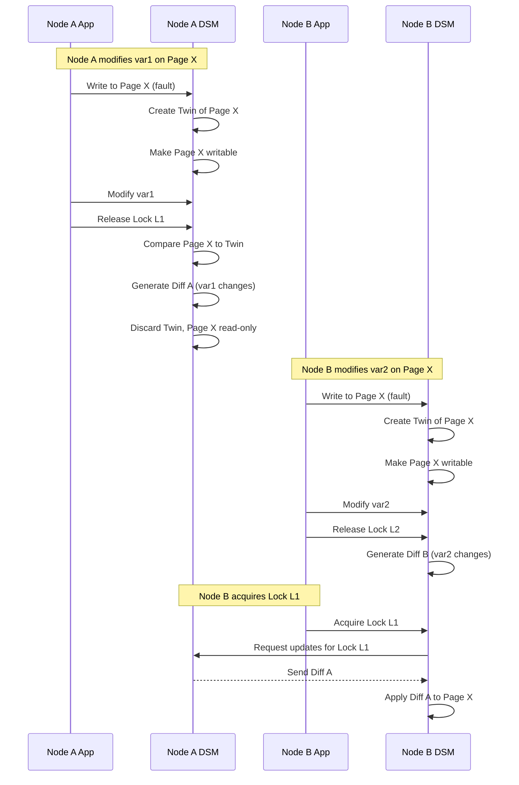

# L07b Distributed Shared Memory

> [!summary] TL;DR
> Distributed Shared Memory (DSM) provides the illusion of a globally shared address space across independent cluster nodes, hiding the complexity of explicit message passing.
> It leverages virtual memory mechanisms to trap accesses and automatically fetch missing data over the network.
> To achieve reasonable performance, software DSMs use relaxed memory models like Lazy Release Consistency (LRC) and multiple-writer protocols using twins and diffs to mitigate the high costs of network communication and page-level false sharing.

## Learning outcomes

- Contrast implicitly parallel, message-passing, and DSM programming models.
- Explain how software DSM handles page faults to fetch remote memory.
- Differentiate between sequential, eager release, and lazy release consistency.
- Diagram the multiple-writer coherence protocol using twins and diffs.
- Calculate memory and network overhead for diff-based coherence and understand garbage collection triggers.

## Motivation and the problem

Clusters offer massive compute and memory resources, but programming them requires distributing state across discrete machines.
Explicit message passing forces the programmer to manually coordinate data movement, creating a steep learning curve and necessitating the restructuring of existing code.
DSM abstracts this away, allowing developers to write parallel code using familiar threads and [locks](L04b-Synchronization.md#spinlocks), while the operating system and runtime transparently manage the movement of data across the network.
The central problem is performance: network latency is orders of magnitude slower than a hardware memory bus, so DSM systems must minimize communication to scale.

## Core concepts

### Cluster as a parallel machine

<!-- coverage: L07b-01 -->
Clusters of commodity workstations emerged as a cost-effective alternative to expensive custom supercomputers.
A cluster pools the CPU and memory of multiple independent machines over a Local Area Network (LAN).

> [!note] Cluster Computing
> The practice of linking multiple standalone computers via a network to act as a single, powerful computational resource.

To use a cluster as a parallel machine, the software must distribute both the computation and the data.
The underlying challenge is that, unlike a symmetric multiprocessor (SMP) machine, cluster nodes do not share physical memory or a hardware cache coherence bus.
The operating system or runtime must bridge this gap, deciding when and how to move data to the nodes that are actively computing on it, while completely hiding the physical distribution from the application logic.

### Implicitly parallel and message-passing programs

<!-- coverage: L07b-02 -->
There are three primary ways to program a cluster, starting with implicitly parallel programs where a compiler analyzes sequential code and automatically inserts distribution directives (like High-Performance FORTRAN).

> [!note] Message Passing
> A programming paradigm where nodes have private memory and explicitly send and receive messages to share data (e.g., MPI).

While implicit parallelism is easy for the developer, compilers often fail to extract maximum parallelism from complex, dynamic applications.
The alternative is explicit message passing.
This offers high performance because the programmer precisely controls data movement, but it requires a radical shift in thinking to orchestrate every exchange and manually handle marshaling and synchronization.
DSM offers a middle ground: the familiar shared-state programming model without the burden of manual message passing.

### History of shared memory systems

<!-- coverage: L07b-03 -->
Early shared memory systems relied on custom hardware.
Tightly coupled multiprocessors used shared physical buses to ensure all CPUs saw a unified memory state, maintaining cache coherence completely in hardware.

> [!note] Distributed Shared Memory (DSM)
> A software or hardware abstraction that provides a single shared address space across nodes with independent physical memories.

As clusters grew popular, researchers sought to replicate this abstraction in software over standard LANs.
Early software DSM systems attempted to mimic hardware by enforcing strict coherence on every memory access.
However, because network communication is drastically slower than a physical bus, treating a cluster like a tightly coupled multiprocessor led to terrible performance.
This historical bottleneck drove the evolution of relaxed consistency models, which trade immediate global visibility for reduced network traffic.

### Sequential consistency for DSM

<!-- coverage: L07b-04 -->
Sequential consistency (SC) provides the most intuitive programming model: every node sees all memory operations in a single, global sequential order that respects the program order of each node.

> [!note] Sequential Consistency
> A memory model where the result of any execution is the same as if the operations of all processors were executed in some sequential order.

In a DSM system, implementing SC requires generating network traffic (a cache coherence action) for almost every shared memory access.
The DSM does not distinguish between accessing normal data and accessing synchronization variables.
Thus, even if a node holds a lock and is the only one modifying a data structure, the DSM broadcasts every write immediately.
This leads to massive overhead, stalling the processor repeatedly, and severely limiting the scalability of the system.

### Release consistency

<!-- coverage: L07b-05 -->
To reduce the overhead of SC, Release Consistency (RC) takes advantage of synchronization primitives by recognizing that programmers already use locks to protect shared data.

> [!note] Release Consistency
> A relaxed memory model that defers propagating updates to shared memory until a synchronization release operation occurs.

Under RC, the DSM does not broadcast every write as it happens.
Instead, it allows a processor to freely modify its local copy of the data within a critical section.
Only when the processor releases the lock does the DSM system gather the modifications and propagate them.
This batches the communication and overlaps it with computation, drastically reducing the number of network messages and alleviating the latency bottleneck that cripples SC.

> [!question]- Why does RC require applications to be data-race-free?
> If threads modify shared data without acquiring locks, the DSM runtime will never see a "release" operation to trigger data propagation, leading to nodes operating on stale, incoherent data.

### Eager versus lazy release consistency

<!-- coverage: L07b-06 -->
RC can be implemented in two ways: eager or lazy.
Eager RC pushes updates to other nodes as soon as a lock is released.

> [!note] Lazy Release Consistency (LRC)
> An implementation of RC where updates are not sent until another node explicitly acquires the lock.

In Eager RC, the releasing node broadcasts its changes to all nodes that cache the modified data.
This is proactive but can waste bandwidth if those nodes never read the data again.
Lazy RC (LRC) optimizes this by pulling data: when a node acquires a lock, it contacts the previous lock holder and pulls only the updates relevant to the data protected by that lock.
This single-to-single communication further reduces network traffic, though it adds a slight latency penalty during lock acquisition while the updates are fetched.

### Software DSM: page granularity and address space partitioning

<!-- coverage: L07b-07 -->
Software DSM relies on the operating system's virtual memory subsystem to intercept memory accesses.
The global virtual address space is partitioned into pages, and ownership of these pages is distributed across the cluster nodes.

> [!note] Page Granularity
> The strategy of using virtual memory pages (typically 4KB) as the unit of sharing and coherence in a DSM system.

When a node accesses a page it does not possess, a page fault occurs.
The OS traps the fault and contacts the DSM runtime, which looks up the page's owner and fetches a copy.
Because network transmission has high latency, moving an entire page at once exploits spatial locality better than requesting individual words.
However, this large granularity introduces false sharing: if two nodes modify distinct, unrelated variables that happen to reside on the same page, the page will ping-pong back and forth over the network, ruining performance.

### Multiple-writer coherence protocol

<!-- coverage: L07b-08 -->
To combat false sharing at the page level, software DSM systems employ a multiple-writer protocol.
Instead of enforcing mutual exclusion (where only one node can hold a page for writing at a time), multiple nodes can write to the same page concurrently.

> [!note] Multiple-Writer Protocol
> A coherence mechanism that allows several processors to modify different parts of the same shared page simultaneously without invalidating each other's copies.

This protocol assumes that the application is data-race-free, meaning different processors are modifying distinct data structures (protected by different locks) on that page.
By allowing concurrent writes, the DSM avoids the ping-pong effect entirely.
The challenge then becomes how to reconcile these concurrent modifications when the processors synchronize.
The system must merge the independent changes into a single, coherent view of the page.

### Twins and diffs

<!-- coverage: L07b-09 -->
The mechanism used to merge concurrent writes in a multiple-writer protocol relies on twins and diffs.

> [!note] Twins and Diffs
> A technique where a pristine copy of a page (the twin) is kept so that later modifications can be isolated by comparing the modified page against the twin to produce a diff.

When a processor first attempts to write to a shared page, a page fault triggers the DSM to create a duplicate of the page, called the twin.
The original page is then made writable.
The processor executes its code, modifying the original page.
At synchronization time (e.g., releasing a lock in LRC), the DSM compares the modified page word-by-word against the twin.
The differences are encoded, often using Run-Length Encoding (RLE), into a compact diff.
The twin is then discarded, and only the small diff is sent over the network, minimizing bandwidth usage while accurately capturing the exact changes.

### Garbage collection of diffs

<!-- coverage: L07b-10 -->
As the system runs, processors accumulate many diffs over time.
If left unchecked, these diffs would consume excessive memory and slow down lock acquisition, as an acquiring node must fetch and apply a long history of diffs.

> [!note] Diff Garbage Collection
> The process of periodically applying accumulated diffs to the master copy of a page and discarding the diffs to reclaim memory and bound access time.

Garbage collection (GC) is triggered based on either a space metric (when the memory consumed by pending diffs reaches a threshold) or a time metric (when applying the diffs takes too long).
During GC, the system forces the accumulated diffs to be applied in order to the original page at the page owner.
The page owner updates its master copy, and all other cached copies across the cluster are invalidated.
This resets the baseline, freeing up memory and ensuring that future page faults fetch a fully updated page rather than a massive chain of diffs.

### Non-page-based DSM: structured and object-based

<!-- coverage: L07b-11 -->
Because page-level granularity often suffers from false sharing, some DSM systems abandon virtual memory pages entirely.
Instead, they manage coherence at the level of language-level constructs.

> [!note] Structured DSM
> A DSM approach where the programmer uses specific library APIs or shared abstractions (like objects or tuples) to manage shared state, avoiding OS page faults.

In a structured DSM (or library-based approach), the runtime instruments the code to track individual variable or object accesses.
When a shared variable is touched, the library intercepts the call and performs the necessary network communication.
This approach completely eliminates false sharing because the unit of coherence exactly matches the logical unit of data (e.g., an object or a structure).
However, it requires either a specialized compiler to insert the hooks or forces the programmer to use specific API calls (like in Linda or Orca), removing the illusion of transparent shared memory.

### DSM scalability

<!-- coverage: L07b-12 -->
The ultimate goal of DSM is to allow applications to scale by adding more commodity machines.
However, scalability is heavily bounded by the computation-to-communication ratio.

> [!note] Computation-to-Communication Ratio
> The amount of productive processing a node performs compared to the time it spends waiting for network coherence traffic.

If an application shares very fine-grained data and frequently synchronizes, the network overhead of fetching diffs and managing locks will dominate, leading to zero or negative speedup.
For a DSM to scale, the application must be coarse-grained.
Critical sections must enclose substantial computation so that the cost of the implicit network messages is amortized.
When designed correctly, relaxed consistency and diffing mechanisms allow DSMs to achieve near-linear speedup on well-behaved scientific workloads.

## Mechanisms step by step

**LRC and Diff Creation Workflow**
When Node A and Node B both write to different variables on the same page, the DSM orchestrates the updates using twins and diffs.

## Worked examples

**Diff Size and Garbage Collection Overhead**
Imagine a DSM system with a 4096-byte page size.
1. Node A modifies a single 4-byte integer on the page.
2. At lock release, Node A compares the modified page to the 4096-byte twin.
3. The diff identifies only the 4-byte change.
With run-length encoding (RLE) overhead (an 8-byte header specifying the offset and length), the diff size is just 12 bytes.
4. Sending 12 bytes over the network is vastly cheaper than sending a full 4096-byte page.

**GC Trigger Math:**
If the system generates an average diff size of 32 bytes per lock release, and the garbage collection space threshold is set to 1MB of pending diffs:
$1,048,576 \text{ bytes} / 32 \text{ bytes/diff} = 32,768 \text{ diffs}$
The system can endure roughly 32,768 critical sections before the space metric forces a garbage collection cycle to compact the diffs into the master page and invalidate caches.

## Comparison

| Feature | Sequential Consistency (SC) | Eager Release Consistency (ERC) | Lazy Release Consistency (LRC) |
| :--- | :--- | :--- | :--- |
| **When updates are sent** | On every write access | On lock release | On lock acquire |
| **Who receives updates** | All caching nodes (Broadcast) | All caching nodes (Push/Broadcast) | Only the acquiring node (Pull/Unicast) |
| **Network Traffic** | Extremely high | Moderate | Very low |
| **Latency** | Stalls on writes | Overlaps computation | High latency at lock acquire |
| **Best Use Case** | Tightly coupled hardware | Hardware DSM with fast broadcast | Software DSM over LANs |

## Paper deep dives

- [Implementing Global Memory Management in a Workstation Cluster](../Papers/L07-GMS.md): GMS introduces a decentralized global memory system that treats the RAM of all cluster nodes as a unified paging cache. It tracks page ages across nodes using an epoch-based algorithm, allowing a node under memory pressure to page out to the idle RAM of another node rather than hitting the slow local disk.
- [TreadMarks: Shared Memory Computing on Networks of Workstations](../Papers/L07-TreadMarks.md): TreadMarks is the definitive implementation of Lazy Release Consistency paired with a multiple-writer protocol. It proved that by using twins and diffs to combat false sharing at the page level, a software DSM could achieve acceptable performance on commodity networks without requiring special compilers.
- [Serverless Network File Systems](../Papers/L07-xFS-Serverless-NFS.md): xFS eliminates the central file server bottleneck by distributing data, metadata, and control across all cooperating workstations in a cluster. It utilizes software RAID-like striping across local disks to provide high bandwidth and fault tolerance in a truly decentralized file system.
- [Coda: A Highly Available File System for a Distributed Workstation Environment](../Papers/L07-Coda.md): Coda focuses on high availability and disconnected operation for mobile clients. It uses optimistic replication and a local modification log (CML) to allow users to continue working during network partitions, resolving conflicts when connectivity is restored.

## Modern descendants

While page-level Software DSMs like TreadMarks largely died out as a general-purpose programming model, the underlying mechanisms survive in modern infrastructure.
- **KVM's Kernel Samepage Merging (KSM):** KSM uses background scanning to find identical memory pages across different virtual machines, merging them into a single read-only shared page and using Copy-on-Write (CoW) to handle modifications, a direct descendant of DSM page tracking.
- **Distributed Key-Value Stores (Dynamo, Cassandra):** Modern NoSQL stores use relaxed consistency models (eventual consistency) heavily inspired by the transition from SC to LRC. They trade immediate global coherence for availability and partition tolerance.
- **Virtual Machine Migration:** Live VM migration relies on OS page fault tracking (dirty bit tracking) to iteratively copy modified memory pages to a destination host, similar to how DSM diffs track page modifications.

## Pitfalls and exam traps

> [!warning] False Sharing is a Logical Concept
> A classic trap is confusing false sharing with true sharing.
> False sharing occurs when two threads modify completely independent variables that happen to sit on the same OS page.
> The data isn't shared, but the underlying coherence unit is.
> The multiple-writer protocol (twins and diffs) solves this.

> [!warning] LRC Latency Shift
> Remember that Lazy Release Consistency does not eliminate network latency; it shifts it.
> Instead of stalling during the write or the lock release, the stall occurs when a new thread acquires the lock and must pull the diffs over the network.

> [!warning] SC Overhead vs. Correctness
> SC is intuitively correct to programmers, but in a distributed system, it enforces a global order that hardware simply cannot support efficiently.
> Do not assume SC is the "best" model; it is strictly the most expensive.

## Practice

- [Practice L07](../Practice/Practice-L07.md)

## Lab

- [lab-15-dsm](../labs/lab-15-dsm/README.md): User-level DSM with mprotect and SIGSEGV, twins and diffs

## Further reading

- [Memory Consistency Models: A Tutorial](https://ieeexplore.ieee.org/document/479816)
- [TreadMarks Source Code via Rice University](https://www.cs.rice.edu/~willy/TreadMarks/overview.html)
