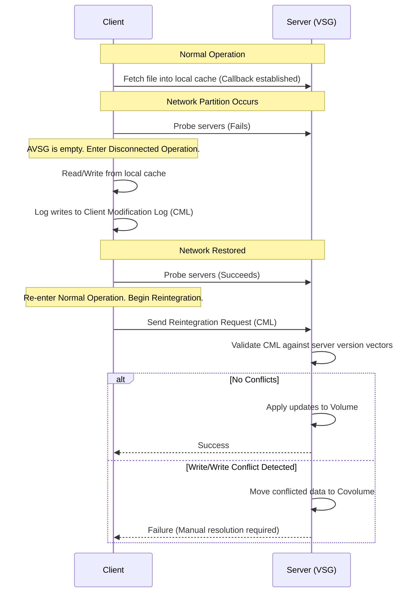

# L07c Distributed File Systems

> [!summary] TL;DR
> Distributed File Systems address the scalability and availability limitations of centralized servers like NFS.
> By decentralizing data, metadata, and control, systems like xFS harness the collective CPU, memory, and disk bandwidth of workstation clusters.
> Meanwhile, Coda focuses on high availability through server replication and disconnected operation, allowing clients to function autonomously during network partitions.
> Together, these systems introduce techniques like log-structured network striping, cooperative caching, and optimistic replication.

## Learning outcomes

- Contrast the centralized architecture of NFS with the decentralized architectures of xFS and Coda.
- Explain how log-structured file systems (LFS) and software RAID solve the small write problem.
- Trace the step-by-step path of a file read and write operation in the xFS architecture.
- Evaluate the mechanisms Coda uses to support disconnected operation and conflict resolution.
- Analyze the role of cooperative caching and distributed log cleaning in serverless network file systems.

## Motivation and the problem

Network File Systems (NFS) successfully provided a shared namespace for local area networks, but their centralized design created severe bottlenecks.
As clients scale, a single file server becomes a single point of failure and a performance choke point due to limited network bandwidth, CPU processing power, and cache capacity.
Modern distributed file systems aim to eliminate this central bottleneck by distributing storage and management across all participating nodes.
This approach leverages the aggregate bandwidth, storage, and processing power of the entire network while simultaneously improving fault tolerance.

## Core concepts

### NFS and centralized server limitations

<!-- coverage: L07c-01 -->
> [!note] Centralized Bottleneck
> A single server handling all metadata lookups, cache misses, and disk writes severely limits overall system throughput.

In a traditional Network File System (NFS), all clients rely on a single, central server machine to store data, manage metadata, and satisfy cache misses.
This architecture creates a fundamental performance bottleneck.
As the number of active clients grows, the server's network bandwidth, disk I/O capacity, and CPU are quickly overwhelmed.
Furthermore, the central server represents a single point of failure; if the server crashes, the entire file system becomes unavailable to all clients until it recovers.

### Distributed file servers

<!-- coverage: L07c-02 -->
> [!note] Distributed File System (DFS)
> An architecture that distributes file data and control logic across multiple server nodes in a network to eliminate centralized bottlenecks.

To resolve the scalability issues of NFS, distributed file systems decentralize operations.
Instead of a single server, each file is distributed across multiple server nodes on the network.
When a client needs to access a file, it interacts with a distributed set of servers.
This eliminates the central performance bottleneck, provides distributed management of data and metadata, and aggregates the bandwidth and cache capacity of all nodes, facilitating significantly faster and more scalable access.

### RAID and parity

<!-- coverage: L07c-03 -->
> [!note] RAID (Redundant Array of Inexpensive Disks)
> A storage technology that stripes data across multiple disks to increase bandwidth, using parity blocks to tolerate disk failures.

RAID works by splitting, or "striping," a file's data across multiple physical disks, which allows the system to read and write to those disks in parallel.
While this vastly increases aggregate I/O bandwidth, it also increases the probability of encountering a failed disk.
To provide fault tolerance, RAID calculates a parity block (usually via XOR) for each stripe.
If one disk fails, the data can be reconstructed using the remaining data blocks and the parity block.
However, RAID suffers from the "small write" problem: updating a small chunk of a stripe requires reading the old data and old parity to compute the new parity, which degrades performance.

### Log-structured file systems

<!-- coverage: L07c-04 -->
> [!note] Log-structured File System (LFS)
> A file system that buffers modifications in memory and writes them sequentially to disk as a single continuous log segment.

LFS was designed to optimize write performance and mitigate the RAID small write problem.
Instead of overwriting files in place, LFS buffers all file modifications in memory.
Once a large batch of changes accumulates, it writes them sequentially to the disk as a contiguous "log segment."
Because sequential disk writes are much faster than random writes, LFS provides high write throughput.
However, modifying files creates holes of invalid data in older segments, necessitating a background "garbage collection" or log cleaning process to compact live data and free up contiguous disk space.

### Journaling file systems

<!-- coverage: L07c-05 -->
> [!note] Journaling File System (JFS)
> A system that writes structural changes to a log before applying them in place, ensuring quick recovery without full disk scans.

While LFS writes all data to the log and reads from the log, a Journaling File System maintains traditional in-place data structures alongside a separate log.
Changes are first appended to the log (the journal) and then periodically flushed to their actual in-place locations on disk.
The journal is subsequently discarded or truncated.
This approach prevents the need to reconstruct files from scattered log segments during a read, while still providing robust crash recovery since the journal can be replayed if the system loses power before the in-place writes complete.

### Software RAID and log-based striping

<!-- coverage: L07c-06 -->
> [!note] Software RAID
> Implementing RAID logic in the operating system using commodity hardware rather than relying on expensive custom RAID controllers.

Hardware RAID is often prohibitively expensive.
Software RAID achieves the same striping and parity benefits using standard workstation disks connected over a local area network.
By integrating LFS with software RAID, systems can aggregate small writes into large log segments before striping them across the network.
This log-based striping means parity is calculated purely in software over the large memory buffer, completely avoiding the expensive read-modify-write cycle of the RAID small write problem.

### Zebra and stripe groups

<!-- coverage: L07c-07 -->
> [!note] Stripe Group
> A dedicated subset of storage servers across which a single log segment is striped, rather than striping across the entire network.

The Zebra file system pioneered combining LFS with network software RAID, but it striped segments across all available storage servers.
As the network grew, clients were forced to send tiny fragments to many servers, reducing efficiency.
xFS introduces the concept of stripe groups.
Instead of utilizing every server, clients stripe a log segment across a specific subset of storage servers.
This matches the aggregate disk bandwidth of the group to the client's network bandwidth, avoids fragmenting writes, allows parallel client activities on different groups, and improves fault tolerance by containing failures.

### xFS dynamic management of metadata

<!-- coverage: L07c-08 -->
> [!note] Manager Map
> A globally replicated table in xFS that maps a file's index number to the specific physical machine managing its metadata.

In xFS, no single node is the metadata server.
Instead, metadata management is dynamically distributed across all cluster nodes.
xFS uses a globally replicated Manager Map.
By extracting bits from a file's index number, clients consult this map to identify which node is responsible for tracking that file's cache consistency and disk location.
This indirection allows xFS to dynamically rebalance the workload; if a manager is overloaded or a machine crashes, the manager map can be updated to reassign responsibilities gracefully.

### xFS cooperative client caching

<!-- coverage: L07c-09 -->
> [!note] Cooperative Caching
> Utilizing the aggregate RAM of all client workstations in a cluster as a massive, shared, global file cache.

xFS eliminates the central server cache entirely.
Because accessing data over a fast switched LAN is significantly faster than reading from a local magnetic disk, xFS implements cooperative caching.
When a client experiences a local cache miss, it contacts the file's manager.
If another client holds the data in its memory, the manager forwards the request to that peer, which sends the data directly to the requesting client.
To maintain cache coherence, xFS employs a token-based, single-writer multiple-readers protocol at the granularity of individual file blocks.

### Log cleaning

<!-- coverage: L07c-10 -->
> [!note] Log Cleaning
> The distributed garbage collection process that reads partially empty log segments, extracts live data, and writes it to new segments.

Because LFS never overwrites data in place, old versions of blocks become dead space.
Log cleaning is the process of reclaiming this space.
It identifies partially filled segments, extracts the remaining valid data blocks, writes them compactly into new log segments, and frees the old segments for reuse.
In xFS, log cleaning is a distributed, parallel activity.
Clients track utilization, and the leaders of each stripe group coordinate the cleaning of data residing on their specific storage servers, preventing the cleaner from becoming a centralized bottleneck.

### xFS data structures: manager map, file directory, imap, stripe group map

<!-- coverage: L07c-11 -->
> [!note] xFS Location Independence
> xFS uses a chain of indirection maps to locate data and metadata anywhere in the cluster seamlessly.

xFS relies on four key data structures to route requests.
The Manager Map directs clients to a file's metadata manager based on its index number.
The File Directory maps human-readable file names to these index numbers.
The Imap, distributed among the managers, maps a file's index number to the disk log address of its index node.
Finally, the Stripe Group Map translates the segment identifier (embedded in the disk log address) to the specific list of physical storage servers that currently hold that segment's data and parity fragments.

### Client reads and writes in xFS

<!-- coverage: L07c-12 -->
> [!note] xFS Read/Write Path
> Complex distributed lookups are offset by local caching and fast network paths to peer memory.

When a client reads a file in xFS, it first checks its local cache.
On a miss, it consults the manager map and queries the file's manager.
The manager checks its cache consistency state; if a peer has the block, the peer serves the data directly over the network.
If no peer has it, the manager traverses the Imap and index nodes to find the disk log address, and uses the Stripe Group Map to direct the client to read from the storage servers.
For writes, the client buffers changes locally, flushes them as a complete log segment to a stripe group, and then asynchronously notifies the manager of the updated file status.

### Coda: disconnected operation and server replication

<!-- coverage: L07c-13 -->
> [!note] Disconnected Operation
> A state where a client operates entirely out of its local cache because no servers in the Volume Storage Group are accessible.

Coda provides high availability through two complementary mechanisms.
First, it uses Server Replication, organizing servers into a Volume Storage Group (VSG).
Clients fetch from a preferred server but verify currency across the Accessible VSG (AVSG).
Second, if network partitions isolate the client, the AVSG becomes empty, and the client enters Disconnected Operation.
The client relies solely on locally cached files and logs modifications to a local replay log.
Upon reconnection, a reintegration process replays these updates top-down to the VSG, utilizing covolumes to hold data if optimistic replication detects unresolvable conflicts.

## Mechanisms step by step

Here is the step-by-step mechanism for a Coda client undergoing disconnected operation and reintegration.

## Worked examples

Let us examine the parity overhead and block distribution in an xFS stripe group.

Suppose we have a stripe group of 5 storage servers ($N=5$) utilizing a single parity disk.
The stripe segment size is 1024 KB.
1. The 1024 KB segment is divided into $N-1 = 4$ data fragments.
2. Each data fragment size is $1024 / 4 = 256$ KB.
3. The client computes a parity fragment of 256 KB.
4. The client writes 256 KB to Server 1, 256 KB to Server 2, 256 KB to Server 3, 256 KB to Server 4, and the 256 KB parity to Server 5.
5. The total data transferred over the network is $1024 + 256 = 1280$ KB.
6. The parity overhead is $256 / 1024 = 0.25$, or 25 percent.

If Server 3 fails, the system reconstructs its 256 KB fragment by XORing the 256 KB fragments from Server 1, Server 2, Server 4, and the Parity from Server 5.

## Comparison

| Feature | NFS | Coda | xFS |
| :--- | :--- | :--- | :--- |
| **Architecture** | Centralized | Decentralized servers, thick clients | Fully Serverless (Peer-to-Peer) |
| **Cache Management** | Server cache, simple client cache | Whole-file caching on client disks | Cooperative caching across client memory |
| **Fault Tolerance** | Single point of failure | Server replication, Disconnected operation | Distributed striping, stripe groups, dynamic maps |
| **Primary Goal** | Transparent network access | High availability and mobility | Highly scalable performance and bandwidth |
| **Write Strategy** | Synchronous/Asynchronous in-place | Optimistic replication with conflict detection | Log-structured network striping |

## Paper deep dives

- [Implementing Global Memory Management in a Workstation Cluster](../Papers/L07-GMS.md)
This paper introduces the Global Memory System (GMS), which utilizes the aggregate idle memory of a workstation cluster as a shared paging and file cache.
By monitoring node age information, GMS coordinates page replacements globally, ensuring that active nodes can transparently page out to the idle memory of peer nodes instead of hitting a slow mechanical disk, vastly improving read performance in cluster environments.

- [TreadMarks: Shared Memory Computing on Networks of Workstations](../Papers/L07-TreadMarks.md)
TreadMarks implements Distributed Shared Memory (DSM) on top of standard Unix networks without kernel modifications.
It introduces lazy release consistency and multiple-writer protocols to reduce the severe network communication overhead typically associated with false sharing in page-based DSM systems, making workstation clusters viable for parallel computing.

- [Serverless Network File Systems](../Papers/L07-xFS-Serverless-NFS.md)
The xFS paper details a fully decentralized file system where all storage, caching, and control are distributed across cooperating peers.
By combining log-based network striping, dynamic metadata manager maps, and cooperative caching, xFS eliminates the central server bottleneck entirely, providing aggregate bandwidth that scales linearly with the number of participating workstations.

- [Coda: A Highly Available File System for a Distributed Workstation Environment](../Papers/L07-Coda.md)
The Coda paper explores the design of a highly available file system tailored for distributed and mobile environments.
It introduces disconnected operation, where clients survive network partitions by relying on local disk caches and modification logs, coupled with optimistic server replication, prioritizing constant data availability and graceful reintegration over strict, pessimistic consistency.

## Modern descendants

The architectural principles of xFS and Coda have profoundly influenced modern distributed systems.
xFS's decentralization and stripe-group concepts are visible in highly scalable, clustered storage systems like Ceph, which distributes data dynamically without single points of failure via the CRUSH algorithm, and HDFS, which manages blocks across massive clusters.
Coda's optimistic replication and disconnected operation paved the way for Dynamo-style eventual consistency stores (like Amazon DynamoDB and Apache Cassandra) that prioritize availability during network partitions.
Additionally, modern distributed databases built in the Raft-era often use log-structured replication to maintain highly available state machine replicas across partitioned clusters.

## Pitfalls and exam traps

> [!warning] Exam Trap: xFS vs Zebra
> Do not confuse xFS with Zebra.
> Zebra stripes log segments across all servers, leading to fragmentation and small writes on large clusters.
> xFS solves this by using stripe groups, dividing the cluster into smaller subsets of servers.

> [!warning] Exam Trap: Cooperative Caching Hierarchy
> In xFS, cooperative caching means a client will check a peer's memory before going to disk.
> A common mistake is to assume a client goes to the manager's disk first.
> The manager acts as a router to the peer cache.

> [!warning] Exam Trap: Coda Consistency
> Coda does not guarantee strict consistency.
> It uses optimistic replication.
> Remember that Coda will allow conflicting writes during a partition and force the user to resolve them later, favoring availability over strict consistency.

## Practice

- [Practice L07](../Practice/Practice-L07.md)

## Lab

- [lab-16-dfs](../labs/lab-16-dfs/README.md): Distributed file system ideas: RAID parity, log-structured writes, and a FUSE cache

## Further reading

- A. Sweeney et al., "Scalability in the XFS File System", USENIX 1996.
- M. Rosenblum and J. Ousterhout, "The Design and Implementation of a Log-Structured File System", SOSP 1991.
