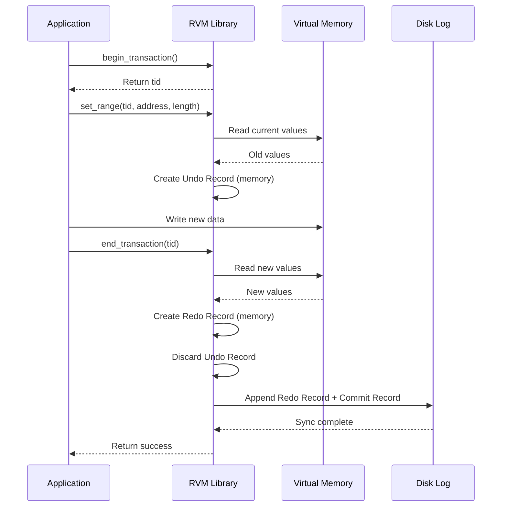

# L08a Lightweight Recoverable Virtual Memory

> [!summary] TL;DR
> Lightweight Recoverable Virtual Memory (LRVM) is a user-level library that provides transactional persistence for memory-resident data structures.
> Unlike heavyweight database management systems, LRVM decouples atomicity and permanence from serializability to maximize flexibility.
> It allows subsystems like file servers to reliably recover from crashes without the overhead of complex transaction mechanisms.
> By relying on simple undo logs for aborts and redo logs for commits, LRVM balances structural simplicity with high performance.

## Learning outcomes

- Explain how LRVM provides persistence without enforcing serializability.
- Evaluate the costs and benefits of decoupling transaction properties in an operating system context.
- Trace the lifecycle of a memory modification from `set_range` to commit and disk flush.
- Calculate log sizes and space reclamation metrics during epoch and incremental log truncation.
- Compare LRVM's design trade-offs with those of general-purpose databases and persistent object stores.

## Motivation and the problem

Building reliable distributed systems often requires maintaining persistent meta-data that can survive system crashes.
Traditional approaches rely on either complex database management systems or heavy transactional facilities like Camelot.
These heavyweight systems enforce rigid constraints, such as mandatory serializability and deep integration with the operating system kernel.
Such constraints lead to poor performance, difficult debugging, and limited portability across different Unix environments.
The problem is how to provide robust fault tolerance for memory-resident data structures without paying the overhead of a full database system.
Lightweight Recoverable Virtual Memory solves this by offering a minimalistic, user-level library that handles only atomicity and permanence.

## Core concepts

### Persistence for OS subsystems

<!-- coverage: L08a-01 -->
> [!note] Persistence for OS subsystems
> Persistence refers to the ability of operating system components to maintain state across reboots and crashes using non-volatile storage.

Many subsystems, such as distributed file systems, need to update their internal data structures reliably.
If a crash occurs during a complex update, the metadata could be left in an inconsistent state.
General-purpose databases offer too much overhead because they provide distributed commits and complex query languages.
Subsystems typically require a simple mechanism to guarantee that an operation either completes fully or leaves no trace at all.
LRVM provides this persistence natively within a program's virtual address space.
It avoids tying the subsystem to a dedicated, heavy infrastructure.

### Server design for persistence

<!-- coverage: L08a-02 -->
> [!note] Server design for persistence
> Server design for persistence involves structuring an application so that critical metadata fits within virtual memory and is backed by a transactional log.

A server must manage its metadata in a way that minimizes the cost of fault tolerance.
In the Coda file system, for instance, directory structures and internal housekeeping data are stored in recoverable virtual memory.
File contents are stored directly on the local Unix file system.
This separation of concerns allows the server to recover quickly after a crash by reading a log of recent metadata changes.
The server simply maps its persistent structures into its address space at startup.
This design reduces disk I/O because most metadata reads are served directly from main memory.

### RVM primitives

<!-- coverage: L08a-03 -->
> [!note] RVM primitives
> RVM primitives are the basic functions exposed by the library to manage recoverable memory, such as `initialize`, `map`, `begin_transaction`, and `end_transaction`.

The library exposes a minimalistic API to keep the programming model simple.
Applications call `initialize` to specify the location of the write-ahead log.
Regions of a backing file are mapped into the virtual address space using the `map` primitive.
Transactions begin with `begin_transaction` and conclude with either `end_transaction` or `abort_transaction`.
Because RVM is implemented entirely at user level, these primitives avoid expensive context switches to the kernel.
This minimal API provides just enough functionality to ensure data integrity without dictating application structure.

### Transaction semantics without serialization

<!-- coverage: L08a-04 -->
> [!note] Transaction semantics without serialization
> LRVM provides atomicity and permanence but deliberately omits serializability, leaving concurrency control entirely to the application layer.

Traditional transaction systems bundle atomicity, isolation, and permanence together into a rigid set of ACID properties.
RVM takes a different approach by unbundling these features.
It guarantees atomicity, meaning that updates are all-or-nothing, and permanence, meaning committed changes survive crashes.
However, it does not lock memory or enforce a serialization order between concurrent transactions.
The application must use its own concurrency control mechanisms, such as mutexes or read-write locks, to prevent data races.
This decoupling allows applications to optimize locking at a granularity that makes sense for their specific data structures.

### Undo records and set_range

<!-- coverage: L08a-05 -->
> [!note] Undo records and set_range
> The `set_range` primitive notifies LRVM of an impending memory modification, prompting the creation of an undo record to restore the original value if needed.

Before an application modifies a block of recoverable memory, it must call `set_range` to declare its intent.
RVM responds by copying the current contents of that memory range into a temporary buffer called an undo record or old-value record.
If the transaction is subsequently aborted, RVM copies the data from the undo record back into the original memory locations.
This mechanism provides atomicity by ensuring that incomplete modifications can be cleanly rolled back.
Failing to call `set_range` before a modification is a critical bug, as it destroys the ability to revert changes.
Undo records only exist in volatile memory and are discarded once the transaction commits.

### Redo logs and commit

<!-- coverage: L08a-06 -->
> [!note] Redo logs and commit
> Redo logs capture the new values of modified memory ranges and are written to stable storage upon transaction commit to guarantee permanence.

When an application calls `end_transaction`, RVM must ensure that the modifications survive power failures.
It reads the new values from the modified memory ranges and constructs a new-value record.
This new-value record is then appended to a write-ahead log on disk.
Because RVM only logs the final state of the memory rather than the logical operation, it uses a no-undo/redo logging strategy.
The log records include forward and backward displacement pointers to allow efficient traversal in either direction during recovery.
Once the redo log is safely on disk, the transaction is considered fully committed.

### No-restore and no-flush modes

<!-- coverage: L08a-07 -->
> [!note] No-restore and no-flush modes
> No-restore mode avoids creating undo records for transactions that never abort, while no-flush mode delays writing redo logs to disk to improve latency.

RVM provides optimization flags to relax certain transactional guarantees in exchange for better performance.
If a developer knows a transaction will never be explicitly aborted, they can mark it as "no-restore".
This suppresses the creation of undo records during `set_range` calls, saving CPU cycles and memory allocations.
Similarly, the "no-flush" mode allows a transaction to commit without immediately forcing the redo log to disk.
These lazy transactions spool their log records in memory and rely on a later periodic flush.
This provides a bounded persistence guarantee that significantly reduces disk I/O delays for high-frequency updates.

### Log truncation

<!-- coverage: L08a-08 -->
> [!note] Log truncation
> Log truncation reclaims space in the write-ahead log by applying the recorded changes to the permanent external data segment.

Because the write-ahead log is finite, RVM must periodically consolidate changes into the permanent backing file.
Epoch truncation stops normal processing, applies all log entries to the backing store, and then empties the log.
This resembles crash recovery but causes disruptive pauses in system operation.
To avoid these pauses, RVM uses incremental truncation, which works concurrently with new transactions.
Incremental truncation uses an internal page vector to track which memory pages have committed changes.
It systematically writes these dirty pages to the backing file and advances the logical head of the log.

### Implementation and optimizations: intra and inter transaction

<!-- coverage: L08a-09 -->
> [!note] Implementation and optimizations
> LRVM coalesces overlapping memory modifications to minimize the amount of data written to the log, optimizing both within a single transaction and across multiple delayed transactions.

RVM employs two primary optimizations to reduce log traffic and improve throughput.
Intra-transaction optimization occurs when multiple `set_range` calls overlap or cover adjacent memory addresses within the same transaction.
RVM coalesces these ranges into a single, contiguous log record.
Inter-transaction optimization applies to no-flush transactions where multiple delayed commits modify the same memory locations over time.
When the log is finally flushed, RVM discards the older, obsolete modifications and only writes the most recent data to disk.
These optimizations significantly reduce disk bandwidth requirements for workloads that exhibit high temporal locality.

## Mechanisms step by step

The transaction lifecycle in LRVM involves coordinating in-memory buffers and the on-disk write-ahead log.
The following sequence diagram illustrates a successful standard transaction.

1. The application starts a transaction.
2.
Before updating data, the application calls `set_range`.
3.
RVM allocates an undo record in memory and copies the old data into it.
4.
The application directly mutates the mapped virtual memory.
5.
The application requests a commit.
6.
RVM reads the modified virtual memory and builds a redo record.
7.
RVM forces the redo record to the disk log to ensure permanence.

## Worked examples

### LRVM log size arithmetic

Consider an application performing updates on a 128-byte data structure.
An application issues 5 consecutive "no-flush" transactions that each call `set_range` on the exact same 128-byte block.
Without inter-transaction optimization, RVM would buffer 5 separate redo records.
Each record consists of an 8-byte transaction header, an 8-byte range header, 128 bytes of payload, and 8 bytes of bidirectional displacements.
The unoptimized log size would be 5 * (8 + 8 + 128 + 8) = 760 bytes.
However, with inter-transaction optimization, RVM recognizes that all 5 transactions modify the same memory.
It coalesces them, keeping only the payload from the final transaction.
The final flushed log size is just 1 * (8 + 8 + 128 + 8) = 152 bytes.
This optimization reduces the required disk I/O for this block by exactly 80 percent.

## Comparison

The following table contrasts LRVM with heavyweight transactional facilities like Camelot.

| Feature | LRVM | Heavyweight (Camelot) |
| :--- | :--- | :--- |
| **Architecture** | User-level library linked into the application. | Multi-process daemon requiring kernel IPC. |
| **Concurrency** | Handled manually by the application. | Strict lock-based serializability enforced. |
| **Commit Latency** | Low, especially in no-flush mode. | High, due to IPC and synchronous disk I/O. |
| **Log Sharing** | Dedicated log per application process. | Multiplexed log shared across multiple applications. |
| **Complexity** | ~10K lines of code. | ~60K lines of code plus kernel patches. |
| **Use Case** | Persistent data structures in memory. | Distributed, nested transactions across multiple servers. |

## Paper deep dives

- [Lightweight Recoverable Virtual Memory](../Papers/L08-LRVM.md)
  This paper introduces LRVM as a minimalist alternative to heavyweight database systems for maintaining persistent metadata in operating systems.
  It details the decision to unbundle serializability from atomicity and permanence, allowing applications like the Coda file system to control concurrency themselves.
  The authors show that replacing Camelot with LRVM drastically reduced system complexity and improved scalability.

- [Free Transactions with Rio Vista](../Papers/L08-Rio-Vista.md)
  Rio Vista provides transactional guarantees directly in memory without requiring synchronous disk writes during commit.
  It relies on a reliable memory system backed by an uninterrupted power supply to achieve zero-cost durability.
  The system removes the overhead of redo logging entirely, offering a stark contrast to LRVM's disk-based log flushing.

- [Recovery Management in QuickSilver](../Papers/L08-Quicksilver.md)
  QuickSilver integrates recovery mechanisms deeply into the operating system architecture to provide fault tolerance as a universal service.
  Unlike LRVM's user-level library approach, QuickSilver handles distributed commitments and crash recovery at the OS level.
  It demonstrates a holistic approach to reliability that touches every layer of the system kernel.

- [The Recovery Manager of the System R Database Manager](../Papers/L08-System-R-Recovery-Manager.md)
  This foundational paper outlines the complex recovery management used in early relational database systems.
  It describes the comprehensive write-ahead logging, shadowing, and checkpointing required to maintain strict ACID properties.
  The architecture presented here serves as the heavyweight baseline that LRVM sought to simplify.

- [Operating System Transactions](../Papers/L08-OS-Transactions.md)
  This paper explores the application of transactional concepts to standard operating system resources like files and directories.
  It focuses on making complex multi-step operations atomic and isolated at the kernel level.
  This stands in contrast to LRVM, which keeps the kernel out of the transaction entirely.

- [Large-scale Incremental Processing Using Distributed Transactions and Notifications](../Papers/L08-Percolator.md)
  Percolator replaces batch processing with incremental updates over large-scale distributed datasets using distributed transactions.
  It provides snapshot isolation and relies on a massive cluster infrastructure to maintain data consistency.
  This represents the extreme opposite of LRVM's single-node, memory-bound design.

## Modern descendants

The conceptual descendants of LRVM are found in modern systems that prioritize localized, high-performance persistence.
Raft-era systems, such as etcd and Consul, utilize simple, dedicated write-ahead logs to persist state machine changes without full relational database overhead.
Dynamo-style stores employ lightweight logging mechanisms to provide eventual consistency and fast recovery for distributed hash tables.
Modern persistent memory systems, including PMEM and DAX storage, expose raw, byte-addressable non-volatile memory directly to user-space applications.
These technologies echo LRVM's philosophy of mapping recoverable structures directly into the virtual address space to bypass kernel and file system layers.

## Pitfalls and exam traps

> [!warning] Forgetting `set_range`
> A classic trap is modifying memory without first calling `set_range`.
> RVM will not know to capture an undo record, which means a subsequent abort will fail to restore the original state and permanently corrupt the memory.

> [!warning] Assuming serializability
> Do not assume that RVM handles concurrency for you.
> A common exam trap is a scenario where two threads update the same RVM-mapped region concurrently; without application-level locking, the outcome is undefined.

> [!warning] Misinterpreting no-flush mode
> Marking a transaction as no-flush does not mean it is never written to disk.
> It merely means the log write is delayed until a periodic flush, offering bounded persistence rather than immediate permanence.

## Practice

- [Practice L08](../Practice/Practice-L08.md)

## Lab

- [lab-17-recoverable-memory](../labs/lab-17-recoverable-memory/README.md): Recoverable virtual memory: undo and redo logs, fsync, crash injection

## Further reading

- Satyanarayanan, M., et al. "Lightweight Recoverable Virtual Memory".
- Gray, J. and Reuter, A. "Transaction Processing: Concepts and Techniques".
