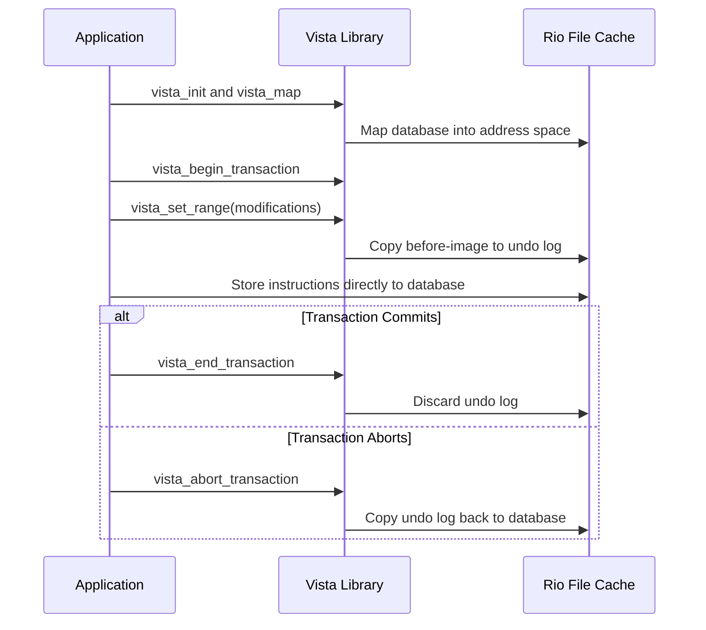

# L08b RioVista

> [!summary] TL;DR
> Rio Vista is a persistent recoverable memory system that drastically reduces transaction overhead for main-memory working sets by leveraging a battery-backed Rio file cache.
> It eliminates redo logs, system calls, and multiple memory-to-memory copies found in standard recoverable memories like LRVM.
> By tailoring its lightweight recoverable virtual memory (Vista) for Rio, the system achieves a 2000-fold speedup, dropping transaction overhead down to 5 microseconds.

## Learning outcomes

- Contrast system crashes with power failures in the context of memory persistence.
- Explain how the Rio file cache protects against software errors and system crashes.
- Analyze the mechanisms of the Vista recoverable memory library and its interaction with Rio.
- Quantify the performance gains achieved by eliminating redo logs and synchronous disk writes.
- Describe the crash recovery process and idempotency in Rio Vista.

## Motivation and the problem

Standard recoverable memory libraries incur high overhead, often several milliseconds per transaction, because they rely on synchronous disk I/O to ensure durability.
This forces systems to choose between the precise failure semantics of atomic transactions and faster, but less rigorous, consistency mechanisms.
Traditional transaction processing systems use undo logs for aborts and redo logs for crash recovery, which necessitates multiple memory-to-memory copies and expensive system calls.
The core problem is making transactions fast enough to be used ubiquitously for all persistent data manipulation without sacrificing their atomicity and durability.

## Core concepts

### System crash versus power failure

<!-- coverage: L08b-01 -->
> [!note] System Crash vs. Power Failure
> A power failure removes electricity, dropping main memory contents unless battery-backed.
> A system crash is a software failure (like a kernel panic or wild pointer) where power remains, but the OS halts unexpectedly.

Protecting memory against power loss is straightforward and inexpensive using an uninterruptible power supply (UPS).
However, software errors are more challenging because a wild store from the kernel or an application could corrupt persistent data structures before the system crashes.
Operating systems must isolate and protect persistent memory segments from these erroneous writes.
By relying on virtual memory protection, a system can ensure that memory-resident data survives an OS crash without being corrupted, thus making it as safe as disk storage.

### Rio file cache with battery-backed memory

<!-- coverage: L08b-02 -->
> [!note] Rio File Cache
> Rio is an area of main memory that survives operating system crashes, backed by a UPS to survive power failures, functioning as a persistent, safe in-memory buffer.

Rio uses virtual memory protection mechanisms to prevent operating system errors from corrupting the file cache during a crash.
When the system restarts, a warm reboot process simply flushes the surviving file cache data to disk.
Applications can modify the Rio cache either via explicit `write` system calls, which copy data and handle protection, or via `mmap`, which maps the cache into the application's address space for direct store instructions.
Because Rio makes this memory reliable, standard write-backs are delayed infinitely, drastically reducing the number of disk I/Os.

### Vista recoverable memory library

<!-- coverage: L08b-03 -->
> [!note] Vista
> Vista is a highly simplified, user-level recoverable-memory library specifically tailored to run on the Rio file cache, providing atomic updates and persistence.

Unlike standard recoverable memories that copy data to an undo log, modify the database, and then copy to a redo log on disk, Vista operates entirely within Rio's persistent memory.
Applications start a transaction, declare the memory range to modify, and Vista saves a before-image to a persistent undo log.
The application then stores directly to the mapped database.
Committing the transaction simply discards the undo log.
If the transaction aborts, Vista copies the original data from the undo log back to the database.

### Eliminating redo logs and disk writes

<!-- coverage: L08b-04 -->
> [!note] Redo Log Elimination
> Because all modifications to the mapped space in Rio are automatically persistent, Vista can completely eliminate the redo log and the log truncation process.

Traditional systems like LRVM require a redo log to implement a no-force policy, preventing the need to flush scattered database pages to disk on every commit.
This requires at least three copies: to the undo log, to the redo log, and later log truncation to the actual database on disk.
Vista eliminates the redo log entirely, reducing the transaction process to a single memory-to-memory copy to the undo log.
This also eliminates the need for expensive `fsync` and `msync` system calls, lowering transaction overhead from 10 milliseconds down to 5 microseconds.

### Crash recovery in RioVista

<!-- coverage: L08b-05 -->
> [!note] Idempotent Crash Recovery
> During recovery, Rio writes surviving cache data to disk, and Vista inspects segments to roll back any uncommitted transactions using the persistent undo log.

Because there is no redo log, the recovery process is immensely simplified, requiring fewer than 20 lines of code.
When a Vista segment is mapped after a crash, Vista checks for uncommitted transactions and rolls back their changes by copying the before-images from the undo log to the database.
This rollback process is identical to a user-initiated abort.
The recovery mechanism is idempotent, meaning that if the system fails again during the recovery process, Vista can simply replay the undo log a second time without corrupting the state.

### Vista simplicity and performance

<!-- coverage: L08b-06 -->
> [!note] Performance Impact
> Vista achieves a 100-fold speedup over LRVM running on Rio, and a 2000-fold speedup over standard LRVM on raw disks, requiring only 720 lines of code.

Vista's simplicity stems from the reliable memory provided by Rio.
By discarding redo logs, truncation, checkpointing, and disk I/Os, Vista avoids the complex optimizations like group commit that traditional systems require.
Group commit amortizes disk I/O across multiple transactions but hurts individual response times and is useless for single-threaded applications.
Vista provides microsecond-level response times, making it cheap enough for fine-grained operations like atomically swapping two pointers.

## Mechanisms step by step

The lifecycle of a Vista transaction running on the Rio file cache operates as follows:

## Worked examples

Standard LRVM on a raw disk incurs an overhead of 10,000 microseconds for a small transaction, dominated by the synchronous disk I/O to the redo log.
LRVM running on Rio (RVM-Rio) short-circuits the disk I/O, dropping the overhead to 500 microseconds.
This remaining 500 microseconds is due to system calls like `write` and `fsync`, and copying to the redo log.
Vista on Rio eliminates the redo log, system calls, and multiple copies, dropping the overhead down to 5 microseconds.
The speedup over RVM-Rio is 500 / 5 = 100x.
The speedup over standard RVM is 10000 / 5 = 2000x.

For Vista transactions larger than 1 KB, the overhead scales linearly at a rate of 17.9 microseconds per KB.
If a transaction modifies an 8 KB chunk of memory, the overhead is the base 5 microseconds plus the 7 KB over the baseline times 17.9 microseconds per KB.
The calculated overhead is 5 + (7 * 17.9) = 5 + 125.3 = 130.3 microseconds.

## Comparison

| Feature | LRVM | LRVM on Rio | Vista on Rio |
| :--- | :--- | :--- | :--- |
| Durability mechanism | Synchronous disk I/O (redo log) | Battery-backed RAM (Rio cache) | Battery-backed RAM (Rio cache) |
| System calls used | `write`, `fsync`, `msync` | `write`, `fsync` | None (direct mapped memory) |
| Memory copies per transaction | 3 (undo, redo, truncate) | 3 (undo, redo, truncate) | 1 (undo log only) |
| Small transaction overhead | ~10,000 microseconds | ~500 microseconds | ~5 microseconds |
| Log type | Undo and Redo logs | Undo and Redo logs | Undo log only |

## Paper deep dives

- [Lightweight Recoverable Virtual Memory](../Papers/L08-LRVM.md): LRVM provides atomicity and persistence without the weight of a full database, relying on an in-memory undo log and an on-disk redo log.
- [Free Transactions with Rio Vista](../Papers/L08-Rio-Vista.md): Rio Vista achieves a 2000x speedup by combining battery-backed file caches with a tailored library that eliminates redo logs.
- [Recovery Management in QuickSilver](../Papers/L08-Quicksilver.md): QuickSilver is a distributed recovery management system that provides atomicity across networked client-server systems.
- [The Recovery Manager of the System R Database Manager](../Papers/L08-System-R-Recovery-Manager.md): This seminal paper introduces Write-Ahead Logging (WAL) and the undo/redo mechanisms that influenced modern databases.
- [Operating System Transactions](../Papers/L08-OS-Transactions.md): This paper explores pushing transactional semantics directly into the operating system kernel to manage system state and file operations safely.
- [Large-scale Incremental Processing Using Distributed Transactions and Notifications](../Papers/L08-Percolator.md): Percolator is Google's system for incrementally processing web updates using distributed transactions over Bigtable.

## Modern descendants

Hardware evolution of Rio's battery-backed RAM utilizes technologies like Intel Optane and NVDIMM as Persistent Memory (PMEM).
Software frameworks like PMDK operate much like Vista, mapping persistent memory into user space and bypassing the kernel block layer entirely.
Memory-mapped databases like LMDB use read-only memory maps to provide zero-copy reads, though they still rely on traditional Write-Ahead Logging for writes to ensure durability on standard storage.

## Pitfalls and exam traps

> [!warning] Redo Log Requirement Trap
> A common exam trap is assuming all transactional systems require both an undo log and a redo log.
> Vista requires only an undo log because the primary memory itself is persistent, meaning the redo log is entirely eliminated.

> [!warning] Group Commit Utility
> Do not confuse group commit as a universal performance win.
> While it improves throughput by amortizing disk I/Os for concurrent transactions, it worsens individual transaction response times and is completely useless for single-threaded applications with dependent transactions.

## Practice

- [Practice L08](../Practice/Practice-L08.md)

## Lab

- [lab-17-recoverable-memory](../labs/lab-17-recoverable-memory/README.md): Recoverable virtual memory: undo and redo logs, fsync, crash injection

## Further reading

- [PMDK: Persistent Memory Development Kit](https://pmem.io/pmdk/)
- [Intel Optane DC Persistent Memory](https://www.intel.com/content/www/us/en/architecture-and-technology/optane-dc-persistent-memory.html)
