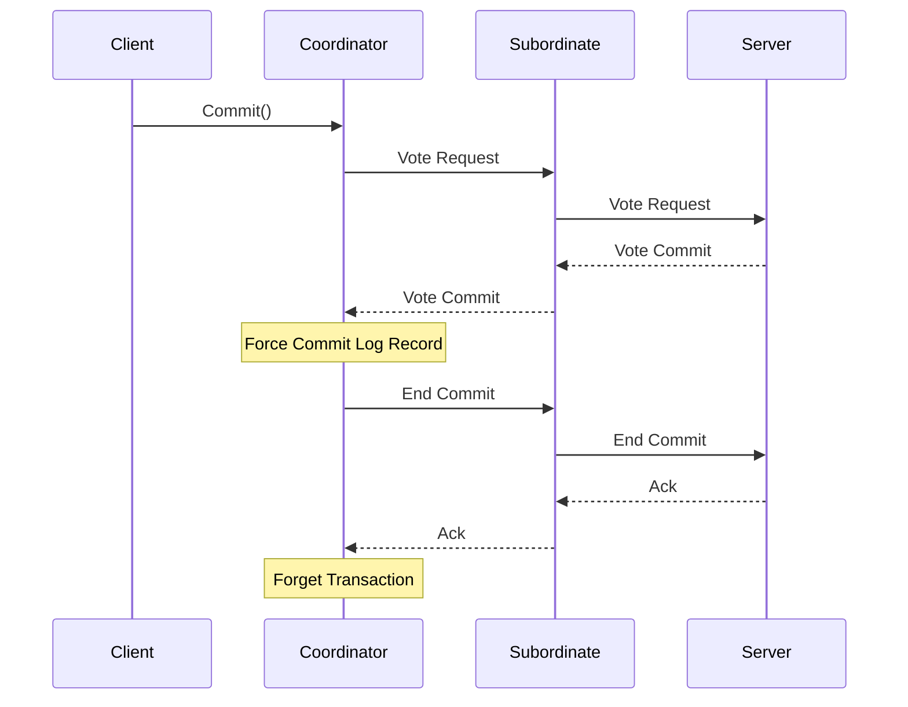

# L08c Quicksilver

> [!summary] TL;DR
> Quicksilver makes recovery a first-class OS concern by providing a unified, transaction-based recovery mechanism.
> Instead of building custom recovery logic into each service, servers in Quicksilver leverage a distributed transaction manager to achieve atomicity and failure resilience.
> The system architecture supports distributed transactions through hierarchical transaction trees and customizable commit protocols.
> Beyond Quicksilver, OS-level transactions have been explored in TxOS, while large-scale incremental processing utilizes similar distributed transaction concepts in systems like Google's Percolator.
> Database recovery fundamentals, such as write-ahead logging and shadow paging from System R, form the theoretical backbone for these reliable systems.

## Learning outcomes

- Understand the necessity of a unified recovery mechanism in distributed operating systems.
- Explain how Quicksilver utilizes transactions as the primary abstraction for system recovery.
- Describe the architecture of Quicksilver, including its interprocess communication and client-server model.
- Analyze the structure and management of distributed transactions using transaction trees.
- Evaluate the different commit protocols provided by Quicksilver and their use cases.
- Compare the log maintenance strategies and the shadow graph approach used in Quicksilver.
- Examine the principles of System R recovery, focusing on the write-ahead log and shadow pages.
- Assess the design and benefits of operating system-level transactions as implemented in TxOS.
- Understand the application of distributed transactions in large-scale incremental processing systems like Percolator.

## Motivation and the problem

Extensible and distributed operating systems introduce a complex set of failure modes.
In a client-server architecture, servers maintain substantial state on behalf of clients, such as open files or screen windows.
Failure resilience requires that clients and servers handle process and machine crashes gracefully without leaving orphaned resources or inconsistent states.
Traditional approaches like timeouts are difficult to tune and can cause false errors, while stateless server designs are impractical for services requiring hard state.
Replicated systems offer high availability but are often too expensive for all services.
Consequently, there is a critical need for a uniform, system-wide recovery architecture that prevents ad hoc error handling and ensures atomic execution of related activities across multiple servers.

## Core concepts

### Recovery as a first-class OS concern

<!-- coverage: L08c-01 -->
Operating systems traditionally handled recovery implicitly through kernel cleanup routines for local resources.
In distributed and extensible environments, services run as user-level processes and maintain distributed state.
Quicksilver elevates recovery to a primary system service by using atomic transactions as a unified recovery paradigm.
This approach allows properly written programs to recover resources associated with failed entities without relying on ad hoc, service-specific mechanisms.
The recovery manager provides fundamental primitives such as commit coordination, log recovery, and deadlock detection.
Servers can choose the level of recoverability they need, balancing efficiency with robustness.
> [!note] Definition
> A first-class recovery mechanism is a system-wide infrastructure that provides standardized, atomic failure handling as a core service, rather than leaving recovery logic to individual applications or isolated subsystems.

### Quicksilver system architecture and IPC

<!-- coverage: L08c-02 -->
Quicksilver is structured with a lean kernel that supports services implemented as communicating processes.
The kernel handles process management, machine control, and interprocess communication.
Interprocess communication follows a request-response protocol where services are identified by globally unique addresses.
Clients issue synchronous, asynchronous, or message requests to servers.
When interacting with remote nodes, a Communication Manager handles routing and connection state.
The interprocess communication mechanism tags every message with a transaction identifier.
This tagging allows the system to track all participants in a transaction seamlessly.
> [!note] Definition
> Interprocess communication in Quicksilver guarantees reliable delivery, preserves request ordering per client, and automatically propagates transaction identifiers to support distributed commit coordination.

### Transaction manager and transaction trees

<!-- coverage: L08c-03 -->
The transaction manager in Quicksilver coordinates commit processing by communicating with local servers and remote transaction managers.
A transaction begins when a client process requests a new transaction identifier from its local manager.
As the client invokes remote services, the transaction topology forms a directed graph, or tree, rooted at the coordinator.
The interprocess communication subsystem registers each participating server and subordinate transaction manager.
Each node in the transaction tree only communicates with its immediate superior and subordinates.
This decentralized structure minimizes network traffic and optimizes the distributed commit protocol.
> [!note] Definition
> A transaction tree is a hierarchical representation of a distributed transaction where the coordinating manager sits at the root, subordinate managers act as internal nodes, and participating servers form the leaves.

### Distributed transactions and the coordinator

<!-- coverage: L08c-04 -->
When a transaction spans multiple nodes, it becomes a distributed transaction requiring careful coordination.
The transaction coordinator is the manager at the node where the transaction originated.
The coordinator is responsible for initiating the commit or abort sequence based on client requests or failure detections.
Subordinate transaction managers handle the local voting and logging on behalf of their respective participants.
If a subordinate detects a local failure, it can unilaterally abort its portion of the transaction and notify the coordinator.
This architecture isolates local failures and prevents them from silently corrupting the global state of the distributed transaction.
> [!note] Definition
> A transaction coordinator manages the global outcome of a distributed transaction by aggregating votes from subordinate nodes and dictating the final commit or abort decision across the system.

### Commit protocols in Quicksilver

<!-- coverage: L08c-05 -->
Quicksilver offers flexible commit protocols tailored to the recovery needs of different servers.
Volatile servers that do not maintain persistent state use a lightweight one-phase commit protocol.
This one-phase variant notifies servers of transaction termination without the overhead of voting and logging.
Recoverable servers utilize a modified two-phase commit protocol based on the presumed-abort strategy.
The two-phase protocol includes a voting phase where participants can respond with vote-commit-volatile, vote-commit-read-only, or vote-commit-recoverable.
This granularity ensures that logging and forced disk writes are only incurred when absolutely necessary for persistent state recovery.
> [!note] Definition
> The presumed-abort protocol optimizes two-phase commit by assuming that any transaction without a persistent commit record has aborted, thereby eliminating the need to force abort records to the log.

### Log maintenance and the shadow graph

<!-- coverage: L08c-06 -->
The log manager in Quicksilver acts as a centralized facility for both commit protocol records and server-specific recovery data.
To minimize synchronous disk operations, servers append their log records sequentially to a common log.
The transaction manager forces the log to disk only at the commit point, guaranteeing that all prior server updates are safely recorded.
Some servers utilize a shadow graph technique for managing persistent data structures.
In this approach, modifications are made to a volatile copy of the data graph.
Upon transaction commit, the shadow graph atomically replaces the permanent graph, and the necessary log entries are flushed to ensure structural integrity after a crash.
> [!note] Definition
> A shadow graph is a recovery data structure where updates are applied to a duplicate (shadow) structure, which only becomes the authoritative version once the transaction successfully commits.

### Implementation notes and performance

<!-- coverage: L08c-07 -->
The implementation of Quicksilver demonstrates that an operating system can provide robust transactional semantics without unacceptable performance overhead.
The transaction manager and log manager are implemented as user-level server processes.
By batching log writes and utilizing the presumed-abort protocol, the system achieves high throughput for lightweight transactions.
Performance measurements indicate that the cost of local transaction coordination is comparable to standard interprocess communication overhead.
For distributed transactions, the hierarchical transaction tree significantly reduces the number of network messages required for commit processing.
The flexibility of allowing servers to dictate their own log recovery mechanisms further enhances overall system efficiency.
> [!note] Definition
> Quicksilver's performance optimization relies on minimizing synchronous log I/O and reducing network message round-trips through hierarchical commit coordination.

### System R recovery: write-ahead log and shadow pages

<!-- coverage: L08c-08 -->
System R introduced foundational recovery techniques that influenced subsequent transactional systems.
The write-ahead log protocol dictates that the log records representing a state change must be written to stable storage before the actual data pages are updated on disk.
This guarantees that the system can always undo uncommitted changes or redo committed ones after a crash.
System R also employed shadow paging, where updated disk pages are written to new locations rather than overwriting the original pages.
A page map points to the current active pages, and this map is atomically updated during a checkpoint or commit.
Shadow paging allows quick recovery from failures by simply discarding the modified page map if a transaction aborts.
> [!note] Definition
> Write-ahead logging ensures data integrity by mandating that undo and redo log records are safely stored on non-volatile media before the corresponding data blocks are modified in place.

### OS-level transactions (TxOS)

<!-- coverage: L08c-09 -->
TxOS integrates transaction semantics directly into the operating system kernel to solve persistent concurrency problems like time-of-check-to-time-of-use vulnerabilities.
Applications group system calls within transaction boundaries, and the OS guarantees atomicity, consistency, isolation, and durability.
TxOS uses lazy version management, isolating transactional updates in private copies of kernel data structures until commit.
This avoids the deadlocks and performance penalties associated with eager versioning and complex locking schemes.
The kernel serializes transactions with non-transactional system calls, ensuring strong isolation and fairness.
By providing transactions as a core OS abstraction, developers can easily build reliable services like transactional software installers.
> [!note] Definition
> Lazy version management in TxOS isolates transactional state modifications in private buffers, applying them to the global system state only upon successful transaction commit.

### Large-scale incremental processing (Percolator) transactions

<!-- coverage: L08c-10 -->
Percolator applies distributed transactions to the problem of incrementally updating massive datasets, such as the Google web search index.
Built on top of Bigtable, Percolator replaces batch processing with incremental updates by allowing random access and mutation of the repository.
It provides ACID snapshot isolation semantics, enabling thousands of machines to concurrently update the index without data corruption.
Percolator uses an observer framework where user-defined code is triggered by changes to specific columns.
The system maintains locks explicitly within Bigtable columns to manage distributed transactions across the cluster.
A timestamp oracle provides strictly increasing timestamps to coordinate snapshot isolation and ensure consistency across concurrent reads and writes.
> [!note] Definition
> Percolator utilizes snapshot isolation and a distributed lock service stored directly within the data tables to provide scalable, cross-row transactions for massive incremental processing tasks.

## Mechanisms step by step

The two-phase commit protocol in Quicksilver operates through a structured sequence of messages across the transaction tree.
First, the transaction owner issues a Commit request to the local transaction manager.
Second, the coordinator transaction manager sends vote requests to all local participants and immediate subordinate transaction managers.
Third, subordinate transaction managers recursively propagate the vote requests down the transaction tree to their local participants.
Fourth, participants flush their necessary log records and return their votes to their respective transaction managers.
Fifth, the coordinator collects all votes and forces a commit record to the log if all are positive.
Sixth, the coordinator broadcasts end-commit messages to all subordinates and participants.
Finally, subordinates and participants release resources, acknowledge the end message, and the transaction is successfully forgotten.

## Worked examples

Consider the transaction latency in Quicksilver for a distributed commit involving three nodes.
Assume local interprocess communication takes 2 milliseconds, network message delay is 10 milliseconds, and a synchronous log force takes 15 milliseconds.
When Node A initiates a commit, it sends a vote request over the network to Node B, taking 10 milliseconds.
Node B receives the request and sends a vote request to its subordinate Node C, taking another 10 milliseconds.
Node C processes the vote, forces its log which takes 15 milliseconds, and replies to Node B taking 10 milliseconds.
Node B receives the vote, forces its log taking 15 milliseconds, and replies to Node A taking 10 milliseconds.
Node A receives the final vote and forces the global commit log taking 15 milliseconds.
The total time for the voting phase to complete before Node A decides to commit is 10 plus 10 plus 15 plus 10 plus 15 plus 10 plus 15, equating to 85 milliseconds.
This calculation demonstrates the critical path of the hierarchical commit protocol and the substantial impact of synchronous disk operations.

## Comparison

| Feature | Quicksilver | TxOS | Percolator |
| :--- | :--- | :--- | :--- |
| **Primary Goal** | Unified recovery in distributed OS | OS-level system call atomicity | Massive-scale incremental indexing |
| **Transaction Scope** | Distributed across multiple nodes | Local OS resources and files | Distributed across Bigtable rows |
| **State Management** | Log-based and shadow graphs | Lazy versioning in kernel buffers | Multi-version timestamped columns |
| **Isolation Level** | Serializable via locks | Strong isolation from non-tx code | Snapshot isolation |
| **Best Used For** | Client-server distributed recovery | Safe software installs | Continuous search index updates |

## Paper deep dives

- [[L08-LRVM]]
  Lightweight Recoverable Virtual Memory provides an efficient way for applications to manage persistent data structures without the overhead of a full database.
  It maps segments of virtual memory to disk and uses a redo log to ensure atomicity and durability of updates.
  By relying on a simple, user-level library, it allows applications to define their own transactional boundaries.

- [[L08-Rio-Vista]]
  Rio Vista builds upon reliable memory to eliminate the synchronous disk writes typically required for transaction commits.
  By battery-backing the main memory, the system ensures that volatile state survives power failures.
  This design allows transactions to commit at the speed of memory access, drastically improving throughput for transaction-heavy workloads.

- [[L08-Quicksilver]]
  The Quicksilver paper details the architecture of a distributed operating system where recovery is handled by a unified transaction manager.
  It introduces a hierarchical commit protocol and customizable participant voting to optimize performance.
  The system demonstrates that building recovery directly into the OS interprocess communication layer simplifies the design of fault-tolerant distributed services.

- [[L08-System-R-Recovery-Manager]]
  System R's recovery manager paper is a foundational text describing write-ahead logging and shadow paging.
  It explains how databases can guarantee atomicity and durability in the presence of system crashes or transaction aborts.
  The concepts introduced in System R heavily influenced the design of almost all subsequent transactional storage systems.

- [[L08-OS-Transactions]]
  The TxOS paper presents a modified Linux kernel that provides ACID transactions for system calls.
  It tackles the problem of time-of-check-to-time-of-use vulnerabilities by allowing file system operations to be grouped atomically.
  The paper highlights the use of lazy version management and strong isolation to integrate transactions seamlessly with existing non-transactional applications.

- [[L08-Percolator]]
  Percolator is described as a system that replaces MapReduce batch processing with incremental, transaction-based updates for the Google search index.
  The paper explains how snapshot isolation and a distributed lock service built on Bigtable enable massive concurrency.
  It also introduces the observer model, which allows developers to chain asynchronous processing tasks robustly.

## Modern descendants

Modern descendants of these transactional concepts are visible across numerous computing domains.
In the operating system space, concepts from TxOS influence file systems like ZFS and Btrfs, which use copy-on-write and transactional semantics to maintain volume integrity.
Software transactional memory implementations have matured, allowing user-space applications to utilize similar lazy versioning techniques for concurrent programming.
Percolator's design directly inspired a generation of distributed databases, including Google's Spanner and CockroachDB, which utilize snapshot isolation and distributed transaction coordinators to provide scalable, globally consistent storage.
Key-value stores and Dynamo-style architectures often adopt the log-structured merge-tree concepts that evolved from early shadow paging and logging techniques.

## Pitfalls and exam traps

> [!warning] Pitfalls and exam traps
> A common mistake is to assume that Quicksilver uses a central transaction coordinator for all nodes in the system.
> In reality, it builds a transaction tree, and nodes only communicate with their immediate superior and subordinates.
> Students often confuse the isolation guarantees of Percolator.
> Percolator provides snapshot isolation, not strict serializability, meaning it is susceptible to write skew anomalies.
> Do not assume that TxOS uses eager locking like traditional databases.
> TxOS utilizes lazy version management, isolating changes in private buffers until commit, which eliminates the possibility of transaction deadlocks.

## Practice

- [Practice L08](../Practice/Practice-L08.md)

## Lab

- [[labs/lab-18-transactions/README|lab-18-transactions]]: Transactions and recovery: two-phase commit, write-ahead logging, and shadow paging

## Further reading

- [Quicksilver Distributed File System](https://dl.acm.org/doi/10.1145/38159.38174)
- [System R Database Recovery](https://dl.acm.org/doi/10.1145/319566.319567)
- [Google Percolator Architecture](https://research.google/pubs/pub36726/)
