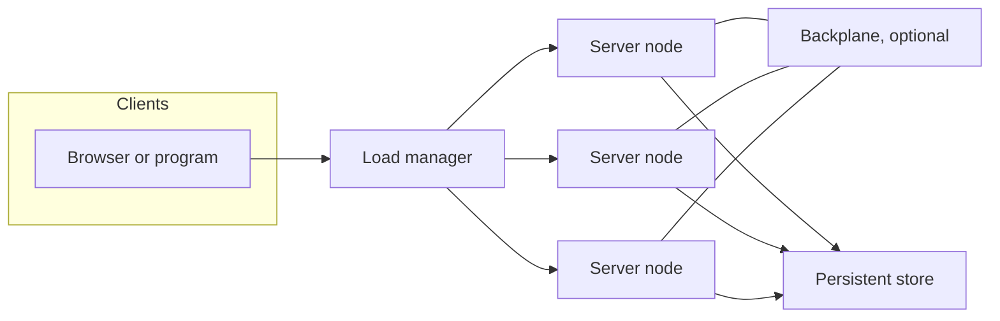
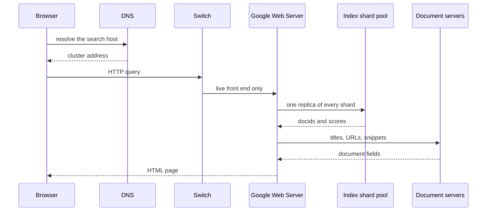

# L09a Giant Scale Services

> [!summary] TL;DR
> A giant-scale service is a cluster of commodity nodes behind a load manager, with a replicated or partitioned data store and an optional backplane.
> Capacity is governed by Brewer's DQ principle: data moved per query times queries per second is bounded by bandwidth, seeks, or a similar physical bottleneck.
> Availability is better reported as yield (fraction of queries completed) and harvest (fraction of the data reflected in the answer) than as uptime.
> Replication spends a fault on yield.
> Partitioning spends the same fault on harvest.
> Upgrades are controlled faults whose lost DQ-time is the same for a fast reboot, a rolling upgrade, and a big flip.

## Learning outcomes

- Compute yield, harvest, and uptime from MTBF, MTTR, offered queries, and the fraction of data still reachable.
- Apply the DQ principle to say how queries per second must change when data per query changes, and check the product.
- For a replica group of n nodes with k failures, compute lost capacity, redirected load, and the overload factor.
- Choose replication, partitioning, or a mix, and say which availability metric moves when a node dies.
- Compare fast reboot, rolling upgrade, and big flip by peak DQ loss and by the area of lost DQ-time.
- Trace one Google query from DNS through the Google Web Server, index shards, and document servers, and say what a dead replica does to capacity versus completeness.

## Motivation and the problem

Phone switches and water systems were designed to change slowly and to stay up.
A search engine, a storefront, or a free web cache changes features continuously, grows faster than a single box, and is built from parts that fail every day.
The operational question is not how to avoid every fault.
It is how a fault, a traffic spike, or an upgrade should show up to users: as refused queries, as thinner answers, or as a short planned hole.
Brewer's account of Inktomi-style clusters, and the Google cluster paper that followed, turn that question into metrics you can calculate before you buy hardware or ship a release.
The Fall 2026 syllabus marks both papers as partial readings and does not name sections.
The lecture's fair-game core is the service model, DQ, harvest and yield, replication versus partitioning, graceful degradation, online evolution, and the Google query path.
This note covers those arguments from the papers, in original wording.

## Core concepts

### Generic service model of giant scale services

<!-- coverage: L09a-01 -->

> [!note] Generic giant-scale service
> Clients talk only to a load manager.
> The load manager spreads queries across a pool of servers.
> Each server has CPU, memory, and disk.
> The persistent store is a replicated or partitioned collection of those disks, sometimes plus network-attached storage.
> An optional backplane, a private system-area network, carries coherence traffic and redirects a query to the node that actually holds the bytes.

The model is deliberately small.
Auxiliary systems such as profile databases, ad servers, and management tools exist on a real site, and the basic picture ignores them so the availability argument stays about queries and data.
Two published endpoints show how the same boxes are wired differently.
A simple web farm uses round-robin DNS, copies the whole corpus onto every node, and needs no backplane, because any node can answer any query.
A search cluster puts a hot-failover pair of transport-layer switches in front, partitions the index across servers, and uses a backplane so a node can still reach data it does not store locally.
In the farm, a dead node removes capacity and does not remove data.
In the search cluster, a dead node can remove both a slice of capacity and a slice of the store, unless that slice is also replicated.
The load manager's two jobs follow from this picture: keep the live nodes busy, and hide a partial failure so clients do not pin themselves to a corpse.



### Clusters as workhorses

<!-- coverage: L09a-02 -->

> [!note] Why a cluster, not a bigger server
> Commodity nodes give absolute scale, incremental growth, and independent faults.
> Hardware dollars are usually smaller than bandwidth and operations.
> The design goal is to turn independent faults into a controlled change in yield or harvest, and to make repair cheap.

A single high-end multiprocessor does not reach the request rate of a planetary search or cache, and it turns a bad disk, a bad DIMM, or a kernel bug into a site-wide outage.
A cluster grows by adding nodes.
Brewer's DQ normally scales about linearly with node count, which is why Inktomi could measure a software change on a four-node cluster and expect the same relative gain on a hundred-node cluster.
Nodes bought in different years do not have equal DQ.
Load and partition sizes should follow measured DQ, not a head count, or the new fast nodes sit idle while an old node saturates.
Symmetry is an availability feature, not an aesthetic.
The hundred-node, two-hundred-CPU cluster Brewer shows is extreme on purpose: internal disks, almost no external storage, few cables, no operators and no monitors in the room, managed from offsite, with contracts that bound temperature and power.
Every extra cable and every unique box is another MTTR.
Independent faults are the assumption that makes a single-node failure a 1/n event.
Power, cooling, and a cut fiber violate that assumption, and the disaster section below treats them as a different problem from a dead disk.

### Load management: round-robin DNS

<!-- coverage: L09a-03 -->

> [!note] Round-robin DNS
> The authoritative server rotates the address it returns for one name, so successive resolvers land on different replicas.
> The data on those replicas is identical, or the rotation is wrong.
> The scheme balances new lookups.
> It does not know which server is dead, and it does not know which server is busy.

Round-robin is not least-loaded scheduling.
Nothing in the DNS reply inspects CPU, queue length, or health.
A client, a recursive resolver, or a browser that ignores TTL will keep using a dead address until the cached mapping expires.
Brewer notes that this can last several hours.
A short TTL cuts that window and multiplies DNS queries, and some browsers of that era mishandled expiry anyway.
The mapping is also a poor fit once nodes are no longer interchangeable.
If the store is partitioned by URL, handing the client a random IP either misses the data or forces a second hop.
Round-robin therefore matches the simple web farm: full replicas, no session stickiness, and a tolerance for slow failover.
Cross-site failover has the same defect in a stronger form.
Changing a DNS record to drain a lost data center can take hours, which is why smart clients that already know a second site are more convincing for disaster recovery than a DNS update.

### Load management: layer 4 and layer 7 switches

<!-- coverage: L09a-04 -->

> [!note] Layer-4 and layer-7 switches
> A layer-4 switch understands TCP and port numbers and binds a connection to a chosen server.
> A layer-7 switch also parses the application payload, for HTTP the URL, at wire speed.
> Vendors sold both in pairs that fail over to each other, at throughputs the paper puts above 20 Gbit/s.

The transport switch watches live connections, so it can stop sending new work to a node that is no longer accepting TCP.
Clients never learn the dead address.
That is the property round-robin lacks.
The switch is itself a single point of failure, which is why the search-cluster picture uses a pair and hot failover.
Layer 7 matters once the store is partitioned.
The switch reads the URL, hashes or looks up the owner, and sends the query to a node that has that partition, or to a front end that will.
A pure switch is still a poor place to keep per-user session state.
Wal-Mart's site, in Brewer's telling, used custom front-end nodes as software layer-7 routers because those nodes can remember a shopper across requests.
Smart clients are the third tool, used with the switches rather than instead of them.
A program that is the real client of a search cluster can pick another physical site immediately when the local switch or the local site is gone.
Browsers of the open web had no generic way to do that, which is why DNS remained the cross-site mechanism even though it is slow.

### DQ principle

<!-- coverage: L09a-05 -->

> [!note] DQ
> For a data-intensive service, data examined per query times queries completed per second is approximately constant for a given pile of hardware.
> Call that product DQ.
> It is the bytes, or the seeks, the cluster must move per second.
> Adding nodes or making the software touch less data raises DQ.
> Faults and upgrades lower it.
> The absolute number is less useful than the ratio before and after a change.

The bottleneck behind the constant is physical: total disk bandwidth, total seeks, or network bandwidth inside the cluster.
At the high utilization these sites actually run, DQ sits near that limit, so you cannot raise queries per second without lowering bytes per query, or the reverse.
Brewer prefers bandwidth over a raw I/O count because the workload is a huge mix of connections and is more network-bound than disk-bound, and because bandwidth is easier to degrade on purpose.
The constant is a principle, not an identity.
It fits data-intensive sites, which Brewer says were the bulk of the top hundred properties at the time.
A simulation engine that is CPU-bound, or a chat site whose latency is spent waiting on humans, does not obey it.
Heavy write traffic is the important exception inside the data-intensive family: a replica must pay DQ for every extra copy that is written, so replication then costs more DQ than partitioning.
Read-mostly giant-scale stores rarely hit that exception.
Relative DQ is also the capacity-planning tool.
Measure it on the target workload with a load generator, including the real database size, then turn a traffic forecast into a hardware target.
Inktomi's four-node versus hundred-node experience is the evidence that the relative number survives scale-up when the bottleneck is the same.

Do not confuse this D and Q with the fractions in the next section.
D here is bytes (or records) touched by one query.
Q here is queries per second.
Harvest and yield are both dimensionless.
At saturation the fractions move in a way that looks like a constant product, and that is a consequence, not the definition.

### Uptime, yield, and harvest

<!-- coverage: L09a-06 -->

> [!note] Three availability metrics
> Uptime is the fraction of time the site is serving.
> Brewer writes it as uptime = (MTBF - MTTR) / MTBF, so MTBF is the interval from one failure to the next and MTTR is the repair slice of that interval.
> Yield is queries completed divided by queries offered.
> Harvest is data available for the answer divided by the complete data the answer should reflect.

Uptime treats every second as equal.
A one-second outage at peak and a one-second outage when the site is idle change uptime by the same amount and change yield by very different amounts, because offered load can differ by an order of magnitude.
A second with no queries does not change yield at all.
Yield is therefore the metric that matches user experience, and on a healthy site it is numerically close to uptime without being the same thing.
Harvest catches a second failure mode that uptime and yield both miss.
The site answers every query, and each answer is missing a slice of the index, a seller profile, or a fresh quote.
A perfect service has yield 1 and harvest 1.
Real faults move one, the other, or both, and the design choice is which one you allow to move.

"Four nines" in the paper is 0.9999 uptime.
The paper states that as less than 60 seconds of downtime per week.
Check: a week is 7 x 24 x 3600 = 604800 seconds, and 0.0001 x 604800 = 60.48 seconds.
That budget is about a minute a week, not a minute a year.
Five nines would be a tenth of that.
The practical lesson Brewer draws from the formula is to attack MTTR at least as hard as MTBF.
Proving that a component's MTBF is a week takes well more than a week of realistic load, and a failure restarts the clock.
Measuring an MTTR takes minutes, and a ten-percent repair improvement can be debugged in a short cycle.
New features tend to hurt MTBF and barely move MTTR, so MTTR is the stabler target on a site that ships constantly.

### Replication versus partitioning

<!-- coverage: L09a-07 -->

> [!note] Where the fault lands
> A replicated store keeps D and cuts Q.
> Harvest stays near 1, and yield falls if the survivors cannot absorb the redirected load.
> A partitioned store keeps Q and cuts D.
> Yield stays near 1, and harvest falls by the fraction of data that lived on the dead nodes.
> Both organizations lose the same fraction of DQ.
> Disk copies are cheap.
> The DQ to read or write those copies is not.

Take Brewer's two-node illustration, saturated, one node dead.
The replicated pair still has the full corpus on the survivor, so harvest is 1, and Q is cut in half, so yield is 0.5.
The partitioned pair still answers every query, so yield is 1, and each answer sees half the corpus, so harvest is 0.5.
Someone who only watches harvest will call replication the winner.
Someone who only watches yield will call partitioning the winner.
DQ says they lost the same capacity.
The traditional defense of replication quietly assumes spare DQ, so the redirected load never turns into refused queries.
Under the high utilization these clusters actually run, that spare DQ is not there.
Table 1 of the paper generalizes a replica group of n nodes.
Losing k nodes costs k/n of capacity.
The failed nodes' load is spread over the n - k survivors, so each survivor's extra load, as a fraction of its old load, is k / (n - k).
The overload factor on each survivor is n / (n - k).
Losing 2 of 5 is the paper's numeric example: redirected load 2/3, overload factor 5/3, which is about 167 percent of normal load.
Check: lost capacity 2/5 = 0.4, redirected load 2/(5-2) = 2/3, overload 5/3 = 1.667.
If the site was already full, yield falls unless you also cut D.

Because the DQ constant does not prefer replication or partitioning, the paper's rule is pragmatic.
Partition until each piece is a convenient size, then replicate, because replicas give you a choice about harvest, a disaster copy, and an easier way to grow than a full repartition.
You can also replicate only the important slice.
Normally one node serves that slice and the other nodes hold ordinary partitions.
If the important node dies, promote a node that was holding a less important partition.
Randomized placement, a hash the switch already has, makes the lost harvest a random sample instead of a correlated hole, and it avoids hot partitions.
Inktomi search used partial replication, mail used full replication, and clustered web caches used none.
All three randomized.

### Graceful degradation

<!-- coverage: L09a-08 -->

> [!note] Saturation is a policy
> When offered load exceeds DQ, decide explicitly whether to refuse queries, thin the data, or both.
> Admission control limits Q and protects harvest.
> Shrinking or staling the effective database limits D and protects yield.
> Doing neither produces a cliff: timeouts for everyone, including the queries you most wanted to keep.

Spare capacity sized for the peak is a weak plan.
Brewer puts the peak-to-average ratio of these systems in a range of about 1.6 to 1 up to 6 to 1, so building for the peak multiplies the bill.
A single event can sit far above even that peak.
The paper's example is moviephone.com adding ten times its capacity for one film's ticket sales and still saturating.
Correlated faults, a power domain or a disaster, remove DQ in a lump and leave the survivors saturated.
Graceful degradation is the designed response.

Cutting the effective database in half should roughly double Q, because the product is the constant.
That is the simplest database-reduction move, and some sites were only beginning to use it when the paper was written.
More selective policies from production systems:

- Cost-based admission, as at Inktomi.
  The switch or front end estimates the DQ of a query and may reject one expensive query so several cheap ones complete.
  Both harvest and yield move, and the net harvest of the queries you do answer can rise.
- Value-based admission, as at Datek.
  A stock trade is guaranteed to run within 60 seconds or the commission is waived.
  Low-value queries are dropped because of their value, not because of their DQ cost.
- Reduced freshness.
  A quote that is allowed to expire less often is cheaper to serve and is a lower-harvest answer, because it no longer reflects the current database.
  Yield goes up.

Disaster tolerance is the same machinery plus replica placement.
With two replicas at each of three sites, losing one site loses 2 of 6 replicas.
Survivors must carry 6/4 = 1.5 times the traffic.
To hold DQ constant while raising Q by 3/2, set the new data per query to 2/3 of the old data, because (2/3) x (3/2) = 1.
The paper's parenthetical goal is that 3/2 Q.
A literal reading of "reduce D by 2/3" would leave only 1/3 of D and would triple Q, which is more harvest loss than the overload requires.
Use the inverse.
Inktomi's actual disaster plan, Brewer writes, was simpler and less tight: cut D to half for any disaster, which doubles Q and covers a 1.5 overload with harvest to spare.
Layer-4 switches do not help once the whole site name is unreachable.
DNS may take hours.
A smart client can move immediately.
That is the strongest argument in the paper for putting the client in the load-management path.

### Online evolution and growth: fast reboot, rolling upgrade, big flip

<!-- coverage: L09a-09 -->

> [!note] An upgrade is a controlled fault
> Maintenance removes DQ on purpose.
> If each of n nodes takes time u to upgrade, the lost DQ-time is n times u times the average DQ of one node, which equals total DQ times u.
> Fast reboot, rolling upgrade, and big flip all have that same area.
> They differ in peak loss, wall-clock time, and whether two versions must run at once.

The area identity is equation (5) in the paper and the point of its Figure 5, drawn for four nodes.
Check it with u = 10 minutes and four equal nodes, each one DQ unit.
A fast reboot takes every node down together for 10 minutes: 4 x 10 = 40 unit-minutes, wall clock 10 minutes, remaining DQ is 0.
A rolling upgrade takes one node down for 10 minutes, then the next, four times: 1 x 40 = 40 unit-minutes, wall clock 40 minutes, remaining DQ is 3/4.
A big flip takes two nodes down for 20 minutes (each half is upgraded as a batch, and each node still spends u in the down set): 2 x 20 = 40 unit-minutes, wall clock 20 minutes, remaining DQ is 1/2.
The shaded area is the same.
The shape is not.

| Scheme | Wall clock for n = 4 | DQ left during the window | Versions live at once | Use when |
| --- | --- | --- | --- | --- |
| Fast reboot | u | 0 | one | The user base is segmented and you can pick an off-peak window. Lost yield is real but short. |
| Rolling upgrade | n x u | (n - 1) / n | two, so schemas and intra-cluster protocols must interoperate | The common case. Off-peak, a replicated site often keeps yield and harvest at 1 because one missing replica still fits. A partitioned site loses harvest in each of the n windows. |
| Big flip | 2 x u | 1/2 | one | Hardware, OS, schema, networking, or a physical move. Switch new connections atomically to the upgraded half, drain the old half, then flip back. |

Staging is what makes u small.
The new bits sit on the node next to the old bits, so the reboot is a pointer swing plus a process start, and rollback is the reverse.
Without a staging area the operator copies the new version while the node is down, and u grows.
Software upgrades are the common, short case.
Hardware, operating system, schema, and repartitioning are the long cases.
The big flip is powerful enough to move a cage.
Inktomi used DNS to flip about 20 nodes from Berkeley to Santa Clara, and a switch to flip about 100 nodes between cages in one data center.
The 50 percent DQ hole then lasts as long as the physical move, which can be hours, and is still a weekend problem rather than a redesign.
Fifty percent DQ on a replica group can be spent as 50 percent capacity, which may still be 100 percent yield off-peak, or as 50 percent harvest if the store is partitioned.
Rolling upgrades were the popular default.
The big flip was reserved for changes that cannot coexist.
Automation matters because the site never reaches a finished software version: slow leaks and nondeterministic bugs remain, and the philosophy is a target MTBF, a low MTTR, and no cascading failure.

```text
DQ
|  ####                 fast reboot: height n, width u
|  ####
|  ####............     rolling: height 1, width n*u
|  ##..............
|  ####......          big flip: height n/2, width 2*u
+------------------> time
Each shape has area n*u of lost node-time.
```

### Web search for a planet: cluster architecture

<!-- coverage: L09a-10 -->

> [!note] Google query serving, circa the 2003 paper
> Many clusters, each a few thousand commodity PCs, more than 15,000 machines in total.
> DNS picks a cluster using proximity and remaining capacity.
> Inside the cluster a hardware load balancer picks a Google Web Server.
> That server fans the query out to replicated index shards, then to document servers, plus spell checking and ads, and writes the HTML.

The index is the harvest story and the DQ story at once.
Raw documents were several tens of terabytes uncompressed, and the inverted index built from them was itself many terabytes.
The index is cut into shards, each a random subset of documents, and each shard is served by a pool of replicas.
A query goes to one replica of every shard, the local hit lists are intersected, and a cheap merge produces the ordered document ids.
Random subsets mean a dead replica does not punch out one topic.
The load balancer skips the dead replica, capacity falls by that machine's share of the pool, and every part of the index stays available.
That is Brewer's replication case: harvest holds, Q drops.
Document servers use the same pattern on the corpus itself.
Because replicas already exist to get the request rate, fault tolerance is almost free, which is why the paper refuses RAID, redundant power supplies, and high-end components.
A query is read-only against these structures.
Updates are infrequent and are done by steering traffic off a replica, so the serving path sidesteps distributed-database consistency.

The price argument is a worked comparison, not a slogan.
A late-2002 rack of 88 dual 2 GHz Xeon servers, 2 GB of RAM and an 80 GB disk each, was about $278,000.
Over three years that is 278000 / 36 = $7,722 a month, which the paper rounds to $7,700.
The rack holds 88 x 2 = 176 CPUs, 88 x 2 = 176 GB of RAM, and 88 x 80 = 7040 GB, about 7 TB of disk.
A contemporary eight-socket x86 server with 64 GB of RAM and 8 TB of disk cost about $758,000: roughly three times the money, 176/8 = 22 times fewer CPUs, about three times less RAM, and slightly more disk.
The extra money bought interconnect and hardware reliability that this software does not use.
Power is the constraint the dollars do not capture.
A dual 1.4 GHz Pentium III board drew about 90 W DC under load (about 55 W for the CPUs, 10 W for the disk, 25 W for memory and board).
At about 75 percent ATX efficiency, AC draw is 90 / 0.75 = 120 W per server, and the paper's rack is about 10 kW.
In 25 square feet that is 10000 / 25 = 400 W per square foot, against a commercial data center of that era at 70 to 150 W per square foot.
The same 10 kW rack, with cooling overhead, is about 10 MWh a month.
At the paper's generous 15 cents per kWh that is about $1,500, smaller than the $7,700 depreciation, so a lower-power server had to be cheaper, not merely cooler, to win.
Packing still harder would have pushed past 700 W per square foot and still would not have fit the building.
The architectural conclusion is price per query, amortized over two or three years, not peak single-thread speed.
Index-server measurements on a 1 GHz dual Pentium III support that conclusion: cycles per instruction about 1.1, branch mispredict about 5 percent, L2 miss about 0.3 percent per retired instruction, memory-bus use well under 20 percent.
There is little instruction-level parallelism to buy with a more aggressive core.
A dual-context SMT Xeon did give more than a 30 percent gain over one context, which is thread-level parallelism the query mix already has.

## Mechanisms step by step

A saturated search query under the combined model:

1. DNS returns a cluster address.
   The client caches it.
   A dead cluster is invisible to this step until the TTL dies, unless the client is smart and has a second address.
2. The hardware load balancer, a layer-4 or layer-7 switch in a failover pair, picks a front-end server and will not pick a node that has stopped completing TCP.
3. The front end fans out to one live replica of each index shard.
   If a replica is down, the pool's Q drops by 1 over the pool size and the shard is still represented.
4. If the remaining DQ cannot cover the offered load, admission control or database reduction runs before the fan-out, not after the timeouts.
5. Document servers, spell checking, and ads run the same way: replicated pools, read-only serving data, traffic steered away during an update.
6. An upgrade uses one of the three schedules above, and the operator decides whether the missing DQ appears as refused queries or as a smaller index.



## Worked examples

### Two nodes, one fault, saturated

Offered load is the full DQ of both nodes.
One node dies.

| Layout | Harvest | Yield | DQ left |
| --- | ---: | ---: | ---: |
| Replicated | 1.00 | 0.50 | 0.50 |
| Partitioned | 0.50 | 1.00 | 0.50 |

The product of the two fractions is 0.50 in both rows.
That product is not the definition of DQ.
It matches DQ here because the site was saturated and the fault removed half the bytes-per-second.

### Replica group, n = 5, k = 2

Lost capacity = 2/5 = 0.40.
Redirected load on each survivor = 2/3 = 0.667 of that survivor's previous load.
Overload factor = 5/3 = 1.667.
If offered load was already 100 percent of the healthy DQ, and you do not cut D, completed queries can be at most 3/5 of offered queries, so yield is at most 0.60.
Harvest stays 1 only while every surviving replica still holds the full replica-group data.

### Three sites, two replicas each, one site lost

Capacity left = 4/6 = 0.667.
Overload if you keep D fixed = 6/4 = 1.5.
Data per query that restores the product: D_new = D / 1.5 = (2/3) D.
Harvest becomes 2/3 if the cut is a uniform thinning of what each query reads, and yield can stay 1.
Cutting D to 1/2 instead doubles Q (factor 2, which is more than 1.5) and spends more harvest than the overload required.
That is a legal, simpler policy.
It is not the tight one.

### Upgrade area

n = 4, u = 10 minutes, one DQ unit per node.
Fast reboot, rolling upgrade, and big flip each destroy 40 unit-minutes.
They leave 0, 75 percent, and 50 percent of DQ during the window.
Off-peak offered load at 50 percent of healthy DQ fits under the big flip exactly, fits under rolling with room, and fits under a fast reboot not at all.

### Rack arithmetic from the Google paper

88 servers x 2 CPUs = 176 CPUs.
88 x 2 GB = 176 GB RAM.
88 x 80 GB = 7040 GB of disk, about 7 TB.
Capital cost about $278,000 over 36 months is about $7,722 per month.
AC power 90 W DC / 0.75 = 120 W per server.
10 kW in 25 square feet is 400 W per square foot.
Energy cost at 10 MWh and $0.15 per kWh is $1,500 per month, set next to $7,700 of depreciation.

## Comparison

| Design | Strength | Cost | Use when |
| --- | --- | --- | --- |
| Round-robin DNS, full replicas | No special hardware, even spread of new clients | Dead nodes stay in caches for up to hours, no load signal | Small identical corpus, tolerant failover |
| Layer-4 switch pair | Hides dead nodes immediately, high packet rate | Switch is a component you must duplicate, no URL affinity | Replicated pools, connection-level balance |
| Layer-7 switch or front end | Routes to the owning partition, can hold a session | More state, more parsing cost | Partitioned store, shopping sessions |
| Smart client | Cross-site failover in one RTT | You must own the client | Middle-tier programs, not a stock browser |
| Full replication | Harvest holds under a node fault | Q falls, and writes pay DQ per extra copy | Mail, small web farms, any answer that must be complete |
| Pure partitioning | Yield holds, aggregate disk bandwidth adds | Harvest falls, growth means repartitioning | Caches, and search slices where a random hole is acceptable |
| Partial replication | Important data keeps harvest, the rest keeps scale | You must decide which slice is important | Search indexes |
| Fast reboot | Short wall clock, one version | Yield is zero during u | Off-peak, fully automated, staged bits |
| Rolling upgrade | Smallest peak hole | Longest wall clock, versions must coexist | Ordinary software pushes |
| Big flip | One version, half the DQ, works for schema and physical moves | Half the capacity for 2u, operationally heavy | Changes that cannot interoperate |

## Paper deep dives

[Lessons from Giant-Scale Services](../Papers/L09-Giant-Scale-Services.md) is the source of the DQ principle, the uptime formula, yield and harvest, the overload table, and the three upgrade shapes.
The syllabus marks it partial and does not name sections, so the metrics and the mechanisms above are the part to be able to recompute.

[Web Search for a Planet](../Papers/L09-Web-Search-for-a-Planet.md) is the concrete cluster: geographic DNS, in-cluster load balancing, index shards that are random document subsets, document servers, and the 2002 price and power arithmetic.
It is also a partial reading.
The query path and the decision to buy price per query rather than peak CPUs are the part that lines up with this lesson.

[MapReduce](../Papers/L09-MapReduce.md) is how the same commodity cluster computes, rather than how it serves a query.
The programmer supplies a map and a reduce.
The runtime owns splitting, shuffle, re-execution, and backup tasks.
See [L09b](L09b-MapReduce.md).

[Coral](../Papers/L09-Coral.md) and [Dynamo](../Papers/L09-Dynamo.md) take the harvest-versus-yield choice into an overlay and into a key-value store.
Coral stops a put short of the node closest to a hot key.
Dynamo will accept a write when a strict quorum cannot be reached, and it reconciles later.
See [L09c](L09c-Content-Delivery-Networks.md).

[SOAP, WSDL, and UDDI](../Papers/L09-Web-Services-SOAP-WSDL-UDDI.md) and [The Next Step in Web Services](../Papers/L09-Next-Step-in-Web-Services.md) are the self-study web-services pair.
They describe how an internet-scale service advertises an interface.
They do not change the DQ arithmetic.

## Modern descendants

The operational split between "answer everyone with less data" and "answer fewer people with all the data" is still how search, feeds, and product-listing pages degrade.
Blue-green deploys are a big flip with an atomic traffic cut.
Canaries and rolling restarts are the rolling upgrade, including the requirement that neighboring versions interoperate.
Anycast and geographic DNS still pick a cluster, and they still fail slowly if the client or the resolver caches the answer.
In-cluster, Maglev-style layer-4 hashing and Envoy-style layer-7 routing are the switches in this paper, now usually software on commodity NICs.
Warehouse-scale computing, the later Barroso and Holzle line, starts from this paper's observation that power density, not the server invoice, is what the building cannot absorb.
The formal CAP theorem is adjacent, not the same result.
Brewer's 2000 PODC conjecture and the Gilbert and Lynch 2002 proof say you cannot have linearizable consistency, availability, and partition tolerance together.
Harvest and yield are the 2001 operational metrics for choosing which user-visible quantity drops when DQ drops.
Spanner-style systems later spend synchronous replication and clocks to keep both harvest and strong consistency inside a partition, at a latency cost this paper's read-mostly index did not pay.
Do not import a 2020s watts-per-rack number into an exam answer about the 2003 paper.
The paper's own figures are 120 W AC per server, about 10 kW and 400 W per square foot per rack, and $1,500 a month of energy against $7,700 of depreciation.

## Pitfalls and exam traps

> [!warning] DQ is not harvest times yield
> D in the DQ principle is data per query, an amount.
> Q is queries per second, a rate.
> Harvest and yield are fractions.
> At saturation a fault makes the product of the fractions fall in proportion to DQ.
> Writing "D x Q = constant" without saying which D and which Q is how this question is missed.

> [!warning] Replication does not preserve yield by itself
> It preserves harvest.
> Yield holds only when the survivors have enough spare DQ to absorb the redirected load.
> The overload factor is n / (n - k), not 1.

> [!warning] Round-robin DNS is not a health check
> It does not skip dead nodes, and it is not least-connections.
> Failover waits for TTL expiry, which the paper says can be hours.
> Layer-4 switches hide dead nodes because they watch TCP, and they still need a hot-standby pair.

> [!warning] The three upgrades do not differ in total lost DQ-time
> They differ in peak loss and in whether two versions coexist.
> If you draw Figure 5, the three shaded areas are equal to DQ times u.

> [!warning] "Reduce D by 2/3 to get 3/2 Q" does not match the constant
> To multiply Q by 3/2 you must multiply D by 2/3.
> That is a reduction of 1/3, not of 2/3.
> State the inverse and move on.

> [!warning] A dead Google shard replica is a capacity event
> The paper's pools keep every shard available by failing over inside the pool.
> Completeness drops only when you have no live replica of a shard, or when you choose to stop querying some shards in order to save DQ.

## Practice

- [Practice L09](../Practice/Practice-L09.md)

## Lab

- [lab-19-giant-scale](../labs/lab-19-giant-scale/README.md): Giant-scale services: DQ, harvest and yield, replication versus partitioning

## Further reading

- Eric A. Brewer, "Lessons from Giant-Scale Services," IEEE Internet Computing, July-August 2001. <https://doi.org/10.1109/4236.939450>
- Luiz Andre Barroso, Jeffrey Dean, and Urs Holzle, "Web Search for a Planet: The Google Cluster Architecture," IEEE Micro, 2003. <https://doi.org/10.1109/MM.2003.1196112>
- The syllabus note on partial readings: sections are not named, and lecture-covered material is in scope.
- Related required papers on this part: [MapReduce](../Papers/L09-MapReduce.md), [Coral](../Papers/L09-Coral.md), [Dynamo](../Papers/L09-Dynamo.md).
